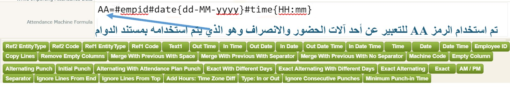
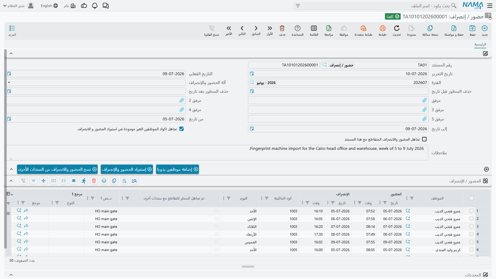
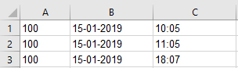

# معادلات الحضور والانصراف (Attendance and Departure Formulas)

معظم الموظفين يسجلون حضورهم وانصرافهم ببصمة على ماكينة حضور وانصراف مخصصة. المشكلة أن كل ماكينة تُصدِّر قراءاتها بطريقة مختلفة عن غيرها. واحدة تكتب الأوقات بنظام 24 ساعة، وأخرى بنظام 12 ساعة مع AM/PM. واحدة تُنتج ملف إكسل، وأخرى ملفاً نصياً مفصولاً بفواصل أو فواصل منقوطة أو علامات جدولة أو سلاسل من المسافات. واحدة تكتب اليوم `1`، والتالية تكتبه `01`. بعضها يكتب قراءة واحدة في كل سطر ويترك لك مهمة معرفة أيها حضور وأيها انصراف، وبعضها الآخر يكتب الحضور والانصراف جنباً إلى جنب في نفس السطر.

**معادلة الحضور والانصراف** هي الطريقة التي تُعلِّم بها نما كيف تقرأ ملف ماكينة بعينها. وهي سطر قصير من الرموز المسبوقة بعلامة `#` يصف، عموداً بعمود، ما يحتويه الملف المُصدَّر فعلياً. وبمجرد وجود المعادلة، يصبح استيراد ملف تلك الماكينة عملية من نقرتين طوال عمرها.

::: tip هناك أيضاً مسار مباشر ومؤتمت
هذه الصفحة تتحدث عن استيراد **ملف صدَّرته الماكينة**. ونما تستطيع أيضاً الاتصال ببعض الماكينات (أو بقواعد بياناتها) مباشرة وسحب البصمات وفق جدول زمني، بلا ملف وبلا معادلة — راجع [ماكينات الحضور](attendance/attendance-machines.md). الآليتان مستقلتان؛ والماكينة الواحدة عادةً لا تحتاج إلا إحداهما.
:::

## أين تُكتب المعادلات، وكيف تُختار واحدة منها (Where formulas live)

تُكتب المعادلات مرة واحدة، في **إعدادات الموارد البشرية ← الرواتب ← إعدادات ماكينات الحضور** (HR Configuration → Salary → Attendance Machines Settings)، في حقل **معادلة ماكينة الحضور** (Attendance Machine Formula). هذا الحقل الواحد يحتوي على **معادلة واحدة في كل سطر**:

```
AA=#empid#date{dd-MM-yyyy}#time{HH:mm}
ZK1=#empid#datetime{dd-MM-yyyy HH:mm:ss}#type{I-O}#exact
OldClock=#ignoreLinesFromTop{1}#empid#date{d-M-yyyy}#time{hh:mm}#am_pm{AM-PM}
```

كل ما يسبق أول علامة `=` هو **اسم المعادلة** — أي الاسم الذي ستختاره لاحقاً عند الاستيراد. وكل ما بعدها هو المعادلة نفسها. والأسماء التي تبتكرها هنا هي بالضبط ما سيظهر في قائمة **ماكينة الحضور** (Attendance Machine) المنسدلة في مستند الحضور والانصراف، لذا امنحها أسماءً يتعرف عليها موظفوك (`AA`، `ZK1`، `Warehouse-Gate`).



::: warning الأسماء تُطابَق حرفياً
تتم مقارنة الاسم حرفاً بحرف، بما في ذلك حالة الأحرف والمسافات. فـ `ZK1` و `zk1` ماكينتان مختلفتان، ومسافة زائدة قبل علامة `=` تمنع العثور على المعادلة وقت الاستيراد. ويجب ألا يحتوي الاسم على `=`.
:::

لاستخدام معادلة، افتح مستند **الحضور والانصراف** (Time Attendance)، واختر اسم الماكينة في حقل **ماكينة الحضور**، وأرفق الملف المُصدَّر (تُقرأ حتى **خمسة** مرفقات وتُعالَج كقائمة واحدة متصلة)، ثم شغِّل إجراء الاستيراد.



::: warning ملفات إكسل القديمة مرفوضة
إذا كانت الماكينة تُصدِّر بصيغة `.xls` القديمة، فأعد حفظ الملف بصيغة `.xlsx` قبل إرفاقه. فالتحقق من المرفقات يرفض ملفات إكسل ذات الصيغة القديمة عند حفظ المستند.
:::

## تشريح المعادلة (The anatomy of a formula)

المعادلة سلسلة من الرموز، يبدأ كل منها بعلامة `#`، ويحمل بعضها مُدخَلاً بين أقواس معقوفة:

```
AA=#empid#date{dd-MM-yyyy}#time{HH:mm}
```

فكرتان تشرحان تقريباً كل شيء عن سلوك المعادلات.

**أولاً: الموضع مهم.** كل رمز يمثل **عموداً واحداً** من الملف، بنفس ترتيب ظهور الأعمدة. فـ `#empid` أعلاه تعني «العمود الأول هو كود الموظف على الماكينة»، و `#date{dd-MM-yyyy}` تعني «العمود الثاني هو التاريخ، مكتوباً يوم-شهر-سنة بشرطات»، و `#time{HH:mm}` تعني «العمود الثالث هو الوقت بنظام 24 ساعة». وبناءً على هذه المعادلة، تتوقع نما أن يبدو الملف هكذا:



**ثانياً: الرموز التي لا تعرفها نما تُعامَل كمجرد شواغل للمواضع.** لا يوجد تحقق من قاموس رموز. فإذا كان ملفك يحتوي على عمود لا يهمك — اسم إدارة، أو رقم مسلسل، أو فاصل فارغ — ضع أي رمز من ابتكارك ليشغل الموضع وسيتم تجاهله. والاختيار المتعارف عليه هو `#ignore`، لكن `#ignore` ليست كلمة محجوزة؛ فـ `#skipMe` أو `#column4` تعملان بنفس الطريقة تماماً.

::: warning الوجه الآخر لهذه السهولة
لأن الرموز غير المعروفة تُقبل بصمت، فإن **الرمز المكتوب بخطأ إملائي ليس خطأً يُبلَّغ عنه** — بل يتحول بهدوء إلى عمود متجاهَل. فـ `#Date{dd-MM-yyyy}` بحرف D كبير لا يستورد التاريخ؛ بل يُهمل العمود ويترك كل سطر بلا تاريخ. أسماء الرموز حساسة لحالة الأحرف، لذا استخدم الأزرار الموجودة أسفل الحقل كلما أمكن بدلاً من كتابة الرموز يدوياً.
:::

ليس كل رمز يستهلك عموداً حقيقياً. فرموز مثل `#exact` أو `#sep{,}` تغيّر *طريقة* قراءة الملف بدلاً من وصف عمود — لكنها مع ذلك تشغل موضعاً في السلسلة، لذا من الأفضل وضعها كلها في نهاية المعادلة، بعد الأعمدة التي تؤثر فيها.

## قراءة الملف: الفواصل والسطور والأعمدة (separators, rows and columns)

قبل تفسير أي تواريخ أو أوقات، على نما أن تقسّم الملف إلى سطور وأعمدة. والرموز التالية تتحكم في هذه الخطوة.

### `#sep{,}` — فاصل الأعمدة

**الافتراضي: الفاصلة.** أي نص حرفي يصلح، بما في ذلك الفواصل المكونة من أكثر من حرف. وتُحذف علامات التنصيص المفردة، وهذه هي الطريقة للتعبير عن المسافة: `#sep{' '}`.

::: warning علامات الجدولة تُكتب حرفياً
`#sep{\t}` **لا** تعني علامة جدولة — فبالنسبة للفاصل، تُقرأ `\t` كشرطة مائلة عكسية حرفية يتبعها حرف t. فإذا كان ملفك مفصولاً بعلامات جدولة، ألصق علامة جدولة حقيقية بين الأقواس المعقوفة. (أما تسلسلات الهروب فتعمل داخل أنماط التاريخ والوقت؛ انظر أدناه.)
:::

::: tip ملفات إكسل تتجاهل الفاصل الذي تحدده
عندما يكون المرفق بصيغة `.xlsx`، تقرأ نما الورقة خلية بخلية وتعيد ربط كل سطر باستخدام **الفواصل** قبل تطبيق المعادلة. لذا اترك `#sep` على قيمته الافتراضية مع ملفات إكسل. فتحديد أي قيمة أخرى سيُفسد الاستيراد — كما أن الخلية التي يحتوي نصها على فاصلة ستُقسَّم إلى عمودين.
:::

### `#ignoreLinesFromTop{1}` و `#ignoreLinesFromEnd{1}`

لتجاهل عدد من السطور في بداية الملف (سطر العناوين) أو في نهايته (سطر الإجماليات). ويُطبَّق كلاهما على **كل مرفق على حدة**، وهو ما تريده عندما ترفق خمسة ملفات تحمل كلها نفس سطر العناوين.

يجب إعطاء `#ignoreLinesFromEnd` رقماً — فكتابة `#ignoreLinesFromEnd` وحدها تؤدي إلى فشل الاستيراد.

### `#removeEmptyColumns`

يحذف كل عمود فارغ من كل سطر بعد التقسيم. وهذا هو العلاج للملفات النصية المحشوة بسلاسل من المسافات، حيث كان `Ahmed    01-05-2026` سيُقسَّم إلى أربعة أعمدة بدلاً من عمودين.

::: warning إنه يُزيح المواضع
تُحذف الأعمدة الفارغة *قبل* مطابقة الرموز بالأعمدة، لذا يجب أن تصف سلسلة الرموز السطر **كما يبدو بعد اختفاء الفراغات**، لا كما يبدو في الملف الخام.
:::

### رموز الدمج (The merge tokens)

أحياناً تكون القيمة الواحدة موزعة على عدة أعمدة — فتاريخ مكتوب `2019 01 15` في ملف مفصول بمسافات يصل على شكل ثلاثة أعمدة بدلاً من عمود واحد. ورموز الدمج تطوي العمود داخل العمود الذي يسبقه:

| الرمز | الأثر |
|---|---|
| `#mergeWithPreviousWithSeparator` | يدمج باستخدام فاصل الملف (قيمة `#sep`، والفاصلة افتراضياً). |
| `#mergeWithPreviousWithSpace` | يدمج بمسافة واحدة. |
| `#mergeWithPreviousWithNoSeparator` | يدمج بلا أي فاصل على الإطلاق. |

في حالة `2019 01 15`، مع فاصل من نوع الفاصلة:

```
AA=#empid#date{yyyy,MM,dd}#mergeWithPreviousWithSeparator#mergeWithPreviousWithSeparator#time{HH:mm}
```

استُخدم الرمز مرتين لأن هناك عمودين يجب طيّهما، ونمط التاريخ يصف النتيجة *المدموجة* — ثلاثة أجزاء مربوطة بالفاصل.

::: warning يجب كتابتها مجردة
فـ `#mergeWithPreviousWithSeparator{-}` غير معروف ولا يفعل شيئاً على الإطلاق. ولا يمكنك اختيار حرف الربط؛ فهو دائماً فاصل الملف.
:::

### `#copylines{...}` — عدة ورديات في سطر واحد

بعض الماكينات تكتب اليوم كله في سطر واحد: حضور وانصراف الوردية الصباحية، ثم حضور وانصراف الوردية المسائية، جنباً إلى جنب. ونما تخزّن سطراً واحداً لكل وردية، لذا يجب تحويل تلك الأعمدة الإضافية إلى سطور إضافية.

صِف كل الأعمدة أولاً، مع منح الأعمدة الإضافية أسماءً من ابتكارك:

```
AA=#date{dd-MM-yyyy}#intime{HH:mm:ss}#outtime{HH:mm:ss}#Checkin2#Checkout2#Checkin3#Checkout3
```

ثم أضف `#copylines`، مخبراً إياه أي عمود مبتكر يجب نسخه إلى أي عمود حقيقي. وكل مجموعة مفصولة بعلامة `|` تُنتج سطراً إضافياً واحداً:

```
#copylines{intime=Checkin2,outtime=Checkout2|intime=Checkin3,outtime=Checkout3}
```

كل سطر جديد هو نسخة كاملة من السطر الأصلي مع استبدال الأعمدة المسماة فقط، ويُدرَج مباشرة بعده. وإذا كان العمود المصدر فارغاً في سطر ما، تُلغى تلك النسخة — وبذلك لا يُنتج اليوم ذو الوردية الواحدة سطوراً وهمية. واحذف المجموعة الثانية إذا كان الملف لا يحتوي أبداً إلا على ورديتين.

### `#trim{date}` — إزالة المسافات العنيدة

تُنظَّف كل الأعمدة من المسافات العادية تلقائياً. و `#trim` يتولى الحالات الأصعب — المسافات غير القابلة للكسر وغيرها من المحارف غير المرئية التي تحشو بها بعض الماكينات ملفاتها المُصدَّرة. مرّر قائمة مفصولة بفواصل بـ **أسماء الرموز** المراد تنظيفها: `#trim{date,time}`.

### `#noDateParsing`

لملفات إكسل فقط. بدونه، تفسّر نما الخلايا المنسقة كتواريخ بنفسها وتسلّم المعادلة قيمة موحدة. ومعه، يُستخدم النص المعروض في الخلية تماماً كما تُظهره الورقة. استخدمه عندما ينتج استيراد إكسل تواريخ مُزاحة أو مُعاد تنسيقها أو ترفض مطابقة نمطك.

## وصف الأعمدة (Describing the columns)

### `#empid` — الموظف

**مطلوب عملياً.** هذا هو كود الموظف **على الماكينة**، والذي تطابقه نما مع حقل **كود آلة الحضور والإنصراف** (Attendance Machine Code) في بطاقة الموظف.

- السطر الذي يكون عمود الموظف فيه فارغاً يُتجاهل بصمت.
- إذا لم يحمل أي موظف كود الماكينة ذاك، يتوقف الاستيراد برسالة *"Could not find employee with attendance machine code …"* — إلا إذا كان خيار **تجاهل الموظفين غير الموجودين** (Ignore Unfound Employees) مُفعَّلاً في الاستيراد، وعندها يُتجاهل السطر بهدوء.
- إذا اشترك **موظفان** في نفس كود الماكينة، يتوقف الاستيراد ويسرد كل موظف مخالف: *"The employee … has a repeated attendance code …, please change it"*.
- عند تفعيل **اعتبار الشركة عند البحث عن الموظف** (Consider Legal Entity To Find Employee) في إعدادات الموارد البشرية، يُقيَّد البحث إضافةً إلى ذلك بشركة المستند، وهو ما يتيح لشركتين إعادة استخدام نفس أكواد الماكينة.

### التواريخ والأوقات

| الرمز | المعنى |
|---|---|
| `#date{dd-MM-yyyy}` | تاريخ القراءة. |
| `#time{HH:mm}` | وقت القراءة. |
| `#datetime{dd-MM-yyyy HH:mm:ss}` | التاريخ والوقت معاً في عمود واحد. |
| `#indate{dd-MM-yyyy}` / `#outdate{dd-MM-yyyy}` | تاريخ الحضور وتاريخ الانصراف في عمودين **منفصلين**. |
| `#intime{HH:mm:ss}` / `#outtime{HH:mm:ss}` | وقت الحضور ووقت الانصراف في عمودين منفصلين. |
| `#indatetime{…}` / `#outdatetime{…}` | الحضور والانصراف، كل منهما في عمود واحد للتاريخ والوقت معاً. |

النمط الموجود بين الأقواس المعقوفة يوضّح كيفية كتابة القيمة:

- `dd` — اليوم برقمين (`01`، `02` … `31`)؛ أما `d` المفرد فيتوقع `1`، `2` … `31`.
- `MM` — الشهر برقمين. **استخدم حرف `M` الكبير** — فحرف `m` الصغير يعني الدقائق.
- `yyyy` — السنة بأربعة أرقام؛ و `yy` لرقمين.
- `HH` — الساعة بنظام 24 ساعة؛ أما `H` المفرد فيتوقع `1` … `24`.
- `hh` — الساعة بنظام 12 ساعة، وتحتاج إلى حرف `a` في النمط لعلامة AM/PM: `#time{hh:mm a}`.
- `mm` — الدقائق؛ و `ss` — الثواني.

::: tip تسلسلات الهروب داخل الأنماط
يمكن استخدام `\n` (سطر جديد) و `\r` (إرجاع المؤشر) و `\t` (علامة جدولة) داخل نمط التاريخ أو الوقت عندما تفصل الماكينة أجزاء القيمة بهذه المحارف — مثلاً `#date{dd-MM-yyyy\t}`.

وهي تعمل في `#date` و `#indate` و `#outdate` و `#intime` و `#outtime` و `#outdatetime`. و**لا** تعمل في الشق الخاص بالوقت من `#datetime` و `#indatetime`، لذا فإن `#datetime{dd-MM-yyyy\tHH:mm:ss}` ستقرأ التاريخ بشكل صحيح لكن ليس الوقت. وعندما تقع علامة جدولة بين التاريخ والوقت، استخدم رمزَي `#date` و `#time` منفصلين مع ضبط `#sep` على علامة جدولة بدلاً من ذلك.
:::

### `#type{I-O}` — هل هذه بصمة حضور أم انصراف؟

استخدم هذا الرمز عندما يذكر الملف نوع البصمة في عمود مستقل. والمُدخَل يعطي **علامة الحضور وعلامة الانصراف مفصولتين بشرطة**: `#type{I-O}`، `#type{C/In-C/Out}`، `#type{1-2}`.

::: warning علامة الحضور وحدها هي التي تُقارَن فعلياً
تتحقق نما مما إذا كان العمود يطابق العلامة الواقعة **قبل** الشرطة. وأي شيء آخر — علامة الانصراف، أو قيمة غير متوقعة، أو خلية فارغة — يُعامَل على أنه **انصراف**. والمقارنة حساسة لحالة الأحرف، ولا يمكن أن تحتوي علامة الحضور نفسها على شرطة.

وإذا حُذف `#type` تماماً، تُعامَل **كل** قراءة على أنها حضور.
:::

### بقية رموز الأعمدة

| الرمز | الغرض |
|---|---|
| `#machinecode` | معرِّف الماكينة نفسها، ويُنقَل إلى سطر الحضور — مفيد عندما تغذّي عدة ماكينات مستنداً واحداً. |
| `#text1` | عمود نص حر يُحفظ بجوار السطر، مثل الجنسية أو ملاحظة. |
| `#ref1Code` / `#ref2Code` | كود سجل مرجع يُربط بالسطر. |
| `#ref1EntityType{Project}` / `#ref2EntityType{Branch}` | نوع السجل الذي يشير إليه ذلك الكود. |

رمزا نوع الكيان يعملان بإحدى طريقتين. **مع** قيمة بين الأقواس المعقوفة، يكون النوع ثابتاً لكل السطور ولا يستهلك الرمز عموداً — فـ `#ref1EntityType{Project}` تعني «كل كود في `#ref1Code` هو مشروع». و**مع أقواس فارغة**، يأخذ الرمز عموداً ويذكر كل سطر نوعه الخاص، وهو ما يتيح لملف واحد أن يمزج بين المشروعات والإدارات.

إذا ظهر أي من `#empid` أو `#machinecode` أو `#text1` أو `#ref1Code` أو `#ref2Code` أكثر من مرة في المعادلة، تُدمَج قيم تلك الأعمدة معاً، باستخدام النص الموجود بين أقواس الرمز المكرر كرابط بينها.

## مطابقة الحضور بالانصراف (Pairing entries with exits)

هذا هو الجزء الذي يحدد كم سطراً ستتحول إليه قراءات الماكينة، وهو مصدر معظم مشكلات الاستيراد. فالماكينة التي تكتب قراءة واحدة في كل سطر تعطيك كومة من الأوقات؛ وعلى نما أن تستنتج أيها حضور، وأيها الانصراف المقابل له، وأيها ينتمي معاً إلى سطر حضور واحد.

اختر **واحداً** من الأنماط التالية.

### الوضع الافتراضي: حضور يتبعه انصراف

بلا أي رمز مطابقة على الإطلاق، تطابق نما الحضور مع الانصراف الذي يليه مباشرة **في نفس التاريخ**، وتترك الانصراف غير المطابَق كسطر فيه وقت انصراف فقط. وهذا مطابق تماماً لكتابة `#exact`.

ولأن هذا النمط يعمل على *نوع* البصمة، فهو يحتاج إلى أن يكون `#type` ذا معنى. فبدون `#type` تُحتسب كل قراءة كحضور، ولا يتطابق شيء، وتحصل على سطر حضور فقط لكل قراءة.

| الرمز | السلوك |
|---|---|
| `#exact` | الوضع الافتراضي الموصوف أعلاه: مطابقة الحضور بالانصراف التالي في **نفس التاريخ**. |
| `#exactWithDifferentDays` | نفس الشيء، إلا أن الزوج يمكن أن يعبر منتصف الليل إلى اليوم التالي. استخدمه للورديات الليلية. |

### المطابقة بالترتيب، مع تجاهل النوع

| الرمز | السلوك |
|---|---|
| `#exactAlternating` | خذ القراءات بالترتيب: الأولى حضور، والثانية انصراف، والثالثة حضور، وهكذا — لكن مع مطابقة قراءتين تقعان في **نفس التاريخ** فقط. والقراءة التي يقع جارها في تاريخ آخر تُترك كسطر حضور فقط، وبذلك يبدأ كل يوم جديد بحضور دائماً. |
| `#exactAlternatingWithDifferentDays{22}` | نفس المطابقة بالتناوب، مع السماح بعبور الأيام. والرقم هو **أقصى فجوة بالساعات** بين قراءتي الزوج؛ وبعدها لا تتم المطابقة. و**القيمة الافتراضية 24 ساعة** عند حذف الرقم. |

### `#alternatingPunch` — أول وآخر قراءة في اليوم

لكل موظف ولكل يوم تقويمي، تصبح القراءة **الأولى** هي الحضور و**الأخيرة** هي الانصراف؛ ويُهمَل كل ما بينهما. وهذا أبسط الأنماط وأكثرها تسامحاً، وهو الخيار الصحيح عندما يبصم الموظفون دخولاً وخروجاً عدة مرات في اليوم لكن ما يهمك فقط هو وقت وصولهم ووقت مغادرتهم.

وإذا جاء الاثنان معكوسين، يتم تبديلهما. وحين تأتي القراءتان الأولى والأخيرة من ماكينتين مختلفتين، يُحتفظ بكودَي الماكينتين (وبقيمتَي `#text1` معاً)، مفصولين بفاصلة.

### `#alternatingWithAttendancePlanPunch{2.5}` — دع الوردية تقرر

بدلاً من الاعتماد على الترتيب أو على عمود النوع، يقارن هذا النمط كل قراءة بـ **خطة الدوام** الخاصة بالموظف ويقرر من أوقات الوردية ما إذا كانت القراءة حضوراً أم انصرافاً.

والرقم بين الأقواس المعقوفة هو هامش تسامح **بالساعات**. فلموظف دوامه من 8:00 صباحاً إلى 4:00 مساءً مع `{2}`:

- تُحتسب القراءة الواقعة بين **6:00 صباحاً و 10:00 صباحاً** كـ **حضور**؛
- وتُحتسب القراءة الواقعة بين **2:00 مساءً و 6:00 مساءً** كـ **انصراف**.

ثم تُجمَّع القراءات حسب الوردية التي تنتمي إليها، وتصبح كل مجموعة سطر حضور واحداً. والورديات الليلية التي تمتد بعد منتصف الليل تُعالَج بشكل صحيح. أما القراءة التي لا تطابق أي وردية — كموظف يبصم في يوم إجازته مثلاً — فتُجمَّع حسب تاريخها وحده.

::: warning هامش التسامح مطلوب
أعطِ رقماً دائماً. فـ `#alternatingWithAttendancePlanPunch` بلا أقواس ليس له قيمة افتراضية معقولة.
:::

وهذا هو النمط الذي تلجأ إليه عندما يكون للموظف **أكثر من وردية في اليوم**، أو عندما تُسجَّل عدة حالات حضور وانصراف حقيقية في نفس اليوم ولا يستطيع الترتيب ولا عمود النوع فك اشتباكها.

**`#respectAttendancePlanPunchType`** يُنقّح هذا النمط. فنمط خطة الدوام وحده يُبقي على القراءتين **الأولى والأخيرة** فقط من كل مجموعة وردية ويرمي ما بينهما — فالموظف الذي يخرج في استراحة ثم يعود يُنتج سطراً واحداً طويلاً. أضف `#respectAttendancePlanPunchType` فيُحترَم النوع المستنتَج لكل قراءة بدلاً من ذلك:

- الانصراف الذي لا يسبقه حضور داخل الوردية يصبح سطر انصراف فقط؛
- والحضور الذي يتبعه انصراف يصبح زوجاً عادياً؛
- والحضور الذي يتبعه حضور آخر يُكتب وحده، ثم يُنظر في القراءة التالية من جديد.

وبذلك تُنتج أربع قراءات في اليوم (دخول، خروج، دخول، خروج) **سطرين** يمثلان فترتَي العمل، بدلاً من سطر واحد يمتد من الأولى إلى الأخيرة.

```
AA=#empid#date{dd-MM-yyyy}#time{hh:mm}#alternatingWithAttendancePlanPunch{2}#respectAttendancePlanPunchType
```

**`#maxCheckInDistance{n}`** تنقيح إضافي، ولا معنى له إلا عند وجود `#alternatingWithAttendancePlanPunch` و `#exactAlternatingWithDifferentDays` معاً: فإذا بدت القراءة التالية انصرافاً تبدأ ورديته بعد أكثر من *n* ساعة من القراءة الحالية، فلا تتم مطابقة الاثنين.

### عندما يحتوي الملف على الطرفين أصلاً

إذا كانت معادلتك تستخدم `#indate` أو `#intime` أو `#indatetime`، فإن الملف يخبر نما أن كل سطر **يحتوي بالفعل على حضور وانصراف كاملين** — فلا حاجة إلى أي مطابقة ويُتجاهَل كل نمط من أنماط المطابقة.

::: warning السطر يحتاج إلى تاريخ انصراف كما يحتاج إلى وقت انصراف
عند استخدام أعمدة الحضور/الانصراف يجب أن تعطي نما أيضاً مكاناً تقرأ منه **تاريخ** الانصراف: `#outdate` أو `#outdatetime` أو `#date` مشترك يغطي الاثنين. فالمعادلة التي تحتوي على `#indate` و `#intime` و `#outtime` بلا تاريخ انصراف يفشل استيرادها برسالة *"Could not find parameter outdatetime"*.
:::

### `#alternatingPunchByMachineName` — المطابقة لكل ماكينة على حدة

في الوضع الطبيعي تُجمَّع كل قراءات الموظف معاً قبل المطابقة، أياً كانت الماكينة التي أنتجتها. أضف هذا الرمز فتُجمَّع القراءات حسب **الموظف والماكينة**، وبذلك يحصل الموظف الذي يُتابَع بشكل منفصل عند بوابتين على زوج مستقل من كل بوابة. (ولا أثر له في نمط `#alternatingPunch`، الذي يجمّع دائماً حسب الموظف.)

### إذا جمعت بين عدة أنماط بالخطأ

لا يُطبَّق إلا نمط واحد أبداً. وعند وجود أكثر من نمط يختار النظام واحداً بصمت، والترتيب ليس بديهياً — لذا اعتبر ما يلي قواعد لقراءة معادلة كتبها شخص آخر، لا شيئاً تعتمد عليه:

- إذا وُجد أي من `#exactWithDifferentDays` أو `#exactAlternating` أو `#exact`، يُستخدم **الأول بهذا الترتيب**، ويُتجاهَل `#alternatingPunch`.
- `#exactAlternatingWithDifferentDays` يتغلب على `#exactWithDifferentDays`، لكنه يخسر أمام `#exactAlternating` و `#exact`.
- إذا لم يوجد أي من هذه الأربعة، يتغلب `#alternatingPunch` على كل شيء، بما في ذلك أعمدة الحضور/الانصراف.
- تُطبَّق أعمدة الحضور/الانصراف ما لم يوجد أحد الأربعة أعلاه أو `#alternatingPunch`. ولاحظ أن `#alternatingWithAttendancePlanPunch` **لا** يتغلب عليها — فخلط أعمدة الحضور/الانصراف مع نمط خطة الدوام يتجاهل الخطة بصمت.
- `#alternatingWithAttendancePlanPunch` يعمل كنمط فقط عندما لا ينطبق أي مما سبق؛ أما بجوار `#exactAlternatingWithDifferentDays` فيعمل كتنقيح بدلاً من ذلك.

## تنظيف القراءات (Cleaning up the readings)

### `#ignoreConsecutivePunches{5}`

يُهمل القراءات من **نفس النوع** الواقعة ضمن العدد المحدد من الدقائق من بعضها — وهي الحالة الكلاسيكية للموظف الذي يبصم مرتين لأنه لم يسمع الصفارة الأولى. ومن كل حضورين متقاربين أكثر من اللازم يُحتفظ بـ **الأسبق**، ومن كل انصرافين يُحتفظ بـ **الأحدث**، حتى لا تُختصر فترة العمل أبداً بسبب بصمة مزدوجة.

### `#addhours{2}` — تصحيح فرق التوقيت

يضيف العدد المحدد من الساعات إلى كل وقت يُقرأ من الملف؛ والقيمة السالبة مثل `#addhours{-2}` تطرح. استخدمه عندما تعمل ساعة الماكينة بتوقيت مختلف عن توقيت الشركة. وهو يزيح **الأوقات فقط** — فالتواريخ لا تُدفَع إلى الأمام بسببه.

### `#am_pm{AM-PM}` — ساعات 12 بعلامات مخصصة

للملفات التي تستخدم نظام 12 ساعة بعلامات غير AM/PM المعتادة — وغالباً ما تكون علامات عربية. أعطِ علامة الصباح وعلامة المساء مفصولتين بشرطة: `#am_pm{صباحاً-مساءاً}`. وعندما تحتوي خلية الوقت على علامة المساء، تُضاف إليها اثنتا عشرة ساعة.

::: warning استخدم إما `a` أو `#am_pm`، ولا تجمع بينهما أبداً
`#time{hh:mm a}` يتعامل بالفعل مع علامة AM/PM القياسية. وجمعه مع `#am_pm` يُزيح نفس الوقت المسائي مرتين. وتأكد أيضاً من أن المُدخَل يحتوي على شرطة وعلى العلامتين معاً — فـ `#am_pm{}` أو مُدخَل بلا شرطة سيُفسد الاستيراد.
:::

### `#minimumpunchintime{06:00}`

لا معنى له إلا مع `#alternatingPunch`. فالانصراف المسجَّل **قبل** الوقت المذكور يُعامَل على أنه يخص **اليوم السابق**، شريطة أن تكون القراءة التي تسبقه حضوراً في ذلك اليوم السابق. وهذا ما يمنع تسجيل وردية ليلية تنتهي في الساعة 2:00 صباحاً كانصراف شارد في اليوم التالي.

### `#initialPunch{In}`

هناك زر يُدرج هذا الرمز، لكنه حالياً **بلا أي أثر** على الاستيراد — ويمكن حذفه بأمان من أي معادلة تجده فيها.

## الأزرار أسفل حقل المعادلة (The buttons under the formula field)

توصي الشركة المطوِّرة بشدة ببناء المعادلات بالأزرار بدلاً من كتابة الرموز، لأن الرمز المكتوب خطأً يفشل بصمت. وكل زر يُلحق رمزه بنهاية الحقل، جاهزاً لتعديل النمط داخل الأقواس المعقوفة.

| الزر | يُدرج |
|---|---|
| معرف الموظف (Employee ID) | `#empid` |
| التاريخ والوقت (Date Time) | `#datetime{dd-MM-yyyy HH:mm:ss}` |
| التاريخ (Date) | `#date{dd-MM-yyyy}` |
| الوقت (Time) | `#time{HH:mm}` |
| تاريخ ووقت الحضور / الانصراف (In Date Time / Out Date Time) | `#indatetime{…}` / `#outdatetime{…}` |
| تاريخ الحضور / الانصراف (In Date / Out Date) | `#indate{dd-MM-yyyy}` / `#outdate{dd-MM-yyyy}` |
| وقت الحضور / الانصراف (In Time / Out Time) | `#intime{HH:mm:ss}` / `#outtime{HH:mm:ss}` |
| نص1 (Text1) | `#text1` |
| كود المرجع1 / المرجع2 (Ref1 Code / Ref2 Code) | `#ref1Code` / `#ref2Code` |
| نوع كيان المرجع1 / المرجع2 (Ref1 EntityType / Ref2 EntityType) | `#ref1EntityType{replace with your Entity}` |
| عمود فارغ (Empty Column) | `#ignore` |
| كود الماكينة (Machine Code) | `#machinecode` |
| الدمج مع السابق بلا فاصل (Merge With Previous With No Separator) | `#mergeWithPreviousWithNoSeparator` |
| الدمج مع السابق بالفاصل (Merge With Previous With Separator) | `#mergeWithPreviousWithSeparator` |
| الدمج مع السابق بمسافة (Merge With Previous With Space) | `#mergeWithPreviousWithSpace` |
| حذف الأعمدة الفارغة (Remove Empty Columns) | `#removeEmptyColumns` |
| نسخ السطور (Copy Lines) | `#copylines{intime=checkin2,outtime=checkout2\|…}` |
| بلا تفسير للتواريخ (No Date Parsing) | `#noDateParsing` |
| صباحاً / مساءً (AM / PM) | `#am_pm{AM-PM}` |
| مطابقة تامة (Exact) | `#exact` |
| مطابقة تامة بالتناوب (Exact Alternating) | `#exactAlternating` |
| مطابقة تامة بالتناوب مع اختلاف الأيام (Exact Alternating With Different Days) | `#exactAlternatingWithDifferentDays{22}` |
| التناوب حسب اسم الماكينة (Alternating Punch By MachineName) | `#alternatingPunchByMachineName` |
| مطابقة تامة مع اختلاف الأيام (Exact With Different Days) | `#exactWithDifferentDays` |
| التناوب حسب خطة الدوام (Alternating With Attendance Plan Punch) | `#alternatingWithAttendancePlanPunch{2.5}` |
| احترام نوع بصمة خطة الدوام (Respect Attendance Plan Punch Type) | `#respectAttendancePlanPunchType` |
| البصمة الأولية (Initial Punch) | `#initialPunch{In}` |
| البصمة بالتناوب (Alternating Punch) | `#alternatingPunch` |
| أقل وقت لبصمة الحضور (Minimum Punch-in Time) | `#minimumpunchintime{06:00}` |
| تجاهل البصمات المتتالية (Ignore Consecutive Punches) | `#ignoreConsecutivePunches{5}` |
| النوع: حضور أم انصراف (Type: In or Out) | `#type{C/In-C/Out}` |
| إضافة ساعات: فرق التوقيت (Add Hours: Time Zone Diff) | `#addhours{2}` |
| تجاهل سطور من الأعلى / من النهاية (Ignore Lines From Top / From End) | `#ignoreLinesFromTop{1}` / `#ignoreLinesFromEnd{1}` |
| الفاصل (Separator) | `#sep{,}` |
| التنظيف (Trim) | `#trim{date}` |

لا يوجد زر لـ `#maxCheckInDistance`؛ اكتبه يدوياً إذا احتجت إليه.

## ما الذي يستبعده الاستيراد (What the import filters out)

هناك أمران يقللان بهدوء عدد السطور التي تحصل عليها في النهاية، وكلاهما يفاجئ الناس.

**المدى الزمني للمستند.** القراءات التي يقع تاريخ حضورها خارج **من تاريخ** / **إلى تاريخ** (From Date / To Date) في مستند الحضور والانصراف تُستبعَد، أثناء قراءة الملف ومرة أخرى بعد المطابقة. أما سطور الانصراف فقط، التي لا تاريخ حضور لها، فلا يستبعدها هذا الفلتر أبداً.

**السطور بلا كود موظف.** كما ذُكر أعلاه، السطر الذي يكون عمود `#empid` فيه فارغاً لا يتحول إلى سطر على الإطلاق.

## عندما يحدث خطأ ما (When something goes wrong)

| الرسالة | ما تعنيه |
|---|---|
| *You must specify formula name* | لم تُختَر أي ماكينة في حقل **ماكينة الحضور** في المستند. |
| *Could not find parameter …* | المعادلة تشير إلى شيء لم تُعرِّفه أبداً — وغالباً تاريخ انصراف مفقود من معادلة حضور/انصراف. |
| *Could not find employee with attendance machine code …* | لا يوجد موظف يحمل هذا الكود. صحّح بطاقة الموظف، أو فعّل **تجاهل الموظفين غير الموجودين** لتخطي هذه السطور. |
| *The employee … has a repeated attendance code …, please change it* | موظفان أو أكثر يشتركون في كود ماكينة واحد؛ ويجب أن تكون الأكواد فريدة. |
| *There is Error in Parsing line …* | تعذّرت قراءة سطر — وعادةً بسبب تاريخ أو وقت لا يطابق نمطه. والرقم يعدّ سطور البيانات بعد أي تخطٍّ بواسطة `#ignoreLinesFromTop`، لذا لن يطابق رقم السطر الفعلي في الملف. |
| *The pattern … does not contain right hand side* | إحدى إسنادات `#copylines` تنقصها علامة `=`. |
| *The pattern … left hand side … is not found in the formula* | إحدى إسنادات `#copylines` تسمّي عموداً لم تُصرِّح به المعادلة أبداً. |

وإذا نجح استيراد الملف لكن جاءت النتيجة خاطئة بدلاً من أن يفشل، فالسبب في الغالب أحد ثلاثة أمور: رمز كُتب خطأً وتحوّل بصمت إلى شاغل موضع، أو نمط مطابقة خاطئ، أو نمط تاريخ يستخدم حرف `m` الصغير للشهر.

## صفحات ذات صلة

- **[ماكينات الحضور](attendance/attendance-machines.md)** — مقارنة بين المسارين، والمرجع الكامل للبديل المؤتمت الذي يتصل بالماكينة مباشرة.
- **[الحضور والانصراف](attendance/time-attendance.md)** — المستند الذي تستورد إليه هذه المعادلات.
