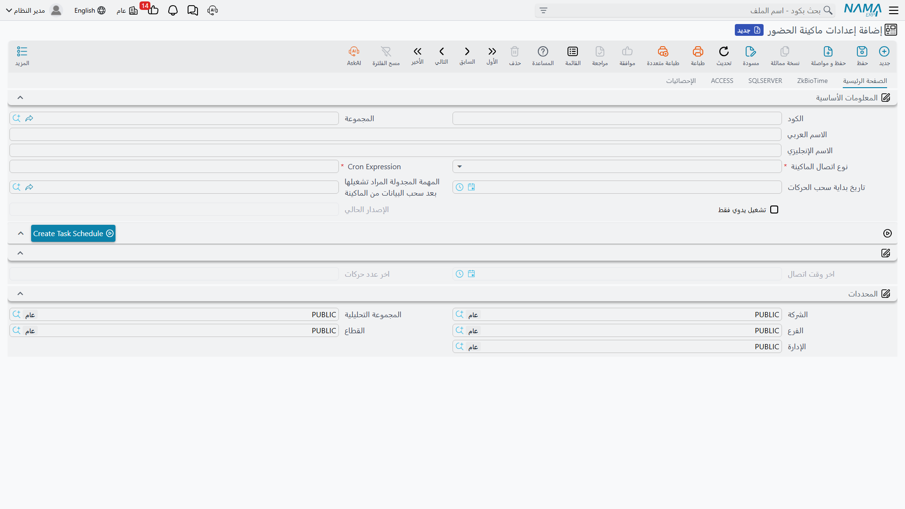

# أجهزة البصمة (Attendance Machines)

يمكن لبيانات البصمة الخام أن تصل إلى النظام بإحدى طريقتين. إما أن تُسحَب **تلقائياً** وفق جدول زمني، مباشرة من واجهة برمجة ماكينة البصمة أو من قاعدة بياناتها الخاصة — بإعداد يُضبط مرة واحدة عبر **إعدادات ماكينة الحضور** (Attendance Machine Configuration) — أو أن تُستورَد **يدوياً** من ملف كشف حضور تصدّره الماكينة، بمطابقته مع صيغة مسمّاة تخبر النظام كيف تُنسَّق أعمدة وتواريخ ذلك الملف. تغطي هذه الصفحة الطريقة الآلية وسجل إعداداتها؛ أما صيغة الاستيراد اليدوي من الملف، ومعالجة بيانات البصمة غير الكاملة، فلكل منهما صفحة مستقلة معمَّقة مُشار إليها أدناه.

## إعدادات ماكينة الحضور — الطريقة الآلية

توجد في **الرواتب > حضور / إنصراف > إعدادات ماكينة الحضور**.

::: tip يتطلب ترخيصاً خاصاً به
التكامل الآلي مع ماكينات البصمة مُقيَّد ضمن إضافة مخصصة (`humanresource-attendance-import-cron`)، منفصلة عن ترخيص الرواتب الأساسي — راجع مدير حسابك إذا لم تكن شاشة **إعدادات ماكينة الحضور** ظاهرة.
:::

يُعرَّف سجل الإعداد بالكود / المجموعة / الاسم العربي / الاسم الإنجليزي، ثم يحدد *كيف* و*متى* يتصل النظام بالماكينة:

| الحقل (عربي ← إنجليزي) | الغرض |
|---|---|
| نوع اتصال الماكينة (Machine Connection Type) | أحد ثلاثة أنواع: **ZkBioTime**، أو **SQLSERVER**، أو **ACCESS** — أي نظام ماكينة/مورّد يتم التخاطب معه. اختيار أحدها يُظهر تبويبة مطابقة بتفاصيل الاتصال أدناه. |
| Cron Expression (Cron Expression) | الجدول الزمني الذي يتصل النظام بموجبه تلقائياً ويسحب الحركات الجديدة. |
| تاريخ بداية سحب الحركات (Fetching Transaction Start Date) | أقدم تاريخ تُجمَع منه البصمات — لا تُسحَب الحركات السابقة له مطلقاً. |
| تشغيل يدوي فقط (Only Work Manually) | يُوقِف جدولة Cron التلقائية تماماً؛ فلا يتم الاتصال إلا عند التشغيل اليدوي. |
| المهمة المجدولة المراد تشغيلها بعد سحب البيانات من الماكينة (Run Task Schedule After Fetching Transactions) | مهمة مجدولة اختيارية تُسلسَل مباشرة بعد كل عملية سحب ناجحة — مثل مهمة تعيد توليد مفردات راتب مرتبطة بالحضور. |

يحوّل إجراء **Create Task Schedule** الإعدادَ إلى مهمة مجدولة فعلية وجارية بمجرد اكتمال تفاصيل الاتصال.

### أنواع الاتصال الثلاثة

لكل نوع اتصال تبويبته الخاصة التي تجمع التفاصيل التي يحتاجها، لكنها تشترك في نفس الشكل: إعدادات اتصال، واستعلام يسحب الحركات الخام، وجدول مطابقة.

| نوع الاتصال | حقول التبويبة | ما يتصل به |
|---|---|---|
| **ZkBioTime** | رابط الماكينة، اسم المستخدم، كلمة المرور، SQL Query | منصة/واجهة برمجة المورّد الخاصة بـ ZkBioTime. |
| **SQLSERVER** | رابط الماكينة، Database Port، Database Name، اسم المستخدم، كلمة المرور، SQL Query | قاعدة بيانات SQL Server تكتب فيها الماكينة (أو برنامج موردها) الحركات مباشرة. |
| **ACCESS** | مسار الملف، Access Query | ماكينة أقدم تُصدِّر سجلها إلى ملف قاعدة بيانات Microsoft Access محلي. |

لكل نوع، يقوم إجراء **إضافة الاستعلامات الافتراضية** — بصياغة مختلفة حسب نوع الاتصال، مثل "إضافة الاستعلامات الافتراضية لـ Zk" أو "إضافة الاستعلامات الافتراضية لـ Zk Bio Time" — بتعبئة استعلام جاهز للعمل حتى لا يُكتب الإعداد من الصفر. ويُستخدَم **Read For Period Query** منفصلاً تحديداً عند إعادة سحب فترة تاريخ مخصصة عند الطلب، لا عند السحب التزايدي المجدوَل. ثم يخبر جدول **Mapping** (Response Field / Column Index / Column Alias) النظامَ أي عمود من نتيجة الاستعلام يقابل أي معلومة — كود الموظف، التاريخ، الوقت، وهكذا.

تحتفظ تبويبة **الإحصائيات** بسجل جارٍ لعمليات الـ Cron (Attendance Machine Cron Log)، إلى جانب **اخر وقت اتصال** و**اخر عدد حركات** في الصفحة الرئيسية، بحيث يسهل ملاحظة عملية فاشلة أو فارغة دون البحث في سجلات الخادم.

::: tip ليست نفس آلية صيغة استيراد الملف
إعدادات ماكينة الحضور تتصل بالماكينة (أو قاعدة بياناتها) مباشرة ووفق جدول زمني. وهي آلية مختلفة عن استيراد مستند **الحضور والانصراف** اليدوي الموضح أدناه — الآليتان غير قابلتين للتبادل، وتحتاج كل ماكينة إحداهما فقط، أيّاً كانت مناسبة لطريقة تصديرها للبيانات.
:::

## الطريقة اليدوية: استيراد ملف مُصدَّر

كثير من الماكينات لا تُتيح واجهة برمجة ولا قاعدة بيانات يمكن الوصول إليها إطلاقاً — بل تُصدِّر فقط ملف كشف حضور (إكسل أو نص مفصول) يجب استيراده يدوياً إلى مستند **الحضور والانصراف**. وفهم تنسيق ذلك الملف — كيف يُرمَّز كود الموظف والتاريخ والوقت، وما الفاصل بين الحقول — هو مهمة **صيغة الحضور والانصراف**، وهي لغة أنماط صغيرة (`#empid`، `#date{...}`، `#time{...}`) تُضبط مرة واحدة لكل ماكينة ثم تُختار عند الاستيراد.

::: tip المرجع الكامل للصيغة
راجع **[معادلات الحضور والانصراف](../attendance-machine-formula.md)** للمرجع الكامل والمُفصَّل حول تعريف واستخدام صيغ الاستيراد هذه.
:::

## بصمات غير كاملة: تفويتات وأسطر متداخلة

أيّاً كانت الطريقة التي تصل بها البيانات، نادراً ما تكون بيانات البصمة الواقعية نظيفة تماماً — موظف ينسى تسجيل الانصراف، أو يبقى في الموقع بعد منتصف الليل فينتج سطرين غير مكتملين بدلاً من سطر واحد مكتمل. يوفر النظام ميزة مخصصة لتصحيح ذلك دون المساس بالبيانات المستوردة الأصلية.

::: tip معالجة أسطر الحضور غير المكتملة أو المتداخلة
راجع **[تجاهل سطور الحضور والانصراف المتقاطعة](../ignore-overlapping-attendance.md)** لمعرفة كيف يمكن لمستند تصحيح يدوي أن يأخذ الأولوية على أسطر مستوردة من الماكينة غير مكتملة تحديداً.
:::

## صفحات ذات صلة

- **[الحضور والانصراف](time-attendance.md)** — المستند الذي يحمل فعلياً البصمات المستوردة والإلكترونية، ويحوّلها إلى آثار على الراتب.
- **[خطط الدوام والورديات](attendance-plans-and-shifts.md)** — الجدول المتوقَّع الذي تُقاس البصمات الواردة عليه.
