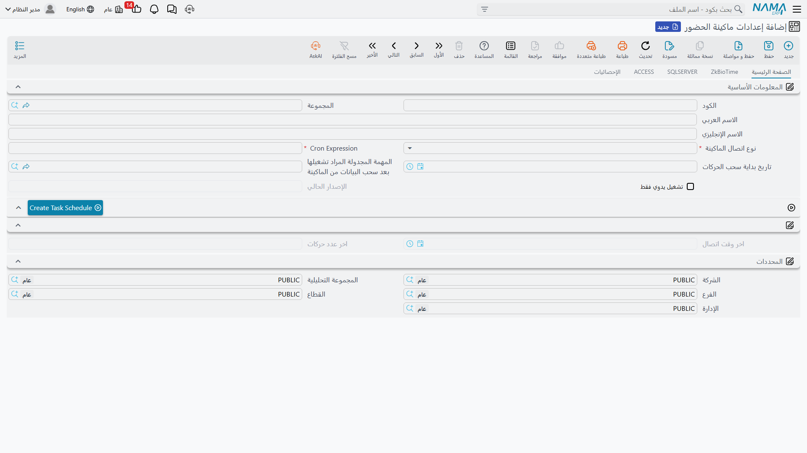

# أجهزة البصمة (Attendance Machines)

يمكن لبيانات البصمة الخام أن تصل إلى النظام بإحدى طريقتين. إما أن تُسحَب **تلقائياً** وفق جدول زمني، مباشرة من واجهة برمجة ماكينة البصمة أو من قاعدة بياناتها الخاصة — بإعداد يُضبط مرة واحدة عبر **إعدادات ماكينة الحضور** (Attendance Machine Configuration) — أو أن تُستورَد **يدوياً** من ملف كشف حضور تصدّره الماكينة، بمطابقته مع صيغة مسمّاة تخبر النظام كيف تُنسَّق أعمدة وتواريخ ذلك الملف.

وتحتاج كل ماكينة عادةً إحدى الطريقتين فقط، أيّاً كانت المناسبة لطريقة إتاحتها لبياناتها. فإذا كانت الماكينة تُتيح واجهة برمجة، أو تكتب في قاعدة بيانات يمكنك الوصول إليها، فاسلك الطريقة الآلية — إذ تُضبط مرة واحدة ثم تعمل بعدها دون تدخل. أما إذا كانت لا تنتج سوى ملف، فالطريقة اليدوية هي خيارك، ولها مرجعها المستقل المُشار إليه أدناه.

## المسار الآلي: أن يجمع النظام البيانات بنفسه

استيراد ملف كل صباح أمر يصبح مملاً بسرعة. فإذا كانت ماكينة البصمة تُتيح واجهة برمجة، أو تكتب قراءاتها في قاعدة بيانات يمكنك الوصول إليها، فبإمكان النظام أن يجمع تلك القراءات بنفسه — كل ساعة، أو كل ليلة، أو وفق أي جدول تختاره — فلا يبقى على موظفي شؤون الموظفين سوى مراجعة النتيجة.

**إعدادات ماكينة الحضور** (Attendance Machine Configuration) هو السجل الذي يجعل ذلك ممكناً. وهو ملف رئيسي صغير يجيب عن أربعة أسئلة: *أي* ماكينة، و*كيف* يتم التخاطب معها، و*متى* يتم التخاطب معها، و*ماذا يُفعَل* بما يعود منها.

توجد في **الرواتب ← حضور / إنصراف ← إعدادات ماكينة الحضور**.

::: tip يتطلب ترخيصاً خاصاً به
التكامل الآلي مع ماكينات البصمة مُقيَّد ضمن إضافة مخصصة (`humanresource-attendance-import-cron`)، منفصلة عن ترخيص الرواتب الأساسي. إذا لم تكن شاشة **إعدادات ماكينة الحضور** ظاهرة في القائمة، فراجع مدير حسابك.
:::

::: warning هذا نصف الإعداد فقط
سجل الإعدادات يعيش داخل النظام، لكن النظام لا يتصل بالماكينة بنفسه مطلقاً. هناك تطبيق مرافق صغير اسمه **attcron**، يُثبَّت على جهاز في الفرع يستطيع رؤية الماكينة، يقرأ هذه الإعدادات ويقوم بعملية الجمع الفعلية. إعداد السجل هو الخطوة الأولى، وتثبيت التطبيق المرافق هو الخطوة الثانية — راجع [تطبيق attcron لسحب بيانات الحضور](../../../integration/attcron-agent.md).

هذا الفصل مقصود. فماكينات البصمة عادةً ما تكون على الشبكة المحلية للفرع دون أي منفذ للدخول إليها من الخارج، ولذلك يجب أن تبدأ حركة البيانات من الفرع نفسه. وهذا يعني أن الفروع لا تحتاج إلى عنوان IP ثابت؛ يكفي أن تستطيع الوصول إلى خادم النظام.
:::

### الصفحة الرئيسية

يُعرَّف سجل الإعدادات مثل أي ملف رئيسي — الكود، والمجموعة، والاسم العربي، والاسم الإنجليزي — ثم يصف الاتصال وجدوله الزمني:

| الحقل (عربي ← إنجليزي) | الغرض |
|---|---|
| نوع اتصال الماكينة (Machine Connection Type) | **ZkBioTime** أو **SQLSERVER** أو **ACCESS**. اختيار أحدها يحدد أي التبويبات الثلاث أدناه ستملؤها. |
| Cron Expression | كل كم يجمع التطبيق البيانات. راجع التحذير أدناه — الصيغة تتكون من ستة حقول لا خمسة. |
| تاريخ بداية سحب الحركات (Fetching Transaction Start Date) | أقدم لحظة يستحق الجمع منها، وتُستخدَم فقط في أول تشغيل على الإطلاق. |
| تشغيل يدوي فقط (Only Work Manually) | يُوقِف الجدولة تماماً؛ فلا يجمع التطبيق حينها إلا عندما يضغط شخص ما زراً في شاشته الخاصة. |
| المهمة المجدولة المراد تشغيلها بعد سحب البيانات من الماكينة (Run Task Schedule After Fetching Transactions) | المهمة المجدولة التي تُشغَّل بعد كل عملية جمع ناجحة — وهي عادةً المهمة التي تحوّل البصمات الخام إلى مستند الحضور والانصراف. |
| الإصدار الحالي (Current Release Version) | للقراءة فقط. إصدار التطبيق الذي أرسل البيانات آخر مرة، حتى تعرف بنظرة واحدة ما إذا كان أحد الفروع يعمل بإصدار قديم. |
| اخر وقت اتصال / اخر عدد حركات (Last Connection Time / Last Log Count) | للقراءة فقط. متى سلّم التطبيق البيانات آخر مرة، وكم قراءة كانت في تلك الدفعة. |

::: warning صيغة الـ cron تتكون من ستة حقول
يستخدم النظام صيغة cron ذات ستة حقول — **الثواني** أولاً، ثم الدقائق، فالساعات، فيوم الشهر، فالشهر، فيوم الأسبوع. فـ `0 5 * * * *` تعني "عند الدقيقة الخامسة من كل ساعة". أما الصيغة المألوفة ذات الخمسة حقول في يونكس (`5 */1 * * *`) فهي **غير** صالحة هنا.

يفحص النظام الصيغة عند الحفظ ويرفض غير الصالحة برسالة *"Invalid cron expression: … "*. وإذا وصلت صيغة غير صالحة إلى التطبيق بطريقة ما، فإنه يتراجع بهدوء إلى التشغيل كل اثنتي عشرة ساعة — لذا فإن عملية جمع تبدو بطيئة بشكل غامض تستحق التحقق من هذا الحقل أولاً.

ويُتجاوَز هذا الفحص بالكامل عند تعليم **تشغيل يدوي فقط**.
:::

### أنواع الاتصال الثلاثة

لكل نوع تبويبته الخاصة. املأ التبويبة المطابقة لـ **نوع اتصال الماكينة** وتجاهل التبويبتين الأخريين.

#### ZkBioTime

للمواقع التي تشغّل منصة المورّد الخاصة ZkBioTime، والتي تنشر حركاتها عبر واجهة ويب. وهذا أنظف الأنواع الثلاثة لأنه لا يحتاج وصولاً إلى قاعدة بيانات ولا كتابة أي SQL.

| الحقل | القيمة |
|---|---|
| رابط الماكينة (Machine URL) | عنوان تطبيق الويب الخاص بـ ZkBioTime، مثل `http://192.168.1.50:8081`. |
| اسم المستخدم / كلمة المرور (Username / Password) | حساب دخول على ZkBioTime لديه صلاحية قراءة الحركات. |

يسجّل التطبيق الدخول، ثم يقرأ الحركات صفحة تلو الأخرى حتى يستدرك كل ما فاته. أما SQL Query و Read For Period Query وجدول المطابقة الظاهرة في هذه التبويبة فهي **غير مستخدَمة** في اتصال ZkBioTime — إذ إن صيغة بياناته ثابتة ولا تحتاج إلى مطابقة.

#### SQLSERVER

لأي ماكينة يخزّن برنامجها قراءاتها في قاعدة بيانات SQL Server — والحالة الشائعة هي برنامج ZK المكتبي الأقدم.

| الحقل | القيمة |
|---|---|
| رابط الماكينة (Machine URL) | خادم SQL Server، وعادةً يكون `localhost` عندما يعمل التطبيق على نفس جهاز برنامج الماكينة. |
| Database Port | عادةً `1433`. |
| Database Name | قاعدة بيانات برنامج الماكينة، مثل `TATimeAttendance`. |
| اسم المستخدم / كلمة المرور (Username / Password) | حساب قاعدة بيانات يستطيع قراءة جداول البصمات. |
| SQL Query | الاستعلام الذي يجلب القراءات الجديدة — راجع أدناه. |
| Read For Period Query | النسخة المستخدَمة عندما يعيد شخص ما قراءة فترة تاريخ محددة يدوياً. |
| جدول المطابقة (Mapping grid) | أي عمود من النتيجة يقابل أي معلومة. |

#### ACCESS

للماكينات الأقدم التي تحتفظ بسجلها في ملف Microsoft Access محلي. التبويبة بنفس شكل تبويبة SQL Server مع فارقين: **رابط الماكينة** يُعاد تسميته إلى **مسار الملف** ويحمل المسار الكامل لملف `.mdb` أو `.accdb` على الجهاز الذي يعمل عليه التطبيق، و**SQL Query** يُعاد تسميته إلى **Access Query**.

::: warning املأ الحقول التي لا تحتاجها Access فعلياً
يرفض التطبيق أن يبدأ ما لم تكن رابط الماكينة واسم المستخدم وكلمة المرور **و** Cron Expression جميعها ذات قيم، كما أن السجل نفسه لن يُحفَظ بدون Database Port و Database Name. وإعداد Access لا يستخدم اسم المستخدم ولا كلمة المرور ولا المنفذ ولا اسم قاعدة البيانات إطلاقاً — لكن يجب مع ذلك أن تحتوي على شيء ما. ضع فيها قيماً وهمية.
:::

### الاستعلامان

يحتاج اتصالا SQL Server و Access إلى أن تزوّدهما بالاستعلام الذي يقرأ البصمات. وهما اثنان، ويختلفان في أمر واحد مهم: **كم عدد العلامات النائبة التي يحتويها كل منهما.**

- **SQL Query** هو الاستعلام التزايدي، ويُشغَّل في كل عملية جمع مجدوَلة. ويأخذ **علامة `?` واحدة بالضبط**، يضع فيها التطبيق اللحظة التي وصل إليها في آخر عملية جمع. ويُفترض أن يعيد الاستعلام كل ما هو أحدث من تلك اللحظة.
- **Read For Period Query** يُستخدَم فقط عندما يطلب مشغّل من التطبيق فترة تاريخ محددة. ويأخذ **علامتَي `?` بالضبط** — بداية تلك الفترة ونهايتها.

ولست مضطراً لكتابة أي منهما من الصفر. فإجراء **إضافة الاستعلامات الافتراضية** في كل تبويبة يملأ زوجاً متوافقاً وجاهزاً للعمل:

| الإجراء | يكتب استعلامات لـ |
|---|---|
| إضافة الاستعلامات الافتراضية لـ Zk Bio Time (Add Default Queries For Zk Bio Time) | جدول الحركات في قاعدة بيانات ZkBioTime. |
| إضافة الاستعلامات الافتراضية لـ Zk (Add Default Queries For Zk) | جداول الدخول/الخروج الكلاسيكية في ZK — بصيغة T-SQL في تبويبة SQL Server، وبصيغة Access في تبويبة Access. |

كما يملأ الإجراءان جدول المطابقة بمجموعة قياسية من ثلاثة عشر سطراً، فيكتمل الإعداد الافتراضي بضغطة واحدة.

::: warning زر Zk هو الزر الخطأ لنوع ZkBioTime
الضغط على **إضافة الاستعلامات الافتراضية لـ Zk** بينما نوع الاتصال هو ZkBioTime **يمسح** حقلَي الاستعلام بدلاً من ملئهما. استخدم لهذا النوع زر **إضافة الاستعلامات الافتراضية لـ Zk Bio Time**.
:::

### جدول المطابقة

يجيب جدول المطابقة عن سؤال واحد في كل سطر: *أي عمود من نتيجة استعلامي يحمل هذه المعلومة؟* فهو يربط أعمدة النتيجة بما يحتاجه النظام — ولا علاقة له إطلاقاً بمطابقة الموظفين.

| العمود | المعنى |
|---|---|
| Response Field | المعلومة التي يحملها عمود النتيجة هذا. |
| Column Index | موضعه في النتيجة، بالعد من 1. وله الأولوية عند تعبئته. |
| Column Alias | اسمه في النتيجة، ويُستخدَم عندما يُترك Column Index فارغاً. |

أدخِل **أحد** الحقلين Column Index أو Column Alias لكل سطر؛ فالسطر الذي لا يحمل أياً منهما يُرفَض عند حفظ السجل، مع الإبلاغ عن العمودين كليهما كحقلين مطلوبين.

قيم Response Field المتاحة هي `EmployeeCode` و `firstName` و `lastName` و `department` و `punchTime` و `punchState` و `punchStateDisplay` و `verifyType` و `verifyTypeDisplay` و `gpsLocation` و `areaAlias` و `terminalSN` و `uploadTime`.

::: tip بعضها فقط يُخزَّن فعلياً
`EmployeeCode` و `punchTime` هما الحقلان المهمان — فلا شيء يعمل بدونهما. أما `punchState` و `punchStateDisplay` و `verifyTypeDisplay` و `terminalSN` و `areaAlias` و `uploadTime` فتُخزَّن مع كل قراءة.

وأما `firstName` و `lastName` و `department` و `verifyType` و `gpsLocation` فتُقرأ من استعلامك لكنها **لا** تُحفَظ. ومطابقتها لا تضر، بل إن المطابقة الافتراضية تتضمنها، لكن لا تتوقع أن تجدها في النظام بعد ذلك.
:::

### أين تستقر القراءات

القراءات المجموعة **لا** تذهب مباشرة إلى مستند الحضور والانصراف. بل تمر عبر مرحلتين، ومعرفة المرحلتين هي ما يجعل هذه الميزة قابلة للتشخيص.

**المرحلة الأولى — صندوق الوارد.** كل دفعة يسلّمها التطبيق تُحفَظ كاملة كما وصلت تماماً. وتلتقط عملية خلفية مدخلات صندوق الوارد كل عشر ثوانٍ تقريباً وتفكّها. وإذا فشل الفك، بقي المدخل في مكانه، وارتفع **عدد المحاولات (Retry Count)** الخاص به، وكُتِب سبب الخطأ في **سجل الأخطاء (Error Log)**. وبعد **خمس** محاولات فاشلة يُترَك المدخل نهائياً ويحتاج إلى من ينظر فيه.

**المرحلة الثانية — سجل الـ cron.** تتحول القراءات التي فُكّت بنجاح إلى سطور في **Attendance Machine Cron Log**: الموظف، ووقت البصمة، وحالة البصمة، والجهاز الطرفي، ووقت الرفع. والقراءة الموجودة مسبقاً — نفس الإعداد، ونفس الموظف، ونفس وقت البصمة — تُتجاوَز، لذا فإن إعادة جمع فترة ما لا تنتج تكراراً أبداً.

وكلاهما ظاهر في **تبويبة الإحصائيات** الخاصة بسجل الإعدادات، والتي تُضمِّن Attendance Machine Cron Log وصندوق الوارد جنباً إلى جنب. وهذه التبويبة هي أول ما يُنظَر فيه عندما يقول فرع ما إن بياناته لم تصل: فقراءات باقية في صندوق الوارد بعدد محاولات أكبر من صفر تشير إلى مشكلة في البيانات، وسجل cron فارغ مع **اخر وقت اتصال** حديث يشير إلى استعلام لا يعيد شيئاً، و**اخر وقت اتصال** قديم يشير إلى التطبيق نفسه.

وتُرفَض القراءة رفضاً كاملاً، ويُسجَّل ذلك في سجل أخطاء صندوق الوارد، عندما لا تحمل أي تعريف للموظف إطلاقاً، أو عندما يكون وقت البصمة مفقوداً، أو عندما لا يكون وقت البصمة تاريخاً ووقتاً صالحين.

### من القراءات الخام إلى مستند الحضور والانصراف

سجل الـ cron مخزن للطوابع الزمنية؛ وهو ليس حضوراً بعد. أما تحويله إلى مستند **الحضور والانصراف** — بمزاوجة الدخول مع الخروج، ومطابقة الموظفين، وتطبيق قواعد الورديات — فهو عمل المهمة المجدولة المسماة في **المهمة المجدولة المراد تشغيلها بعد سحب البيانات من الماكينة**، والتي تعمل تلقائياً بعد فك كل دفعة من القراءات (بعد ثوانٍ قليلة من تسليم التطبيق لها، لا في لحظة التسليم).

ولست مضطراً لبناء تلك المهمة يدوياً. فإجراء **Create Task Schedule** في الصفحة الرئيسية ينشئها ويفتحها في نافذة منبثقة، معبّأة مسبقاً بـ:

- استعلام يربط سجل الـ cron بالموظفين عبر **كود آلة الحضور والإنصراف**، مع تعبئته إلى ثمانية أحرف حتى يتطابق `007` مع `7`، للشهر الحالي؛
- صيغة استيراد، `empid#datetime{yyyy-MM-dd HH:mm:ss}#alternatingPunch`، تعامل أول قراءة في كل يوم على أنها الحضور وآخر قراءة على أنها الانصراف؛
- استعلام يحدد أي مستند تذهب إليه القراءات — كوده، ودفتره، وفترته المالية، وتاريخ قيمته، وشركته.

::: warning عدِّل استعلام المستند المعبّأ مسبقاً قبل استخدامه
استعلام المستند المُولَّد يثبّت دفتر مستند `TAB` وكود شركة `1`. غيّر الاثنين ليطابقا إعدادك، وإلا فستفشل المهمة أو تسجّل الحضور تحت الشركة الخطأ.
:::

والصيغة الموجودة في تلك المهمة هي نفس لغة الأنماط الصغيرة المستخدَمة في استيراد الملفات يدوياً. فإذا لم يناسب السلوك الافتراضي — أول قراءة وآخر قراءة في اليوم — ورديّاتك، فإن [معادلات الحضور والانصراف](../attendance-machine-formula.md) تشرح كل البدائل.

### كيف يعرف التطبيق من أين يستأنف

لن يُطلب منك إدارة هذا أبداً، لكن فهمه يفسّر كثيراً من أسئلة "لماذا سحب هذا تحديداً؟". ففي كل مرة ينهي التطبيق عملية جمع، يتذكر إلى أين وصل، ويبدأ من هناك في المرة التالية. وعلى تثبيت جديد تماماً، دون أي شيء متذكَّر بعد، يعمل بالترتيب على قائمة قصيرة:

1. أحدث وقت بصمة مخزَّن مسبقاً في النظام لهذا الإعداد — حتى لا تؤدي إعادة تثبيت التطبيق إلى إعادة إرسال شهور من التاريخ؛
2. وإن لم يوجد، فـ **تاريخ بداية سحب الحركات** في هذا السجل؛
3. وإن لم يوجد، فقبل شهرين.

ولذلك فإن **تاريخ بداية سحب الحركات** لا يهم إطلاقاً إلا في أول تشغيل على إعداد فارغ. وضبطه لاحقاً لا أثر له؛ ولإعادة جمع فترة قديمة، استخدم بدلاً من ذلك زر *Read For Period* الخاص بالتطبيق نفسه.

### رسائل التحقق

| الرسالة | السبب |
|---|---|
| خطأ حقل مطلوب على رابط الماكينة أو اسم المستخدم أو كلمة المرور أو Cron Expression أو نوع اتصال الماكينة | هذه الخمسة إلزامية دائماً، أياً كان نوع الاتصال. |
| خطأ حقل مطلوب على Database Port أو Database Name أو SQL Query | تصبح هذه إلزامية بمجرد أن يكون النوع SQLSERVER أو ACCESS. |
| أخطاء حقل مطلوب على كل من Column Index و Column Alias في سطر مطابقة | ذلك السطر لا يحمل أياً منهما؛ أدخِل أحدهما. |
| *Cron expression is required when automatic scheduling is enabled* | الصيغة فارغة و**تشغيل يدوي فقط** غير معلَّم. |
| *Invalid cron expression: … - Error: …* | تعذّر فهم الصيغة. تذكّر أنها تحتاج ستة حقول. |

## الطريقة اليدوية: استيراد ملف مُصدَّر

كثير من الماكينات لا تُتيح واجهة برمجة ولا قاعدة بيانات يمكن الوصول إليها إطلاقاً — بل تُصدِّر فقط ملف كشف حضور (إكسل أو نص مفصول) يجب استيراده يدوياً إلى مستند **الحضور والانصراف**. وفهم تنسيق ذلك الملف — كيف يُرمَّز كود الموظف والتاريخ والوقت، وما الفاصل بين الحقول — هو مهمة **صيغة الحضور والانصراف**، وهي لغة أنماط صغيرة (`#empid`، `#date{...}`، `#time{...}`) تُضبط مرة واحدة لكل ماكينة ثم تُختار عند الاستيراد.

::: tip المرجع الكامل للصيغة
راجع **[معادلات الحضور والانصراف](../attendance-machine-formula.md)** للمرجع الكامل والمُفصَّل حول تعريف واستخدام صيغ الاستيراد هذه.
:::

## بصمات غير كاملة: تفويتات وأسطر متداخلة

أيّاً كانت الطريقة التي تصل بها البيانات، نادراً ما تكون بيانات البصمة الواقعية نظيفة تماماً — موظف ينسى تسجيل الانصراف، أو يبقى في الموقع بعد منتصف الليل فينتج سطرين غير مكتملين بدلاً من سطر واحد مكتمل. يوفر النظام ميزة مخصصة لتصحيح ذلك دون المساس بالبيانات المستوردة الأصلية.

::: tip معالجة أسطر الحضور غير المكتملة أو المتداخلة
راجع **[تجاهل سطور الحضور والانصراف المتقاطعة](../ignore-overlapping-attendance.md)** لمعرفة كيف يمكن لمستند تصحيح يدوي أن يأخذ الأولوية على أسطر مستوردة من الماكينة غير مكتملة تحديداً.
:::

## صفحات ذات صلة

- **[تطبيق attcron لسحب بيانات الحضور](../../../integration/attcron-agent.md)** — تثبيت وتشغيل تطبيق الفرع الذي يسحب البصمات.
- **[معادلات الحضور والانصراف](../attendance-machine-formula.md)** — لغة الأنماط التي يقوم عليها كل من الاستيراد اليدوي والمهمة المجدولة أعلاه.
- **[الحضور والانصراف](time-attendance.md)** — المستند الذي يحمل فعلياً البصمات المستوردة والإلكترونية، ويحوّلها إلى آثار على الراتب.
- **[خطط الدوام والورديات](attendance-plans-and-shifts.md)** — الجدول المتوقَّع الذي تُقاس البصمات الواردة عليه.
