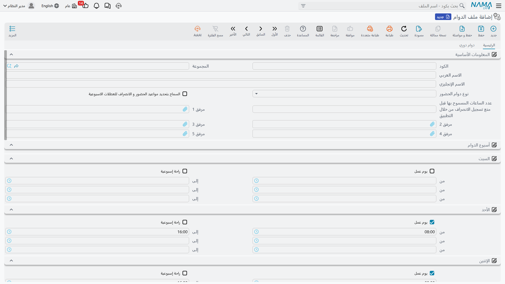
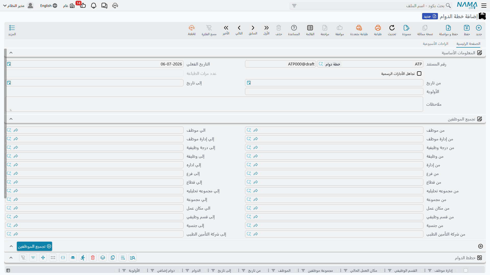

# خطط الدوام والورديات (Attendance Plans & Shifts)

قبل أن يستطيع النظام معرفة هل بصمة ما "تأخير" أم أن ساعة ما "عمل إضافي"، يحتاج أولاً إلى معرفة الجدول الذي كان *مفترضاً* أن يعمل به الموظف في ذلك اليوم. سجلان رئيسيان يحملان هذا الجدول: **ملف الدوام** (Attendance Shift) هو القالب الأسبوعي القابل لإعادة الاستخدام — من الثامنة إلى الرابعة، من الأحد إلى الخميس مثلاً — و**خطة الدوام** (Attendance Plan) هي المستند الذي يوزّع دواماً موجوداً بالفعل على مجموعة من الموظفين لفترة زمنية محددة. الدوامات تُبنى مرة واحدة؛ والخطط هي ما يُسنِدها.

## ملف الدوام — القالب الأسبوعي

يوجد في **الرواتب > حضور / إنصراف > ملف الدوام**.

يُعرَّف ملف الدوام بالكود / المجموعة / الاسم العربي / الاسم الإنجليزي كأي ملف رئيسي، بالإضافة إلى **نوع دوام الحضور** (AttendanceShiftType) الذي يحدد كيفية تعريف ساعاته:

| نوع الدوام | آلية العمل |
|---|---|
| عادية (Normal) | نمط أسبوعي ثابت واحد — تسرد تبويبة **الرئيسية** أيام السبت حتى الجمعة، ولكل يوم مفتاح **يوم عمل** أو **راحة إسبوعية**، مع ما يصل إلى ثلاثة أزواج مواعيد من/إلى (لدوام مقسّم بفترة راحة منتصف اليوم مثلاً). |
| تلقائي (Automatic) | بدلاً من نمط ثابت واحد، يسرد جدول **الدوامات الآليه** عدة نوافذ زمنية مرشّحة (وقت الحضور من/إلى ساعة، ووقت الانصراف من/إلى وقت)، ويختار النظام أقرب نافذة لبصمة الموظف الفعلية، ويمكن تعليم أحد الأسطر كـ**دوام إفتراضى** يُعتمد عليه عند عدم التطابق. مفيد حين لا يبدأ كل الموظفين على نفس كود الدوام في نفس الدقيقة بالضبط. |
| دورية (Rotational) | تُعرِّف تبويبة **دوام دوري** جدول **تفاصيل خطة مجموعة عمالة** (ساعات العمل لكل مجموعة تدوير) وجدول **تفاصيل التدويير** (متى يبدأ تدوير كل مجموعة وأي سطر تدوير يتبعه) — لأنماط الدوام التي تُدوِّر الموظفين بين أسابيع مختلفة وفق جدول، بدلاً من تكرار نفس الأسبوع دائماً. |

مفتاحان إضافيان ينطبقان بصرف النظر عن النوع:

| الحقل (عربي ← إنجليزي) | الغرض |
|---|---|
| السماح بتحديد مواعيد الحضور و الانصراف للعطلات الاسبوعية (Allow Specifying Times For Weekends) | يتيح ليوم الراحة الأسبوعية أن يحمل مواعيد حضور/انصراف خاصة به، لحالات يُتوقَّع فيها حضور الموظف أحياناً في يوم راحته. |
| عدد الساعات المسموح بها قبل منع تسجيل الانصراف من خلال التطبيق (Number Of Hours Allowed Before Preventing CheckOut) | يحدد أقصى مدة يمكن للموظف خلالها تسجيل الانصراف مبكراً عبر تطبيق الحضور الإلكتروني/الجوال قبل موعد نهاية الدوام — راجع **[الحضور والانصراف](time-attendance.md)** لمعرفة كيفية تسجيل الحضور والانصراف الإلكتروني. |

كأي بيانات رئيسية أخرى في الرواتب، يمكن تحديد نطاق ملف الدوام عبر **المحددات** المعتادة (الشركة، الفرع، القطاع، الإدارة، المجموعة التحليلية) بحيث تحتفظ كل جهة بكتالوج الدوامات الخاص بها.

## خطة الدوام — إسناد دوام للموظفين

توجد في **الرواتب > حضور / إنصراف > خطة الدوام**.

الخطة لا تُعرِّف الساعات بنفسها — بل *توزّع* دوامات موجودة بالفعل على أي موظفين تنطبق عليهم معايير محددة، لفترة زمنية معينة. يغطي رأسها:

| الحقل (عربي ← إنجليزي) | الغرض |
|---|---|
| التاريخ الفعلي / من تاريخ / إلى تاريخ (Value Date / From Date / To Date) | الفترة التي تسري فيها هذه الخطة. |
| الأولوية (Priority) | حين تنطبق أكثر من خطة على نفس الموظف في نفس اليوم، تفوز الخطة ذات الأولوية الأعلى. |
| تجاهل الأجازات الرسمية (Ignore Holidays) | هل تُحتسب ساعات الدوام حتى في الأيام المعلَّمة كأجازات رسمية. |
| ملاحظات (Description) | ملاحظات نصية حرة على الخطة. |

يقوم زر **تجميع الموظفين** (Collect Employees) بعملية المطابقة: عبّئ نطاق موظفين — من/إلى موظف، إدارة، وظيفة، درجة وظيفية، فرع، قطاع، مجموعة، مجموعة تحليلية، مكان عمل، قسم وظيفي، جنسية، أو شركة تأمين طبي — ثم يسحب الزر كل موظف مطابق إلى جدول **خطط الدوام** الخاص بالخطة، حيث يحدد كل سطر بعد ذلك **الدوام** (Shift) الفعلي المطبَّق (مع **دوام إضافي** اختياري لدوام ثانٍ متزامن، وأولوية وفترة تاريخ خاصة بكل سطر).

::: tip يمكن للخطة أيضاً تعديل أيام الراحة الأسبوعية
تتيح تبويبة ثانية، **الراحات الأسبوعية**، لنفس الخطة أن تحمل مجموعة أسطر منفصلة — مُحدَّدة النطاق حسب الموظف أو الإدارة أو الوظيفة أو القسم الوظيفي، ولفترة تاريخ معينة — تُعدِّل أيام الراحة الأسبوعية المعتادة للموظف (حتى ثلاثة أيام راحة أسبوعية لكل سطر) دون المساس بالدوام المُسنَد إليه. تُدار هذه الأسطر بالكامل داخل سجل خطة الدوام نفسه، ولا تتطلب مستنداً منفصلاً.
:::

يمكن تحديد نطاق الخطة، مثل ملف الدوام، عبر **المحددات** المعتادة (الشركة، الفرع، القطاع، الإدارة، المجموعة التحليلية).

## سير العمل

1. **ابنِ ملف/ملفات الدوام** من **ملف الدوام** — اختر عادية لنمط أسبوعي ثابت، تلقائي حين تتفاوت مواعيد البدء ويُترك للنظام مطابقة أقرب نافذة، أو دورية لجدول متدوِّر.
2. **حرّر خطة دوام** بفترة التاريخ والأولوية التي تسري بها.
3. **حدد نطاق الموظفين** واستخدم **تجميع الموظفين** لمعاينة الموظفين المطابقين وتعبئتهم.
4. **أسنِد الدوام** (ودوام إضافي عند الحاجة) لكل سطر تم تجميعه.
5. **أضِف تعديلات الراحات الأسبوعية** اختيارياً على نفس الخطة لمجموعات الموظفين التي تختلف أيام راحتها الأسبوعية عن الافتراضي.

## صفحات ذات صلة

- **[الحضور والانصراف](time-attendance.md)** — أين تُسجَّل البصمات الفعلية مقابل هذه الدوامات وتتحول إلى آثار على الراتب.
- **[أجهزة البصمة](attendance-machines.md)** — كيف تصل بيانات البصمة الخام إلى النظام أصلاً، سواء عبر تكامل آلي مجدوَل أو استيراد يدوي.
