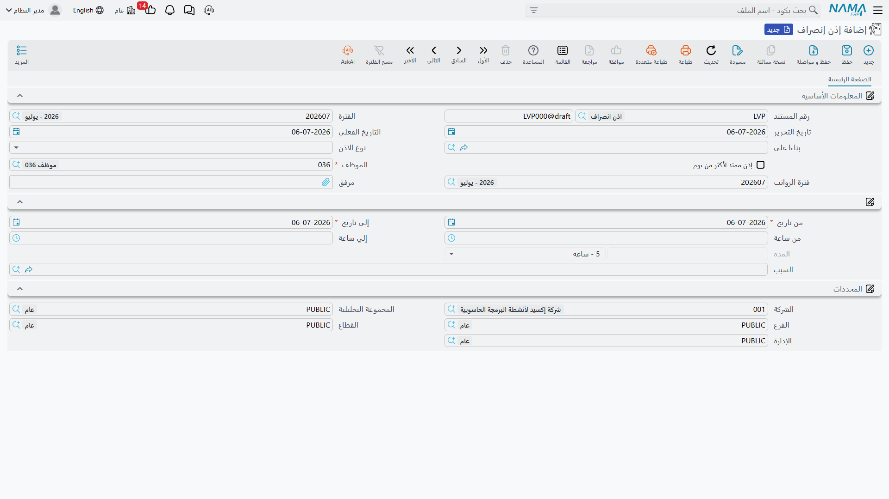
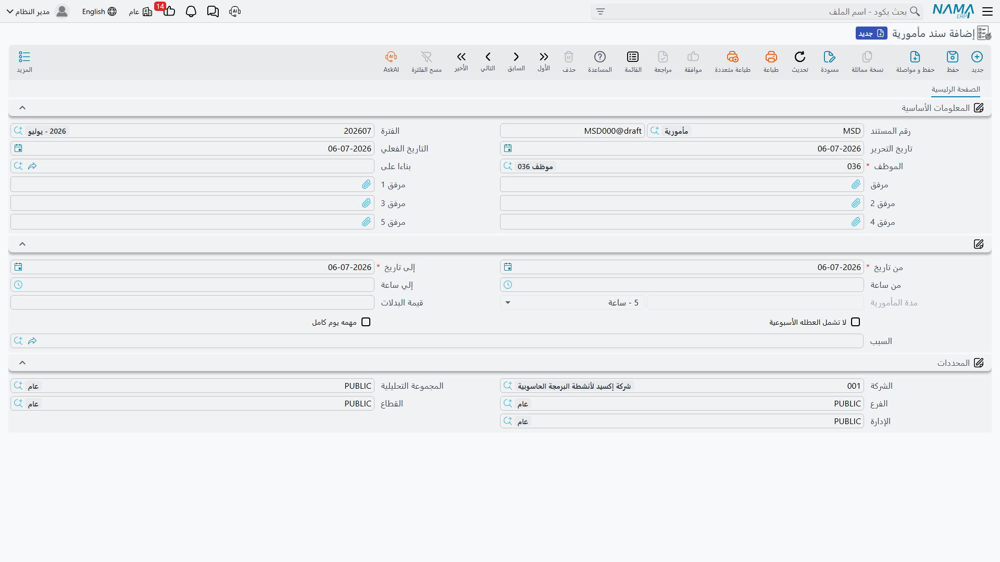

# الاستئذانات والمأموريات (Leave Permissions & Missions)

ليس كل خروج عن الجدول المعتاد يحتاج **[أجازة](../vacations/vacation-documents.md)** كاملة. أحياناً يحتاج الموظف فقط إلى الانصراف قبل ساعتين، أو الحضور متأخراً، أو الخروج في مهمة لصالح الشركة لبضع ساعات بعد الظهر. يغطي النظام هذه الاستثناءات القصيرة داخل اليوم بمستندين خفيفين: **إذن انصراف** (Leave Permission) للغياب المصرَّح به عن مكان العمل، و**سند مأمورية** (Mission Document) للوقت المقضي خارج المكتب في عمل رسمي. لا يُرحِّل أي منهما قيداً محاسبياً بذاته — مهمتهما الكاملة هي التأكد من أن ذلك الغياب القصير *مُفسَّر* في سجل الحضور بدلاً من أن يظهر تأخيراً غير مبرر أو فجوة في اليوم.

## إذن انصراف — غياب قصير مصرَّح به

يوجد في **الرواتب > حضور / إنصراف > إذن إنصراف**.

يسجّل إذن الانصراف غياباً محدداً بفترة زمنية لموظف واحد، مع **نوع الاذن** الذي يوضح السبب:

| نوع الاذن | إنجليزي | الاستخدام المعتاد |
|---|---|---|
| اذن مبكر | Early Leave | الانصراف قبل انتهاء الدوام. |
| اذن تاخير | Late Arrival | الحضور بعد بداية الدوام. |
| انصراف خلال العمل | Leave During Work | الخروج أثناء الدوام والعودة إليه. |
| نسيان بصمة دخول | Forgot Check In | يغطي بصمة حضور مفقودة — غالباً يُنشأ عبر إجراء **تحويل لإذن انصراف** من سجل **[حضور إلكتروني](time-attendance.md)** مُعلَّم بذلك. |
| نسيان بصمة خروج | Forgot Check Out | يغطي بصمة انصراف مفقودة، بنفس الطريقة. |
| أخرى 1 / 2 / 3 | Other 1 / 2 / 3 | فئات عامة خاصة بكل جهة. |

يحمل رأسه هوية المستند المعتادة بالإضافة إلى حقلين يستحقان الذكر:

| الحقل (عربي ← إنجليزي) | الغرض |
|---|---|
| بناءا على (From Document) | رابط اختياري للسجل الذي نشأ منه هذا الإذن — غالباً بصمة "حضور إلكتروني" التي حُوِّل منها، وفق نفس فكرة "المستند يخبرك من أين جاء" الموضحة في **[طلبات ومستندات الموارد البشرية](../concepts/hr-requests-and-documents.md)**. |
| إذن ممتد لأكثر من يوم (Extended Multi Day Permission) | يتيح لإذن واحد أن يمتد لأكثر من يوم تقويمي، بدلاً من الاقتصار على يوم واحد. |
| فترة الرواتب (HR Period) | فترة الرواتب التي يُحتسب عليها هذا الإذن. |

يحدد متن المستند بدقة مدة الغياب:

| الحقل (عربي ← إنجليزي) | الغرض |
|---|---|
| من تاريخ / إلى تاريخ (From Date / To Date) | المدى الزمني الذي يغطيه الإذن. |
| من ساعة / إلي ساعة (From Hour / To Hour) | الساعات المحددة ضمن ذلك المدى. |
| المدة — القيمة / الوحدة (Duration — Value / Unit) | طول الإذن المحسوب، بوحدة يوم/أسبوع/شهر/سنة/ساعة/دقيقة/ثانية. |
| السبب (Reason) | **نوع سبب** يُختار من كتالوج الأسباب المشترك (موضح في القسم التالي). |

::: info لا يوجد أثر محاسبي
لا يولّد إذن الانصراف أي قيد على دفتر الأستاذ بذاته. أثره بالكامل على سجل الحضور — الساعة المسجَّلة هنا هي ساعة لن تُعلَّم تأخيراً أو غياباً غير مبرر عند احتساب مؤشرات أداء الفترة. وإن كان السبب أو إعداد المفردات يستوجب استقطاعاً (سبب غياب بدون مرتب مثلاً)، فسيظهر ذلك لاحقاً كمفرد راتب مبني على رقم مؤشر الأداء الناتج، وليس كشيء يُرحِّله الإذن نفسه.
:::

## إعدادات إذن الانصراف — الضوابط

**إعدادات إذن الانصراف** (Leave Permission Configuration، ملف رئيسي في **الرواتب > الأساسيات > إعدادات إذن الانصراف**) هي حيث تحدد الجهة سقف استخدام هذا البدل من الغياب القصير لموظف (أو مجموعة موظفين). فبدلاً من قاعدة واحدة ثابتة، تحمل جدول **التفاصيل** بعدة قواعد، كل قاعدة محدَّدة النطاق بـ:

- **فترة تاريخ** تسري خلالها القاعدة (من/إلى التاريخ الفعلي).
- **محددات سند الإذن** نفسه (الشركة، الفرع، القطاع، الإدارة، المجموعة التحليلية) أو استعلام/معيار حر.
- **محددات الموظف** (الشركة، الفرع، القطاع، الإدارة، المجموعة التحليلية).

ثم تحدد كل قاعدة:

| الحقل (عربي ← إنجليزي) | الغرض |
|---|---|
| أقصى عدد ساعات إذون انصراف شهريا (Max Permission Hours Per Month) | إجمالي ساعات إذن الانصراف التي يمكن للموظف أخذها في الشهر. |
| أقصى عدد ساعات للإذن الواحد (Max Single Permission Hours) | أطول مدة يمكن أن يكون عليها إذن واحد. |
| أقصى عدد إذون انصراف شهريا (Max Permissions Per Month) | عدد الأذون المنفصلة المسموح بها في الشهر، بصرف النظر عن طول كل منها. |

ولأن القاعدة يمكن تحديد نطاقها بشكل ضيق (إدارة واحدة) أو واسع (الشركة بأكملها)، يمكن لجهة ما منح موظفي المبيعات مثلاً بدلاً أوسع من موظفي المكتب، كل ذلك من نفس سجل الإعدادات.

## نوع سبب — كتالوج الأسباب

**نوع سبب** (Leave Reason، ملف رئيسي في **الرواتب > الأساسيات > نوع سبب**) هو كتالوج أسباب مشترك — نفس الكيان يخدم أسباب الأجازات وأذون الانصراف والمكافآت والجزاءات والوقف عن العمل والمأموريات، ويُميَّز بينها بحقل **قائمة المختارين** (Selected Group):

| قائمة المختارين | إنجليزي | تنطبق على |
|---|---|---|
| الأجازة | Vacation | مستندات الأجازات. |
| إنصراف | Leave | مستندات إذن الانصراف. |
| مكافأة | Reward | سجلات المكافآت. |
| جزاء | Penalty | سجلات الجزاءات. |
| وقف عن العمل | Suspension | مستندات الوقف عن العمل. |
| مأمورية | Mission | سندات المأموريات. |

بالنسبة لسبب محدَّد النطاق بـ**إنصراف**، الحقول ذات الصلة هي:

| الحقل (عربي ← إنجليزي) | الغرض |
|---|---|
| بدون مرتب و يخصم من نهاية الخدمة (Without Salary Deducted From Termination) | إجازة هذا السبب بدون مرتب، وتُحتسب ضمن حسابات نهاية الخدمة. |
| بدون مرتب ولا يخصم من نهاية الخدمة (Without Salary Not Deducted From Termination) | بدون مرتب، لكنها **لا** تؤثر على نهاية الخدمة. |
| أقصي عدد أذون شهريا لكل سبب على حدة (Max Permission Count Per Reason) | سقف شهري خاص بهذا السبب تحديداً، إضافة إلى ما تسمح به إعدادات إذن الانصراف عموماً. |
| تخصم من مدة الأجازة مدفوعة الأجر في التصفية (Deducted From Paid Vacation Period In Dues) | هل يخصم الوقت المأخوذ بهذا السبب من مدة الأجازة مدفوعة الأجر المحتسبة عند التصفية النهائية. |
| إعتبار تاريخ العودة تاريخ مباشرة العمل (Consider Return Date As Working Start Date) | يعامل يوم عودة الموظف كتاريخ مباشرة عمل جديد لأغراض الحساب. |
| تغير حالة الموظف إلى (Change Employee State To) | يغيّر حالة عمل الموظف اختيارياً (إلى موقوف مثلاً) طوال فترة سريان هذا السبب. |
| أقصى عدد إذون انصراف شهريا / أقصى عدد ساعات إذون انصراف شهريا / أقصى عدد ساعات للإذن الواحد | نفس الضوابط الثلاثة الموجودة في إعدادات إذن الانصراف، قابلة للضبط لكل سبب بدلاً من (أو إضافة إلى) الضبط العام. |

## سند مأمورية — الوقت خارج المكتب في عمل رسمي

يوجد في **الرواتب > حضور / إنصراف > سند مأمورية**.

يسجّل سند المأمورية غياب موظف عن مكان عمله المعتاد **في مهمة لصالح الشركة** — زيارة عميل، رحلة توصيل، اجتماع خارجي — بخلاف الغياب الشخصي. من الناحية الهيكلية يشبه إذن الانصراف كثيراً:

| الحقل (عربي ← إنجليزي) | الغرض |
|---|---|
| الموظف (Employee) | من في المأمورية. |
| بناءا على (From Document) | السجل المصدر الاختياري، نفس فكرة إذن الانصراف. |
| من تاريخ / إلى تاريخ، من ساعة / إلي ساعة | مدى المأمورية. |
| مدة المأمورية — القيمة / الوحدة (Mission Period — Value / Unit) | طول المأمورية المحسوب. |
| قيمة البدلات (Allowance Value) | بدل مالي مرتبط بالمأمورية (كبدل انتقال أو بدل يومية)، يمكن لمعادلة راتب أن تلتقطه. |
| لا تشمل العطله الأسبوعية (Not Include Week Ends) | يستبعد أيام الراحة الأسبوعية من مدة المأمورية المحتسبة. |
| مهمه يوم كامل (Full Day Mission) | يعلِّم المأمورية كمغطية ليوم العمل بأكمله بدلاً من جزء منه. |
| السبب (Reason) | نوع سبب محدَّد النطاق بـ**مأمورية**. |
| مرفق 1–5 | مستندات مساندة (أمر انتداب، تقرير زيارة عميل، وما شابه). |

::: tip المأمورية وقت عمل، لا وقت إجازة
الفارق الجوهري عن إذن الانصراف هو النية: موظف المأمورية لا يزال يعمل، فقط ليس على مكتبه. لهذا السبب لا تحتاج المأموريات ليوم كامل إلى أن تُعلَّم غياباً، ولهذا السبب تحمل المأمورية غالباً **قيمة بدلات** بدلاً من استقطاع — فهي تعوّض الموظف عن خروجه، لا تبرر غياباً.
:::

## سير العمل

1. **غياب قصير مصرَّح به**: حرّر **إذن انصراف** بنوع الإذن الصحيح، ونطاق التاريخ/الساعة، و**نوع سبب** محدَّد النطاق بإنصراف — أو دع بصمة "حضور إلكتروني" منسية تتحول إليه تلقائياً.
2. **حدّ الضوابط**: عرّف (أو اعتمد على) قواعد **إعدادات إذن الانصراف** والحدود الخاصة بكل سبب حتى لا تتراكم الغيابات القصيرة دون رقابة.
3. **مهمة خارج المكتب**: حرّر **سند مأمورية** بنطاق تاريخ/ساعة خاص به، وبدل إن وُجد، و**نوع سبب** محدَّد النطاق بمأمورية.
4. **دع الحضور والراتب يقرآن النتيجة**: يغذّي كلا المستندين صورة حضور اليوم، والتي تحوّلها مؤشرات الأداء بعد ذلك إلى إضافات أو استقطاعات الراتب المعنية.

## صفحات ذات صلة

- **[الحضور والانصراف](time-attendance.md)** — سجل البصمات الذي تعدّل أذون الانصراف والمأموريات كيفية قراءته.
- **[طلبات ومستندات وأنظمة تجميع الموارد البشرية](../concepts/hr-requests-and-documents.md)** — النمط العام للطلب/المستند؛ تستخدم أذون الانصراف والمأموريات النسخة الخفيفة منه ("مستند بأصل اختياري بناءا على").
- **[كيف يُحسب الراتب](../concepts/hr-salary-engine.md)** — كيف تتحول أرقام الحضور، بما فيها الأذون والمأموريات، إلى راتب في النهاية.
