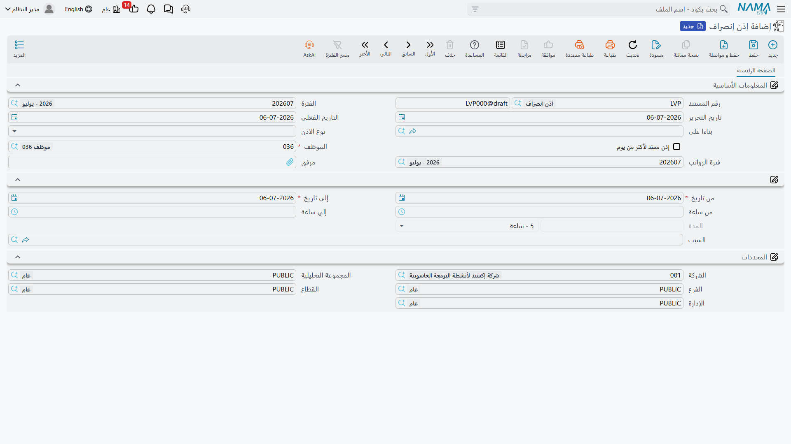
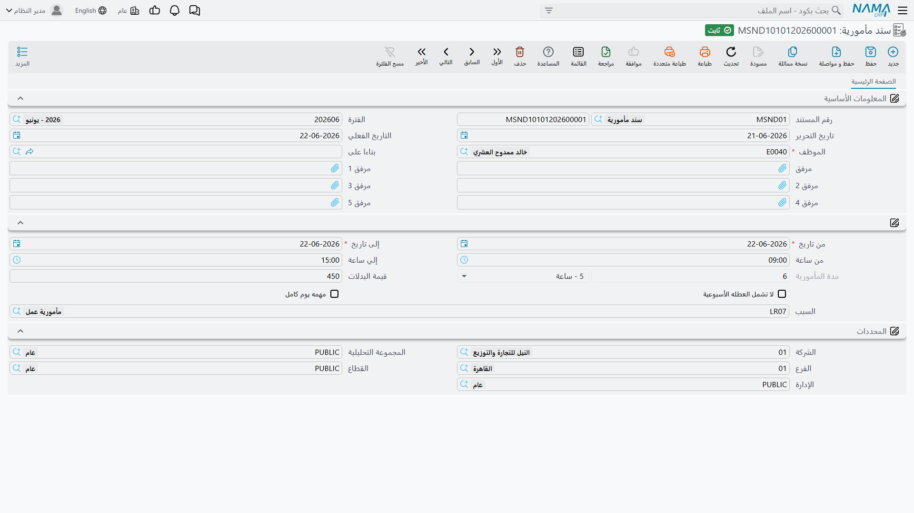

# الاستئذانات والمأموريات (Leave Permissions & Missions)

ليس كل خروج عن الجدول المعتاد يحتاج **[أجازة](../vacations/vacation-documents.md)** كاملة. أحياناً يحتاج الموظف فقط إلى الانصراف قبل ساعتين، أو الحضور متأخراً، أو الخروج في مهمة لصالح الشركة لبضع ساعات بعد الظهر. يغطي النظام هذه الاستثناءات القصيرة داخل اليوم بمستندين خفيفين: **إذن انصراف** (Leave Permission) للغياب المصرَّح به عن مكان العمل، و**سند مأمورية** (Mission Document) للوقت المقضي خارج المكتب في عمل رسمي. لا يُرحِّل أي منهما قيداً محاسبياً بذاته — مهمتهما الكاملة هي التأكد من أن ذلك الغياب القصير *مُفسَّر* في سجل الحضور بدلاً من أن يظهر تأخيراً غير مبرر أو فجوة في اليوم.

## إذن انصراف — غياب قصير مصرَّح به

يوجد في **الرواتب > حضور / إنصراف > إذن إنصراف**.

يسجّل إذن الانصراف غياباً محدداً بفترة زمنية لموظف واحد، مع **نوع الاذن** الذي يوضح السبب:

| نوع الاذن | إنجليزي | الاستخدام المعتاد |
|---|---|---|
| اذن مبكر | Early Leave | الانصراف قبل انتهاء الدوام. |
| اذن تاخير | Late Arrival | الحضور بعد بداية الدوام. |
| انصراف خلال العمل | Leave During Work | الخروج أثناء الدوام والعودة إليه. |
| نسيان بصمة دخول | Forgot Check In | يغطي بصمة حضور مفقودة — غالباً يُنشأ عبر إجراء **تحويل لإذن انصراف** من سجل **[حضور إلكتروني](time-attendance.md)** مُعلَّم بذلك. |
| نسيان بصمة خروج | Forgot Check Out | يغطي بصمة انصراف مفقودة، بنفس الطريقة. |
| أخرى 1 / 2 / 3 | Other 1 / 2 / 3 | فئات عامة خاصة بكل جهة. |

يحمل رأسه هوية المستند المعتادة بالإضافة إلى حقلين يستحقان الذكر:

| الحقل (عربي ← إنجليزي) | الغرض |
|---|---|
| بناءا على (From Document) | رابط اختياري للسجل الذي نشأ منه هذا الإذن — غالباً بصمة "حضور إلكتروني" التي حُوِّل منها، وفق نفس فكرة "المستند يخبرك من أين جاء" الموضحة في **[طلبات ومستندات الموارد البشرية](../concepts/hr-requests-and-documents.md)**. |
| إذن ممتد لأكثر من يوم (Extended Multi Day Permission) | يتيح لإذن واحد أن يمتد لأكثر من يوم تقويمي، بدلاً من الاقتصار على يوم واحد. |
| فترة الرواتب (HR Period) | فترة الرواتب التي يُحتسب عليها هذا الإذن. |

يحدد متن المستند بدقة مدة الغياب:

| الحقل (عربي ← إنجليزي) | الغرض |
|---|---|
| من تاريخ / إلى تاريخ (From Date / To Date) | المدى الزمني الذي يغطيه الإذن. |
| من ساعة / إلي ساعة (From Hour / To Hour) | الساعات المحددة ضمن ذلك المدى. |
| المدة — القيمة / الوحدة (Duration — Value / Unit) | طول الإذن المحسوب، بوحدة يوم/أسبوع/شهر/سنة/ساعة/دقيقة/ثانية. |
| السبب (Reason) | **نوع سبب** يُختار من كتالوج الأسباب المشترك (موضح في القسم التالي). |

::: info لا يوجد أثر محاسبي
لا يولّد إذن الانصراف أي قيد على دفتر الأستاذ بذاته. أثره بالكامل على سجل الحضور — الساعة المسجَّلة هنا هي ساعة لن تُعلَّم تأخيراً أو غياباً غير مبرر عند احتساب مؤشرات أداء الفترة. وإن كان السبب أو إعداد المفردات يستوجب استقطاعاً (سبب غياب بدون مرتب مثلاً)، فسيظهر ذلك لاحقاً كمفرد راتب مبني على رقم مؤشر الأداء الناتج، وليس كشيء يُرحِّله الإذن نفسه.
:::

## إعدادات إذن الانصراف — الضوابط

**إعدادات إذن الانصراف** (Leave Permission Configuration، ملف رئيسي في **الرواتب > الأساسيات > إعدادات إذن الانصراف**) هي حيث تحدد الجهة سقف استخدام هذا البدل من الغياب القصير لموظف (أو مجموعة موظفين). فبدلاً من قاعدة واحدة ثابتة، تحمل جدول **التفاصيل** بعدة قواعد، كل قاعدة محدَّدة النطاق بـ:

- **فترة تاريخ** تسري خلالها القاعدة (من/إلى التاريخ الفعلي).
- **محددات سند الإذن** نفسه (الشركة، الفرع، القطاع، الإدارة، المجموعة التحليلية) أو استعلام/معيار حر.
- **محددات الموظف** (الشركة، الفرع، القطاع، الإدارة، المجموعة التحليلية).

ثم تحدد كل قاعدة:

| الحقل (عربي ← إنجليزي) | الغرض |
|---|---|
| أقصى عدد ساعات إذون انصراف شهريا (Max Permission Hours Per Month) | إجمالي ساعات إذن الانصراف التي يمكن للموظف أخذها في الشهر. |
| أقصى عدد ساعات للإذن الواحد (Max Single Permission Hours) | أطول مدة يمكن أن يكون عليها إذن واحد. |
| أقصى عدد إذون انصراف شهريا (Max Permissions Per Month) | عدد الأذون المنفصلة المسموح بها في الشهر، بصرف النظر عن طول كل منها. |

ولأن القاعدة يمكن تحديد نطاقها بشكل ضيق (إدارة واحدة) أو واسع (الشركة بأكملها)، يمكن لجهة ما منح موظفي المبيعات مثلاً بدلاً أوسع من موظفي المكتب، كل ذلك من نفس سجل الإعدادات.

## نوع سبب — كتالوج الأسباب

**نوع سبب** (Leave Reason، ملف رئيسي في **الرواتب > الأساسيات > نوع سبب**) هو كتالوج أسباب مشترك — نفس الكيان يخدم أسباب الأجازات وأذون الانصراف والمكافآت والجزاءات والوقف عن العمل والمأموريات، ويُميَّز بينها بحقل **قائمة المختارين** (Selected Group):

| قائمة المختارين | إنجليزي | تنطبق على |
|---|---|---|
| الأجازة | Vacation | مستندات الأجازات. |
| إنصراف | Leave | مستندات إذن الانصراف. |
| مكافأة | Reward | سجلات المكافآت. |
| جزاء | Penalty | سجلات الجزاءات. |
| وقف عن العمل | Suspension | مستندات الوقف عن العمل. |
| مأمورية | Mission | سندات المأموريات. |

بالنسبة لسبب محدَّد النطاق بـ**إنصراف**، الحقول ذات الصلة هي:

| الحقل (عربي ← إنجليزي) | الغرض |
|---|---|
| بدون مرتب و يخصم من نهاية الخدمة (Without Salary Deducted From Termination) | إجازة هذا السبب بدون مرتب، وتُحتسب ضمن حسابات نهاية الخدمة. |
| بدون مرتب ولا يخصم من نهاية الخدمة (Without Salary Not Deducted From Termination) | بدون مرتب، لكنها **لا** تؤثر على نهاية الخدمة. |
| أقصي عدد أذون شهريا لكل سبب على حدة (Max Permission Count Per Reason) | سقف شهري خاص بهذا السبب تحديداً، إضافة إلى ما تسمح به إعدادات إذن الانصراف عموماً. |
| تخصم من مدة الأجازة مدفوعة الأجر في التصفية (Deducted From Paid Vacation Period In Dues) | هل يخصم الوقت المأخوذ بهذا السبب من مدة الأجازة مدفوعة الأجر المحتسبة عند التصفية النهائية. |
| إعتبار تاريخ العودة تاريخ مباشرة العمل (Consider Return Date As Working Start Date) | يعامل يوم عودة الموظف كتاريخ مباشرة عمل جديد لأغراض الحساب. |
| تغير حالة الموظف إلى (Change Employee State To) | يغيّر حالة عمل الموظف اختيارياً (إلى موقوف مثلاً) طوال فترة سريان هذا السبب. |
| أقصى عدد إذون انصراف شهريا / أقصى عدد ساعات إذون انصراف شهريا / أقصى عدد ساعات للإذن الواحد | نفس الضوابط الثلاثة الموجودة في إعدادات إذن الانصراف، قابلة للضبط لكل سبب بدلاً من (أو إضافة إلى) الضبط العام. |

## سند مأمورية — الوقت خارج المكتب في عمل رسمي

يوجد في **الرواتب > حضور / إنصراف > سند مأمورية**.

يسجّل سند المأمورية غياب موظف عن مكان عمله المعتاد **في مهمة لصالح الشركة** — زيارة عميل، رحلة توصيل، اجتماع خارجي — بخلاف الغياب الشخصي. من الناحية الهيكلية يشبه إذن الانصراف كثيراً:

| الحقل (عربي ← إنجليزي) | الغرض |
|---|---|
| الموظف (Employee) | من في المأمورية. |
| بناءا على (From Document) | السجل المصدر الاختياري، نفس فكرة إذن الانصراف. |
| من تاريخ / إلى تاريخ، من ساعة / إلي ساعة | مدى المأمورية. |
| مدة المأمورية — القيمة / الوحدة (Mission Period — Value / Unit) | طول المأمورية المحسوب. |
| قيمة البدلات (Allowance Value) | بدل مالي مرتبط بالمأمورية (كبدل انتقال أو بدل يومية)، يمكن لمعادلة راتب أن تلتقطه. |
| لا تشمل العطله الأسبوعية (Not Include Week Ends) | في مأمورية بساعات تمتد عبر أيام — انتداب لأسبوعين في الإسكندرية — يترك أيام الراحة الأسبوعية الواقعة داخل المدة خارج المدة المحتسبة. أما المأمورية التي تقع داخل يوم واحد فتُحتسب دائماً، يوم راحة كان أو لا: فقد حدثت فعلاً. ولا يجتمع هذا الخيار مع «مهمه يوم كامل». |
| مهمه يوم كامل (Full Day Mission) | المأمورية متصلة على مدار الساعة وليست لساعات محددة — رحلة توصيل لأسوان تستغرق ثلاثة أيام — ولذلك يُحتسب كل يوم بين من تاريخ وإلى تاريخ يوم عمل، ومنها أيام الراحة الأسبوعية. |
| السبب (Reason) | نوع سبب محدَّد النطاق بـ**مأمورية**. |
| مرفق 1–5 | مستندات مساندة (أمر انتداب، تقرير زيارة عميل، وما شابه). |

::: tip المأمورية وقت عمل، لا وقت إجازة
الفارق الجوهري عن إذن الانصراف هو النية: موظف المأمورية لا يزال يعمل، فقط ليس على مكتبه. لهذا السبب لا تحتاج المأموريات ليوم كامل إلى أن تُعلَّم غياباً، ولهذا السبب تحمل المأمورية غالباً **قيمة بدلات** بدلاً من استقطاع — فهي تعوّض الموظف عن خروجه، لا تبرر غياباً.
:::

## عندما تتقاطع المأمورية مع غيرها (Overlap)

لأن المأمورية وقت عمل، فهي لا تجلس بهدوء بجوار سجل الحضور — بل تشارك فيه. يكتسب اليوم فترة من الساعات لم تنتجها أي بصمة، وعلى هذه الفترة أن تتعايش مع كل ما يحمله اليوم بالفعل: البصمات الحقيقية، وإذن الانصراف، والأجازة الجزئية. من هنا يبرز سؤالان، وهما معاً سبب معظم استفسارات الدعم حول المأموريات.

### نفس الساعات محسوبة مرتين — التداخل والأولوية

تخيل موظفاً بصم دخولاً في 09:06 وخروجاً في 17:05، ولديه في اليوم نفسه سند مأمورية يغطي من 09:00 إلى 17:00. الساعات المعمولة ثماني ساعات، لكن اليوم يحمل سجلَّين لها. وما لم يوفّق النظام بين السجلَّين، تُحسب هذه الساعات الثماني مرتين.

هذا التوفيق خيار في **إعدادات الرواتب**، داخل مجموعة **إعدادات الحضور**:

<HRConfigOption option-code="value.handleOverlapBetweenAttendanceAndMissions" link-title="معالجة التداخل بين الحضور و الانصراف و الاذون" />

بتفعيله، تُرتَّب سجلات اليوم على خط زمني واحد وتُقارن أزواجاً. وحيث يغطي سجلان نفس الدقائق، يحتفظ الأقوى بها ويُقلَّص الأضعف إلى الجزء غير المتقاطع فقط — أو يُحذف بالكامل إذا كان الأقوى يغطيه من أوله إلى آخره. والقوة رقم تحدده أنت، **والأصغر يفوز**:

| الخيار (عربي ← إنجليزي) | القيمة الافتراضية |
|---|---|
| اولوية المأموريات عند التداخل (Mission Document Priority With Overlap) | 1 |
| اولوية الحضور و الانصراف عند التداخل (Time Attendance Priority With Overlap) | 2 |
| اولوية الأذون عند التداخل (Leave Permission Priority With Overlap) | 3 |
| اولوية الاجازات الجزئية عند التداخل (Partial Vacation Priority With Overlap) | 4 |

أي أن المأمورية تتقدم على كل ما سواها في الوضع الافتراضي: في المثال أعلاه تحتفظ المأمورية بالفترة من 09:00 إلى 17:00 ويُحذف سطر البصمة، لأن المأمورية تغطيه بالكامل. وتبديل الرقمين الأولين يجعل البصمة هي المرجع، فلا يتبقى للمأمورية إلا الساعات التي لم تسجلها الماكينة.

::: warning قد لا يكون الخيار مفعّلاً في سجل إعدادات قديم
سجل إعدادات الرواتب المنشأ اليوم يأتي بمعالجة التداخل مفعّلة من البداية، أما السجل الأقدم من الخيار نفسه فيبقى غير مفعّل — وغير المفعّل يعني أن السجلَّين يُحسبان كاملَين. فإذا ظهر يوم بساعات مضاعفة، اقرأ هذا الخيار قبل البحث في أي شيء آخر ولا تفترض القيمة الافتراضية.
:::

### ساعات المأمورية تصبح حضور اليوم وانصرافه

لأن المأمورية تدخل اليوم كفترة زمنية حقيقية، فإن أول وقت حضور وآخر وقت انصراف لليوم قد يُقرآن من **من ساعة / إلي ساعة** الخاصة بالمأمورية نفسها. لهذا تظهر أيام المأمورية بأوقات مستديرة تماماً — من 09:00:00 إلى 17:00:00 — في نفس القائمة التي تظهر فيها أيام البصمة العادية بأوقات مثل 09:06:35 و 16:58:12. لا خطأ في البيانات: ما تراه هو ساعات المأمورية نفسها، لا بصمة.

وإذا كنت تفضّل أن تبقى المأمورية بعيدة عن هذين الوقتين، فالمجموعة نفسها تحتوي على خيارَين لذلك (وبجوارهما نظيراهما الخاصان بأذون الانصراف):

<HRConfigOption option-code="value.missionDoesNotAffectInFirstInTime" link-title="المأمورية لا تؤثر في اول وقت حضور" />

<HRConfigOption option-code="value.missionDoesNotAffectInLastOutTime" link-title="المأمورية لا تؤثر في اخر وقت انصراف" />

## مأمورية في يوم الراحة الأسبوعية

تستحق هذه الحالة عنواناً خاصاً بها: فهي أكثر السلوكيات التي تُساء قراءتها في معالجة المأموريات، والأرقام التي تنتجها تبدو تماماً كأنها خطأ برمجي.

لنبدأ بالحالة العادية. في يوم عمل تُقاس ساعات المأمورية مقابل ما يتوقعه الدوام، ما دام الخيار الذي يجعل المأموريات تدخل في حساب الوقت الإضافي مفعّلاً:

<HRConfigOption option-code="value.missionsAddsOvertime" link-title="اعتبار المأموريات عند حساب الوقت الاضافي" />

ومع تفعيله تنتج مأمورية من ثماني ساعات على دوام من ثماني ساعات وقتاً إضافياً **صفراً**. المأمورية غطّت اليوم ولم يتبقَّ شيء، وهذا ما يتوقعه الجميع.

أما يوم الراحة الأسبوعية فلا دوام خلفه، ومن ثَم لا ساعات متوقعة — فلا شيء تُقاس المأمورية مقابله ولا شيء يُطرح منها. والقاعدة هناك مختلفة: **المأمورية كلها وقت إضافي**. ولذلك تظهر نفس الساعات الثماني مرتين في اليوم الواحد، في عمودين مختلفين:

| اليوم | إجمالي وقت المأموريات (Net Mission Time) | إجمالي الوقت الإضافي (Net Overtime) |
|---|---|---|
| يوم عمل — مأمورية ثماني ساعات على دوام ثماني ساعات | 8 | 0 |
| يوم راحة أسبوعية — مأمورية ثماني ساعات | 8 | 8 |

وبقراءة الرقمين كوصف لليوم، فليس هنا ازدواج على الإطلاق: الموظف تخلّى عن يوم راحته، فكل ساعة منه وقت إضافي، وعمود المأمورية يسجّل *سبب* وجوده فقط. المشكلة تبدأ فقط عندما تصرف معادلة الراتب العمودين معاً — فتُدفع نفس الساعات الثماني مرتين، ويصبح يوم الراحة مكلِّفاً ضعف قيمته في صمت.

أي أن لا شيء يحتاج إلى تصحيح في الأرقام نفسها — وما يحدد المصروف هو أي الرقمين تقرأه مكونات الراتب، وأنواع [مؤشر الأداء](../performance/performance-indicators.md) مقسّمة بحسب نوع اليوم لهذا الغرض بالضبط:

| نوع المؤشر | ما يقرأه |
|---|---|
| وقت إضافي (بالساعة) — OverTime | إجمالي الوقت الإضافي في كل الأيام، ومنها أيام الراحة. |
| وقت إضافي يوم عادي (بالساعة) — OverTime Normal Day | الوقت الإضافي في أيام العمل فقط — وصفر في أيام الراحة والعطلات الرسمية والأجازات. |
| وقت إضافي عطلة أسبوعية (بالساعة) — OverTime In Week Ends | الوقت الإضافي في أيام الراحة الأسبوعية وحدها. |
| مأمورية بالساعات — Hours Missions | إجمالي وقت المأموريات في اليوم. |
| إجمالي عدد ساعات المأموريات من السندات — Total Mission Hours From Mission Doc | مدد سندات المأمورية نفسها، دون النظر إلى التقاطع. |

فمكوّن وقت إضافي مبني على **وقت إضافي يوم عادي** إلى جانب مكوّن مأموريات مبني على **مأمورية بالساعات** يصرف مأمورية يوم الراحة مرة واحدة بوصفها ساعات مأمورية، ويبقى مع ذلك صارفاً للوقت الإضافي المعتاد في أيام العمل. ومكوّن مبني على **وقت إضافي** وحده دون مكوّن مأموريات يصرفها مرة واحدة بوصفها وقتاً إضافياً. أما التركيب الذي يصرف مرتين فهو **وقت إضافي** مع مكوّن ساعات مأموريات معاً — وإن كانت المكونات مبنية بهذا الشكل بالفعل، فإلغاء *اعتبار المأموريات عند حساب الوقت الاضافي* يُخرج ساعات المأمورية من الوقت الإضافي في كل الأيام، ومنها أيام الراحة.

::: warning خيار «لا يتم احتسابه في أيام العطلات الأسبوعية» ليس خياراً خاصاً بالمأموريات
خيار **لا يتم احتسابه في أيام العطلات الأسبوعية** (Not Included In Week Ends) في مؤشر الأداء يبدو كأنه الحل الدقيق لهذه المسألة، وليس كذلك: فهو يصفّر المؤشر بأكمله في كل يوم راحة أسبوعية، فيخسر معه موظف بصم وقتاً إضافياً يوم الجمعة دون أي مأمورية. اختر بدلاً من ذلك نوع المؤشر المطابق لنوع اليوم الذي تقصد صرفه.
:::

::: info يمكن جعل العطلات الرسمية والأجازات تتصرف كأيام عمل
قاعدة «كله وقت إضافي» ليست خاصة بيوم الراحة الأسبوعية — فالعطلة الرسمية ويوم الأجازة يُعالجان بالطريقة نفسها افتراضياً. لكنهما، بخلاف يوم الراحة، قابلان للعكس، فيقيس اليوم المأمورية مقابل الساعات المتوقعة كما يفعل يوم العمل:

<HRConfigOption option-code="value.calculateNormalWorkHoursForHolidays" link-title="احتساب وقت العمل بطريقة عادية لأيام العطلات الرسمية (الاضافي لن يكون طوال اليوم)" />

<HRConfigOption option-code="value.calculateNormalWorkHoursForVacations" link-title="احتساب وقت العمل بطريقة عادية لأيام الاجازة (الاضافي لن يكون طوال اليوم)" />
:::

## سير العمل

1. **غياب قصير مصرَّح به**: حرّر **إذن انصراف** بنوع الإذن الصحيح، ونطاق التاريخ/الساعة، و**نوع سبب** محدَّد النطاق بإنصراف — أو دع بصمة "حضور إلكتروني" منسية تتحول إليه تلقائياً.
2. **حدّ الضوابط**: عرّف (أو اعتمد على) قواعد **إعدادات إذن الانصراف** والحدود الخاصة بكل سبب حتى لا تتراكم الغيابات القصيرة دون رقابة.
3. **مهمة خارج المكتب**: حرّر **سند مأمورية** بنطاق تاريخ/ساعة خاص به، وبدل إن وُجد، و**نوع سبب** محدَّد النطاق بمأمورية.
4. **دع الحضور والراتب يقرآن النتيجة**: يغذّي كلا المستندين صورة حضور اليوم، والتي تحوّلها مؤشرات الأداء بعد ذلك إلى إضافات أو استقطاعات الراتب المعنية.

## صفحات ذات صلة

- **[الحضور والانصراف](time-attendance.md)** — سجل البصمات الذي تعدّل أذون الانصراف والمأموريات كيفية قراءته.
- **[طلبات ومستندات وأنظمة تجميع الموارد البشرية](../concepts/hr-requests-and-documents.md)** — النمط العام للطلب/المستند؛ تستخدم أذون الانصراف والمأموريات النسخة الخفيفة منه ("مستند بأصل اختياري بناءا على").
- **[كيف يُحسب الراتب](../concepts/hr-salary-engine.md)** — كيف تتحول أرقام الحضور، بما فيها الأذون والمأموريات، إلى راتب في النهاية.
