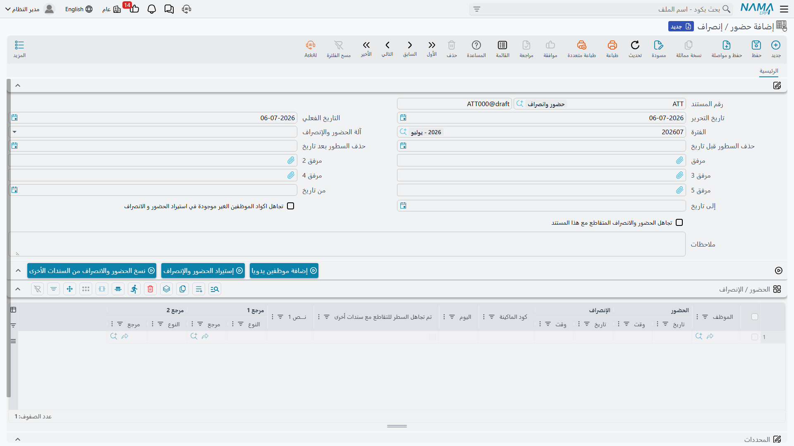
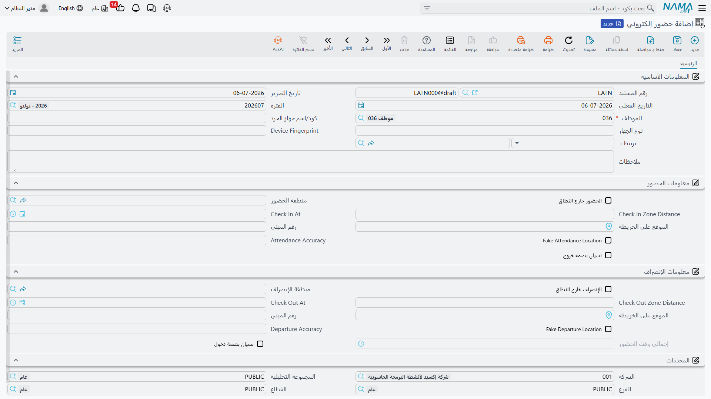

# الحضور والانصراف (Time Attendance)

**[خطة الدوام والملف](attendance-plans-and-shifts.md)** تخبر النظام بما *يفترض* أن يكون عليه يوم الموظف. أما هذه الصفحة فتتناول ما حدث *فعلاً*: بصمات الحضور والانصراف الخام، أياً كانت طريقة تسجيلها، وكيف تتحول هذه البصمات إلى قيم على قسيمة الراتب.

يسجّل النظام البصمات بطريقتين مختلفتين، لمصدرين مختلفين:

- **حضور / إنصراف** (Time Attendance) — مستند دفعي يستورد بصمات من جهاز بصمة/كارت فعلي، ملف واحد (أو سطر يدوي) في المرة الواحدة، لعدة موظفين دفعة واحدة.
- **حضور إلكتروني** (Electronic Attendance) — تسجيل حضور/انصراف الموظف بنفسه عبر تطبيق الجوال، مع إمكانية تحديد نطاق جغرافي (geofence) لموقع بعينه.

كلا الطريقتين تصبّان في نفس المكان في النهاية: سجل يومي لكل موظف بوقتي "الدخول" و"الخروج"، تقرأه محرك الرواتب عند حساب التأخير والعمل الإضافي والغياب.

## حضور / إنصراف — بصمات من جهاز

يوجد في **الرواتب > حضور / إنصراف > حضور / إنصراف**.

مستند الحضور / الإنصراف هو حاوية لدفعة من البصمات — عادة كل من صدّر جهاز بصمته ملفاً في ذلك اليوم أو الأسبوع. يغطي رأسه الدفعة ككل:

| الحقل (عربي ← إنجليزي) | الغرض |
|---|---|
| رقم المستند / الدفتر (Document Code / Book) | ترقيم المستند الخاص به. |
| تاريخ التحرير / التاريخ الفعلي (Issue Date / Value Date) | متى حُرِّر المستند، والتاريخ المحاسبي/التشغيلي الذي يسري عليه. |
| الفترة (Fiscal Period) | فترة الرواتب التي تنتمي إليها هذه الدفعة من البصمات. |
| آلة الحضور والإنصراف (Attendance Machine Name) | صيغة تصدير أي جهاز يتوقعها هذا المستند — راجع **[أجهزة البصمة](attendance-machines.md)** لمعرفة كيفية وصف تنسيق ملف الجهاز للنظام. |
| من تاريخ / إلى تاريخ (From Date / To Date) | نطاق التاريخ الذي يجب أن تقع البصمات المستوردة ضمنه. |
| حذف السطور قبل/بعد تاريخ (Remove Lines Before/After Date) | مفاتيح تنظيفية تحذف الأسطر الشاردة خارج النطاق المتوقع قبل الحفظ. |
| تجاهل اكواد الموظفين الغير موجودة في الاستيراد (Ignore Unfound Employees In Import) | تخطي أسطر الملف التي لا يطابق كودها في الجهاز أي موظف، بدلاً من إيقاف الاستيراد بالكامل. |
| تجاهل الحضور والانصراف المتقاطع مع هذا المستند (Ignore Overlapping Attendance With This Document) | راجع **[أجهزة البصمة](attendance-machines.md)** — يسمح لبصمات هذه الدفعة بالتعايش مع بصمات مسجَّلة مسبقاً لنفس الموظف/الوقت في مستند آخر، بدلاً من التعارض معها. |
| مرفق 1–5 (Attachment 1–5) | ملف (أو ملفات) تصدير الجهاز نفسها، حتى خمسة لكل مستند. |

ثلاثة أزرار تتحكم في كيفية وصول الأسطر للمستند، بدلاً من كتابة كل بصمة يدوياً:

| الإجراء | الغرض |
|---|---|
| **إضافة موظفين يدويا** (Add Employees Manually) | يضيف موظفين محددين كأسطر فارغة، لتسجيل مواعيد حضورهم/انصرافهم يدوياً. |
| **إستيراد الحضور والإنصراف** (Import Attendance Lines) | يقرأ ملف (أو ملفات) الجهاز المرفقة باستخدام معادلة الجهاز المختار ويملأ الجدول تلقائياً. |
| **نسخ الحضور والانصراف من السندات الأخرى** (Copy Attendance From Other Documents) | يسحب بصمات محفوظة بالفعل على مستندات حضور/إنصراف أخرى، للدمج أو تصحيح نطاق ما. |

كل سطر ناتج في جدول **الحضور / الإنصراف** يسجل زوج دخول/خروج موظف واحد ليوم واحد:

| العمود (عربي ← إنجليزي) | الغرض |
|---|---|
| الموظف (Employee) | من قام بالبصمة. |
| الحضور | تاريخ / وقت (In Date / In Time) | وقت بصمة الحضور. |
| الإنصراف | تاريخ / وقت (Out Date / Out Time) | وقت بصمة الإنصراف. |
| كود الماكينة (Machine Code) | كود الموظف كما يعرفه الجهاز الفعلي، وهو مختلف عن كود الموظف في النظام. |
| اليوم (Day of Week) | للعرض فقط، لمراجعة سريعة مقابل العطلات الأسبوعية والرسمية. |
| تم تجاهل السطر للتقاطع (Line Ignored Due To Overlap) | يُعلَّم تلقائياً حين يُستبعد هذا السطر لأن مستنداً آخر يغطي بالفعل نفس الوقت — راجع أجهزة البصمة. |
| نص 1 / مرجع 1 / مرجع 2 | حقول إضافية حرة تملؤها بعض معادلات الأجهزة. |

::: tip النظام لا يتصل بالجهاز مباشرة أبداً
مهما كانت ماركة جهاز البصمة أو الكارت، لا يقرأ النظام سوى **الملف الذي يصدّره الجهاز** — ولا يتصل بالجهاز عبر الشبكة إطلاقاً. صفحة **[أجهزة البصمة](attendance-machines.md)** تغطي كيفية وصف تنسيق هذا الملف للنظام (معادلة الحضور) وكيفية حل تقاطع البصمات بين الأجهزة.
:::

## حضور إلكتروني — بصمات ذاتية عبر الجوال

يوجد في **الرواتب > تطببيقات الجوال - الموراد البشرية > حضور إلكتروني**.

بينما "حضور / إنصراف" استيراد دفعي، فإن "حضور إلكتروني" هو ضغطة موظف واحد على "تسجيل حضور" / "تسجيل انصراف" من هاتفه، سجل واحد لكل زوج بصمة. يحدد رأسه الموظف والجهاز:

| الحقل (عربي ← إنجليزي) | الغرض |
|---|---|
| الموظف (Employee) | من يسجّل الحضور. |
| كود/اسم جهاز الجرد (Device Code/Name) | الهاتف أو الجهاز الذي تمت منه البصمة. |
| نوع الجهاز (Device Model) | طراز/نوع الجهاز، كما يُبلِّغ به التطبيق. |
| يرتبط بـ (Related To) | رابط اختياري لأي سجل عمل آخر ترتبط به هذه البصمة. |

ثم ينقسم السجل إلى جانب **حضور** وجانب **انصراف** مطابق، ويمكن تحديد نطاق جغرافي لكل منهما باستقلالية:

| الحقل (عربي ← إنجليزي) | الغرض |
|---|---|
| الحضور/الإنصراف خارج النطاق (Check In/Out Is Out Of Zone) | هل وقعت هذه البصمة خارج النطاق الجغرافي المسموح به. |
| منطقة الحضور/الإنصراف (Check In/Out Zone) | أي **منطقة حضور إلكتروني** (راجع القسم التالي) جرت مطابقة البصمة معها. |
| Check In/Out Zone Distance | المسافة بين إحداثيات البصمة GPS وموقع تلك المنطقة. |
| Check In/Out At | توقيت البصمة. |
| الموقع على الخريطة / رقم المبني (Map Location / Building Number) | نقطة GPS والعنوان اللذان التقطا لحظة البصمة. |
| Fake Attendance/Departure Location | يُعلَّم حين يكتشف التطبيق احتمال تزييف موقع الجهاز. |
| Attendance/Departure Accuracy | دقة تحديد الموقع GPS التي أبلغ عنها الجهاز في تلك اللحظة. |
| نسيان بصمة خروج / دخول (Forgot Check Out / Forgot Check In) | يُضبط حين لا يُسجَّل النصف المقابل من الزوج أبداً — سجّل الموظف حضوره ولم يسجل انصرافه، أو العكس. |
| إجمالي وقت الحضور (Attendance Total Time) | المدة المحسوبة بين الحضور والانصراف. |

::: tip البصمة المنسية ليست طريقاً مسدوداً
حين يُعلِّم "حضور إلكتروني" **نسيان بصمة دخول** أو **نسيان بصمة خروج**، لا يبقى السجل ناقصاً كما هو. إجراء **تحويل لإذن انصراف** (Convert To Leave Permission) يحوّله مباشرة إلى **[إذن انصراف](leave-permissions-and-missions.md)** من النوع المطابق (نسيان بصمة دخول / نسيان بصمة خروج)، بحيث تحصل البصمة الناقصة على تفسير مُراجَع رسمي بدلاً من احتسابها غياباً بصمت.
:::

### منطقة حضور إلكتروني — النطاق الجغرافي

**منطقة حضور إلكتروني** (Electronic Attendance Zone، ملف رئيسي في **الرواتب > تطببيقات الجوال - الموراد البشرية > منطقة حضور إلكتروني**) هي ما يُقاس عليه "داخل النطاق" أو "خارج النطاق". كل منطقة هي موقع — دولة، مدينة، محافظة، منطقة، شارع، رقم مبنى، ونقطة على الخريطة (الموقع على الخريطة) — بالإضافة إلى مسافة تسامح هي **أبعد مسافة** (Max Distance Away). عند تسجيل الموظف لحضوره، يقارن النظام إحداثيات GPS الخاصة به بنقطة المنطقة؛ فإن كانت ضمن مسافة التسامح تُعتبر البصمة داخل النطاق، وإن تجاوزتها يُعلِّم "حضور إلكتروني" البصمة كخارج النطاق.

## كيف تتحول البصمة إلى إضافة أو استقطاع

لا يؤثر "حضور / إنصراف" ولا "حضور إلكتروني" على قسيمة الراتب مباشرة — بل يُثبِّتان فقط، لكل موظف ولكل يوم، متى بدأ العمل ومتى انتهى. يُجمَّع هذا السجل الخام بعد ذلك في أرقام يومية (وقت عمل، تأخير، انصراف مبكر، عمل إضافي، غياب)، وتصل هذه الأرقام إلى الراتب عبر **مؤشرات الأداء**: **[معادلة حساب مفرد](../payroll/salary-calculation-formulas.md)** من نوع "مرتبط بمؤشر أداء" تقرأ **[مؤشر أداء](../performance/performance-indicators.md)** مبنياً على أرقام حضور اليوم وتحوّله إلى إضافة (كمفرد عمل إضافي مثلاً) أو استقطاع (كخصم تأخير مثلاً). راجع **[كيف يُحسب الراتب](../concepts/hr-salary-engine.md)** للاطلاع على المسار الكامل الذي تنتمي إليه هذه الخطوة (الخطوة 4).

::: warning مستندات الحضور لا تُرحّل قيداً محاسبياً بذاتها أبداً
لا يوجد لمستندي "حضور / إنصراف" و"حضور إلكتروني" أي أثر على دفتر الأستاذ بذاتهما — فهما بيانات حضور خالصة. القيد المحاسبي، إن وُجد، يحمله دائماً **سند الراتب** الذي يقرأ لاحقاً أرقام مؤشرات الأداء الناتجة، وليس سجل الحضور نفسه.
:::

## سير العمل

1. **بصمات جماعية من جهاز**: أرفق الملف (أو الملفات) المصدَّرة على مستند **حضور / إنصراف**، اختر **آلة الحضور والإنصراف** الصحيحة، وشغّل **إستيراد الحضور والإنصراف** — أو أضف الموظفين يدوياً للتسجيل اليدوي.
2. **بصمات ذاتية عبر الجوال**: يسجّل الموظفون حضورهم/انصرافهم من التطبيق؛ يحفظ النظام كل واحدة كسجل **حضور إلكتروني**، ويقارن إحداثيات GPS بأي **منطقة حضور إلكتروني** مُعدَّة.
3. **تعامل مع بصمة منسية**: استخدم **تحويل لإذن انصراف** على سجل "حضور إلكتروني" المُعلَّم بدلاً من تركه ناقصاً.
4. **دع محرك الرواتب يقرأ النتيجة**: بمجرد اكتمال حضور الفترة، تلتقط مؤشرات الأداء الأرقام اليومية وتغذّي معادلات الراتب المعنية.

## صفحات ذات صلة

- **[خطط الدوام والورديات](attendance-plans-and-shifts.md)** — الجدول المتوقَّع الذي تُقاس البصمات بناءً عليه.
- **[أجهزة البصمة](attendance-machines.md)** — كيفية وصف تنسيق ملف تصدير الجهاز للنظام، وكيفية حل تقاطع البصمات بين المستندات.
- **[الاستئذانات والمأموريات](leave-permissions-and-missions.md)** — استثناءات قصيرة خلال الفترة (انصراف مبكر، بصمات منسية، مأموريات) تُعدِّل كيفية قراءة حضور اليوم.
- **[معادلات حساب الراتب](../payroll/salary-calculation-formulas.md)** و**[مؤشرات الأداء](../performance/performance-indicators.md)** — كيف تتحول أرقام الحضور إلى قيم مالية.
- **[كيف يُحسب الراتب](../concepts/hr-salary-engine.md)** — المسار الكامل الذي يغذّيه الحضور.
