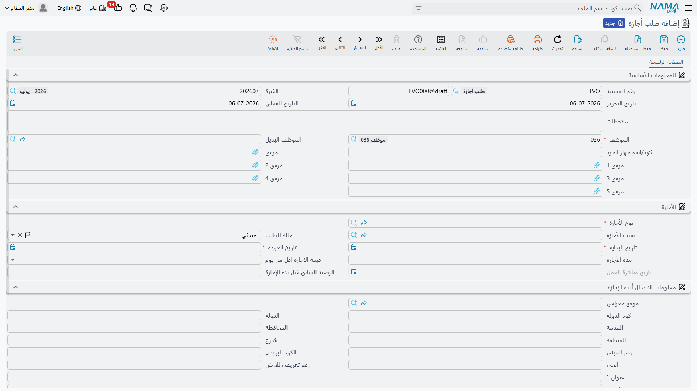
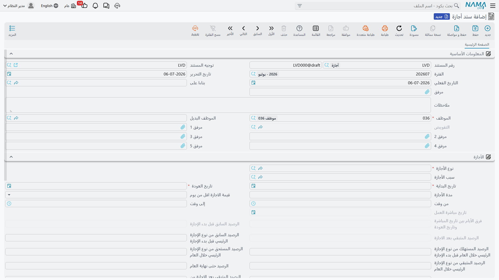

# طلبات ومستندات الموارد البشرية والمستندات المجمعة

كل ما يحدث للموظف في الموارد البشرية في نظام Nama — أجازة، سلفة، الالتحاق بالعمل، أو ترك الخدمة — يُسجَّل من خلال **نفس النمط ذي الطبقات الثلاث**. وبمجرد أن تفهم هذا النمط تستطيع قراءة أي شاشة في الموارد البشرية، لأنها جميعاً تتصرف بالطريقة نفسها. تشرح هذه الصفحة النمط مرة واحدة حتى تكتفي بقية صفحات الموارد البشرية بالإشارة إليها.

الطبقات الثلاث هي:

1. **الطلب** (Request) — نموذج تقديم قد يحتاج إلى موافقة قبل أن يحدث أي أثر فعلي.
2. **السند** (Document) — المستند المُنفَّذ الذي يُحدث الأثر الحقيقي على الأرصدة أو الراتب أو حالة الموظف.
3. **المستند المجمع** (Aggregated) — شاشة واحدة تُنتج عدداً من السندات العادية (أو الطلبات) دفعة واحدة.

وهي ليست ثلاث شاشات منفصلة، بل ثلاث مراحل مقصودة لنفس الحدث. ومعظم مجالات الموارد البشرية توفّر الطبقات الثلاث كلها حتى تختار المنشأة قدر الموافقة وقدر المعالجة المجمعة الذي تحتاجه.

## الطلبات: نموذج طلب الموافقة

يُسجّل **الطلب** رغبةً ما ويوجّهها لاتخاذ قرار قبل أن تصبح نافذة. فطلب الأجازة، وطلب السلفة، وطلب مباشرة العمل، وطلب إنهاء الخدمة، كلها تحمل الحقول الفعلية (الموظف، التواريخ، المبالغ) **بالإضافة** إلى حالة موافقة لا يحملها السند العادي.

وتتنقّل هذه الحالة بين أربع قيم:

| الحالة (Status) | English | المعنى |
|---|---|---|
| مبدئي (Initial) | Initial | أُدخل للتو؛ في انتظار القرار. |
| مقبول (Accepted) | Accepted | تمت الموافقة — ويمكن الآن تحويله إلى سند. |
| مرفوض (Rejected) | Rejected | تم رفضه؛ ولا يمضي أبعد من ذلك. |
| تمت معالجته (Processed) | Processed | تم إنشاء سند منه بالفعل — فأصبح مُغلقاً ولم يعد يقبل القبول أو الرفض. |

يقود القرارَ زرّان. ففي طلب السلفة مثلاً يضغط المراجع **قبول** (Accept) أو **رفض** (Reject)، فتتغيّر الحالة تبعاً لذلك.

::: info الطلب لا يُحدث أثراً مالياً
الطلب لا يمسّ الراتب أو الأرصدة أو دفتر الأستاذ بذاته — فهو مجرد ورقة القرار. ولا يحدث الأثر الحقيقي إلا بعد أن يصبح **سنداً**. ولهذا تحديداً تكون طبقة الطلب اختيارية: فإن لم تكن منشأتك بحاجة إلى خطوة موافقة منفصلة — للأجازات القصيرة مثلاً — يمكنك إدخال السند مباشرة وتجاوز الطلب كلياً.
:::

## السندات: الإجراء المُنفَّذ

يقع الأثر الفعلي في **السند**. فحفظ سند الأجازة يستهلك رصيد الموظف فعلياً ويحتسب الأيام أجازة؛ وحفظ سند السلفة يصرف السلفة فعلياً ويجدول أقساطها؛ وحفظ سند مباشرة العمل يضع الموظف على كشف الرواتب فعلياً. والسندات التي تمسّ المال تُعالَج في الخلفية لإنتاج آثارها المحاسبية والمخزنية، تماماً كبقية سندات النظام (راجع كيفية معالجة الآثار في صفحة كل مجال).

وهناك طريقتان يُنشأ بهما السند من طلب مقبول:

1. **من الطلب** — يفتح المراجع الطلب المقبول ويضغط زر الإنشاء الخاص به (في طلب الأجازة هو **إنشاء سند أجازة** / Generate Vacation Doc)، فيبني النظام سنداً مطابقاً مملوءاً مسبقاً من الطلب.
2. **من السند** — يفتح المستخدم سنداً جديداً ويختار الطلب المصدر في حقل «المستند المصدر». وتعرض هذه القائمة عمداً **الطلبات المقبولة فقط** — فلا يمكنك بناء سند فعلي من طلب ما زال في انتظار الموافقة أو من طلب مرفوض.

وفي كلتا الحالتين، لحظة إنشاء السند ينتقل الطلب المصدر إلى **تمت معالجته**، حتى لا يُنشأ من الطلب نفسه سندان.

::: tip مثال مرقَّم
لنفترض أن الموظف أحمد يطلب أجازة سنوية 10 أيام:

1. تُدخل الموارد البشرية (أو أحمد عبر الخدمة الذاتية) **طلب أجازة** — الحالة **مبدئي**.
2. يفتحه مديره ويضغط **قبول** — الحالة **مقبول**.
3. تضغط الموارد البشرية **إنشاء سند أجازة**؛ فيُنشأ **سند أجازة** ويُحفظ مستهلكاً 10 أيام من رصيد أحمد. ويصبح الطلب الآن **تمت معالجته**.

ولو ضغط المدير **رفض** في الخطوة الثانية، لبقي الطلب عند **مرفوض** ولما حدث أي سند — ولا أي تغيير في الرصيد — إطلاقاً.
:::

## المستندات المجمعة: مصنع الدفعات

حين ينطبق الإجراء نفسه على مجموعة كاملة، يصبح إدخال سند لكل موظف مرهقاً. **المستند المجمع** هو رأس واحد مع جدول، حيث **يُنتج كل سطر سنداً عادياً لموظف واحد عند حفظ الدفعة**. فتعمل في مكان واحد، ويصنع النظام السندات الفردية خلفه بهدوء.

وتُدار العلاقة نيابةً عنك:

- يحتفظ كل سطر في الجدول بمؤشر عودة إلى السند المفرد الذي أنشأه.
- إضافة سطر تُنشئ سنداً مفرداً جديداً؛ وحذف سطر يحذف سنده المفرد.
- ولأن السندات المفردة **مُدارة من النظام**، عليك أن **تعدّل الدفعة لا السندات المُنشأة** — فتعديل سند مفرد مباشرةً يجعله غير متوافق مع أصله.

::: warning يجب أن يحدد توجيه المستند المجمع دفتراً/توجيهاً للمُنشأ
لا يعرف المستند المجمع كيف يُنشئ أبناءه إلا إذا حدَّد **توجيه المستند** (Document Term) الخاص به **الدفتر/التوجيه المستخدم للسندات المفردة المُنشأة**. فإن تُرك هذا الإعداد فارغاً، عجزت الدفعة عن إنتاج سنداتها وفشل الحفظ. وهذا أشهر خطأ إعداد في الشاشات المجمعة — فاضبط الدفتر المُنشأ على التوجيه قبل استخدام الدفعة.
:::

كما يوجد التجميع على مستوى الطلب أيضاً: فـ **الطلب المجمع** يُنتج عدة **طلبات** مفردة (يحتاج كل منها إلى قبوله أو رفضه)، بينما **المستند المجمع** يُنتج عدة **سندات** مفردة مباشرة.

### محورا التجميع — لا تخلط بينهما

هناك **سببان مختلفان تماماً** للتجميع، ويعطي النظام لكل منهما شاشته الخاصة. وهذه نقطة تستحق التوقف عندها، لأن الشاشات متشابهة الأسماء لكنها متعاكسة المعنى.

| المحور | معنى سطر الجدول الواحد | الشاشة (Screen) | ملاحظة |
|---|---|---|---|
| **عدة موظفين** | سطر لكل موظف — الإجراء نفسه لمجموعة كاملة | سند أجازة مجمع لأكثر من موظف (Multi Employee Vacation) | سند مستقل لكل موظف |
| **موظف واحد بعدة فترات** | سطر لكل جزء من حدث واحد طويل، مقسَّم بين الأرصدة/الأنواع | سند أجازه مجمع (Aggregated Vacation Document) | يقسّم أجازة موظف واحد |

فـ **سند أجازة مجمع لأكثر من موظف** يُرسل *عدة أشخاص* في أجازة دفعة واحدة (سند لكل منهم)، بينما **سند أجازه مجمع** يقسّم أجازة *شخص واحد* الطويلة إلى عدة فترات (كأن يُسحب جزء من الرصيد السنوي وجزء من رصيد بدون أجر) — ويُنتج تحته السندات الفردية. وتتكرر فكرة «عدة موظفين» في مواضع أخرى (إنهاء الخدمة المجمع، السلف المجمعة، المأموريات المجمعة)؛ أما فكرة «موظف واحد بعدة فترات» فخاصة بالأجازات.

## السند الواحد وأصوله المتعددة

النمط ذو الطبقات مرن بشأن نقطة انطلاق السند. فـ **سند مباشرة العمل** مثلاً لا يلزم أن يأتي من طلب مباشرة عمل أصلاً، بل قد ينشأ من:

- **عرض وظيفي** قبله المرشح (تعيين موظف جديد)،
- أو **العودة من أجازة سابقة** (موظف يستأنف عمله)،
- أو **طلب مباشرة عمل** عادي.

وأياً كان الأصل، يبقى السند الناتج هو المستند المُنفَّذ نفسه الذي يضع الموظف على كشف الرواتب. ضع ذلك في اعتبارك عند تتبّع «مصدر» السند — فحقل المصدر يروي القصة.

## أين تجد هذه الشاشات

تقع شاشات الطلب والسند متجاورة في القائمة، مجمّعة حسب الموضوع:

| الشاشة | مسار القائمة (Menu Path) |
|---|---|
| طلب / سند أجازة | الرواتب > الأجازات > طلب أجازة / سند أجازة |
| سند أجازه مجمع | الرواتب > الأجازات > سند أجازه مجمع |
| سند أجازة مجمع لأكثر من موظف | الرواتب > الأجازات > سند أجازة مجمع لأكثر من موظف |
| طلب / سند سلفة | الرواتب > السلف / الأقساط > طلب سلفة / سند سلفة |
| طلب مباشرة عمل | الموارد البشرية > سندات التوظيف > طلب مباشرة عمل |
| سند مباشرة عمل | الرواتب > سندات التوظيف > سند مباشرة عمل |
| طلب / سند إنهاء الخدمة | الرواتب > التصفية وانهاء الخدمات > طلب إنهاء الخدمة / سند إنهاء الخدمة |

## أين يظهر هذا النمط

بعد أن اتضح النمط، تكتفي كل هذه المجالات بتطبيقه:

- **[سندات الأجازات](../vacations/vacation-documents.md)** — مسار الطلب ← السند ومحورا التجميع.
- **[السلف والأقساط](../loans/hr-loan-documents.md)** — طلب سلفة ← سند سلفة ← استرداد الأقساط.
- **[مباشرة العمل](../recruitment/work-starting.md)** — الالتحاق بالعمل وأصوله الثلاثة الممكنة.
- **[إنهاء الخدمة](../end-of-service/firing-and-termination.md)** — طلب إنهاء الخدمة ← سند إنهاء الخدمة ← تصفية المستحقات.
