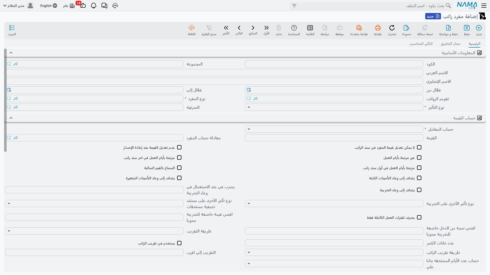
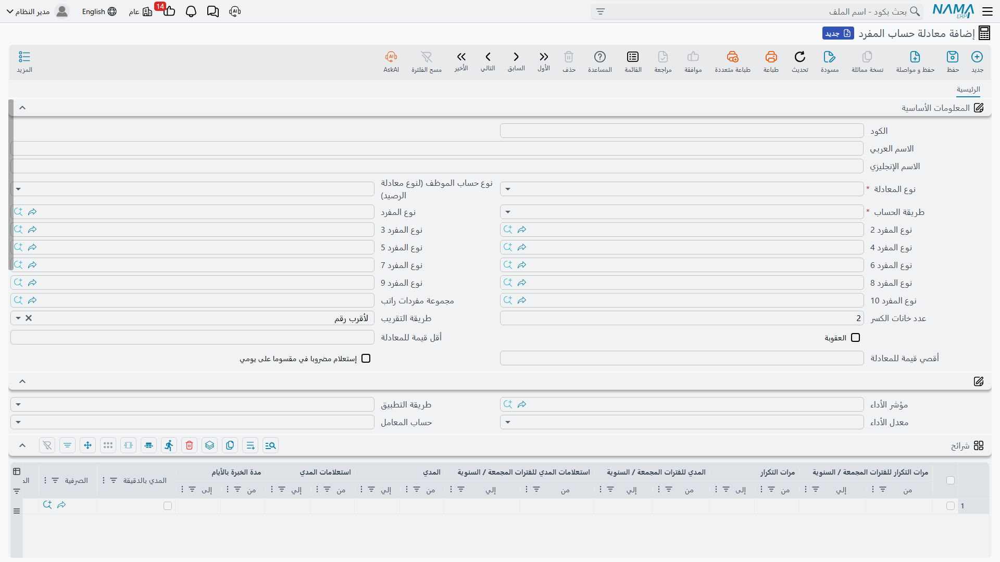
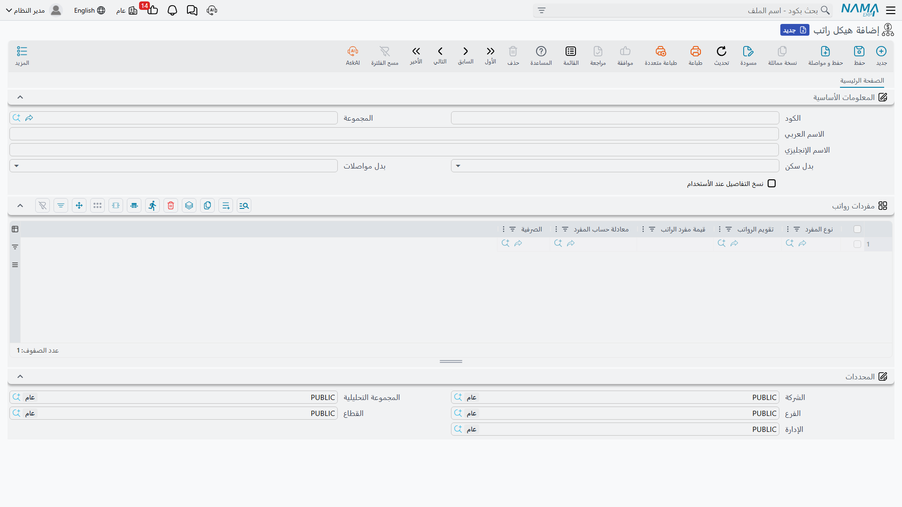

# كيفية حساب الراتب

لا يُكتب سند الراتب في نظام Nama يدوياً أبداً — بل يُحسب من لَبِنات تُعدّها مرة واحدة وتعيد استخدامها كل شهر. وفهم كيفية تركيب هذه اللَبِنات معاً هو مفتاح الثقة في الأرقام، ومفتاح تصحيحها حين يخرج رقم على خطأ. تمشي هذه الصفحة على خط الحساب كاملاً من أوله لآخره؛ ولكل شاشة تفصيلية صفحتها الخاصة المرتبطة في موضعها.

على أعلى مستوى، يتدفق الراتب عبر **خمس مراحل**:

1. **تعريف** أنواع الاستحقاق والاستقطاع (أنواع المفردات).
2. **تسعير** كل مفرد — قيمة ثابتة أو معادلة.
3. **إسناد** المفردات إلى الموظفين (مباشرةً أو عبر هيكل قابل لإعادة الاستخدام).
4. **تغذية** الشهر ببيانات الحضور والأداء.
5. **إنشاء** سجل الرواتب، الذي يُنتج سند راتب لكل موظف.

فلنتابع مفرداً واحداً من تعريفه حتى ظهوره في سند الراتب.

## الخطوة 1 — تعريف أنواع الاستحقاق والاستقطاع

يبدأ كل شيء بـ **نوع المفرد** (Salary Component Type): وهو *فئة* عنصر الراتب — أساسي، سكن، انتقالات، ضريبة، عمل إضافي، حصة تأمين، وهكذا. ويحمل النوع العلاماتِ التي يرثها كل مفرد من نوعه، واثنتان منها حاسمتان:

- **نوع التأثير** — هل يُضاف هذا المبلغ أم يُستقطع أم لا هذا ولا ذاك؟

| نوع التأثير (Effect Type) | English | دوره في سند الراتب |
|---|---|---|
| إضافة | Addition | يزيد الراتب (الأساسي، البدلات، العمل الإضافي). |
| إستقطاع | Deduction | يخفض الراتب (الضريبة، التأمين، الجزاءات، الأقساط). |
| أخري | Other | للعلم فقط — يُسجَّل لكنه **لا** يُضاف إلى صافي الراتب ولا يُطرح منه. |

- **ترتيب المفرد** — تسلسل حساب المفردات. وهذا بالغ الأهمية: فالمفرد الذي هو *نسبة من مفرد آخر* يجب أن يُحسب **بعد** ما يعتمد عليه. فالضريبة المحسوبة قبل البدلات التي يُفترض أن تُخضعها ستخرج صفراً بصمت.

كما يحدد النوع هل يدخل المبلغ في وعاء الضريبة ووعاء التأمينات، ويمكن لـ **مجموعة المفردات** أن تجمع المفردات المرتبطة لأغراض التنظيم فقط — دون أي أثر على الحساب.

## الخطوة 2 — تسعير كل مفرد

**مفرد الراتب** (Salary Component) هو العنصر المُسعَّر ذاته. والاختيار الجوهري هنا هو **طريقة القيمة**:

| طريقة القيمة (Value Method) | English | المعنى |
|---|---|---|
| قيمة ثابتة | Constant Value | رقم ثابت صريح (مثلاً بدل سكن 1000). |
| متغير | Variable Value | مدفوع بـ **معادلة حساب**، فيتغير المبلغ بتغير المدخلات كل شهر. |

يحمل المفرد أيضاً **فلاتر الانطباق** (أي الموظفين أو الفروع أو الوظائف ينطبق عليهم) و**سطور حساباته المدينة/الدائنة** — وهذا ما يتيح لسند الراتب الترحيل إلى دفتر الأستاذ لاحقاً.

### المعادلات: من أين تأتي القيم المتغيرة

تحوّل **معادلة حساب المفرد** (Component Calculation Formula) المدخلاتِ إلى رقم. ويحدد **نوع المعادلة** مصدر الحساب — وفيما يلي بعض من خياراته الكثيرة:

- **نسبة من الإجمالي / الإضافات / الاستقطاعات** — شريحة من مفردات أخرى.
- **مرتبط بمؤشر أداء** — يتتبّع المبلغ رقماً مقاساً (ساعات إضافية، مبيعات، حضور).
- **الضرائب** — ضريبة تصاعدية محسوبة على شرائح.
- **نِسب التأمينات** — حصة العامل أو الشركة من وعاء التأمينات.
- **معادلة مركبة** — معادلة مبنية من معادلات أخرى.

ثم تحدد **طريقة الحساب** كيفية تطبيق الشرائح:

| طريقة الحساب (Calc Method) | English | السلوك |
|---|---|---|
| نسبة واحدة | One Percentage | معدل واحد على الوعاء كله. |
| شرائح | Sections | شرائح تصاعدية — تُحسب كل شريحة من الوعاء بمعدلها الخاص. |

لكل **سطر حساب** (شريحة) مدى، ومعامل/معدل، ومعايير اختيارية تحكم انطباقه، وحدّا أدنى/أقصى اختياريان. وحين يُفعّل التسجيل التفصيلي، يترك كل شريحة تُطبَّق قيداً تدقيقياً على سند الراتب — وهو أثر «لماذا صار هذا الرقم كذلك» الذي يعتمد عليه فريق الدعم.

::: tip مثال محلول على الشرائح التصاعدية
لنفترض أن ضريبة الدخل معرَّفة بـ **شرائح** كالآتي:

- 0 – 2000 ← 0٪
- 2001 – 5000 ← 10٪
- 5001 فأكثر ← 15٪

لوعاء خاضع مقداره **6000**، تُحسب الضريبة شريحةً شريحةً لا بمعدل واحد:

- أول 2000 ← 0
- التالي 3000 (2001–5000) ← 300
- المتبقي 1000 (5001–6000) ← 150

**إجمالي الضريبة = 450.** أما بـ **نسبة واحدة** 15٪ فيُخضع الـ 6000 كله ← 900. فاختيار الشرائح مقابل النسبة الواحدة قرار عمل حقيقي لا مجرد شكل.
:::

## الخطوة 3 — إسناد المفردات إلى الموظفين

تصل المفردات إلى الموظف بإحدى طريقتين، وترتيب الأولوية بينهما مهم.

يمكن لسجل الموظف نفسه ([بيانات الموظف بالموارد البشرية](../setup/employee-hr-information.md)، أو العرض الوظيفي الذي عُيّن عليه) أن يعدّد سطور مفرداته الشخصية بقيمها الخاصة. أما **هيكل الراتب** (Salary Structure) فهو **قالب قابل لإعادة الاستخدام** من سطور المفردات — «الباقة القياسية لمندوب المبيعات» مثلاً.

والقاعدة الأساسية: **الهيكل بديل احتياطي لا بديل قسري.** فعند إنشاء الراتب، يقرأ النظام سطور مفردات الموظف الخاصة أولاً؛ ولا يُستشار الهيكل **إلا** حين لا يملك الموظف أياً منها. فملء الهيكل لا يطمس أبداً ما ضبطته على الفرد بصمت، بل يملأ الفراغات.

وداخل الهيكل، يستطيع كل سطر أن يتجاوز قيمة المفرد الأصلي أو معادلته، فيستوعب القالب الواحد اختلافات صغيرة دون الحاجة إلى مفرد جديد لكل حالة.

## الخطوة 4 — تغذية الشهر بالحضور والأداء

تحتاج القيم المتغيرة إلى مدخلات شهرية حيّة، وتأتي غالبيتها من **[الحضور والإنصراف](../attendance/time-attendance.md)** ومن **[مؤشرات الأداء](../performance/performance-indicators.md)**.

تُجمَّع بصمات الحضور يومياً إلى وقت عمل وعمل إضافي وتأخير وغياب. وتصل هذه الأرقام إلى الراتب عبر **مؤشرات الأداء**: فمعادلة من نوع «مرتبط بمؤشر أداء» تقرأ المؤشر وتحوّله إلى مال. والمؤشر *اليومي* يُعامَل لكل يوم عمل، والمؤشر *الدوري* يستخدم إجمالي الشهر. كما يقود الحضورُ تناسبَ الراتب مع الأشهر الجزئية واستقطاعَ أيام عدم العمل.

أما الموظفون بأجر يومي بدلاً من راتب شهري فيُعالَجون عبر مستند **الأجر اليومي** (Daily Salary) بدلاً من آلية المفردات الشهرية هذه.

## الخطوة 5 — إنشاء سجل الرواتب والسندات

أخيراً، **سجل الرواتب** (Salary Sheet) هو تشغيلة الدفعة لفترة موارد بشرية واحدة: يجمع الموظفين المستحقين (متجاوزاً من صُرف له عن تلك الفترة) ويحسب كلاً منهم. ويخرج من السجل **سند راتب** (Salary Document) لكل موظف — وهو قسيمة الراتب الفردية، و**مصدر الأثر المحاسبي**. ويُحمَل قيد دفتر الأستاذ على سند الراتب نفسه، عبر سطور الحسابات المدينة/الدائنة للمفردات المكوِّنة له.

أما التفصيل الكامل للسجلات والسندات — بما في ذلك ما يُرحَّل بالضبط إلى دفتر الأستاذ — فتجده في صفحة **[سندات الرواتب](../payroll/salary-documents.md)**.

::: warning «صرفية الراتب» مصنِّف لا عملية دفع
**صرفية الراتب** (Salary Issuance) **لا** تصرف لأحد و**لا** تُرحّل محاسبياً. إنها **مجرى/وسم** يتيح لك تشغيل رواتب متوازية لنفس الفترة (كأن يكون راتب شهري رئيسي إلى جانب تشغيلة عمولات منفصلة). فاعتبرها لصيقةً على مجرى الرواتب لا خطوة الدفع — فالمال يظل يتدفق عبر سند الراتب.
:::

## حين يخرج المفرد صفراً

لأن الخط مرتَّب ومحكوم بالقواعد، يظهر أثر العلامة الخاطئة عادةً كمفرد **يُحسب صفراً بصمت** لا كخطأ ظاهر. والأسباب المتكررة:

::: warning أسباب شائعة لخروج القيمة صفراً
- **ترتيب مفرد خاطئ** — النسبة أو الضريبة المحسوبة *قبل* المفردات التي تعتمد عليها لا تجد ما تعمل عليه فتخرج صفراً. صحِّح الترتيب.
- مفردات **«أخري»** للعلم بطبيعتها — فهي لا تُضاف إلى صافي الراتب ولا تُطرح منه.
- المفردات المصنَّفة **قسط** أو بنود **نهاية الخدمة** تكون صفراً عمداً في الراتب الشهري العادي؛ ولا تحمل قيمة إلا في سنداتها المخصصة.
- بدلا **السكن / الانتقالات** يخرجان صفراً ما لم يُفعَّلا فعلاً على سجل الموظف نفسه — فالهيكل وحده لا يكفي.
- **تغيير بيانات في منتصف الفترة** (زيادة أو نقل أثناء الشهر) يقسّم الحساب إلى فترات؛ فراجع حدود الفترات إن بدا الإجمالي غير سليم.
:::

## صفحات ذات صلة

- **[مفردات الراتب](../payroll/salary-components.md)** و**[معادلات الحساب](../payroll/salary-calculation-formulas.md)** — التفصيل الكامل للخطوتين 1 و2.
- **[هياكل الراتب](../payroll/salary-structures.md)** — القوالب القابلة لإعادة الاستخدام (الخطوة 3).
- **[سندات الرواتب](../payroll/salary-documents.md)** — السجلات والسندات والأثر المحاسبي (الخطوة 5).
- **[الزيادات السنوية](../payroll/hr-annual-increases.md)** و**[حجز الراتب](../payroll/salary-blocking.md)** — الزيادات الدورية وحجز الصرف.
- **[الحضور والإنصراف](../attendance/time-attendance.md)** و**[مؤشرات الأداء](../performance/performance-indicators.md)** — المدخلات الشهرية (الخطوة 4).
- **[سنوات وفترات الموارد البشرية](../setup/hr-years-and-periods.md)** — الإطار الزمني الذي تُشغَّل ضمنه كل سجلات الرواتب.
