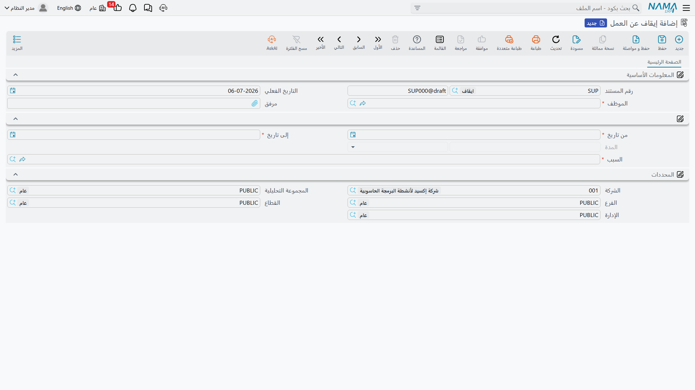

# إيقاف الموظف عن العمل

**سند إيقاف عن العمل** (Suspension Document) يسجّل أن موظفاً أُوقِف عن العمل لمدة أيام محددة — وحسب السبب، هل هذه المدة مدفوعة الأجر أم لا. يقع في نفس مجموعة [المكافآت والجزاءات](rewards-and-penalties.md) التأديبية، لكنه لا يتعلق برقم راتب واحد؛ بل بفترة زمنية لم يعمل خلالها الموظف.

**مكان الشاشة:** الرواتب > نوع مكافأة / جزاء > إيقاف عن العمل (Payroll > Reward / Penalty > Suspension Document).

| الحقل (بالعربية) | English | ملاحظات |
|---|---|---|
| الموظف | Employee | الموظف الذي يُوقَف عن العمل. |
| التاريخ الفعلي | Value Date | التاريخ الذي يسري منه هذا السند نفسه. |
| من تاريخ / إلى تاريخ | From Date / To Date | المدة الزمنية للإيقاف. |
| المدة | Duration | تُحسب تلقائياً بمجرد ضبط من تاريخ وإلى تاريخ — عدد الأيام بينهما، شاملاً طرفي المدة. |
| السبب | Reason | يُختار من نفس كتالوج **نوع سبب** (Leave Reason) المستخدم في مواضع أخرى بالموارد البشرية، مُفلتراً على الأسباب التي خصصتها الشركة لاستخدام الإيقاف. |
| مرفق | Attachment | مستند داعم للإيقاف. |

**السبب** هو ما يحدد الأثر على الراتب: كل نوع سبب يحمل علامة **بدون مرتب و يخصم من نهاية الخدمة** (Without Salary Deducted From Termination). اختر سبباً بهذه العلامة مفعّلة لإيقاف تأديبي غير مدفوع الأجر؛ واختر سبباً بدونها لإيقاف لا يمس الراتب إطلاقاً.

::: info لا تأثير محاسبي
مثل [تغيير حالة الموظف](../vacations/change-employee-state.md)، لا يمس سند الإيقاف دفتر الأستاذ إطلاقاً بنفسه. وجوده الوحيد هو تسجيل مدة زمنية، وعبر سببه، هل هذه المدة مدفوعة الأجر أم لا.
:::

## أثره على الراتب

سند الإيقاف عن العمل ليس مجرد سجل — فمحرك الرواتب يقرأه مباشرة: أي إيقاف تتقاطع مدته مع فترة رواتب يُلتَقط تلقائياً عند إصدار [سند الراتب](../payroll/salary-documents.md) لتلك الفترة. فإن كان السبب المختار معلَّماً بـ**بدون مرتب**، تظهر تلك الأيام على سند الراتب كـ**أيام إيقاف عن العمل بدون مرتب** (Suspension Days Without Salary) وتخفض راتب الفترة تبعاً لذلك؛ وإن لم يكن السبب معلَّماً كذلك، يُسجَّل الإيقاف لكن الراتب لا يتأثر.

::: tip هذا منفصل عن حالة عمل الموظف الرسمية
تسجيل سند إيقاف عن العمل لا يُحوِّل حالة عمل الموظف إلى `موقوف` تلقائياً. فإن أرادت الشركة أيضاً أن تُظهر حالة الموظف الرسمية `موقوف` — لأغراض التقارير، أو لإبعاده عن مسارات عمل أخرى — فهذا تسجيل منفصل ومتعمَّد على [تغيير حالة الموظف](../vacations/change-employee-state.md).
:::

## صفحات ذات صلة

- **[المكافآت والجزاءات](rewards-and-penalties.md)** — المستند التأديبي الآخر، لتعديل رقم راتب واحد بدلاً من مدة زمنية.
- **[تغيير حالة الموظف](../vacations/change-employee-state.md)** — حيث تُسجَّل حالة عمل الموظف الرسمية (بما فيها `موقوف`).
- **[سندات الرواتب](../payroll/salary-documents.md)** — حيث تخفض أيام الإيقاف غير المدفوعة راتب الفترة فعلياً.
