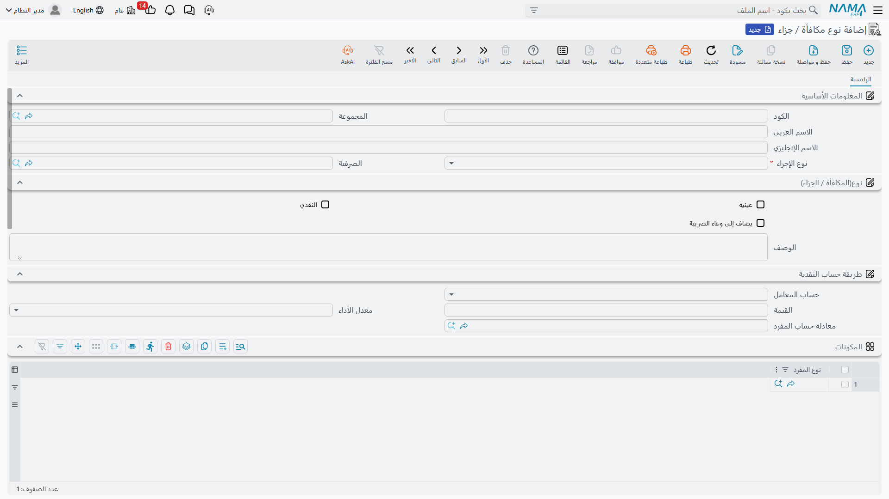
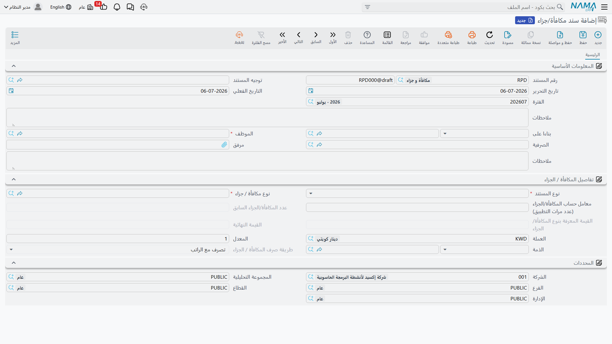

# المكافآت والجزاءات

ليست كل التعديلات على راتب الموظف تأتي من [هيكل الراتب](../payroll/salary-structures.md) أو [الحضور والانصراف](../attendance/time-attendance.md) — بعضها مناسباتي: مكافأة لمرة واحدة على أداء جيد، أو استقطاع مقابل واقعة محددة. لهذا وُجد **نوع مكافأة / جزاء** (Reward / Penalty) و**سند مكافأة/جزاء** (Reward / Penalty) Document: كتالوج صغير وقابل لإعادة الاستخدام لمكافآت واستقطاعات مسمّاة، وسند يطبّق واحداً منها على موظف محدد في يوم محدد.

::: tip ليست نفس الجزاء الحكومي
هذه الصفحة تتناول المكافآت والجزاءات على **مستوى الرواتب** — مكافآت واستقطاعات تأديبية داخلية تحدّدها الشركة لنفسها. أما **مخالفات الجهات الحكومية (الموارد البشرية)** في السعودية/الخليج فهي كتالوج مختلف تماماً له قواعد تصعيد خاصة به ويرحّل إلى دفتر الأستاذ بطريقته الخاصة — انظر [جزاءات الجهات الحكومية](../government-relations/government-penalties.md). لا يشترك الاثنان أبداً في نوع أو سند.
:::

## أين تجدها

- **نوع مكافأة / جزاء** (الكتالوج) — **الرواتب > نوع مكافأة / جزاء > نوع مكافأة / جزاء** (Payroll > Reward / Penalty > Reward / Penalty).
- **سند مكافأة/جزاء** — **الرواتب > نوع مكافأة / جزاء > سند مكافأة/جزاء** (Payroll > Reward / Penalty > (Reward / Penalty) Document).

## كتالوج نوع مكافأة / جزاء

كل عنصر في الكتالوج سجل رئيسي صغير يحدد نوع المكافأة أو الاستقطاع، وإن كان يرحّل إلى دفتر الأستاذ بنفسه — إلى أين يرحّل.

| الحقل (بالعربية) | English | ملاحظات |
|---|---|---|
| المجموعة | Group | مجموعة رئيسية اختيارية، لتنظيم كتالوج طويل. |
| نوع الإجراء | Operation Type | `مكافأة` (Reward) أو `جزاء` (Penalty) — الأمران اللذان يمكن لهذا الكتالوج تعريفهما. |
| الصرفية | Issuance | تربط النوع بـ[صرفية راتب](../setup/hr-years-and-periods.md) واحدة، عندما تشغّل الشركة أكثر من مسار رواتب. |
| عينية | Power | تُعلّم النوع كمكافأة/جزاء **عيني** (منفعة أو استقطاع في صورة سلع أو خدمات) لا كرقم نقدي. |
| النقدي | Cash | تُعلّم النوع كمبلغ **نقدي**. |
| يضاف إلى وعاء الضريبة | Included In Tax | هل تُضاف القيمة إلى وعاء ضريبة الموظف أم لا. |
| حساب المعامل | Factor Value | **طريقة القيمة**: `قيمة ثابتة` (Constant Value) — رقم ثابت — أو `متغير` (Variable Value) — تُحسب وقت السند، بنفس الفكرة المستخدمة في [مفردات الراتب](../payroll/salary-components.md). |
| القيمة | Value | المبلغ الثابت، عندما تكون طريقة القيمة ثابتة. |
| معدل الأداء / معادلة حساب المفرد | Performance Factor / Component Calculation Formula | مدخلات تُستخدم لحساب المبلغ عندما تكون طريقة القيمة متغيرة — نفس آلية [معادلة الحساب](../payroll/salary-calculation-formulas.md) التي تستخدمها مفردات الراتب. |
| المكونات (جدول) | Components | نوع مفرد راتب أو أكثر تستمد منه الحسابة المتغيرة رقمها الأساسي (مثلاً، "يوم واحد من الراتب الأساسي"). |

أسفل ذلك، يحمل نوع المكافأة/الجزاء كتلتي **الحسابات المدينة** و**الحسابات الدائنة** الخاصتين به — نفس نمط سطور الحسابات المستخدم في [مفردات الراتب](../payroll/salary-components.md): طريقة توزيع (`ثابت` أو `نسبة` أو `ثابت بمعايير`) بالإضافة إلى سطر حساب واحد أو أكثر. هذه الحسابات هي ما يرحّل عبرها السند، إما مباشرة أو عبر تشغيلة الرواتب التالية — انظر "كيف يُعالَج" أدناه.

## سند مكافأة/جزاء

هنا تُسجَّل واقعة محددة لموظف واحد.

| الحقل (بالعربية) | English | ملاحظات |
|---|---|---|
| توجيه المستند | Term | التوجيه — يحدد الترقيم، وهل يرحّل هذا السند بنفسه، ومن أين تأتي حساباته المدينة/الدائنة. |
| الموظف | Employee | مَن يتلقى المكافأة أو الجزاء. |
| الصرفية | Issuance | تُملأ تلقائياً من النوع المختار إن كان يحملها. |
| نوع المستند | Document Type | `مكافأة` أو `جزاء`، منعكسة من النوع المختار. |
| نوع مكافأة / جزاء | Reward / Penalty | عنصر الكتالوج الذي يطبّقه هذا السند. |
| معامل حساب المكافأة/الجزاء (عدد مرات التطبيق) | Reward/Penalty Calculation Factor | كم مرة تُطبَّق قيمة النوع — مطلوب كلما كان النوع مكافأة/جزاء نقدياً. |
| عدد المكافأة/الجزاء السابق | Previous Reward/Penalty No | عدّاد تلقائي لعدد مرات اعتماد هذا النوع نفسه سابقاً لهذا الموظف — مفيد لتصعيد الجزاءات. |
| القيمة المعرفة بنوع المكافأة/الجزاء | Reward/Penalty Value | القيمة لكل وحدة، مستمدة من النوع (ثابتة، أو محسوبة لنوع متغير). |
| القيمة النهائية | Final Value | معامل الحساب × قيمة المكافأة/الجزاء — الرقم النهائي. |
| الذمة | Subsidiary | جهة/حساب التسوية الذي يُقيَّد عليه هذا السند. |
| طريقة صرف المكافأة / الجزاء | Reward And Penalty Issue Method | `تصرف الآن` (Issued Immediately) أو `تصرف مع الراتب` (Issued With Salary) — انظر أدناه. |

على سبيل المثال، نوع جزاء "تأخر عن الحضور" بقيمة 50 (يوم واحد من الراتب الأساسي) يُطبَّق ثلاث مرات خلال الشهر ينتج معامل حساب قدره 3، وقيمة مكافأة/جزاء قدرها 50، وقيمة نهائية قدرها 150.

::: warning الترحيل الفوري يتطلب قيمة ثابتة
إذا كان توجيه السند مضبوطاً على `تصرف الآن`، تشترط Nama أن يستخدم نوع المكافأة/الجزاء المختار طريقة قيمة **ثابتة** وتوزيعاً **ثابتاً** في كل من حساباته المدينة والدائنة — فالقيمة المبنية على معايير أو المحسوبة من الراتب لا يمكن أن ترحّل إلا عبر تشغيلة رواتب، لا أن ترحّل بنفسها لحظة اعتماد السند.
:::

::: info مرة واحدة لكل موظف في اليوم (اختياري)
يمكن لإعداد في تهيئة الموارد البشرية منع تسجيل نفس نوع المكافأة/الجزاء لنفس الموظف مرتين في نفس اليوم، تجنباً لتكرار غير مقصود.
:::

## كيف يُعالَج / وماذا يرحّل

هل يُنشئ سند مكافأة/جزاء أثراً محاسبياً أصلاً هو خيار يُحدَّد على **توجيهه** — يمكن لتوجيه المستند أن يعطّل الأثر المحاسبي تماماً، وعندئذٍ يكون السند مجرد سجل بلا ترحيل.

عندما يكون الأثر المحاسبي مُفعَّلاً في التوجيه، فإن اعتماد السند (أو تعديله/إلغاءه لاحقاً) يُنشئ **طلب أعمال** في الخلفية بـ**حالة معالجة**، قابل لإعادة المحاولة من شاشة **طلبات الأعمال** إن فشل — يبني سطر مدين وسطر دائن للقيمة النهائية. تأتي حسابات هذين السطرين من أحد مصدرين حسب إعداد التوجيه: إما **سطور الحسابات المدينة/الدائنة الخاصة بنوع المكافأة/الجزاء** نفسه (نفس الحسابات الموضحة أعلاه)، أو، إن لم يوفرها النوع، حسابات مضبوطة مباشرة على التوجيه نفسه.

عملياً، **طريقة الصرف** هي ما يحدد أي النمطين يُستخدَم:

- **تصرف الآن** — يُضبَط السند عادة ليرحّل بنفسه فوراً، بشكل مستقل عن أي تشغيلة رواتب.
- **تصرف مع الراتب** — الحالة الأكثر شيوعاً بكثير — لا يرحّل السند عادة بنفسه؛ بل تُرحَّل قيمته النهائية إلى الأمام لتُدمَج في [سند الراتب](../payroll/salary-documents.md) التالي للموظف، وهو ما يرحّل الفعل فعلياً، عبر نفس الحسابات المضبوطة على نوع المكافأة/الجزاء. جدول **المكافآت / الجزاءات** في سند الراتب نفسه، وأرقامه **جزاءات الشهر الحالي / الجزاءات المرحلة من الشهر السابق / المرحلة للشهر التالي**، هي بالضبط هذا: الحصيلة الجارية لسندات المكافآت/الجزاءات التي تغذي راتب تلك الفترة.

## صفحات ذات صلة

- **[سندات الرواتب](../payroll/salary-documents.md)** — حيث يرحّل فعلياً مكافأة/جزاء من نوع "تصرف مع الراتب"، إلى جانب كل عنصر آخر من عناصر تشغيلة الرواتب.
- **[مفردات الراتب](../payroll/salary-components.md)** و**[معادلات حساب الراتب](../payroll/salary-calculation-formulas.md)** — نفس أنماط طريقة القيمة وسطور الحسابات مُعاد استخدامها هنا.
- **[جزاءات الجهات الحكومية](../government-relations/government-penalties.md)** — الكتالوج التأديبي المنفصل ذو المنشأ القانوني لمخالفات الجهات الحكومية.
- **[إيقاف الموظف عن العمل](hr-suspension.md)** — سند تأديبي ذو صلة لكن مختلف: إيقاف الموظف عن العمل بدلاً من تعديل رقم راتب واحد.
