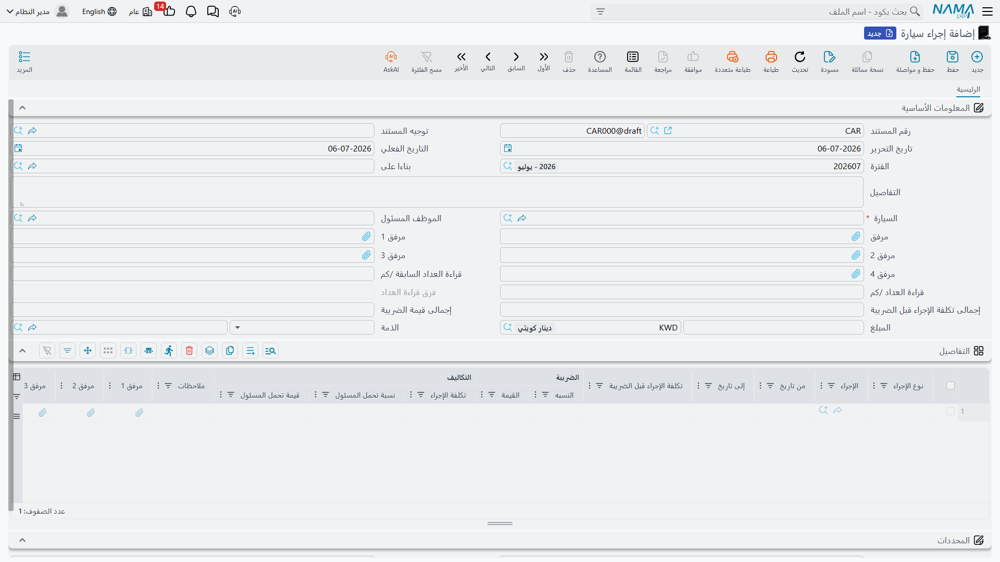
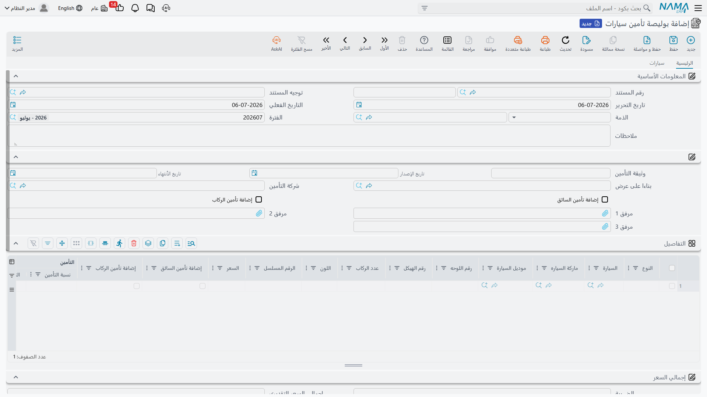
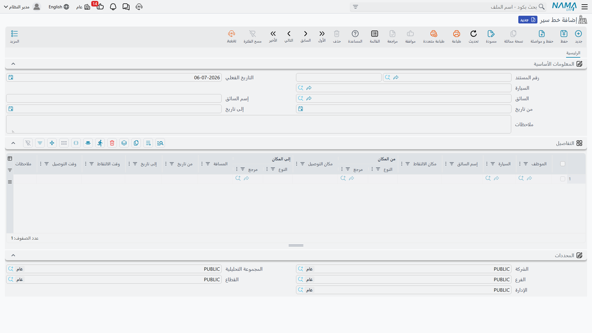
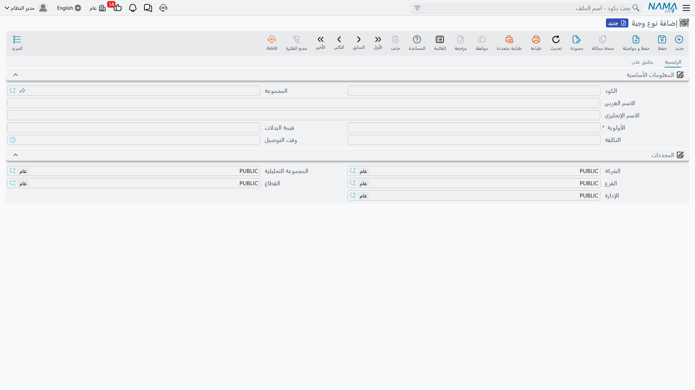

# خدمات الموظفين (السيارات والنقل والوجبات)

بجانب الراتب، تدير معظم الشركات مجموعة صغيرة من المزايا الجانبية لموظفيها — سيارة لأداء العمل، وباص
للوصول إلى الموقع، ووجبة ساخنة في المطعم. هذه المناطق الثلاث لا تشترك في شيء وظيفيًا، لكنها تجتمع في
نما لأنها جميعًا **مزايا موظفين تعتمد على كتالوج**: يحافظ شخص على قائمة رئيسية صغيرة مرّة واحدة (أكواد
أعطال السيارات، وأنواع الوجبات، وخطوط السير)، ثم تعتمد بقية الإدارة عليها بشكل متكرّر. تستعرض هذه
الصفحة المناطق الثلاث كلّها: **السيارات** (تخصيص السيارات وصيانتها وتأمينها)، **النقل** (خطوط السير
التي يسلكها سائق الشركة لإحضار الموظفين من وإلى العمل وإعادتهم)، و**الوجبات** (ما يُقدَّم، ولمن، ومتى
يُوصَّل).

::: tip ليست المخالفات المرورية الحكومية
**إجراء السيارة** أو **عطل السيارة** هنا يعني شيئًا حدث لـ*المركبة* نفسها — حادثة، أو إصلاح، أو صيانة
دورية. أما الغرامات والمخالفات المرورية الحكومية ضد *الشركة* فهي منطقة مختلفة تمامًا وخاصّة بدول
الخليج — راجع [مخالفات حكومية](./government-relations/government-penalties) بدلًا من ذلك.
:::

## السيارات

### تسجيل ما حدث لسيارة: إجراء سيارة (Car Action)

في كل مرّة تحتاج فيها سيارة الشركة إلى صيانة، أو تتعرّض لحادثة، أو يُجدَّد ترخيصها، أو تتكبّد أي تكلفة
أخرى، يُسجَّل هذا الحدث بوصفه **إجراء سيارة** (Car Action) — تجده ضمن **الموارد البشرية ← السيارات ←
إجراء سيارة** (`الموارد البشرية > السيارات > إجراء سيارة`). يمكن أن يحمل المستند الواحد عدّة أحداث من
هذا النوع لنفس السيارة في جدول **التفاصيل**، ويختار كل سطر **نوع إجراء** عام (تجديد رخصة، حادثة،
مخالفة، صيانة دورية، تصليح، أو واحدة من ثلاث فئات "أخرى" مفتوحة)، ثم **إجراءً** محدّدًا مسحوبًا من
كتالوج **عطل سيارة** (Car Problem) الموضّح أدناه — نوع الحادثة الفعلي، أو بند الصيانة، أو الإصلاح
الذي يُحاسَب عليه.

| الحقل (عربي) | التسمية الإنجليزية | الغرض |
|---|---|---|
| السيارة | Car | المركبة التي يخصّها المستند. |
| الموظف المسئول | Responsible Employee | الموظف (غالبًا السائق) المخصَّصة له السيارة. |
| قراءة العداد السابقة / قراءة العداد /كم | Previous Meter Reading / Meter Reading /KM | قراءة العدّاد قبل وبعد، فتُتابَع المسافة المقطوعة بين الإجراءات تلقائيًا. |
| نوع الإجراء | Action Type | الفئة العامة لما حدث (حادثة، صيانة، تصليح، تجديد رخصة…). |
| الإجراء | Action | المدخل المحدَّد من كتالوج عطل سيارة الذي يُحاسَب عليه هذا السطر. |
| تكلفة الإجراء قبل الضريبة | Action Cost Before Tax | تكلفة الإجراء قبل الضريبة. |
| نسبة تحمل المسئول / قيمة تحمل المسئول | Responsible Percentage / Responsible Value | مقدار التكلفة المحمَّلة على الموظف المسئول بدلًا من الشركة (كحادثة بخطأ الموظف). |

يوجد مستند مرتبط هو **طلب إجراء سيارة** (Car Action Request) لنفس الأحداث لكن دون أثر محاسبي — نموذج
أخفّ (مَن عالجه، وما الذي حدث، والتكلفة التقديرية) يمكن تحريره قبل كتابة إجراء سيارة رسمي يُرحَّل إلى
دفتر الأستاذ.

::: tip كيف تُعالَج
حفظ إجراء سيارة يُنشئ **طلب أعمال** (Business Request) في الخلفية يُرحِّل توزيع التكلفة إلى دفتر
الأستاذ: يغطّي الجانب المدين تكلفة الإجراء (بعد خصم حصّة الموظف المسئول)، وتُرحَّل حصّة الموظف
المسئول وضريبتها على حدة، وتُرحَّل ضريبة الإجراء بأكمله على زوج حسابات خاص بها. وإذا فشل هذا الطلب،
أعد محاولته من قائمة **طلبات الأعمال**.
:::

### كتالوج ما يحدث للسيارات: عطل سيارة (Car Problem)

**عطل سيارة** (Car Problem) هو الملف الرئيسي الذي يسحب منه كلٌّ من إجراء سيارة وطلب إجراء سيارة حقل
**الإجراء** — القائمة الفعلية للحوادث والخدمات والإصلاحات التي يمكن أن تمرّ بها سيارة الشركة، ويحمل كل
مدخل إعداده المحاسبي الخاص (حقيبة حسابات، إعفاءات ضريبية) بحيث يُرحَّل كل إجراء من النوع نفسه بشكل
متّسق. حافظ عليه ضمن **الموارد البشرية ← السيارات ← عطل سيارة** قبل تسجيل إجراءات مقابله.

### نقل سيارة بين السائقين أو الإدارات: تحديث بيانات سيارة (Car Info Updater)

حين تتغيّر يد سيارة — يتسلّمها سائق جديد، أو تنتقل إلى فرع أو إدارة مختلفة، أو تتغيّر حالتها (فعّال،
موقوف، في حادثة، تحت الصيانة…)، أو تحتاج مسافتها المقطوعة إلى تصحيح — سجّل ذلك بواسطة **تحديث بيانات
سيارة** (Car Info Updater). يُبنى جدول تفاصيله على هيئة أزواج **القيمة الحالية / القيمة الجديدة**،
سطر واحد لكل سيارة، بحيث يكون التغيير صريحًا وقابلًا للتدقيق بدلًا من كتابة فوقية صامتة: السائق الحالي
مقابل الجديد، الحالة الحالية مقابل الجديدة، المسافة المقطوعة الحالية مقابل الجديدة، ونفس الازدواج قبل/
بعد للشركة والفرع والقطاع والإدارة والمجموعة التحليلية. لا يُرحَّل إلى دفتر الأستاذ — فهو يعيد كتابة
البيانات الرئيسية للسيارة نفسها فقط.

## تأمين السيارات

يمرّ تأمين أسطول الشركة بدورة حياة صغيرة خاصّة به، منفصلة عن إجراءات السيارات اليومية:

1. **الحصول على عرض سعر.** يسجّل **سند عرض تأمين سيارات** (Car Insurance Offer Document) ما عرضته
   شركة تأمين — فترة التأمين، ونوع التغطية، وجدول تفاصيل مسعَّر حسب **نوع السيارة** لا حسب مركبة
   بعينها (عدد السيارات، السعر التقديري، قيم تأمين السائق/الركاب، نسبة تأمين أو حدّ أدنى، نسبة/حدّ
   تحمّل، وتفصيل الأقساط). ليس له أي أثر محاسبي بذاته — فهو عرض للمقارنة لا التزام.
2. **الالتزام بالبوليصة.** بمجرّد قبول عرض، تُفتَح **بوليصة تأمين سيارات** (Cars Insurance Policy) —
   اختياريًا **بناءً على عرض** فترث تسعير العرض — وتسمّي شركة التأمين وتواريخ رقم/إصدار/انتهاء وثيقة
   البوليصة. يسرد جدول تفاصيلها الآن سيارات فعلية، سطرًا لكل واحدة، برقم اللوحة ورقم الهيكل والماركة
   والموديل واللون وعدد الركاب وقيم تأمين السائق/الركاب والخصم والضريبة، بحيث تُبنى صافي قيمة البوليصة
   سيارة سيارة. ويسرد تبويب **سيارات** على البوليصة كل **سند إضافة تأمين سيارات** و**سند حذف سيارات من
   التأمين** المحرَّرَين مقابلها، فيظهر التاريخ الكامل لما أُضيف أو حُذف من البوليصة من مكان واحد.
3. **الإضافة أو الحذف أثناء سريان البوليصة.** السيارات المشتراة أو المباعة بعد توقيع البوليصة تُعالَج
   بواسطة **سند إضافة تأمين سيارات** (Car Insurance Adding Document) أو **سند حذف سيارات من التأمين**
   (Car Insurance Removing Document) يشير إلى **بوليصة تأمين السيارات** التي يعدّلها. ويحسب سند الحذف
   إضافةً **المبلغ المسترد** — القيمة المستحقّة عند إسقاط سيارة قبل انتهاء فترة البوليصة.
4. **إثبات استحقاق الأقساط.** بما أن البوليصة تُسدَّد عادةً على أقساط، يسجّل **قيد إثبات استحقاق قسط
   تأمين السيارة** (Car Insurance Installment Proof Document) القيد المحاسبي الذي يُثبت استحقاق قسط
   واحد، ويشير إلى البوليصة أو مستند التعديل الذي ينتمي إليه.

| الحقل (عربي) | التسمية الإنجليزية | الغرض |
|---|---|---|
| بناءا على عرض | Based On Offer | يربط البوليصة بالعرض الذي نسخت تسعيره. |
| وثيقة التأمين (رقم / تاريخ الإصدار / تاريخ الأنتهاء) | Insurance Document (Number / Issue / End at) | مرجع المؤمِّن الخاص وتواريخ صلاحيته. |
| رقم اللوحه / رقم الهيكل | Plate Number / Chassis Number | المركبة المحدَّدة التي يغطّيها سطر البوليصة. |
| إضافة تأمين السائق / إضافة تأمين الركاب | Add Driver Insurance / Add Passengers Insurance | هل يشمل سعر هذا السطر تغطية للسائق و/أو الركاب. |
| الصافي بعد الخصم / صافي قيمة البوليصة بعد الضرائب | Total After Discount / Policy Net Value After Taxes | إجماليات البوليصة الجارية بعد الخصم وبعد الضريبة. |

::: tip كيف تُعالَج
تُنشئ **بوليصة تأمين السيارات** وسندا **الإضافة** و**الحذف** و**قيد إثبات استحقاق القسط** كل منها
طلب أعمال في الخلفية يُرحِّل تكلفة التعاقد والخصم وأي رسوم (وضريبتها) إلى الحسابات المُعدَّة على
توجيه المستند الخاص بها. أما **سند عرض التأمين** فوحده بلا أثر على دفتر الأستاذ — فهو عرض سعر لم
يتحوّل بعد إلى التزام. وإذا فشل ترحيل، أعد محاولته من قائمة **طلبات الأعمال**.
:::

## النقل: خط سير (Pickup Plan)

**خط السير** (Pickup Plan) هو جولة سائق الشركة اليومية: أي سيارة، وأي سائق، وعلى أي فترة تاريخية، ثم —
سطرًا سطرًا في جدول تفاصيله — أي الموظفين يُلتَقَطون من أين ويُنزَلون أين، وفي أي وقت، وما مسافة كل
مرحلة. تجده ضمن **الموارد البشرية ← السيارات ← خط سير** (`الموارد البشرية > السيارات > خط سير`)، ولا
يُرحَّل إلى دفتر الأستاذ؛ فهو جدول تشغيلي بحت يُعلِم الموارد البشرية وموظفي النقل بمن يركب أي خط.

| الحقل (عربي) | التسمية الإنجليزية | الغرض |
|---|---|---|
| السيارة / السائق / إسم السائق | Car / Driver / Driver Name | المركبة والسائق اللذان يديران هذا الخط. |
| من تاريخ / إلى تاريخ | From Date / To Date | الفترة التي يسري خلالها هذا الخط. |
| الموظف | Employee | الموظف الراكب في هذه المرحلة من الخط. |
| مكان الالتقاط / من المكان | Pickup Place / From Place | مكان التقاط الموظف. |
| مكان التوصيل / إلى المكان | Return Place / To Place | مكان إنزال الموظف. |
| وقت الالتقاط / وقت التوصيل | Pickup Time / Return Time | الأوقات المجدولة لهذه المرحلة. |
| المسافة | Distance | المسافة التي تغطّيها هذه المرحلة. |

## الوجبات

تعتمد تغذية الموظفين على نمط "كتالوج ثم تطبيق" نفسه المستخدَم في معظم مناطق خدمات الموظفين الأخرى:

1. **تعريف ما يُقدَّم: نوع وجبة (Meal Type).** يحدّد **نوع الوجبة** (Meal Type) التكلفة، ووقت
   التوصيل، و**قيمة بدلات** لكل موظف لوجبة معيّنة (مثلًا "عشاء وردية ليلية"). أما تبويب **يطبق على**
   فهو ما يجعله تلقائيًا: تعريف معايير مع نطاق وقت من/إلى، ونطاق موظف/إدارة/وظيفة، ومجموعة مربّعات
   اختيار لأيام الأسبوع تقرّر معًا أي الموظفين يستحقّون هذا النوع من الوجبات وفي أي أيام، دون اختيار
   أسماء يدويًا.

   | الحقل (عربي) | التسمية الإنجليزية | الغرض |
   |---|---|---|
   | التكلفة | Meal Cost | تكلفة النسخة الواحدة من هذه الوجبة. |
   | قيمة البدلات | Allowance Value | البدل النقدي المدفوع بدلًا من الوجبة، حيثما ينطبق ذلك. |
   | وقت التوصيل | Time | وقت التوصيل المجدوَل لهذه الوجبة. |
   | المعايير | Criteria | الفلتر الذي يقرّر الاستحقاق، مجتمعًا مع نطاق الموظف/الإدارة/الوظيفة وأيام الأسبوع أدناه. |
   | من موظف / الي موظف | From Employee / To Employee | نطاق الموظفين الذي تنطبق عليه هذه الوجبة. |
   | الجمعة … الخميس | Friday … Thursday | أيام الأسبوع التي تُقدَّم فيها هذه الوجبة. |

   

2. **معالجة الاستثناءات: تفاصيل الوجبات (Meals Details).** حين يحتاج موظف معيّن تعديلًا لمرّة واحدة —
   استبدال الوجبة ببدلها النقدي، أو إلغاؤها لفترة تاريخية، أو تجاوز الاستحقاق التلقائي من نوع الوجبة
   بأي شكل آخر — سجّل ذلك في مستند **تفاصيل الوجبات** (Meals Details): سطر واحد لكل موظف وفترة تاريخية
   ونوع وجبة، مع **نوع الإجراء** المطلوب (وجبة، بدل وجبة، أو مُلغاة).

3. **توليد التوصيل الفعلي ومتابعته: خطة توصيل الوجبة (Meal Delivery Plan).** **خطة توصيل الوجبة**
   (Meal Delivery Plan) هي الخطة التشغيلية التي توصل الوجبات فعليًا للأشخاص. حدِّد فترة تاريخية من/إلى
   ونطاق موظف/إدارة/وظيفة، ثم استخدم **تجميع الوجبات** (Collect Meals) لسحب كل موظف مستحقّ — مع
   مراعاة معايير نوع الوجبة وأي تجاوزات من تفاصيل الوجبات — كسطر يحمل نوع وجبته وتاريخ/وقت التوصيل
   والتكلفة و**الحالة** (مخطّطة، مسلمّة، ملغي). ومع توصيل الوجبات فعليًا، يُعلِّم **تحديث الحالة**
   (Update Status) النتيجة الفعلية لكل سطر (وجبة، بدل وجبة، مُلغاة).

لا يُرحَّل أي من مستندات الوجبات الثلاثة إلى دفتر الأستاذ العام — فتكلفة الوجبة هنا رقم تشغيلي ومتابعة
بدلات، لا قيد محاسبي.

## صفحات ذات صلة

- [معلومات شئون الموظف](./setup/employee-hr-information) — سجل الموظف الرئيسي الذي يُسحَب منه الموظف
  المسئول في إجراء السيارة، وركّاب خط السير، والموظفون المستحقّون في خطة توصيل الوجبة.
