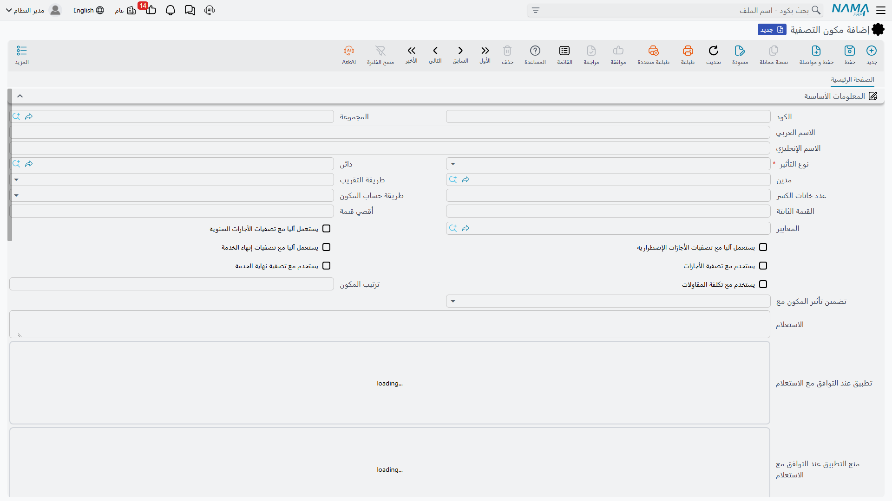
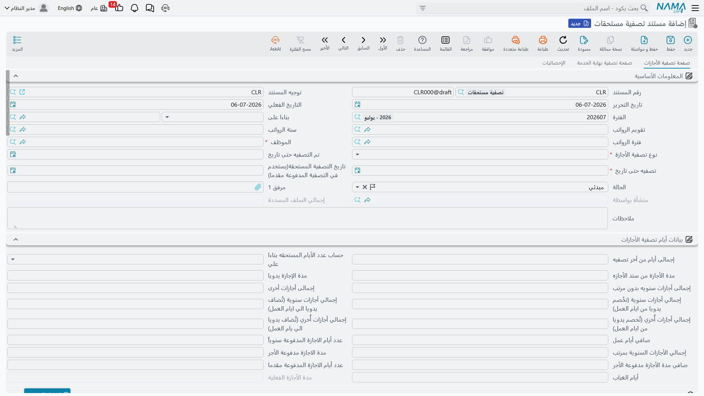

# تصفية المستحقات (Dues Liquidation)

عندما يترك الموظف الشركة، لا بد من مستند واحد يضع خطًا نهائيًا تحت كل ما تبقى بين الطرفين من
مستحقات والتزامات ويحوّله إلى مبلغ واحد يُصرف. **مستند تصفية المستحقات** (Dues Liquidation Document)
هو هذه التسوية النهائية. يجمع **مكافأة نهاية الخدمة**، و**القيمة النقدية للأجازات غير المستنفدة**،
وأي **رواتب غير مسددة** ما زالت مستحقة، و**رصيد السلف المتبقي** الذي يجب على الموظف ردّه، وأي
**تعديلات يدوية** يحتاج مسؤول الموارد البشرية إلى إضافتها أو خصمها — ثم يصفّيها في رقم واحد،
ويسلّم هذا الرقم إلى سند صرف.

::: info تسوية خاصة بدول الخليج
مسار الطلب ← المستند ومحرك الرواتب أسفله من الموارد البشرية العامة، لكن **حساب مكافأة نهاية الخدمة**
ومستند التسوية المبني عليه يتّبعان أعراف قوانين العمل الخليجية / السعودية، ولذلك فتصفية المستحقات
**خاصة بدول الخليج**. وهي تتطلّب رخصة الموارد البشرية المتقدّمة (`humanresource-advanced`).
:::

## أين تجده

تقع التسوية ضمن **الرواتب ← التصفية وانهاء الخدمات** —
`الرواتب > التصفية وانهاء الخدمات > مستند تصفية مستحقات` (*Payroll → Dues Liquidation and Firing →
Dues Liquidation Document*). ونادرًا ما تفتحه من الصفر: المسار المعتاد هو الضغط على زر **إنشاء
مستند تصفية مستحقات (نهاية خدمة)** في سند إنهاء الخدمة، فيفتح تسوية جديدة تحمل بالفعل الموظف وتواريخ
الخدمة وسبب نهاية الخدمة. راجع [إنهاء الخدمة](./firing-and-termination) لتفاصيل هذا الانتقال.

## تسويتان في مستند واحد

تصفية المستحقات في حقيقتها **تسويتان متوازيتان** تعيشان في صفحتين من المستند نفسه، لأن ما يُصرَف
في كلٍّ منهما يتّبع قواعد مختلفة تمامًا:

- **صفحة تصفية الأجازات** (Vacation Liquidation Page) تصرف رصيد الأجازات غير المستنفد. ويمكن
  استخدام هذه الصفحة بمفردها حتى لموظفٍ **لا** يترك العمل — مثل الصرف النقدي السنوي لرصيد مُستحَق.
  و**نوع تصفية الأجازة** (`نوع تصفية الأجازة`) إمّا **أجازة سنوية** (Annual Vacation) أو **أجازة
  إضطرارية** (Compulsory Vacation).
- **صفحة تصفية نهاية الخدمة** (Termination Liquidation Page) تحسب مكافأة نهاية الخدمة، ولا تُستخدم
  إلا عند انتهاء العمل فعليًا. وترتبط بـ**سند إنهاء الخدمة** (Firing Document) الذي أُنشئت منه.

كما توجد صفحة ثالثة **الإحصائيات** (Statistics) تعرض معادلات نهاية الخدمة التي غذّت الحساب وسندات
الصرف التي صدرت.

## عناصر الإعداد التي تُهيَّأ مرّة واحدة

يجعل سجلّان من سجلات الإعداد التسويةَ قابلة لإعادة الاستخدام بدلاً من إدخالها يدويًا في كل مرة.

### مكوّن التصفية

**مكوّن التصفية** (Liquidation Component) سطر مُسمّى يمكن أن يظهر في أي تسوية — تخيّله "مكافأة نهاية
الخدمة"، أو "بدل تذاكر الطيران"، أو "تعويض مهلة الإنذار"، أو "استرداد سلفة". ويُعرَّف من **الرواتب ←
التصفية وانهاء الخدمات ← مكوّن التصفية**، ويقرّر **كيف** تُحسَب قيمته و**أين** تستقر في دفتر الأستاذ.

| الحقل (عربي) | التسمية الإنجليزية | الغرض |
|---|---|---|
| الاسم العربي / الاسم الإنجليزي | Arabic Name / English Name | اسم المكوّن الظاهر. |
| نوع التأثير | Component Effect Type | هل السطر **إضافة** أم **استقطاع** أم قيمة **أخرى**. |
| طريقة حساب المكون | Component Calculation Type | قيمة ثابتة أم معادلة محسوبة. |
| القيمة الثابتة / أقصي قيمة | Fixed Value / Maximum Value | مبلغ ثابت، وسقف لا يتجاوزه الناتج. |
| مدين / دائن | Debit / Credit | حسابا دفتر الأستاذ اللذان يرحّل إليهما المكوّن. |
| المعايير | Criteria | فلتر يحدّد الموظفين الذين ينطبق عليهم المكوّن. |
| يستعمل اّليا مع تصفيات إنهاء الخدمة | Used Automatic with Termination | إضافة هذا السطر تلقائيًا إلى كل تسوية نهاية خدمة. |
| يستعمل اّليا مع تصفيات الأجازات السنوية | Used Automatic with Annual Vacation | إضافته تلقائيًا إلى كل صرف نقدي لأجازة سنوية. |
| بستعمل اّليا مع تصفيات الأجازات الإضطراريه | Used Automatic with Compulsory Vacation | إضافته تلقائيًا إلى صرف الأجازات الإضطرارية. |
| ترتيب المكون | Component Order | ترتيب تقييم السطور (يمكن أن تعتمد السطور اللاحقة على السابقة). |

يحوّل جدول **المعادلات** المكوّنَ إلى حسابٍ بالشرائح — كل صف مدى لمدة الخدمة (**المدي من / إلي**)
مع كسر **مضروب في** و**مقسوما علي**، وهو تمامًا نمط جداول مكافأة سبب نهاية الخدمة. ويربط جدول
**المكونات** السطرَ بأنواع مفردات الراتب التي يستمدّ قيمته منها، ويتيح جدول **سطور التأثير المحاسبي**
تغيير حسابي المدين/الدائن بحسب معيار الموظف.

### توجيه المستند

كأي مستند مُرحِّل، تُحكَم التسوية بـ**توجيه المستند** (`توجيه المستند`) الذي يسمّي الدفاتر وإعدادات
سند الصرف والحسابات المحاسبية (مصروف المكافأة، وحساب مخصّص الالتزام الذي يُسحَب منه، وحساب استرداد
السلف). التوجيه هو ما يربط التسوية بدفتر الأستاذ — راجع ملاحظة المعالجة أدناه.

## كيف تُبنى الأرقام

في صفحة نهاية الخدمة، يحدّد النظام أولًا **مدة الخدمة**. ويختار **احتساب ايام تصفية نهاية الخدمة
بناءا علي** (`احتساب ايام تصفية نهاية الخدمة بناءا علي`) بين **إجمالي ايام العمل** (Total Work Days)
الذي يحسبه النظام و**مدة الخدمة يدويا** (Manual Total Work Days) التي تُدخِلها بنفسك. ومن تاريخ
المباشرة وآخر يوم عمل يشتقّ المستند **مدة الخدمة** كـ**سنة/شهر/يوم** (`مدة الخدمة (سنة - شهر - يوم)`)
و**صافي أيام العمل** (`صافي أيام عمل`) بعد خصم أيام الغياب غير المدفوعة.

::: warning اصطلاح أيام الخدمة ناقص واحد
عند تحويل المدى الزمني إلى مدة خدمة، يعدّ النظام اليوم الأخير حدًّا **غير محتسب** — فالرقم الفعلي هو
**أيام الخدمة − 1**. وهذا **مقصود**: من يبدأ وينتهي في اليوم نفسه لم يُكمل أي يوم خدمة، ومن يمتدّ
عقده من الأول إلى الثلاثين يكون قد خدم 29 يومًا منقضيًا لا 30. ضع هذا في حسبانك عند مراجعة تسوية
يدويًا — فارق اليوم الواحد عن العدّ الساذج للأيام أمرٌ متوقَّع لا خطأ.
:::

ثم يؤدّي الضغط على **إصدار التصفيه** (Generate Liquidation) إلى تشغيل معادلات المكافأة المرتبطة بسبب
نهاية الخدمة وتعبئة جدول **تفاصيل تصفية نهاية الخدمة** — سطر لكل مكوّن، بقيمته الأصلية و**القيمة
المستحقه** (`القيمة المستحقه`) وتوزيعها بين إضافة/استقطاع/أخرى. ويعرض جدول **مكونات تصفية نهاية
الخدمة** الموازي الناتجَ النهائي لكل مكوّن تصفية بعد تطبيق معامله. ويجمع شريطا أدوات بقيّة التسوية:

- **تجميع سندات الرواتب الغير مسددة** (Collect Unpaid Salary Documents) يسرد كل سند راتب لم يُصرَف،
  فتُصرَف الأجور الأخيرة مع التسوية. فعِّل **يصرف مع التصفية** (`يصرف مع التصفية`) على ما تريد إدراجه.
- **تجميع كل السلف المتبقية** (Collect Remaining Loans) يجلب رصيد أقساط السلف المتبقية كخصم، فلا يبقى
  شيء مستحق للشركة دون تسوية.

أما السطور اليدوية لمرة واحدة (منحة استثنائية، خصم متنازَع عليه) فتُدخَل مباشرة في جدول المكوّنات،
وتتيح لك حتى عشرة **مبالغ بالذمّة** (`مبلغ بالذمه`) تصفية ما على الموظف من ذمم مُتتبَّعة. ويحسب قسم
**بيانات بدل التذاكر** (`بيانات بدل التذاكر`) استحقاق تذكرة الطيران الخليجي — عدد التذاكر × قيمة
التذكرة × نسبة الاستحقاق — كإضافة مستقلّة.

ويتجمّع كل ذلك في قسم **الإجمــاليات**: **صافي المفردات (صافي التصفية)** (`صافي المفردات (صافي
التصفية)`)، وإجمالي بدل التذاكر، والذمم المخصومة، وأخيرًا **الصافي** (`الصافي`) و**إجمالي المبالغ
الواجب صرفها في التصفية** (`إجمالي المبالغ الواجب صرفها في التصفية`).

## مثال محسوب

خذ موظفًا يترك العمل بعد خمس سنوات كاملة، راتبه الشهري الخاضع للمكافأة **6,000** وأجره اليومي **200**.

| العنصر | كيف يُحسَب | المبلغ |
|---|---|---|
| مكافأة نهاية الخدمة | نصف شهر عن كل سنة من السنوات الخمس الأولى: 5 × (6,000 ÷ 2) | **+15,000** |
| أجازة سنوية غير مستنفدة | صرف 12 يومًا غير مستنفدة بالأجر اليومي: 12 × 200 | **+2,400** |
| بدل تذاكر | تذكرة واحدة قيمتها 1,500 باستحقاق 100٪ | **+1,500** |
| راتب غير مسدد | سند راتب الشهر الأخير لم يُصرَف، مُجمَّع في التسوية | **+6,000** |
| استرداد سلفة | رصيد الأقساط المتبقي يُستردّ | **−3,000** |
| **صافي التسوية** | 15,000 + 2,400 + 1,500 + 6,000 − 3,000 | **= 21,900** |

يُظهر المستند **21,900** كصافيه. ولأن مدة الخدمة تُقاس باصطلاح **أيام الخدمة − 1**، فإن "الخمس سنوات"
التي تحرّك شريحة المكافأة هي مدة الخدمة المكتملة لا عدًّا زمنيًا يقرّب اليوم الجزئي الأخير لأعلى. وبعد
أن تطمئنّ إلى الرقم، اضغط **إنشاء سند صرف** (Generate Payment Voucher) — أو **إنشاء طلب صرف**
(Generate Payment Voucher Request) إن كانت المدفوعات تمرّ بخطوة موافقة — فيُصرَف مبلغ 21,900 عبر
الخزينة.

## كيف تُعالَج / وماذا تُرحِّل

حفظ التسوية فوري؛ أما أثرها في دفتر الأستاذ فيُرفَع كـ**طلب أعمال** (Business Request) في الخلفية له
**حالة معالجة** (`حالة المعالجة`) خاصّة به، ويمكن إعادة تنفيذه من **قائمة طلبات الأعمال** إن أخفق.

والحسابات التي تستخدمها التسوية هي المسمّاة في **توجيه المستند** — جانبا مصروف المكافأة/التصفية
ومخصّص الالتزام، و**استرداد السلف** مدينًا ودائنًا لإقفال الأقساط المستردّة. أما ما يحرّك المال فعليًا
إلى الموظف فهو **سند الصرف** المُنشأ من التسوية: تسجّل التسوية الالتزام في حسابات المصروف والالتزام
الصحيحة، ويقيّد السند حساب النقدية/البنك دائنًا عند الدفع. وإن عُدِّلت التسوية بعد ترحيلها أول مرة،
يعيد النظام إصدار طلب أعمال **تحديث** ليبقى دفتر الأستاذ متّسقًا؛ وإن هُيّئ التوجيه بلا تأثير محاسبي،
ظلّ المستند يحسب ويصرف دون أن يرحّل بنفسه.

كذلك فإن ترحيل التسوية هو الحدث الذي **يعيد تصفير احتساب المخصّص**: فقد صُرِف التزام نهاية الخدمة
والأجازات المتراكم، فتبدأ دورة الاحتساب التالية من جديد. راجع [مخصصات الموارد البشرية](./hr-provisions).

## تسوية عدّة موظفين دفعة واحدة

لعمليات إنهاء نهاية المشروع، يعالج **سند تصفية مستحقات مجمعة** (Aggregated Dues Liquidation Document)
قائمة موظفين من رأس واحد، فيولّد تسوية مستقلّة لكل موظف عند الترحيل. أنت تدير الدُّفعة لا السجلات
المفردة المتولّدة — ونمط المستندات المجمّعة مشروح في
[طلبات ومستندات الموارد البشرية](../concepts/hr-requests-and-documents).

## صفحات ذات صلة

- [إنهاء الخدمة](./firing-and-termination) — إنهاء الخدمة الذي يولّد التسوية وقواعد مكافأة سبب نهاية
  الخدمة.
- [مخصصات الموارد البشرية](./hr-provisions) — الالتزام المتراكم على مدى الخدمة الذي تعيد التسوية
  المرحَّلة تصفيره.
- [الموافقة على إخلاء الطرف](./evacuation-approval) — إخلاء الطرف الإداري الذي يسبق التسوية غالبًا.
