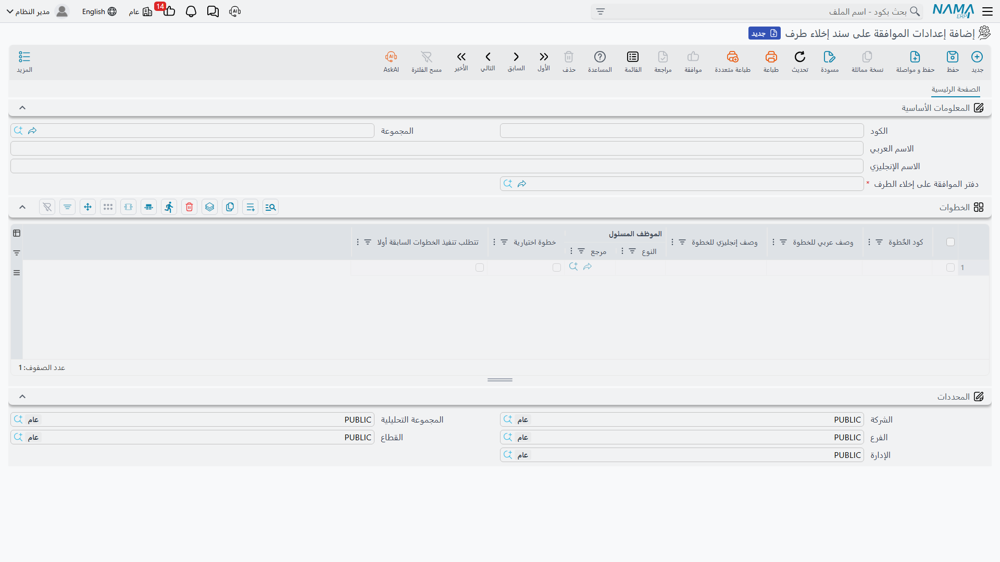
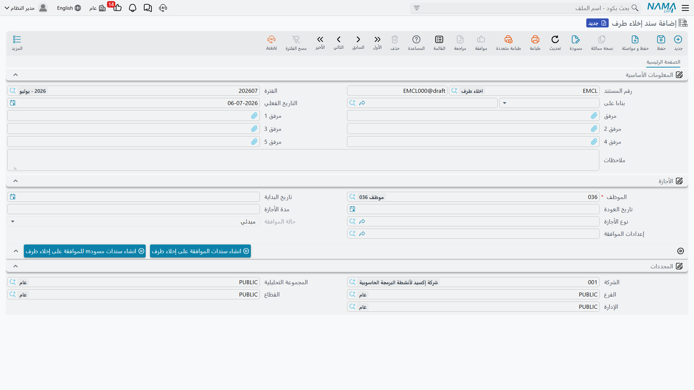

# الموافقة على إخلاء الطرف (Evacuation Approval)

قبل أن يُصرَف للموظف المغادر مستحقاته — أو قبل اعتماد أجازة طويلة — تُجري معظم الشركات **إخلاء طرف**:
إذ يجب أن توقّع له كل إدارة يترتّب عليه تجاهها شيء. فتستردّ إدارة تقنية المعلومات الحاسوب، ويؤكّد
المخزن ألّا شيء بعهدته، وتراجع الإدارة المالية عدم وجود سلف قائمة، ويُفرِج مديره المباشر عن التسليم.
وفي نما يُنمذَج إخلاء الطرف الإداري (**إخلاء طرف**) كمسار عمل صغير يقع **حول** التسوية بوصفه **بوابة
إجرائية**: فهو يقرّر **هل** يُسمح للإجراء بالمضي، لكنه لا يمسّ حساب المال نفسه أبدًا.

::: info بوابة لا حساب
لا تحمل الموافقة على إخلاء الطرف **أي تأثير محاسبي** ولا تحسب أي مكافأة. فهي سلسلة اعتماد خالصة. أما
الأرقام — المكافأة، وصرف الأجازات، والسلف، وصافي الصرف — فتعيش جميعها في مستند
[تصفية المستحقات](./dues-liquidation). اعتبر إخلاء الطرف قائمة التحقّق التي يجب أن تكتمل قبل الإفراج
عن تلك التسوية. وهي تتطلّب رخصة الموارد البشرية المتقدّمة (`humanresource-advanced`).
:::

## العناصر الثلاثة

تتكوّن الخاصية من ثلاثة سجلات تعمل معًا، وكلّها ضمن **الرواتب ← التصفية وانهاء الخدمات**
(`الرواتب > التصفية وانهاء الخدمات`):

1. **إعدادات الموافقة على سند إخلاء طرف** (Evacuation Approval Settings) — القالب القابل لإعادة
   الاستخدام الذي يسرد **خطوات** إخلاء الطرف وترتيبها.
2. **سند إخلاء طرف** (Evacuation Party Document) — إخلاء الطرف الفعلي المفتوح لموظف واحد، والذي
   يتفرّع إلى موافقة لكل خطوة.
3. **الموافقة على إخلاء طرف** (Evacuation Approval Document) — اعتماد خطوة واحدة، يقبلها أو يرفضها
   المسؤول عنها.

## الخطوة 1 — تعريف قالب إخلاء الطرف

سجلّ **إعدادات الموافقة على سند إخلاء طرف** هو حيث تصمّم إخلاء الطرف مرة واحدة وتعيد استخدامه. وهو
يسمّي **دفتر الموافقة على إخلاء الطرف** (`دفتر الموافقة على إخلاء الطرف`) الذي تُقيَّد فيه الموافقات
المفردة، ويحمل جدول **الخطوات** — صف لكل إدارة أو نقطة تحقّق يجب أن يمرّ بها الموظف:

| العمود (عربي) | التسمية الإنجليزية | الغرض |
|---|---|---|
| كود الخٌطوة | Step Code | معرّف مختصر للخطوة. |
| وصف عربي للخطوة / وصف إنجليزي للخطوة | Step Arabic Description / Step English Description | الاسم ثنائي اللغة لنقطة التحقّق (مثل "استرداد أجهزة تقنية المعلومات"). |
| الموظف المسئول | Responsible Employee | من يوقّع اعتماد هذه الخطوة. |
| خطوة اختيارية | Optional Step | إن فُعِّلت، جاز تخطّي الخطوة دون تعطيل إخلاء الطرف. |
| تتطلب تنفيذ الخطوات السابقة أولا | Require Previous Steps Approval | يفرض **الترتيب** — لا يمكن اعتماد هذه الخطوة قبل اعتماد ما قبلها. |

خانة **تتطلب تنفيذ الخطوات السابقة أولا** هي ما يحوّل قائمة التحقّق المسطّحة إلى سلسلة اعتماد
**مرتّبة**: فالخطوة المؤشّرة بها تبقى مقفلة حتى تُوقَّع كل الخطوات التي تسبقها، فلا تستطيع الإدارة
المالية إخلاء طرف الموظف قبل أن تستردّ تقنية المعلومات الحاسوب.

## الخطوة 2 — فتح إخلاء الطرف لموظف

يُحرَّر **سند إخلاء طرف** للموظف المغادر (أو الذاهب في أجازة). وهو يحدّد الشخص والأجازة المعنية —
**الموظف** (`الموظف`)، و**تاريخ البداية** (`تاريخ البداية`)، و**تاريخ العودة** (`تاريخ العودة`)،
و**مدة الأجازة** (`مدة الأجازة`)، و**نوع الأجازة** (`نوع الأجازة`) — ويشير إلى قالب **إعدادات
الموافقة** (`إعدادات الموافقة`) المطلوب استخدامه.

وتتتبّع **حالة الموافقة** (`حالة الموافقة`) إخلاء الطرف بأكمله عبر أربع قيم:

| الحالة (إنجليزي) | التسمية العربية |
|---|---|
| Initial | مبدئي |
| Approval In Progress | الموافقة قيد التنفيذ |
| Approved | مقبول |
| Approval Rejected | تم الرفض |

ويُفرّع زرّان إخلاء الطرف إلى خطواته: **إنشاء مستندات الموافقة** (Generate Approval Documents) ينشئ
موافقة فعلية لكل خطوة، بينما **إنشاء مستندات موافقة كمسودّة** (Generate Draft Approval Documents)
ينشئها كمسودّات أولًا. ولا يبلغ سند إخلاء الطرف حالة **مقبول** إلا بعد اعتماد كل خطوة غير اختيارية؛
ورفضٌ واحد يقلبه إلى **تم الرفض**.

## الخطوة 3 — كل مسؤول يوقّع خطوته

يمثّل كل **مستند الموافقة على إخلاء طرف** خطوةً واحدة. ويحمل **كود الخطوة** ووصفها العربي/الإنجليزي
المنسوخ من القالب، و**الموظف** الجاري إخلاء طرفه، و**الموظف المسئول** (`الموظف المسئول`) صاحب القرار،
و**القرار** (`القرار`) وهو أحد:

| القرار (إنجليزي) | التسمية العربية |
|---|---|
| Initial | مبدئي |
| Approve | موافقة |
| Reject | رفض |

يفتح المسؤول موافقته، ويسجّل ما تحقّق منه، ويضبط القرار. وحين تتحوّل آخر خطوة مطلوبة إلى **موافقة**،
يصبح سند إخلاء الطرف الأصل **مقبولًا** وتُصبح التسوية حرّة في المضيّ.

### خانات قائمة التحقّق مِلكٌ لك لتعريفها

يكشف كل مستند موافقة أيضًا مجموعة من **خانات الالتقاط العامة** — عدّة حقول مرجع وأرقام ونصوص وتواريخ،
مع مرفقات — لا تحمل **أي معنى ثابت** في المنتج القياسي. وهي موجودة لتتيح لكل شركة تحويل الخطوة إلى
قائمة تحقّق حقيقية: فقد تستخدم إحدى المنشآت خانةً لتسجيل رقم أصل، وأخرى رقم شهادة إخلاء طرف، وثالثة
تاريخ إعادة الأجهزة. عاملها بوصفها حقولًا **قابلة للتهيئة** تُسمّى وتُستخدم وفق إجراء إخلاء الطرف
الخاص بك، لا بوصفها دلالات مُعرَّفة مسبقًا.

## كيف تُعالَج

الموافقة على إخلاء الطرف **مسار عمل** لا مستند دفتر أستاذ — فهي لا تولّد **أي تأثير محاسبي** ولا
ترحّل شيئًا إلى دفتر الأستاذ. و"معالجتها" الوحيدة هي آلة الحالات: تتجمّع الموافقات في حالة موافقة سند
إخلاء الطرف، وهذه الحالة هي ما يمكن أن تُلزَم التسويةُ باحترامه. ولأن إخلاء الطرف والمال منفصلان عن
قصد، يمكنك تشغيل الاثنين بالتوازي واشتراط أن يكون إخلاء الطرف **مقبولًا** فقط قبل صرف تصفية المستحقات.

## صفحات ذات صلة

- [تصفية المستحقات](./dues-liquidation) — التسوية النهائية التي يبوّبها إخلاء الطرف؛ وكل حساب المكافأة
  وصرف الأجازات يعيش هناك.
- [إنهاء الخدمة](./firing-and-termination) — إنهاء الخدمة الذي يُشغِّل مسار نهاية الخدمة بأكمله.
