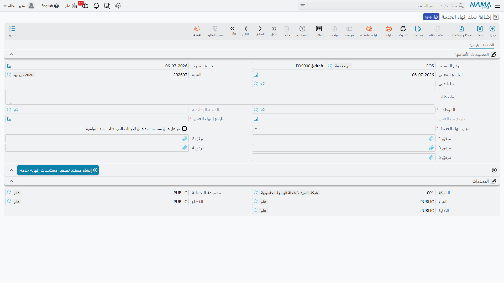
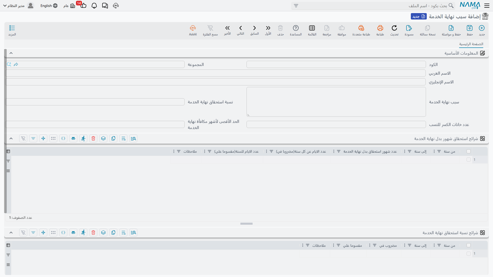

# إنهاء الخدمة والتصفية

إنهاء خدمة موظف ليس مجرد تغيير في حالته أبداً. فبمجرد تأكيد المغادرة تستحقّ سلسلة من الالتزامات:
تصفية الراتب غير المدفوع، وصرف القيمة النقدية للأجازات غير المستخدمة، وأي سلف قائمة — وفوق ذلك كله
**مكافأة نهاية الخدمة** التي تدين بها الشركة عن سنوات الخدمة. يمثّل نما المغادرةَ نفسها بزوجٍ خفيف من
**طلب ← مستند**، ويحتفظ بقواعد المكافأة التي قد تكون معقّدة في كتالوج قابل لإعادة الاستخدام من **أسباب
نهاية الخدمة**، حتى تُطبَّق السياسة نفسها باتّساق على كل من يغادر للسبب ذاته.

::: info مكافأة نهاية الخدمة خاصة بالخليج
تدفّق **طلب ← مستند** وأسباب إنهاء الخدمة وظائف عامة في الموارد البشرية. أما **حساب المكافأة** المبني
فوق أسباب نهاية الخدمة — شرائح شهور الراتب، ونسب الاستحقاق، وسقف نهاية الخدمة — فيتبع أعراف قانون العمل
الخليجي/السعودي وهو **خاص بالخليج**.
:::

## الطلب أولاً، ثم المستند

يتبع إنهاء الخدمة الثلاثية القياسية في الموارد البشرية. **طلب إنهاء الخدمة** هو الطلب الخاضع للموافقة
لإنهاء خدمة أحدهم؛ وبمجرد قبوله يُنتج **سند إنهاء الخدمة**، وهو السجل المنفَّذ الذي يعلّم الموظف فعلياً
بأنه منتهي الخدمة. وإن كانت عمليتك لا تحتاج خطوة موافقة، فيمكنك تحرير السند مباشرة. لمعرفة التفاصيل
الكاملة لكيفية قبول الطلب وتحويله إلى مستند، راجع
[طلبات ومستندات الموارد البشرية والمستندات المجمعة](../concepts/hr-requests-and-documents).

كلتا الشاشتين ضمن **الرواتب ← التصفية وانهاء الخدمات** —
`الرواتب > التصفية وانهاء الخدمات > سند إنهاء الخدمة` (Firing Document). يتطلب سند إنهاء الخدمة
ترخيص رواتب الموارد البشرية (`humanresource-payroll`).

يتشارك الطلب والمستند الحقول الأساسية نفسها:

| الحقل (عربي) | التسمية الإنجليزية | الغرض |
|---|---|---|
| الموظف | Employee | الموظف المنتهية خدمته. |
| الدرجة الوظيفية | Organization Position | درجته وقت المغادرة. |
| تاريخ بدء العمل | Work Start Date | بدء الخدمة — مرتكز مدة الخدمة. |
| تاريخ إنتهاء العمل | Work End Date | آخر يوم عمل؛ تُحتسب التصفية حتى هنا. |
| سبب إنهاء الخدمة | Firing Reason | سبب المغادرة — وهو ما يقود حساب المكافأة (أدناه). |
| بناءا على | From Document | على المستند: يربط بالطلب المقبول. |
| تجاهل عمل سند مباشرة عمل للأجازات… | Ignore Vacation Work Starting Document | يتجاوز إنشاء سند عودة من أجازة للأجازات التي كانت ستتطلبه. |
| مرفق ١–٥ | Attachment 1–5 | المستندات الداعمة (خطاب الاستقالة، إخلاء الطرف، إلخ). |

**سبب إنهاء الخدمة** قائمة ثابتة: **إستقالة** (Resignation)، و**فصل** (Dismissal)، و**على المعاش**
(Pension)، و**وقف عن العمل** (Suspension)، وعشر خانات **أخرى** مفتوحة (*أخرى ١*…*أخرى ١٠*،
Other 1…Other 10) يمكنك تخصيصها لأسباب معرّفة محلياً. والسبب مهمّ لأنه يختار سياسة المكافأة المطبَّقة.

## توليد التصفية

لا يحسب طلبُ إنهاء الخدمة ولا سندُه المبلغَ ولا يدفعه بنفسه — فذلك عمل تصفية المستحقات. وللربط بين
الاثنين، يحمل كلا الشاشتين زرّ **إنشاء مستند تصفية مستحقات (نهاية خدمة)** (Generate Dues Liquidation
Document (Termination)). الضغط عليه يفتح **مستند تصفية مستحقات جديداً**
مملوءاً مسبقاً من إنهاء الخدمة — يُنقَل الموظف وتواريخ الخدمة وسبب نهاية الخدمة المطبَّق تلقائياً حتى
لا تعيد إدخالها. ومن هناك تحسب التصفية المكافأةَ وصرفَ الأجازات والسلفَ والراتبَ النهائي، وتصافيها،
وتنتج الدفعة. راجع [تصفية المستحقات](./dues-liquidation) لحساب المبالغ.

## أسباب نهاية الخدمة — كتاب قواعد المكافأة

**سبب نهاية الخدمة** سجلٌّ رئيسي يحوّل "لماذا غادر وكم خدم" إلى "كم شهراً من الراتب ندين به". قد يغطّي
السجل الواحد عدة أسباب لإنهاء الخدمة معاً — إذ يسرد حقل **سبب نهاية الخدمة** (Termination Reason) في
الرأس أسبابَ إنهاء الخدمة التي ينطبق عليها كتاب القواعد هذا، فقد تحتفظ بسياسة للاستقالات وأخرى أكثر
سخاءً لانتهاء العقد أو التقاعد. تجده في **الرواتب ← التصفية وانهاء الخدمات ← سبب نهاية الخدمة**.

تُحسب المكافأة من **جدولَي قواعد** يعملان معاً، ثم تُقيَّد بسقفٍ إجمالي:

**١. شرائح شهور الراتب** — *Termination Allowance Dues Months Sections*
(`شرائح استحقاق شهور بدل نهاية الخدمة`). كل سطر شريحة خدمة والاستحقاق الذي تكسبه:

| العمود (عربي) | التسمية الإنجليزية | المعنى |
|---|---|---|
| من سنة / إلى سنة | From Year / To Year | شريحة مدة الخدمة التي ينطبق عليها هذا السطر. |
| عدد شهور استحقاق بدل نهاية الخدمة | Due Months | شهور الراتب المكتسبة عن كل سنة داخل هذه الشريحة. |
| عدد الايام عن كل سنة (مضروبا في) | Days Per Year (Multiplied by) | عامل بديل بالأيام: الأيام المحتسبة عن كل سنة. |
| عدد الايام للسنة (مقسوما علي) | Days Of Year (Divided on) | المقسوم عليه الذي يحوّل تلك الأيام إلى كسرٍ من السنة. |

هنا يكمن النمط الخليجي المألوف — فمثلاً *نصف شهر عن كل سنة من السنوات الخمس الأولى، وشهر كامل عن كل سنة
بعدها* يصبح شريحةً للسنوات ٠–٥ وأخرى للسنوات ٥ فأكثر.

**٢. شرائح النسبة** — *Termination Dues Sections* (`شرائح نسبة استحقاق نهاية الخدمة`). تعدّل هذه
المكافأة المكتسبة بحسب *كيفية* مغادرة الموظف:

| العمود (عربي) | التسمية الإنجليزية | المعنى |
|---|---|---|
| من سنة / إلى سنة | From Year / To Year | شريحة مدة الخدمة. |
| مضروب في | Multiply By | بسط كسر الاستحقاق. |
| مقسوما علي | Divide On | مقام كسر الاستحقاق. |

سُلَّم الاستقالة الكلاسيكي — *لا شيء دون سنتين، والثلث بين سنتين وخمس، والثلثان بين خمس وعشر، والكامل
بعد عشر* — يُعبَّر عنه بكسور مضروب في/مقسوم على (١÷٣، ٢÷٣، ١÷١) لكل شريحة.

تحكم السجلَّ كلَّه ثلاثة حقول في الرأس: **نسبة استحقاق نهاية الخدمة** (Due Percentage) تضبط نسبة
استحقاق إجمالية، و**عدد خانات الكسر للنسب** (Percentages Scale) يتحكّم في دقة التقريب، و**الحد الأقصى
لأشهر مكافأة نهاية الخدمة** (Maximum End of Service Months) **يقيّد** إجمالي المكافأة — فمهما طالت
الخدمة، لا يمكن أن يتجاوز المصروف هذا العدد من شهور الراتب (السقف النظامي الخليجي).

## إنهاء خدمة عدد كبير من الموظفين دفعة واحدة

لعمليات إعادة الهيكلة أو تسريح نهاية المشروع، يتيح لك **سند إنهاء خدمة مجمع** — ونظيره في الطلبات،
**طلب إنهاء خدمة مجمعة** — معالجة قائمة كاملة من الموظفين من رأسٍ واحد. وعند الاعتماد تُنشئ الدفعة سند
إنهاء خدمة عادياً لكل موظف، يحمل كلٌّ منه سببه وتواريخه وتصفيته النهائية. تدير أنت الدفعة لا السندات
الفردية المتولّدة؛ ويُشرح النمط المجمّع في
[طلبات ومستندات الموارد البشرية والمستندات المجمعة](../concepts/hr-requests-and-documents).

## صفحات ذات صلة

- [تصفية المستحقات](./dues-liquidation) — التصفية المتولّدة من إنهاء الخدمة.
- [مخصصات الموظفين](./hr-provisions) — التزام المكافأة الذي ظلّ يتراكم طوال الوقت.
- [طلبات ومستندات الموارد البشرية والمستندات المجمعة](../concepts/hr-requests-and-documents) — نمط
  الطلب ← المستند ← المجمّع الذي يقف خلف إنهاء الخدمة.
