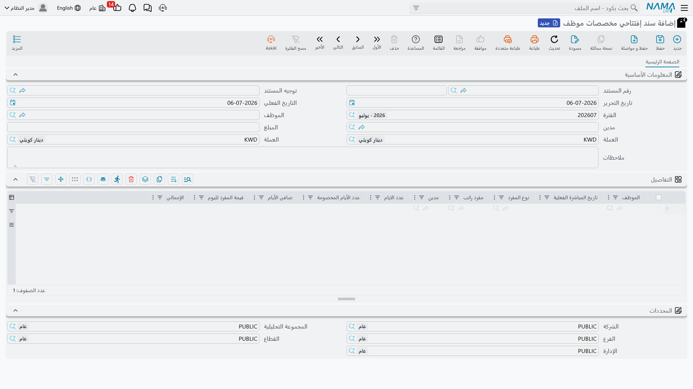
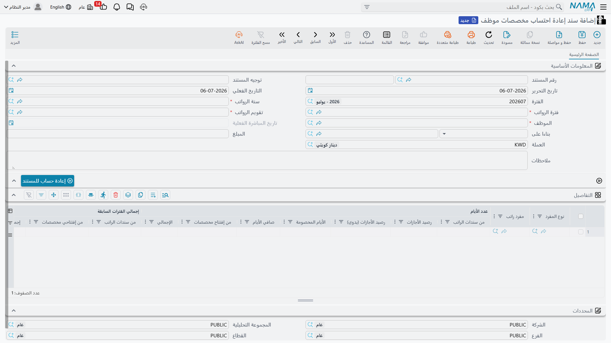

# مخصصات الموظفين (نهاية الخدمة ورصيد الأجازات)

عندما يترك الموظف العمل في النهاية، تكون الشركة مدينة له بأموال ظلّت تتراكم على مدى سنوات: **مكافأة
نهاية الخدمة** (مبلغ إجمالي يعتمد على مدة الخدمة)، و**القيمة النقدية لأيام الأجازات التي لم يحصل
عليها**. لو أنك لم تعترف بهذا الالتزام إلا في الشهر الوحيد الذي يغادر فيه الموظف، لبدت دفاترك سليمة
لسنوات ثم تلقّت ضربة مفاجئة تشوّه النتائج. **المخصصات** هي الحل. في كل فترة تقتطع — *تُجنِّب* — شريحة
صغيرة من الفاتورة النهائية، حتى يظهر دفتر الأستاذ العام دائماً الالتزام الحقيقي المُحدَّث الذي تتحمله
الشركة تجاه موظفيها.

هذه وظيفة **عامة في الموارد البشرية**: آلية التجنيب تعمل بالطريقة نفسها في كل مكان، بغضّ النظر عن قانون
العمل في الدولة الذي يحدّد صيغة المكافأة النهائية.

## ما هو "المخصص" فعلياً

المخصص ليس خانة اختيار في بطاقة الموظف. بل يُبنى من **مفردات الراتب** العادية التي علّمتها لتشارك في
التصفية النهائية. على مفرد الراتب، تحدّد ثلاثة مفاتيح ما إذا كان يغذّي مخصصاً:

- **يستخدم في حساب تصفيه نهاية الخدمة** (Included Termination Liquidation) — يشارك المفرد في تجنيب
  **مكافأة نهاية الخدمة**.
- **يستخدم في حساب تصفيه الاجازة السنوية** (Included Annual Vacation Liquidation) — يغذّي المفرد
  تجنيب **القيمة النقدية للأجازات غير المستخدمة**.
- **يستخدم في حساب تصفية الأجازة الإضطرارية** (Include Compulsory Vacation Liquidation) — يوسّع
  تجنيب الأجازات ليشمل أرصدة الأجازة الاضطرارية.

ولأن المخصص يعتمد على مفردات الراتب نفسها، فإن القيمة اليومية التي يجري تجنيبها تُشتقّ دائماً من راتب
الموظف الفعلي الحالي. راجع [مفردات الراتب](../payroll/salary-components) لمعرفة كيفية ضبط هذه المفاتيح
وسطور الحسابات المدينة/الدائنة الخاصة بها.

تستخدم دورة المخصصات **مستندين** فقط: تفتح المخصص مرة واحدة لكل موظف، ثم تعيد احتسابه في كل فترة بعد ذلك.

## أين تجدها

كلا الشاشتين ضمن **الرواتب ← الرواتب**:

- الافتتاح: `الرواتب > الرواتب > سند إفتتاحي مخصصات موظف` (Employee Provisions Opening Document).
- إعادة الاحتساب: `الرواتب > الرواتب > سند إعادة احتساب مخصصات موظف` (Employee Provisions
  Recalculation Document).

تتطلب إعادة احتساب المخصصات ترخيص الموارد البشرية المتقدّم (`humanresource-advanced`).

## الخطوة ١ — افتح المخصص (مرة واحدة لكل موظف)

يُنشئ **سند إفتتاحي مخصصات موظف** الرصيد الابتدائي لموظف بدأت خدمته *قبل* أن تبدأ في تتبّع المخصصات في
نما. يسجّل عدد أيام المكافأة وقيمة الأجازات المكتسبة سابقاً، حتى لا تحاول أول إعادة احتساب أن تُرحِّل
الالتزام التاريخي بكامله في فترة واحدة.

| الحقل (عربي) | التسمية الإنجليزية | الغرض |
|---|---|---|
| الموظف | Employee | الموظف الذي يخصّه هذا الرصيد الافتتاحي. |
| تاريخ المباشرة الفعلية | Commencement date | تاريخ بدء الخدمة الذي يُحتسب منه التجنيب. |
| التاريخ الفعلي | Value Date | التاريخ المحاسبي للقيد الافتتاحي. |
| الفترة | Fiscal Period | الفترة المالية التي يُرحَّل إليها الافتتاح. |

يحمل جدول **التفاصيل** سطراً لكل مفرد مخصص، حيث تُدخل **عدد الايام** المكتسبة تاريخياً، وأي **عدد الأيام
المخصومة**، و**صافي الأيام** الناتج، و**قيمة المفرد لليوم**، و**الإجمالي**. إذا كان الموظف جديداً حقاً
(بدأ في ظل نما)، فيمكنك تجاوز الافتتاح تماماً وترك عمليات إعادة الاحتساب تبني الرصيد من الصفر.

## الخطوة ٢ — أعد الاحتساب في كل فترة

**سند إعادة احتساب مخصصات موظف** هو محور العمل. يُحرَّر **لموظف واحد وفترة رواتب واحدة** في المرة، وكل
تشغيلة تقوم بأمرين: تحسب إجمالي المخصص الذي *اكتسبه الموظف حتى تاريخه*، ثم تُرحّل **الفرق** بين هذا
الرقم وكل ما جُنِّب سابقاً — أي *التسوية* — حتى يلحق الرصيد المُجنَّب بالواقع.

| الحقل (عربي) | التسمية الإنجليزية | الغرض |
|---|---|---|
| الموظف | Employee | الموظف الذي تُعاد له عملية الاحتساب. |
| سنة الرواتب / فترة الرواتب | HR Year / HR Period | فترة الرواتب التي يخصّها هذا التجنيب. |
| تقويم الرواتب | HR Calendar | التقويم الذي تُقرأ منه الفترة. |
| تاريخ المباشرة الفعلية | Commencement date | تاريخ بدء الخدمة الذي يقود عدّ الأيام. |
| بناءا على | From Document | يربط بالافتتاح (أو بإعادة احتساب سابقة) الذي يُبنى عليه. |
| المبلغ | Amount | إجمالي التسوية التي يرحّلها هذا السند. |

اضغط **إعادة الاحتساب** (Recalculate Document) فيملأ نما جدول **التفاصيل** — سطراً لكل مفرد مخصص. تعرض
الأعمدة خطوات الحساب، مجمّعةً تحت **عدد الأيام** و**إجمالي الفترات السابقة** والتسوية النهائية:

| العمود (عربي) | التسمية الإنجليزية | المعنى |
|---|---|---|
| عدد الأيام · الإجمالي | # Of Days · Total | إجمالي أيام الخدمة المحتسبة الآن لهذا المفرد. |
| عدد الأيام · من إفتتاح مخصصات | # Of Days · From Provisions Opening | الأيام المُرحَّلة من سند الافتتاح. |
| قيمة اليوم الحالية | Current Day Value | قيمة يومٍ واحد من هذا المخصص اليوم. |
| الإجمالي الحالي | Current Total | كامل المخصص المكتسب حتى تاريخه (قيمة اليوم × صافي الأيام). |
| إجمالي التسويات السابقة | Previous Adjustment Total | كل ما جُنِّب في عمليات إعادة الاحتساب السابقة. |
| التسوية | Adjustment | **الإجمالي الحالي − إجمالي التسويات السابقة** — ما يرحّله هذا السند. |

### مثال محلول

لنأخذ موظفاً قيمة مخصص مكافأة نهاية الخدمة له **50** عن كل يوم خدمة.

- **الفترة الأولى.** بعد إعادة الاحتساب، تجمّع 100 يوم صافٍ من الخدمة. الإجمالي الحالي = 50 × 100 =
  **5,000**. لم يُجنَّب شيء من قبل، فيكون إجمالي التسويات السابقة = 0 و**التسوية = 5,000**. يرحّل
  السند 5,000.
- **الفترة الثانية.** تمرّ فترة أخرى فترتفع الأيام الصافية إلى 120. الإجمالي الحالي = 50 × 120 =
  **6,000**. إجمالي التسويات السابقة أصبح الآن 5,000، فتكون **التسوية = 6,000 − 5,000 = 1,000**.
  ترحّل هذه التشغيلة الزيادة 1,000 فقط — ولا تعيد ترحيل الـ 6,000 كاملة.

يعمل المنطق نفسه بالتوازي لمخصص الأجازات غير المستخدمة: إذا كان أجر الموظف اليومي 200 ولديه رصيد 10
أيام، فالإجمالي الحالي = 2,000؛ ولو كان قد جُنِّب 1,600 من قبل، فتسوية هذه الفترة = 400.

::: warning يجب أن تجري التشغيلات بالترتيب — والتصفية تعيد ضبط العدّاد
إعادة الاحتساب متسلسلة بصرامة: لا يمكن إعادة احتساب فترة إلا بعد التي قبلها، لأن كل تشغيلة تحتاج إجمالي
التجنيب السابق لتحسب تسويتها. يرفض نما معالجة إعادة احتساب (أو تصفية مستحقات) تجري خارج الترتيب.
والأهم: **بمجرد اعتماد مستند تصفية المستحقات، يُعاد بدء التجنيب من جديد** — فالتصفية قد صرفت المخصص
المتراكم، لتبدأ دورة التجنيب التالية من اليوم التالي. راجع [تصفية المستحقات](./dues-liquidation).
:::

## كيف تتم معالجته وما الذي يرحّله

حفظ إعادة الاحتساب فوري؛ أما الأثر على دفتر الأستاذ فيُرفع كـ**طلب أعمال** (Business Request) في
الخلفية له **حالة المعالجة** الخاصة به، ويمكن إعادة تشغيله من عرض **طلبات الأعمال** إن أخفق.

ما يرحّله هو **تسوية تجنيب**، لا إعادة ترحيل كاملة. فلكل سطر تفصيلي، يأخذ نما قيمة **التسوية** الخاصة
بذلك السطر وينشئ قيداً مديناً ودائناً متقابلين باستخدام **سطور الحسابات المدينة/الدائنة المعرّفة على
مفرد الراتب** — تحديداً سطور الحسابات المعلَّمة للاستخدام مع التسوية الآلية. محاسبياً، يجعل تجنيب
الفترة **مصروف نهاية الخدمة (أو الأجازات) مديناً** و**حساب مخصص الالتزام المقابل دائناً**، كلٌّ بمبلغ
التسوية. ولأن المرحَّل هو *الفرق* عن الإجمالي السابق، فإن فترةً ينخفض فيها المخصص المكتسب قد ترحّل
**تسوية سالبة**، تحرّر جزءاً من الالتزام بدل أن تضيف إليه. وإذا ضُبط توجيه المستند ليعمل دون أثر
محاسبي، فإن إعادة الاحتساب تظلّ تتتبّع الأرقام لكنها لا ترحّل شيئاً إلى دفتر الأستاذ.

## إعادة الاحتساب لعدد كبير من الموظفين دفعة واحدة

تشغيل مستند لكل موظف في كل فترة لا يتوسّع عملياً، ولذلك يأتي **سند إعادة احتساب مخصصات موظف مجمع**
كمصنع دفعات. تعطيه فترة رواتب و**نطاق موظفين** — من/إلى موظف، إدارة، وظيفة، فرع، قطاع، جنسية والمزيد —
ثم تضغط **تجميع الموظفين** (Collect Employees) فيسرد نما كل موظف مطابق. وعند الاعتماد يُنشئ سند إعادة
احتساب فردياً لكل موظف، يرحّل كلٌّ منه تسويته الخاصة. وكما هو الحال في كل المستندات المجمعة، تدير أنت
الدفعة لا السندات الفردية المتولّدة — راجع
[طلبات ومستندات الموارد البشرية والمستندات المجمعة](../concepts/hr-requests-and-documents).

## صفحات ذات صلة

- [مفردات الراتب](../payroll/salary-components) — حيث تُضبط مفاتيح التصفية وحسابات المخصصات.
- [تصفية المستحقات](./dues-liquidation) — التصفية النهائية التي تصرف المخصص المتراكم وتعيد ضبط التجنيب.
- [إنهاء الخدمة والتصفية](./firing-and-termination) — كيف يُطلق إنهاءُ الخدمة عمليةَ التصفية.
