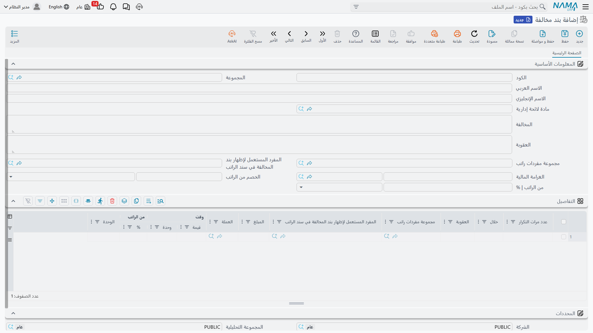
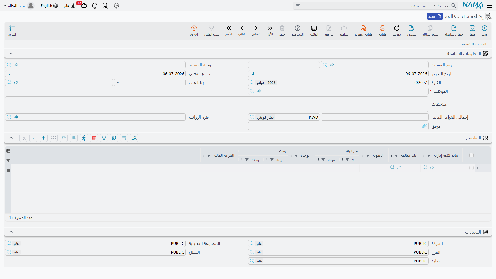

# الجزاءات الحكومية

إلى جانب أعمال التأشيرات والرسوم، يتولى مكتب العلاقات الحكومية **اللائحة الإدارية** للشركة — قائمة
المخالفات الداخلية والعقوبات المرتبطة بها — ويُصدر المستندات التي تُوقِّع العقوبة على الموظف. وهذا في نما
نظام فرعي صغير قائم بذاته: تُعرِّف اللائحة مرة واحدة (مواد المخالفات وعقوباتها المتصاعدة)، ثم تُنشئ **طلب
مخالفة** وتحوّله إلى **سند مخالفة** عند وقوع موظف بعينه في مخالفة.

::: warning هذه عقوبات لائحة عمل / لائحة الشركة — وليست شيئين آخرين تشبههما
من السهل الخلط بين هذا النظام الفرعي ونظامين آخرين، فحافظ على التمييز بينها:

- **ليست مخالفات مرورية / مخالفات المركبات.** فمخالفة السرعة أو الوقوف على سيارة الشركة تُسجَّل على
  المركبة لا هنا، وهي في
  [خدمات الموظفين (المركبات والنقل والوجبات)](../employee-services).
- **ليست عائلة المكافآت والجزاءات في الرواتب.** فالمكافأة الاستثنائية أو الخصم الفردي الذي يقرره المدير هو
  مسار مكافآت/جزاءات الرواتب — راجع
  [المكافآت والجزاءات](../discipline/rewards-and-penalties). أما مستندات *هذه* الصفحة فتُبنى على **لائحة
  المخالفات** الرسمية بتصاعدها المتدرّج، وتتصرف في دفتر الأستاذ تصرفاً مختلفاً (انظر أدناه).
:::

تحتاج هذه المنطقة إلى رخصة الموارد البشرية المتقدمة (`humanresource-advanced`). وللاطلاع على دورة مكتب
العلاقات الحكومية التي تنتمي إليها، راجع
[نظرة عامة على العلاقات الحكومية](./government-relations-overview).

## اللائحة: مادة اللائحة وبند المخالفة

تُعرَّف اللائحة الإدارية على مستويين.

**مادة لائحة إدارية** (Violation List) هي المادة الأعلى — عنوان في لائحة الشركة، مثل *مخالفات الحضور* أو
*مخالفات السلامة*. وتحمل كوداً ومجموعةً واسماً عربياً وإنجليزياً وخانات مرفقات لنص اللائحة الرسمي. تجدها
تحت **الموارد البشرية ← لائحة العمل ← مادة لائحة إدارية**
(Human Resources > Work List > Violation List).

**بند مخالفة** (Violation Item) هو المخالفة المحددة داخل المادة — *التأخر*، *الانصراف دون إذن* — مع
**عقوبتها الأساسية**. وهنا تسكن اللائحة الفعلية. تجده تحت **الموارد البشرية ← لائحة العمل ← بند مخالفة**
(Human Resources > Work List > Violation Item).

| الحقل (عربي) | Field (English) | الغرض |
|---|---|---|
| الكود | Code | كود البند. |
| المجموعة | Group | تصنيفه. |
| الاسم العربي / الاسم الإنجليزي | Arabic Name / English Name | اسم المخالفة الظاهر. |
| مادة لائحة إدارية | Violation List | المادة الأم التي ينتمي إليها البند. |
| المخالفة | violation | وصف المخالفة. |
| العقوبة | Penalty | وصف العقوبة. |
| الغرامة المالية | Financial Penalty | مبلغ غرامة ثابت (وعملته). |
| الخصم من الراتب | penalty From Salary | خصم من الراتب مُعبَّر عنه بمدة زمنية (مثل خصم أجر يومين). |
| من الراتب \| % | From Salary \| percentage | عقوبة مُعبَّر عنها كنسبة من الراتب. |
| مجموعة مفردات راتب / المفرد المستعمل… | Component Group / Component Used… | مفرد الراتب الذي تظهر تحته العقوبة في سند الراتب. |

### التصاعد المتدرّج حسب التكرار

ما يجعل بند المخالفة أكثر من مجرد غرامة واحدة هو جدول **التفاصيل** فيه: سُلَّم من **درجات** العقوبة تشتدّ
كلما كرّر الموظف نفسه المخالفة نفسها. ويحمل كل سطر درجة:

| العمود (عربي) | Column (English) | المعنى |
|---|---|---|
| عدد مرات التكرار | Repetition Count | رقم المرة التي تُطبَّق منها هذه الدرجة (الأولى، الثانية، الثالثة…). |
| خلال | During | النافذة التي تُحسب خلالها مرات التكرار. |
| العقوبة | Penalty | وصف عقوبة الدرجة. |
| الغرامة المالية / الخصم من الراتب / من الراتب % | Financial Penalty / penalty From Salary / From Salary % | المبالغ الأشدّ لهذه الدرجة. |

نافذة **خلال** (During) هي التي تحدّد *أيّ* العقوبات السابقة تُحسب ضمن عدّاد التكرار، ولها أربع قيم:

| خلال (عربي) | During (English) | يُحسب التكرار خلال… |
|---|---|---|
| فترة الراتب | Salary Period | فترة الرواتب نفسها. |
| سنة الرواتب | Salary Year | سنة الرواتب نفسها. |
| فترة محاسبية | Fiscal Period | الفترة المحاسبية نفسها. |
| سنة مالية | Fiscal Year | السنة المالية نفسها. |

فيمكن أن تنصّ القاعدة على: *أول مخالفة في سنة الرواتب — خصم يوم؛ ثاني مخالفة في السنة نفسها — خصم ثلاثة
أيام؛ ثالثة — غرامة ثابتة.* وعند اعتماد سند مخالفة للموظف، يحسب النظام كم سند مخالفة لنفس بند المخالفة يملكه
الموظف بالفعل ضمن النافذة المختارة، ويختار **الدرجة المطبَّقة** — أعلى درجة يكون عدد تكرارها مساوياً أو أقل
من رقم مرة الموظف التالية. وإن لم تنطبق أي درجة، استُعملت العقوبة الأساسية للبند.

::: tip مثال تطبيقي
لنفترض أن بند *التأخر* له عقوبة أساسية = خصم يوم، ودرجتان، كلتاهما **خلال = سنة الرواتب**: درجة عند التكرار
**٢** = خصم ٣ أيام، ودرجة عند التكرار **٣** = غرامة ثابتة ٥٠٠. فالموظف الذي **ليس** لديه أي عقوبات تأخر
سابقة هذه السنة يأخذ العقوبة الأساسية (يوم). وثاني عقوبة له هذه السنة تقفز إلى درجة التكرار الثانية (٣
أيام). وثالثة عقوبة تقع على الغرامة الثابتة ٥٠٠.
:::

## توقيع العقوبة: طلب ثم سند

يسير إصدار العقوبة على فصل نما المعتاد بين الطلب والسند.

**طلب مخالفة** (Penalty Request) هو الاقتراح: يذكر الموظف وفترة الرواتب التي تنتمي إليها العقوبة وسطراً أو
أكثر يشير كلٌّ منها إلى مادة لائحة وبند مخالفة. وهو يسجّل النية ويحسب الإجمالي، لكنه — كأي طلب في نما — **لا
أثر** له بمفرده. تجده تحت **الموارد البشرية ← لائحة العمل ← طلب مخالفة**
(Human Resources > Work List > Penalty Request).

**سند مخالفة** (Penalty Document) هو العقوبة المنفَّذة. ويمكن إنشاؤه مباشرةً أو بناءً على طلب مقبول (يسجّل
حقل **بناءا على** مصدره). ويحمل نفس الموظف والفترة وسطور المخالفة، و**إجمالى الغرامة المالية** المحسوب. تجده
تحت **الموارد البشرية ← لائحة العمل ← سند مخالفة** (Human Resources > Work List > Penalty Document).

| الحقل (عربي) | Field (English) | الغرض |
|---|---|---|
| الموظف | Employee | الموظف الموقَّعة عليه العقوبة. |
| فترة الرواتب | HR Period | فترة الرواتب التي تقع فيها العقوبة (وتحكم أيضاً حساب التكرار). |
| بناءا على | From Document | الطلب أو المستند الذي وُلِّد منه هذا المستند. |
| توجيه المستند | Term | توجيه المستند الذي يوفّر حسابات القيد (انظر أدناه). |
| مادة لائحة إدارية / بند مخالفة | Violation List / Violation Item | المادة والبند المخالَف (سطر لكل منهما). |
| الغرامة المالية | Financial Penalty | العقوبة المحسوبة للسطر. |
| إجمالى الغرامة المالية | Financial Penalty Total | إجمالي مبلغ عقوبة المستند. |

## كيف تتم المعالجة / وما الذي يُرحَّل

هذه هي النقطة المحاسبية التي تميّز الجزاءات الحكومية عن بقية مكتب العلاقات الحكومية، فتستحق التصريح بها
بوضوح.

::: warning سند المخالفة يُرحِّل قيداً حقيقياً في دفتر الأستاذ — أما الطلب فلا
عند اعتماد **سند المخالفة** فإنه يرفع قيداً حقيقياً في دفتر الأستاذ العام بقيمة إجمالي الغرامة: قيد متوازن
له طرف **مدين** وطرف **دائن**، كلاهما مأخوذ من **توجيه المستند** الخاص بالسند وبقيمة إجمالى الغرامة المالية.
وهذا ترحيل فعلي، يُعالَج كأي ترحيل آخر عبر **طلب أعمال** (Business Request) له **حالة المعالجة** الخاصة به،
ويمكن إعادة محاولته من **قائمة طلبات الأعمال**.

أما **طلب المخالفة** فلا يُرحِّل **شيئاً** — فهو مجرد اقتراح. وهذا عكس
[طلب سداد مدفوعات](./government-relations-overview) الذي يكتفي بـ*تسجيل* أن رسماً حكومياً سُدِّد ولا يُرحِّل
إلى دفتر الأستاذ بنفسه. فداخل هذه المنطقة الواحدة يوجد مستندان يتشابهان لكنهما يتصرفان على النقيض: طلب السداد
يتابع رسماً دون ترحيل؛ وسند المخالفة يُرحِّل فعلاً. فلا تفترض أنهما سواء.
:::

إجمالي العقوبة الذي يحمله القيد هو مجموع العقوبة المحسوبة لكل سطر — الغرامة الثابتة، مضافاً إليها أي خصم
مبني على الراتب (يُحوَّل الخصم بالمدة الزمنية إلى مبلغ في مقابل الراتب الأساسي للموظف)، مضافاً إليه أي نسبة
من الراتب — بعد اختيار درجة التصاعد المطبَّقة. كما تظهر العقوبة في سند راتب الموظف عبر مفرد الراتب المذكور
في بند المخالفة، ليبقى الخصم وسجل الرواتب متطابقين.

## موضوعات ذات صلة

- [نظرة عامة على العلاقات الحكومية](./government-relations-overview) — مكتب العلاقات الحكومية وكتالوج
  الرسوم، ولماذا لا يُرحِّل طلب سداد المدفوعات بينما يُرحِّل هذا السند.
- [المكافآت والجزاءات](../discipline/rewards-and-penalties) — عائلة مكافآت/خصومات الرواتب، وهي شيء مختلف عن
  عقوبات المخالفات المبنية على اللائحة.
