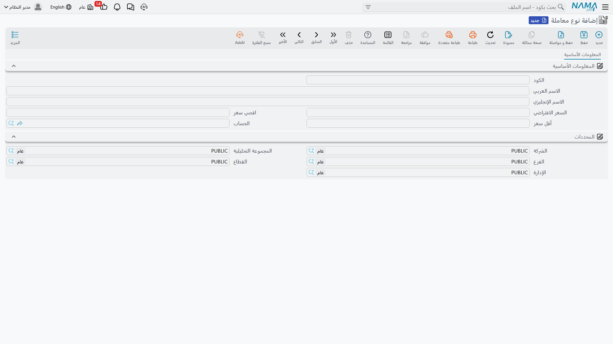
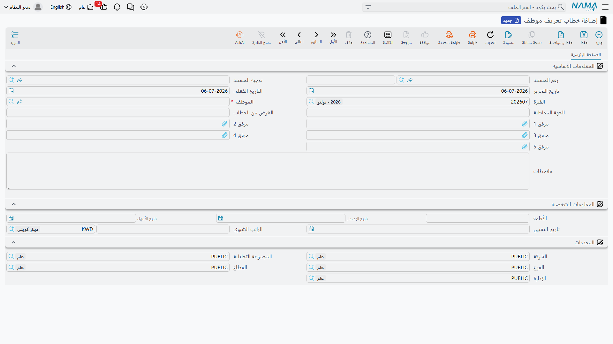
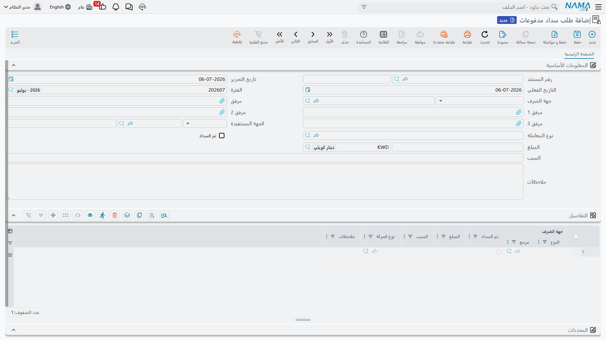

# نظرة عامة على العلاقات الحكومية (Government Relations Overview)

كل شركة توظّف عمالة وافدة في الخليج تدير مكتبًا خلفيًا صغيرًا لا يتوقّف: الإقامات تنتهي، ورخص العمل
تحتاج تجديدًا، وتأشيرات الخروج والعودة تُصدَر، وجوازات السفر تُسلَّم وتُستلَم، وتسجيلات التأمينات
الاجتماعية تُفتَح وتُغلَق، وثمّة رسمٌ حكومي مرتبط بكل خطوة من هذه الخطوات تقريبًا. ومن يتولّى ذلك —
**مندوب العلاقات الحكومية (PRO)** — يقضي يومه متنقّلًا بين بوابة العمل ومكتب الجوازات والبنك. وقائمتا
**المعاملات الإدارية** و**التأشيرات** في نما هما الوجه الإلكتروني لهذا المكتب: عائلة من المستندات
القصيرة تسجّل كل معاملة حكومية، وتتابع الرسم الذي دُفِع، ثم — بمجرّد أن تتمّ المعاملة فعليًا — تكتب
التواريخ والأرقام الجديدة على ملف الموظف الرئيسي كي ترى بقيّة الموارد البشرية ملفًّا محدّثًا.

::: info منطقة خاصّة بدول الخليج / السعودية
تحاكي عائلة العلاقات الحكومية بأكملها إجراءات العمل والهجرة السعودية / الخليجية — الإقامة، وكفالة
الكفيل، والتأمينات الاجتماعية، وتأشيرات الخروج والعودة. ولا تُستخدَم خارج هذا السياق. وتتطلّب خطابات
التعريف ومستندات تتبّع الرسوم رخصة الموارد البشرية المتقدّمة (`humanresource-advanced`)، بينما تتطلّب
إجراءات التأشيرات رخصة تأشيرات الخليج (`humanresource-gulf-visa`).
:::

## الدورة المتكرّرة

تتّبع كل مستندات هذه المنطقة تقريبًا الإيقاع الخماسي نفسه، فيجدر تعلّمه مرّة واحدة:

1. **اختر الموظف.** تفتح معاملة جديدة وتختار الموظف الذي تخصّه.
2. **تملأ المستندات الرسمية نفسها بنفسها، للقراءة فقط.** تُجلَب إقامة الموظف الحالية، ورخصة العمل،
   ورقم الجواز، وبيانات التأمينات والعمل من الملف الرئيسي وتُعرَض بوصفها سياقًا **للقراءة فقط**. أنت
   تنظر إلى الحالة الراهنة للملف لا تحرّرها هنا.
3. **سجّل الطلب.** تدوّن ما يجري تنفيذه — رقم التأشيرة الجديد، وتاريخ التمديد، ومدة التجديد، والرسم —
   وتحفظ المستند.
4. **ادفع الرسم أو احصل على الموافقة.** يُسجَّل الرسم الحكومي (ويُعلَّم بأنه مدفوع)، أو تُمنَح الموافقة
   الداخلية.
5. **خطوة تحديث تكتب الحقائق الجديدة على ملف الموظف.** بمجرّد أن تتمّ المعاملة فعليًا — بأن يُؤشَّر أنها
   **مدفوعة** / **مجدّدة** — تنسخ خطوة تحديث مخصّصة تاريخ انتهاء الإقامة الجديد، أو رقم التأشيرة، أو
   تاريخ الرخصة إلى **ملف الموظف الرئيسي**. وهذه الكتابة محروسة: لا تجري إلا حين تُعلَّم المعاملة
   مكتملة، ولن تدفع تاريخًا **أقدم** من المسجَّل بالفعل، فلا يمكن لمستند قديم أن يُرجِع إقامة الموظف إلى
   الوراء.

تذكّر طوال ذلك أن **المستند وحده هو ذو الأثر** — فالطلب الذي ما زال ينتظر الموافقة لا يغيّر شيئًا.
ولا يتحرّك ملف الموظف إلا حين تنفّذ المعاملة المكتملة كتابتها العكسية.

## كتالوج الرسوم: نوع المعاملة (Transaction Type)

بدلًا من إدخال الرسم الحكومي يدويًا في كل مرة، تُعرّف كل نوع من الرسوم مرّة واحدة بوصفه **نوع معاملة**
(`نوع معاملة`) — ملف رئيسي صغير هو في جوهره **قائمة أسعار للرسوم الحكومية**. ويثبّت كل مدخل المبلغ
المتوقَّع والحساب الذي ينتمي إليه الرسم، فلا يستطيع المندوب إلا اختيار معاملة معروفة، ويرى فريق المالية
أرقامًا متّسقة.

تجده ضمن **الموارد البشرية ← المعاملات الإدارية ← نوع معاملة**
(`الموارد البشرية > معاملات إداريه > نوع معاملة`).

| الحقل (عربي) | التسمية الإنجليزية | الغرض |
|---|---|---|
| الاسم العربي / الاسم الإنجليزي | Arabic Name / English Name | اسم المعاملة الظاهر (مثل *رسم تجديد إقامة*). |
| السعر الافتراضي | Default Price | المبلغ المقترَح تلقائيًا عند اختيار هذه المعاملة. |
| أقل سعر / اقصي سعر | Min Price / Max Price | الحدّ الأدنى والأعلى اللذان يجب أن يقع الرسم المسجَّل بينهما. |
| الحساب | Account | حساب دفتر الأستاذ الذي يُحمَّل عليه الرسم. |
| الشركة / الفرع / القطاع / الإدارة | Legal Entity / Branch / Sector / Department | المحدّدات التي تحصر أين يُستخدَم نوع المعاملة. |

## شهادة العمل: خطاب التعريف (Definition Letter)

المستند الوحيد هنا الذي لا يتعلّق بتأشيرة أو رسم هو **خطاب التعريف** (`خطاب تعريف موظف`) — شهادة
الراتب / العمل التي تصدرها الموارد البشرية عند الطلب: الخطاب الذي يأخذه الموظف إلى بنك لفتح حساب أو
طلب قرض، أو إلى سفارة لطلب تأشيرة. يجمع كل ما ينبغي أن يذكره مثل هذا الخطاب — مَن الموظف، والجهة
المخاطبة المكتوب إليها، وبيانات الإقامة، وتاريخ التعيين، والراتب الشهري — في مستند واحد قابل للطباعة.

يقع ضمن **الموارد البشرية ← لائحة العمل ← خطاب تعريف موظف**
(`الموارد البشرية > لائحة العمل > خطاب تعريف موظف`).

| الحقل (عربي) | التسمية الإنجليزية | الغرض |
|---|---|---|
| الموظف | Employee | الموظف الذي يخصّه الخطاب. |
| الجهة المخاطبة | Addressee | الجهة المكتوب إليها الخطاب (بنك، سفارة…). |
| الغرض من الخطاب | Letter Purpose | سبب إصدار الشهادة. |
| الأقامة (رقم / تاريخ الإصدار / تاريخ الأنتهاء) | Residency (Number / Issue / End) | بيانات الإقامة المستنسَخة في الخطاب. |
| تاريخ التعيين | Hiring Date | تاريخ بدء العمل. |
| الراتب الشهري (المبلغ / العملة) | Monthly Salary (Amount / Currency) | الراتب الذي تؤكّده الشهادة. |

خطاب التعريف **إفادة لا ترحيل** — فإصداره لا يمسّ دفتر الأستاذ. وهو محكوم بتوجيه المستند الخاصّ به،
لكن ذلك التوجيه يسمّي إعدادات الطباعة والترقيم لا الحسابات المحاسبية.

## تسجيل رسم: طلب سداد المدفوعات (Payment Request)

حين يجب تسجيل رسم حكومي، يحرّر المندوب **طلب سداد مدفوعات** (`طلب سداد مدفوعات`)، تجده ضمن **الموارد
البشرية ← المعاملات الإدارية ← طلب سداد مدفوعات**
(`الموارد البشرية > معاملات إداريه > طلب سداد مدفوعات`). يدوّن جهة الصرف التي ذهب إليها المال، والجهة
المستفيدة منه، وأيّ معاملة من الكتالوج كانت، والمبلغ، وهل سُدِّد — ويمكن أن يحمل عدّة سطور كهذه دفعة
واحدة في جدول **التفاصيل**، فتُسجَّل حزمة من الرسوم الحكومية الصغيرة في مستند واحد.

| الحقل (عربي) | التسمية الإنجليزية | الغرض |
|---|---|---|
| جهة الصرف | Receiving Party | الجهة التي يُصرَف إليها المبلغ. |
| الجهة المستفيدة | Beneficiary Side | الجهة المستفيدة من المعاملة (الموظف غالبًا). |
| نوع المعاملة | Transaction Type | الرسم المدفوع من قائمة أنواع المعاملات أعلاه. |
| المبلغ (المبلغ / العملة) | Amount (Amount / Currency) | مبلغ الرسم وعملته. |
| تم السداد | Is Paid | هل سُدِّد الرسم فعلًا. |
| السبب | Reason | شرح نصّي حرّ للرسم. |
| التفاصيل (جدول) | Details (grid) | عدّة سطور رسوم — لكلٍّ جهة صرفه ونوع معاملته ومبلغه ومؤشّر سداده. |

::: warning طلب السداد يسجّل الرسم — ولا يرحّل إلى دفتر الأستاذ بنفسه
هذه أهمّ نقطة محاسبية في المنطقة كلها. **طلب سداد المدفوعات يتابع ويسجّل** فقط أن رسمًا حكوميًا قد
دُفِع — الجهة المستفيدة، وجهة الصرف، والمبلغ. وهو **لا يُنتِج بنفسه قيدًا في دفتر الأستاذ.** فحفظه لا
يقيّد مدينًا ولا دائنًا؛ إذ تُدار محاسبة المال **لاحقًا** عبر سند الصرف / الدفع الفعلي من الخزينة الذي
يسوّيه. فلا تقرأ طلب سداد المدفوعات على أنه القيد المحاسبي للرسم — إنما هو سجلٌّ بأن الرسم موجود ودُفِع،
وتأتي حركة دفتر الأستاذ من مكان آخر.

وهذا **مختلف عمدًا** عن **الجزاء** الحكومي: فمستند الجزاء *يرحّل فعلًا* قيدًا حقيقيًا في دفتر الأستاذ عند
اعتماده. فإن أردت السلوك المحاسبي للغرامات والجزاءات التأديبية، راجع [الجزاءات الحكومية](./government-penalties)
— ولا تفترض أن الاثنين يتصرّفان بالطريقة نفسها.
:::

## كيف تُعالَج

كأي مستند في نما، حفظ أحد هذه المستندات فوري؛ وأيّ أثر خلفي يُرفَع كـ**طلب أعمال** (Business Request)
له **حالة معالجة** (`حالة المعالجة`) خاصّة به يمكن إعادة تنفيذها من **قائمة طلبات الأعمال** إن أخفقت.
أما مستندات تتبّع الرسوم والخطابات هنا فليس لها **أثرٌ محاسبي يُعالَج** — إنها تسجّل حقائق و(لمعاملات
التأشيرات والإقامة) تكتب التواريخ على ملف الموظف. والمال نفسه تُحاسَب عليه عملية الصرف من الخزينة التي
تسوّي الرسم، لا الطلب الذي دوّنه.

## بقيّة الأدوات

يتوزّع مكتب العلاقات الحكومية على عدّة صفحات مركّزة، تتشارك جميعها دورة اختيار الموظف ← المستندات
للقراءة فقط ← التسجيل ← الكتابة العكسية المشروحة أعلاه:

- [التأشيرات](./hr-visas) — تأشيرات الخروج والعودة (المفردة والمجمّعة)، وتمديد التأشيرات، وتأشيرات
  الخروج النهائي، وتأشيرات الزيارة العائلية، واستلام الجوازات.
- [تجديد الإقامة](./residence-renewal) — تجديد الإقامة بتفصيل رسومه، والدُّفعة التي تحصد الإقامات
  المشرفة على الانتهاء.
- [مخزون التأشيرات](./visa-pool) — مخزون الشركة من تأشيرات التوظيف: الإصدار، والتفويض لمندوب، والصرف.
- [التأمينات الاجتماعية والكفالة](./social-insurance-and-sponsorship) — تسجيل / إلغاء التأمينات
  الاجتماعية (GOSI) ونقل الكفالة.
- [الجزاءات الحكومية](./government-penalties) — لائحة المخالفات والجزاءات التأديبية — والمستند الوحيد في
  هذه المنطقة الذي **يرحّل** قيدًا حقيقيًا في دفتر الأستاذ.
