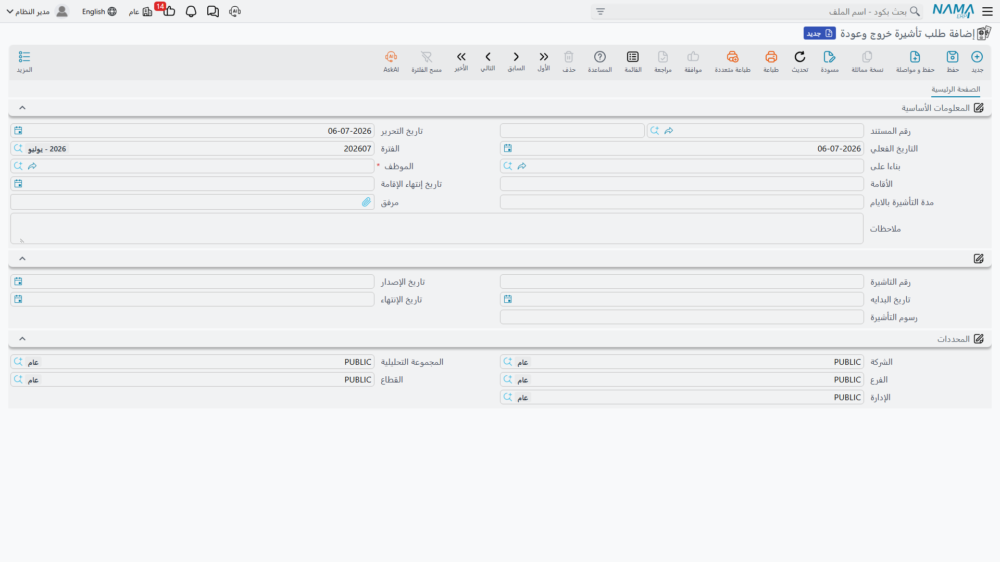
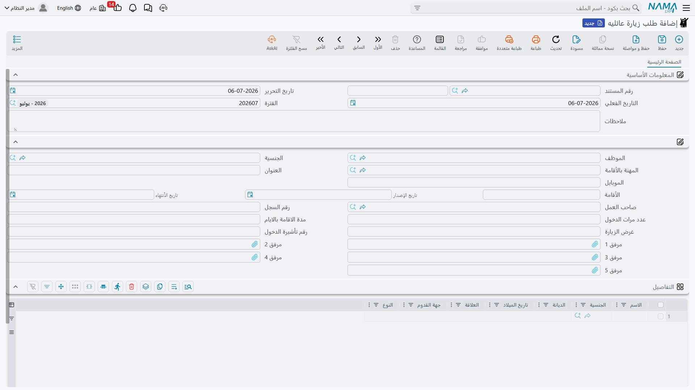

# التأشيرات (HR Visas)

لا يستطيع الموظف الوافد في الخليج أن يغادر البلاد ويعود، أو أن يستقدم أسرته للزيارة، دون تأشيرة حكومية
في كل مرة — ولكل تأشيرة من هذه تاريخ إصدار ومدّة وانتهاء يجب على الموارد البشرية تتبّعها. وقائمة
**التأشيرات** في نما هي حيث يسجّل المندوب كلًّا من هذه الإجراءات: تأشيرات الخروج والعودة كي يسافر الموظف
ويرجع، والتمديد حين تطول الرحلة، وتأشيرة الخروج النهائي حين يغادر أحدهم نهائيًا، وتأشيرة الزيارة العائلية
لاستقدام الأقارب، ومستند تسليم الجواز لصاحبه. وكلٌّ منها مستند قصير يدوّن الموظف وإقامته الحالية وتواريخ
التأشيرة نفسها.

::: info خاصّ بدول الخليج / السعودية، وجزء من دورة واحدة
هذه إجراءات هجرة سعودية / خليجية وتتطلّب رخصة تأشيرات الخليج (`humanresource-gulf-visa`). وتتشارك جميعها
دورة اختيار الموظف ← الإقامة للقراءة فقط ← التسجيل المشروحة في [نظرة عامة على العلاقات
الحكومية](./government-relations-overview) — فاقرأ تلك الصفحة أولًا إن لم تكن قد فعلت، وخاصّةً الملاحظة
بأن **المعاملة المكتملة وحدها هي التي تكتب أي شيء على ملف الموظف**.
:::

## نمط التواريخ الجاري في جميعها

قبل المستندات المفردة، تعلّم الحساب الواحد الذي تتشاركه. للتأشيرة **تاريخ بداية** و**مدّة بالأيام**؛
و**تاريخ انتهائها هو ببساطة البداية زائد المدّة**. أنت تُدخِل البداية والمدّة، ويشتقّ النظام الانتهاء —
لا تكتب تاريخ الانتهاء وتأمل أن يطابق. ولهذا يُظهِر كل مستند تأشيرة البدايةَ والمدّة والانتهاء معًا:
فالانتهاء نتيجة محسوبة من الآخرَين، وهذا التاريخ المحسوب هو ما تكتبه المعاملة المكتملة لاحقًا على سجلّ
إقامة / تأشيرة الموظف.

## تأشيرة الخروج والعودة

**طلب تأشيرة خروج وعودة** (`طلب تأشيرة خروج وعودة`) هو الأكثر اعتيادًا: يتيح للموظف مغادرة المملكة والعودة
على الإقامة نفسها. تفتحه من **الموارد البشرية ← التأشيرات ← طلب تأشيرة خروج وعودة**
(`الموارد البشرية > التأشيرات > طلب تأشيرة خروج وعودة`)، وتختار الموظف، فتُملأ الإقامة وتاريخ انتهائها
للقراءة فقط. ثم تسجّل مدّة التأشيرة، وبعد الإصدار رقمها وتواريخها.

| الحقل (عربي) | التسمية الإنجليزية | الغرض |
|---|---|---|
| الموظف | Employee | المسافر. |
| الأقامة | Residency | إقامة الموظف الحالية (سياق للقراءة فقط). |
| تاريخ إنتهاء الإقامة | Residency End Date | متى تنتهي الإقامة — لا يمكن للتأشيرة أن تتجاوزها. |
| مدة التأشيرة بالايام | Visa Period In Days | مدّة سريان الخروج والعودة. |
| رقم التاشيرة | Number Of Issued Visa | رقم التأشيرة الذي أصدرته الحكومة. |
| تاريخ الإصدار | Visa Issue Date | متى صدرت التأشيرة. |
| تاريخ البدايه | Visa Start Date | تاريخ بدء سريان التأشيرة. |
| تاريخ الإنتهاء | End Date | الانتهاء — **تاريخ البداية + المدّة بالأيام**. |
| رسوم التأشيرة | Visa Fees | الرسم الحكومي للتأشيرة. |
| بناءا على | From Document | المستند الذي وُلِّد منه هذا الطلب عند وجوده. |

### إصدار دُفعة دفعة واحدة

حين تسافر مجموعة من الموظفين معًا — طاقم كامل يعود إلى بلده في موسم — لا تفتح طلبًا لكلٍّ منهم. فـ**طلب
تأشيرة خروج وعودة مجمع** (`طلب تأشيرة خروج وعودة مجمع`)، وهو أيضًا ضمن **الموارد البشرية ← التأشيرات**،
يحمل سطرًا لكل موظف في جدول تفاصيله (الموظف، والإقامة، والمدّة، والرقم المُصدَر، والتواريخ المحسوبة نفسها)
ويُنتِج طلب خروج وعودة مستقلًّا لكل موظف. أنت تدير الدُّفعة لا السجلات المفردة المتولّدة — ونمط المستندات
المجمّعة مشروح في [طلبات ومستندات الموارد البشرية](../concepts/hr-requests-and-documents).

## تمديد تأشيرة الخروج والعودة

إن طالت الرحلة أكثر مما تسمح به التأشيرة، يدفع **طلب تمديد تاشيرة الخروج والعودة**
(`طلب تمديد تاشيرة الخروج والعودة`) الانتهاءَ إلى الأمام. يشير إلى رقم تأشيرة الخروج الأصلية وتاريخ
انتهائها الحالي، ويسجّل **تمديد إلى تاريخ** الجديد الذي تمدّه إليه.

| الحقل (عربي) | التسمية الإنجليزية | الغرض |
|---|---|---|
| الموظف | Employee | الموظف الذي تُمدّ تأشيرته. |
| الأقامة / تاريخ إنتهاء الإقامة | Residency / Residency End Date | سياق الإقامة الحالي. |
| رقم تأشيرة الخروج | Number Of Exit Visa | تأشيرة الخروج التي تُمدّ. |
| تاريخ الإنتهاء | End Date | الانتهاء الحالي للتأشيرة. |
| تمديد إلى تاريخ | Extend To Date | الانتهاء الجديد الذي يمنحه التمديد. |

## تأشيرة الخروج النهائي

حين يغادر الموظف البلاد نهائيًا — عند نهاية الخدمة — يسجّل **طلب تاشيرة خروج نهائي**
(`طلب تاشيرة خروج نهائي`) تلك المغادرة. يدوّن الإقامة وتاريخ انتهائها، والأهمّ **اخر يوم عمل**
(`اخر يوم عمل`) للموظف، الذي يربط المغادرة بمسار نهاية الخدمة.

| الحقل (عربي) | التسمية الإنجليزية | الغرض |
|---|---|---|
| الموظف | Employee | الموظف المغادر. |
| الأقامة / تاريخ إنتهاء الإقامة | Residency / Residency End Date | سياق الإقامة الحالي. |
| اخر يوم عمل | Last Work Date | آخر يوم عمل للموظف. |
| بناءا على | From Document | المستند الذي وُلِّد منه هذا الطلب عند وجوده. |

## تأشيرة الزيارة العائلية

**طلب زيارة عائليه** (`طلب زيارة عائليه`) هو التأشيرة الوحيدة التي تخصّ أشخاصًا غير الموظف: تستقدم أقارب
الموظف إلى البلاد لزيارة. فإلى جانب إقامة الموظف نفسه وجنسيته ومهنته وبيانات صاحب العمل، يحمل **جدول تفاصيل
يسرد كل فرد من أفراد الأسرة** القادمين — الاسم، والجنسية، والديانة، وتاريخ الميلاد، والعلاقة، وجهة القدوم،
والنوع — لأن تأشيرة زيارة واحدة قد تشمل أسرة كاملة.

| الحقل (عربي) | التسمية الإنجليزية | الغرض |
|---|---|---|
| الموظف | Employee | الموظف الكفيل. |
| الجنسية | Nationality | جنسية الموظف. |
| المهنة بالأقامة | Current Position | مهنة الموظف كما هي في الإقامة. |
| الأقامة (رقم / تاريخ الإصدار / تاريخ الأنتهاء) | Residency (Number / Issue / End) | بيانات إقامة الكفيل. |
| صاحب العمل | Work Owner | رب العمل / الكفيل. |
| عدد مرات الدخول | Number Of Entries | دخول مفرد أم متعدّد. |
| مدة الاقامة بالايام | Residency Period In Days | مدّة إقامة الزائرين المسموح بها. |
| غرض الزيارة | Visit Purpose | سبب زيارة الأسرة. |
| **التفاصيل** — الاسم | Name | اسم كل فرد زائر من الأسرة. |
| **التفاصيل** — الجنسية / الديانة | Nationality / Religion | جنسيته وديانته. |
| **التفاصيل** — تاريخ الميلاد | Birth date | تاريخ ميلاده. |
| **التفاصيل** — العلاقة | Relation | علاقته بالموظف. |
| **التفاصيل** — جهة القدوم / النوع | Coming Place / Gender | من أين يسافر، والنوع. |

## تسليم الجواز

كثيرًا ما تحتفظ الشركات بجوازات الموظفين لحفظها. ويوثّق **طلب استلام جواز سفر** (`طلب استلام جواز سفر`)
تسليم الجواز لصاحبه — بتدوين الموظف ورقم الجواز و**الغرض** (`الغرض`) من التسليم — فيبقى أثرٌ قابل
للمراجعة عمّن أخذ جوازه ولماذا.

| الحقل (عربي) | التسمية الإنجليزية | الغرض |
|---|---|---|
| الموظف | Employee | صاحب الجواز. |
| الأقامة | Residency | سياق إقامة الموظف. |
| رقم جواز السفر | Passport Number | الجواز المُسلَّم. |
| الغرض | Purpose | سبب تسليم الجواز. |

## كيف تُعالَج

لا يرحّل أيٌّ من مستندات التأشيرات هذه إلى دفتر الأستاذ — فهي سجلات وحواملُ تواريخ لا قيود محاسبية. وحفظ
أحدها فوري، وأيّ أثر خلفي (كتابة رقم التأشيرة الجديد وتواريخها على الموظف بمجرّد اكتمال المعاملة) يجري
كـ**طلب أعمال** (Business Request) له **حالة معالجة** (`حالة المعالجة`) خاصّة به، يمكن إعادة تنفيذها من
**قائمة طلبات الأعمال** إن أخفقت. وأيّ رسم حكومي مرتبط بتأشيرة يُسجَّل ويُسوَّى بالطريقة التي تُسوَّى بها
كل الرسوم الحكومية — راجع ملاحظة طلب سداد المدفوعات في [نظرة عامة على العلاقات
الحكومية](./government-relations-overview).

## صفحات ذات صلة

- [نظرة عامة على العلاقات الحكومية](./government-relations-overview) — دورة اختيار الموظف ← التسجيل ←
  الكتابة العكسية المشتركة، وكتالوج الرسوم الحكومية، وملاحظة محاسبة طلب السداد بالغة الأهمية.
