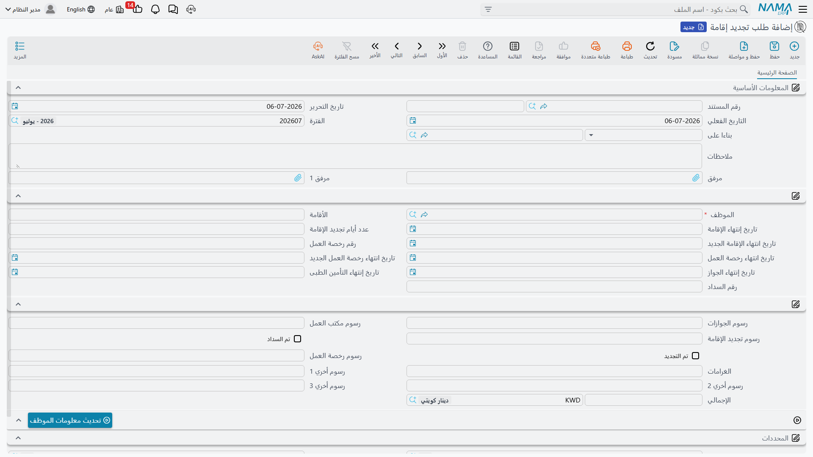
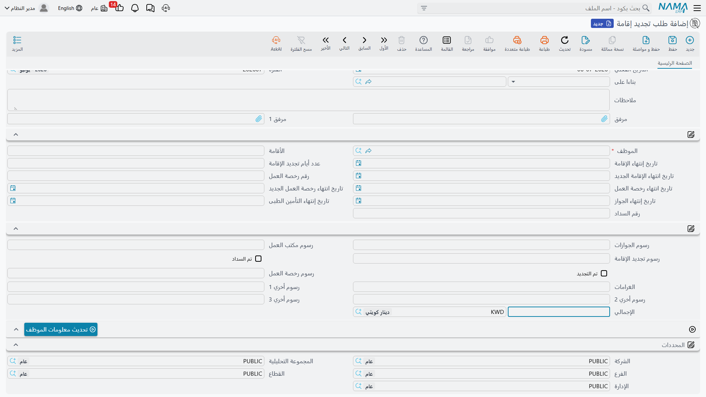

# تجديد الإقامة (Residence Renewal)

من بين كل المواعيد التي يتابعها مكتب العلاقات الحكومية، الإقامة هي الموعد الذي لا يحتمل التأخير —
فانتهاء الإقامة يوقف الموظف عن العمل، وعن السفر، بل وعن فتح حساب بنكي. و**طلب تجديد إقامة** هو
المستند المُعَدّ لهذه المهمة المتكررة تحديدًا: تختار الموظف، وتنظر إلى تواريخ الإقامة ورخصة العمل
كما هي الآن، وتفصّل كل رسم كلّف التجديد، وتؤشّر أنه سُدِّد وجُدِّد، ثم تكتب التواريخ الجديدة على ملف
الموظف. وإلى جانبه، يقوم **طلب تجديد إقامة مجمع** بالمهمة نفسها لدُفعة كاملة من الموظفين دفعة واحدة
— بل ويستطيع أن يبحث بنفسه عمّن أوشكت إقامته على الانتهاء.

::: info خاصّ بدول الخليج / السعودية، وجزء من دورة واحدة
هذا إجراء هجرة سعودي / خليجي ويتطلّب رخصة تأشيرات الخليج (`humanresource-gulf-visa`).
يتّبع دورة اختيار الموظف ← المستندات للقراءة فقط ← التسجيل ← الكتابة العكسية المشروحة في [نظرة عامة
على العلاقات الحكومية](./government-relations-overview) — فاقرأ تلك الصفحة أولًا إن لم تكن قد
فعلت، وخاصّةً الملاحظة بأن **المعاملة المكتملة وحدها هي التي تكتب أي شيء على ملف الموظف**.
:::

## اختيار الموظف يملأ كل شيء، للقراءة فقط

افتح طلب تجديد إقامة جديدًا من **الموارد البشرية ← معاملات إداريه ← طلب تجديد إقامة** واختر
**الموظف**. بمجرّد اختياره، تُنسَخ إليك الحقائق الحالية من ملف ذلك الموظف — رقم الإقامة وتاريخ
انتهائها، ورقم رخصة العمل وتاريخ انتهائها، وتاريخ انتهاء التأمين الطبي، وتاريخ انتهاء الجواز. ولا
يمكن الكتابة فوق أيٍّ من هذه الحقول المنسوخة: فهي مقفلة كي تنظر دائمًا إلى الحالة الراهنة الحقيقية
لملف الموظف لا أن تخمّنها.

| الحقل (عربي) | التسمية الإنجليزية | الغرض |
|---|---|---|
| الموظف | Employee | الموظف الذي تُجدَّد إقامته. |
| الأقامة | Residency | رقم إقامة الموظف الحالي (للقراءة فقط). |
| تاريخ إنتهاء الإقامة | Residency End Date | تاريخ الانتهاء الحالي، منسوخ من الموظف (للقراءة فقط). |
| رقم رخصة العمل / تاريخ انتهاء رخصة العمل | Work License Number / Work License End Date | رخصة العمل الحالية وتاريخ انتهائها (للقراءة فقط). |
| تاريخ إنتهاء الجواز | Passport End Date | تاريخ انتهاء جواز الموظف (للقراءة فقط). |
| تاريخ إنتهاء التأمين الطبى | Health Insurance End Date | تاريخ انتهاء التأمين الطبي للموظف (للقراءة فقط). |
| رقم السداد | Payment Number | مرجع لكيفية سداد الرسم الحكومي. |

## مدّة التجديد وتاريخ الانتهاء الجديد

بدلًا من كتابة تاريخ الانتهاء الجديد يدويًا، تخبر نما بالمدّة التي يغطّيها التجديد: تملأ **عدد أيام
تجديد الإقامة** (`عدد أيام تجديد الإقامة`) فتضيف نما هذا العدد من الأيام إلى **تاريخ إنتهاء
الإقامة** الحالي لتحسب لك **تاريخ انتهاء الإقامة الجديد** (`تاريخ انتهاء الإقامة الجديد`). أما رخصة
العمل فلا تتبع الحساب التلقائي نفسه — لأن مدّة تجديدها قد تسير بدورة مختلفة — لذا يُكتَب **تاريخ
انتهاء رخصة العمل الجديد** (`تاريخ انتهاء رخصة العمل الجديد`) مباشرةً بمجرّد صدور الرخصة الجديدة.

## تفصيل الرسوم الذي يُجمَع تلقائيًا في الإجمالي

نادرًا ما يكون تجديد الإقامة رسمًا حكوميًا واحدًا — فرسوم مكتب الجوازات، ورسم مكتب العمل، ورسم
التجديد نفسه، ورسم رخصة العمل، وأحيانًا غرامة أو أكثر، كلّها تقع على المعاملة نفسها. وبدلًا من جمعها
يدويًا، تُدخِل كل رسم في حقله الخاص وتحسب نما **الإجمالي** (`الإجمالي`) الذي يُعاد حسابه فور تغيّر
أيٍّ منها.

| الحقل (عربي) | التسمية الإنجليزية | الغرض |
|---|---|---|
| رسوم الجوازات | Passports Fees | رسم مكتب الجوازات. |
| رسوم مكتب العمل | labour Office Fees | رسم مكتب العمل. |
| رسوم تجديد الإقامة | Residence Renew Fees | رسم تجديد الإقامة نفسه. |
| رسوم رخصة العمل | Work License Fees | رسم تجديد رخصة العمل. |
| الغرامات | Fines | أيّ غرامة تأخير أو غيرها مضمَّنة في هذه المعاملة. |
| رسوم أخري 1 / 2 / 3 | Other Fees 1 / 2 / 3 | أيّ رسوم أخرى لا تندرج تحت الفئات أعلاه. |
| الإجمالي (الإجمالي / العملة) | Total (Total / Currency) | المجموع الحيّ لكل حقول الرسوم أعلاه، بعملته. |
| تم السداد | Is paid | هل سُدِّد إجمالي الرسم فعلًا. |
| تم التجديد | Is Renewed | هل تمّت الإقامة تجديدها فعلًا لدى الجهة الحكومية. |

## كتابة التواريخ الجديدة: تحديث معلومات الموظف

تعبئة التواريخ الجديدة في الطلب لا تغيّر بمفردها شيئًا في ملف الموظف — يحدث ذلك فقط حين تضغط
**تحديث معلومات الموظف** (`تحديث معلومات الموظف`)، والزرّ يفرض بيت القصيد من هذا المستند بأكمله:

- يرفض التنفيذ إلا حين يكون كلٌّ من **تم السداد** و**تم التجديد** مؤشَّرًا — فتجديد لم يتمّ فعليًا لا
  يمكن أن يحدّث الملف الرئيسي.
- يتطلّب تعبئة واحد على الأقلّ من **تاريخ انتهاء الإقامة الجديد** أو **تاريخ انتهاء رخصة العمل
  الجديد** — إذ يجب أن يكون هناك ما يُكتَب فعلًا.
- لن يدفع تاريخ إقامة أو رخصة عمل جديدًا **أقدم** من التاريخ المسجَّل بالفعل للموظف — فلا يمكن لطلب
  قديم أو خارج الترتيب أن يُرجِع إقامة الموظف أو رخصته إلى الوراء.

بمجرّد اجتياز هذه الشروط، يُحدَّث تاريخ انتهاء الإقامة وتاريخ انتهاء رخصة العمل على **ملف الموظف
الرئيسي** في خطوة واحدة، فترى بقيّة الموارد البشرية التواريخ المجدَّدة فورًا.

## تجديد دُفعة كاملة: طلب تجديد إقامة مجمع

حين يحلّ موسم التجديد وتنتهي عشرات الإقامات معًا، لا تفتح طلبًا لكلّ موظف. فـ**طلب تجديد إقامة
مجمع**، الموجود أيضًا ضمن **الموارد البشرية ← معاملات إداريه**، يحمل سطرًا لكل موظف في جدول
**التفاصيل** — نفس حقول الموظف والإقامة وتفصيل الرسوم والإجمالي الموضّحة أعلاه، سطرًا لكل موظف —
وزرّه **تحديث معلومات الموظفين** ينفّذ الشروط الثلاثة نفسها (السداد، والتجديد، وعدم الرجوع للخلف) على
كل سطر قبل تحديث ملف كل موظف. أنت تدير الدُّفعة لا الطلبات المفردة التي تمثّلها — ونمط المستندات
المجمّعة عمومًا مشروح في [طلبات ومستندات الموارد البشرية](../concepts/hr-requests-and-documents).

### ترك الدُّفعة تعثر على الموظفين بنفسها

بدلًا من إضافة الموظفين إلى الدُّفعة يدويًا، اضغط **تجميع الموظفين** (`تجميع الموظفين`) وستبحث نما
عنهم بنفسها. اضبط **تجميع الإقامات التي ستنتهي خلال (أيام)** (`تجميع الإقامات التي ستنتهي خلال
(أيام)`) فتسحب الدُّفعة كل موظف تنتهي إقامته خلال هذا العدد من الأيام من اليوم، ويحدّ **أقصى عدد
موظفين يتم تجميعه** (`أقصى عدد موظفين يتم تجميعه`) كم سطرًا ستضيفه دفعة واحدة. ويمكن أن يسرد توجيه
المستند الخاصّ بالدُّفعة أيضًا جنسيات يجب تخطّيها دائمًا في هذا الحصاد التلقائي، فيمكن تجديد شريحة
معيّنة من الموظفين عبر مسار منفصل عند الحاجة.

| الحقل (عربي) | التسمية الإنجليزية | الغرض |
|---|---|---|
| تجميع الإقامات التي ستنتهي خلال (أيام) | Collect Only Residencies Expiring In (Days) | لا تسحب إلا الموظفين الذين تنتهي إقامتهم خلال هذا العدد من الأيام. |
| أقصى عدد موظفين يتم تجميعه | Max Employees To Collect | الحدّ الأقصى لعدد الموظفين الذي يضيفه التجميع. |

## كيف تُعالَج

كأي مستند هنا، لا يملك طلب تجديد الإقامة **أثرًا محاسبيًا** — فهو سجلّ وحاملُ تواريخ لا قيدٌ
محاسبي؛ والرسم الحكومي الذي يتابعه يُسوَّى بالطريقة التي تُسوَّى بها كل الرسوم الحكومية (راجع ملاحظة
محاسبة طلب السداد في [نظرة عامة على العلاقات الحكومية](./government-relations-overview)). وحفظ
المستند فوري؛ والشيء الوحيد الذي يمتدّ ليغيّر شيئًا آخر في النظام هو إجراء **تحديث معلومات الموظف**،
الذي يُعاد تنفيذه كأي طلب أعمال آخر إن أخفق — من **قائمة طلبات الأعمال**.

## صفحات ذات صلة

- [نظرة عامة على العلاقات الحكومية](./government-relations-overview) — دورة اختيار الموظف ←
  التسجيل ← الكتابة العكسية المشتركة، وملاحظة محاسبة الرسوم الحكومية.
- [التأشيرات](./hr-visas) — إجراءات التأشيرات الشقيقة التي تتشارك نمط السياق للقراءة فقط نفسه.
