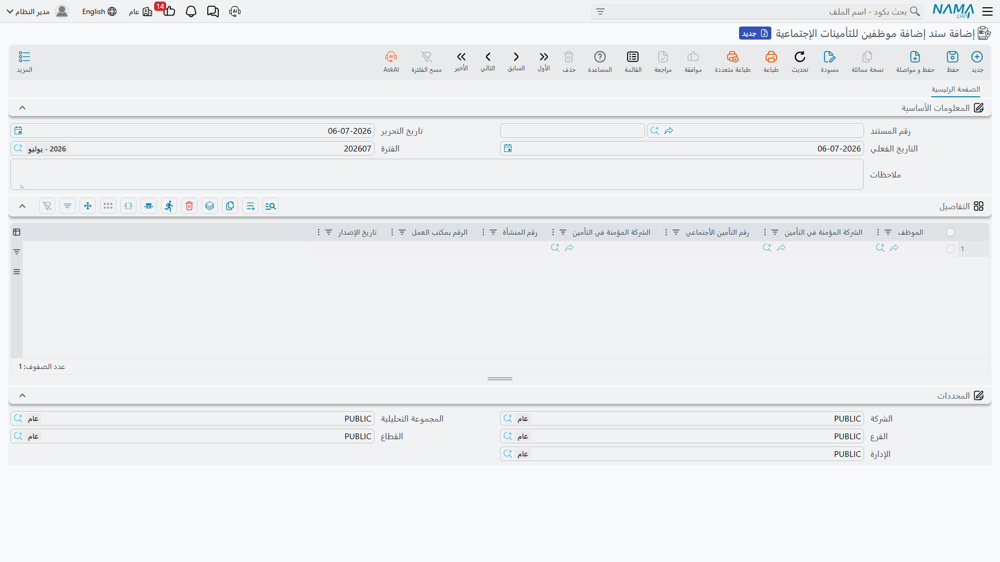
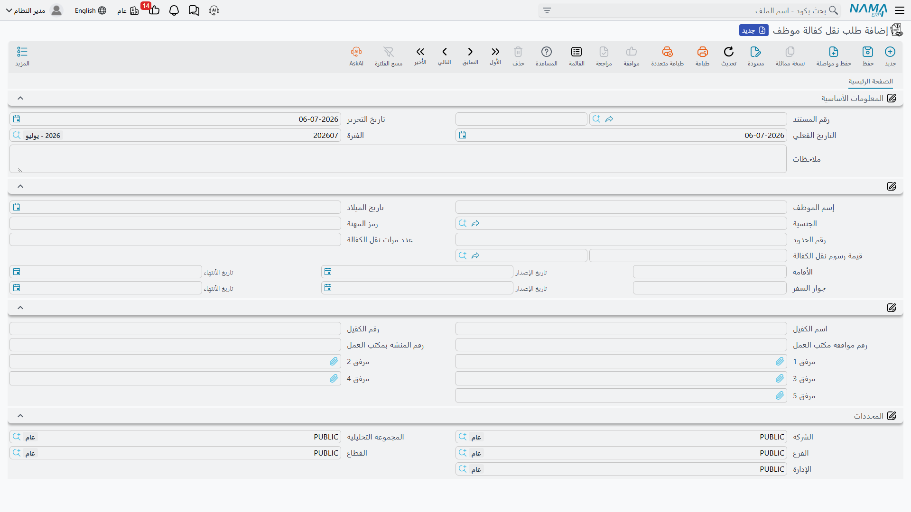

# التأمينات الاجتماعية والكفالة

من أكثر التعاملات الحكومية حساسية بالنسبة للعمالة الوافدة تسجيل الموظفين في **التأمينات الاجتماعية
(GOSI)** وعلاقة **الكفالة**. فعند التحاق موظف جديد يجب إضافته إلى ملف التأمينات لدى صاحب العمل، وعند
تركه للعمل يجب حذفه منه. وعند انتقال الموظف من صاحب عمل إلى آخر يجب نقل الكفالة التي تربط إقامته بالشركة
نقلاً رسمياً. ويعالج نظام نما هذه الحالات الثلاث عبر مستندات تسجيل مختصرة تسير على نفس إيقاع مكتب العلاقات
الحكومية: اختيار الموظف ← تسجيل المعاملة ← تحديث بيانات الموظف.

::: info منطقة خاصة بدول الخليج / السعودية
كلٌّ من سجل التأمينات الاجتماعية ونظام الكفالة من المفاهيم العمالية الخليجية / السعودية، ولذلك فإن هذه
الصفحة لا تُستعمل خارج هذا السياق. تحتاج مستندات التأمين الاجتماعي إلى رخصة التأمين الاجتماعي الخليجي
(`humanresource-gulf-social-insurance`)، وتحتاج مستندات نقل الكفالة إلى رخصة تأشيرات الخليج
(`humanresource-gulf-visa`).
:::

للاطلاع على دورة مكتب العلاقات الحكومية المشتركة وكتالوج الرسوم الذي تستند إليه هذه المستندات، ابدأ من
[نظرة عامة على العلاقات الحكومية](./government-relations-overview).

## التأمينات الاجتماعية: إضافة الموظفين وحذفهم

التسجيل في المؤسسة العامة للتأمينات الاجتماعية (GOSI) عملية ذات وجهين — مستند **لإضافة** الموظفين، ومستند
مقابل **لحذفهم** — وكلاهما مبني على **السطور** عن قصد: فالمستند الواحد يمكن أن يسجّل (أو يلغي تسجيل) دفعة
كاملة من الموظفين مرة واحدة، وهو ما يحدث عادةً بعد موجة تعيينات.

### سند إضافة موظفين للتأمينات الإجتماعية (Employee Social Insurance Add)

يسجّل مستند **سند إضافة موظفين للتأمينات الإجتماعية** (Employee Social Insurance Add) إدخال موظف أو أكثر
في ملف التأمينات لدى صاحب العمل. ويحمل كل سطر اسم الموظف والشركة المؤمَّن لديها والأرقام التأمينية الواردة
من التأمينات.

تجده تحت **الموارد البشرية ← التأمين الأجتماعي ← سند إضافة موظفين للتأمينات الإجتماعية**
(Human Resources > Social Insurance > Employee Social Insurance Add).

| الحقل (عربي) | Field (English) | الغرض |
|---|---|---|
| تاريخ التحرير | Issue Date | تاريخ تحرير المستند. |
| التاريخ الفعلي | Value Date | التاريخ الفعلي للتسجيل. |
| الموظف | Employee | الموظف المضاف إلى سجل التأمينات (سطر لكل موظف). |
| الشركة المؤمنة في التأمين | Ensured Legal Entity | الشركة المؤمَّن الموظف لديها. |
| رقم التأمين الأجتماعي | Social Insurance Number | رقم التأمينات الصادر للموظف. |
| رقم المنشأة | Organization id | رقم منشأة صاحب العمل لدى التأمينات. |
| الرقم بمكتب العمل | Labor id | رقم الموظف بمكتب العمل. |
| تاريخ الإصدار | Issue | تاريخ إصدار تسجيل التأمين الاجتماعي. |

### سند حذف موظفين من التأمينات الإجتماعية (Employee Social Insurance Remove)

مستند **سند حذف موظفين من التأمينات الإجتماعية** (Employee Social Insurance Remove) هو الوجه المقابل
للحذف — يُستعمل عند ترك الموظفين للعمل أو نقلهم خارج ملف التأمين. وتحمل سطوره نفس أعمدة الموظف ورقم التأمين،
إضافةً إلى **تاريخ الأنتهاء** (End at) الذي يُغلق التسجيل.

تجده تحت **الموارد البشرية ← التأمين الأجتماعي ← سند حذف موظفين من التأمينات الإجتماعية**
(Human Resources > Social Insurance > Employee Social Insurance Remove).

## نقل الكفالة (Kafala)

في ظل نظام الكفالة تكون إقامة الوافد مرتبطة بكفيل. ونقل الموظف من صاحب عمل إلى آخر — أو استقبال عامل تتولى
شركتك كفالته — معاملة رسمية لدى مكتب العمل، ويُسجَّل ذلك في مستند **طلب نقل كفالة موظف**
(Sponsorship Transfer Document).

ولأنه معاملة مع الجهات الرسمية، يجمع المستند على شاشة واحدة كل ما يحتاجه ملف النقل: هوية الموظف وجنسيته،
وبيانات الإقامة وجواز السفر، وعدد مرات نقل الكفالة سابقاً (رقم يهتم به مكتب العمل)، ورسوم النقل، وبيانات
الكفيل المستقبِل — إضافةً إلى خانات مرفقات للمستندات المؤيِّدة.

تجده تحت **الموارد البشرية ← معاملات إداريه ← طلب نقل كفالة موظف**
(Human Resources > Administrative Transactions > Sponsorship Transfer Document).

| الحقل (عربي) | Field (English) | الغرض |
|---|---|---|
| إسم الموظف | Employee Name | الموظف الذي تُنقل كفالته. |
| تاريخ الميلاد / الجنسية | Birth date / Nationality | بيانات الهوية لملف النقل. |
| رمز المهنة | Career Code | رمز المهنة المسجَّل في ملف مكتب العمل. |
| رقم الحدود | Boundary Number | رقم الحدود / الدخول. |
| عدد مرات نقل الكفالة | Sponsorship Transfer Count | عدد المرات التي نُقلت فيها هذه الكفالة سابقاً. |
| قيمة رسوم نقل الكفالة | Sponsorship Transfer Cost | الرسم الحكومي للنقل (المبلغ والعملة). |
| الأقامة (رقم / تاريخ الإصدار / تاريخ الأنتهاء) | Residency (Number / Issue / End at) | بيانات الإقامة المنسوخة على المستند. |
| جواز السفر (رقم / تاريخ الإصدار / تاريخ الأنتهاء) | Passport (Number / Issue / End at) | بيانات جواز السفر للنقل. |
| اسم الكفيل / رقم الكفيل | sponsor Name / Sponsor Number | اسم الكفيل الجديد ورقمه. |
| رقم موافقة مكتب العمل | Labor Acceptance Number | رقم موافقة مكتب العمل على النقل. |
| رقم المنشأة بمكتب العمل | labor Facility Number | رقم منشأة صاحب العمل بمكتب العمل. |
| مرفق 1…5 | Attachment 1…5 | صور المستندات المؤيِّدة. |

### نقل عدة موظفين دفعة واحدة

عند نقل مجموعة من العمال معاً، يجمعهم مستند **طلب نقل كفالة مجمع** (Aggregated Sponsorship Transfer
Document) في جدول واحد — كل سطر يمثّل نقل كفالة موظف — ويُنشئ عند الحفظ مستند نقل كفالة عادياً لكل سطر.
وكما هو الحال مع كل مستند مجمع في نما، تدير الدفعة بتعديل المستند المجمع لا المستندات المفردة التي ولّدها؛
راجع [طلبات ومستندات ومستندات مجمعة](../concepts/hr-requests-and-documents) لفهم هذه العلاقة ذات
المستويين. وتجده على بُعد خطوة واحدة في القائمة، تحت **الموارد البشرية ← معاملات إداريه ← طلب نقل كفالة
مجمع** (Human Resources > Administrative Transactions > Aggregated Sponsorship Transfer Document).

## كيف تتم المعالجة

حفظ أي من هذه المستندات فوري؛ وكما في كل مستندات نما، يُرفع أي عمل لاحق على هيئة **طلب أعمال**
(Business Request) له **حالة المعالجة** الخاصة به، ويمكن إعادة محاولته من **قائمة طلبات الأعمال** إذا فشل.
ولا يُرحِّل أيٌّ من مستندات هذه الصفحة إلى دفتر الأستاذ العام — فهي **تسجّل** واقعة حكومية (إضافة أو حذف أو
نقل كفالة)، وتغذّي عند اللزوم بيانات مستندات الموظف الرسمية. أما أي رسم مرتبط بنقل الكفالة فيُتابَع ويُسدَّد
بنفس أسلوب أي رسم حكومي آخر: عبر مسار تسجيل الرسوم الموضّح في
[نظرة عامة على العلاقات الحكومية](./government-relations-overview)، لا عبر أن تقوم هذه المستندات بأي قيد
مدين أو دائن بنفسها.
