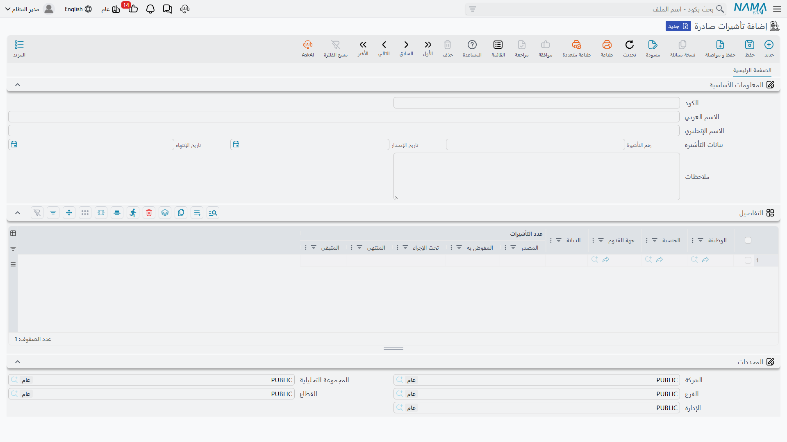
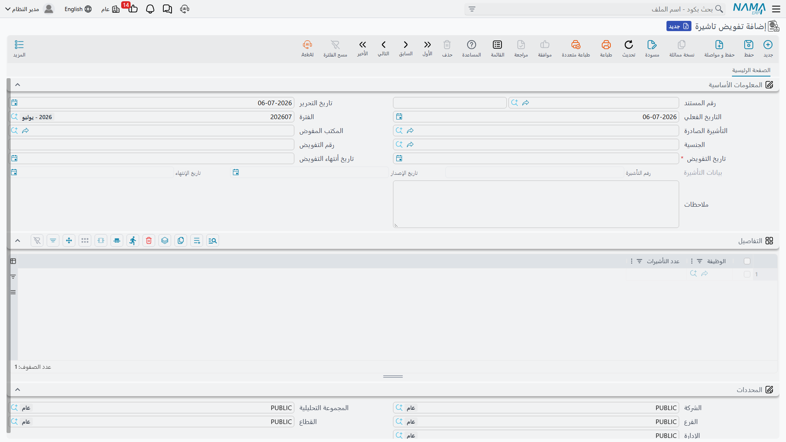

# مجمع التأشيرات (Visa Pool)

قبل أن يستطيع أيّ مُستقدَم من الخارج السفر، تحتاج الشركة إلى تأشيرة عمل مخصّصة له — وفي التوظيف
السعودي / الخليجي، لا تُطلَب هذه التأشيرات واحدة واحدة. فالشركة تُمنَح **مجمعًا** من تأشيرات
الاستقدام حسب الجنسية والوظيفة وحصص أخرى، ومهمّة مكتب العلاقات الحكومية هي إدارة هذا المجمع كقطعة
صغيرة من المخزون: معرفة كم تأشيرة من كل نوع لا تزال في المخزون، وتفويض جزء منها لمكتب مندوب ليعمل به،
وتسجيل كل تأشيرة أُنفِقت فعليًا على تأشيرة حكومية حقيقية. ثلاثة مستندات تُصوِّر هذا المسار كاملًا:
**تأشيرات صادرة** (المخزون)، و**تفويض تأشيرة** (تفويض جزء منه لمكتب)، و**منح تأشيرة** (إنفاق تفويض
على تأشيرة فعلية).

::: info خاصّ بدول الخليج / السعودية
هذا إجراء استقدام سعودي / خليجي ويتطلّب رخصة تأشيرات الخليج (`humanresource-gulf-visa`). وخلافًا
لبقيّة مكتب العلاقات الحكومية، لا تخصّ هذه المستندات الثلاثة أوراق موظف موجود بالفعل — بل تتابع مخزون
الشركة الخاصّ من تأشيرات الاستقدام قبل أن يُوظَّف أحد. وتجدها ضمن **الموارد البشرية ← الاستقدام**، لا
**المعاملات الإدارية**.
:::

## المخزون: تأشيرات صادرة

**تأشيرات صادرة** (`تأشيرات صادرة`) هو حيث تُسجَّل الحصّة الممنوحة للشركة. يحمل في رأسه رقم التأشيرة
الحكومية نفسها وتاريخ إصدارها وانتهائها، وجدول **التفاصيل** بسطر لكل توليفة من **الوظيفة**
و**الجنسية** و**الديانة** و**جهة القدوم** — لأن المنحة الحكومية نادرًا ما تكون رقمًا واحدًا مسطّحًا،
بل تُقسَّم عادةً بهذه الفئات بالذات.

| الحقل (عربي) | التسمية الإنجليزية | الغرض |
|---|---|---|
| الاسم العربي / الاسم الإنجليزي | Arabic Name / English Name | الاسم الظاهر للمنحة. |
| رقم التأشيرة / تاريخ الإصدار / تاريخ الإنتهاء | Visa Number / Visa Issue Date / End Date | رقم المنحة الحكومية نفسها ومدّة صلاحيتها. |
| **التفاصيل** — الوظيفة / الجنسية | job / Nationality | الوظيفة والجنسية التي يخصّها هذا السطر من الحصّة. |
| **التفاصيل** — جهة القدوم | Arrival Region | من أين يُتوقَّع قدوم هؤلاء المستقدَمين. |
| **التفاصيل** — الديانة | Religion | الديانة التي يخصّها هذا السطر من الحصّة. |
| **التفاصيل** — عدد التأشيرات\|المصدر | Visas\|Issued Number | كم تأشيرة مُنِحَت لهذه التوليفة من الوظيفة والجنسية. |
| **التفاصيل** — عدد التأشيرات\|المفوض به | Visas\|Under Delegation | كم منها مُسلَّم حاليًا لمكتب مندوب ولم يُنفَق بعد. |
| **التفاصيل** — عدد التأشيرات\|تحت الإجراء | Visas\|Under Procedure | كم منها أُنفِق على تأشيرة فعلية لا تزال قيد الإجراء. |
| **التفاصيل** — عدد التأشيرات\|المنتهى | Visas\|Finished | كم منها أكمل رحلته (وصل المُستقدَم فعلًا). |
| **التفاصيل** — عدد التأشيرات\|المتبقي | Visas\|Remaining | ما تبقّى متاحًا للتفويض — المصدر ناقص المفوض به وتحت الإجراء والمنتهى. |

لا تُدخِل يدويًا سوى **المصدر**؛ أما **المفوض به**، و**تحت الإجراء**، و**المنتهى**، و**المتبقي** فتتحرّك
بنفسها كلّما حُفِظت واعتُمدت مستندات التفويض والمنح على هذا السطر — فلا تحرّرها مباشرةً أبدًا.

## الخطوة الأولى — التفويض لمكتب: تفويض تأشيرة

بمجرّد وجود الحصّة، يسلِّم **تفويض تأشيرة** (`تفويض تاشيرة`) جزءًا من تأشيرات جنسية واحدة لمكتب
مندوب معيّن ليعمل به — أنت لا تُنفِق تأشيرة بعد، بل تحجزها فقط لذلك المكتب. تختار منحة **التأشيرة
الصادرة** و**الجنسية** المفوَّضة مرّة واحدة في الرأس، ثم تفصّل الكمّية حسب الوظيفة في جدول
**التفاصيل**.

| الحقل (عربي) | التسمية الإنجليزية | الغرض |
|---|---|---|
| التأشيرة الصادرة | Issued Visa | منحة المخزون التي يسحب منها هذا التفويض. |
| المكتب المفوض | Authorized Office | مكتب المندوب المُفوَّضة إليه التأشيرات. |
| الجنسية | Nationality | الجنسية المفوَّضة (جنسية واحدة لكل تفويض). |
| رقم التفويض | Delegation Number | الرقم المرجعي الحكومي للتفويض. |
| تاريخ التفويض / تاريخ أنتهاء التفويض | Delegation Start Date / Delegation End Date | مدّة صلاحية التفويض نفسه (يُفترَض افتراضيًا من تاريخ انتهاء المنحة نفسها). |
| **التفاصيل** — الوظيفة | job | الوظيفة التي تخصّها هذه الكمّية المفوَّضة. |
| **التفاصيل** — عدد التأشيرات | Number Of Visas | كم تأشيرة من تلك الوظيفة والجنسية تُفوَّض. |

حفظ التفويض واعتماده ينقل تلك الكمّية من **المتبقي** إلى **المفوض به** على سطر تأشيرات صادرة
المطابق — وتتحقّق نما من وجود التوليفة نفسها من الوظيفة والجنسية في المخزون، وترفض السطر إن كان
الرصيد المتبقي لا يكفيه.

## الخطوة الثانية — إنفاقها: منح تأشيرة

**منح تأشيرة** (`منح تأشيرة`) هو حيث يُنفَق تفويضٌ فعليًا على تأشيرة حقيقية: يكون المكتب قد ذهب إلى
الجهات الحكومية وحصل على تأشيرة مرقّمة بتواريخ صلاحية خاصّة بها لواحد أو أكثر ممّن فُوِّض له. تشير إلى
**التفويض** الذي يُنفَق منه (ونفس منحة **التأشيرة الصادرة**)، ويسجّل كل سطر في **التفاصيل** التأشيرة
التي مُنِحَت فعليًا.

| الحقل (عربي) | التسمية الإنجليزية | الغرض |
|---|---|---|
| التفويض | Delegation | التفويض الذي يُنفَق منه هذا المنح. |
| التأشيرة الصادرة | Issued Visa | منحة المخزون خلفه. |
| المكتب المفوض | Authorized Office | المكتب الذي يتولّى منح التأشيرة. |
| **التفاصيل** — الجنسية / الوظيفة | Nationality / job | سطر الحصّة الذي تُسحَب منه هذه التأشيرة. |
| **التفاصيل** — رقم التأشيرة | Visa Number | رقم التأشيرة الحكومية الفعلي الذي تمّ الحصول عليه. |
| **التفاصيل** — من تاريخ / إلى تاريخ | From Date / To Date | مدّة صلاحية التأشيرة نفسها. |
| **التفاصيل** — مدة الصلاحية | Expiry Period | مدّة سريان تلك الصلاحية. |
| **التفاصيل** — عدد التأشيرات | Number Of Visas | كم تأشيرة يغطّيها هذا السطر. |

اعتماد منح التأشيرة ينقل الكمّية من **المفوض به** إلى **تحت الإجراء** على سطر تأشيرات صادرة — فقد
توقّفت التأشيرة عن كونها مجرّد تخصيص وأصبحت تأشيرة حقيقية مرقّمة قيد الإجراء. وخطوة لاحقة في مسار
الاستقدام (حين يصل المُستقدَم فعلًا) هي التي تنقل التأشيرة أخيرًا من **تحت الإجراء** إلى **المنتهى**،
فتُغلَق تلك الوحدة من المجمع نهائيًا.

## كيف تُعالَج

لا يرحّل أيٌّ من المستندات الثلاثة في هذا المسار إلى دفتر الأستاذ — فهي تنقل كمّيات بين عدّادات سطر
تأشيرات صادرة، لا أموالًا. والحفظ والاعتماد فوريان، وإلغاء أو تعديل تفويض أو منح يعكس حركة كمّيته على
السطر نفسه، فتظلّ العدّادات تعكس دائمًا ما هو مخصَّص أو قيد الإجراء أو منتهٍ بالفعل.

## صفحات ذات صلة

- [نظرة عامة على العلاقات الحكومية](./government-relations-overview) — مكتب العلاقات الحكومية
  المشترك الذي يغذّيه هذا المجمع بمجرّد أن يصبح المُستقدَم على كشف الرواتب.
- [التأشيرات](./hr-visas) — إجراءات التأشيرات للموظفين المسجَّلين بالفعل في سجلّات الشركة، خلافًا
  لمجمع التأشيرات هذا الذي يسبق التوظيف.
