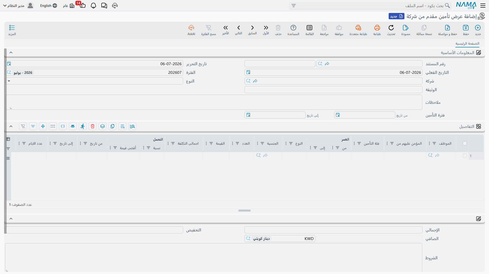
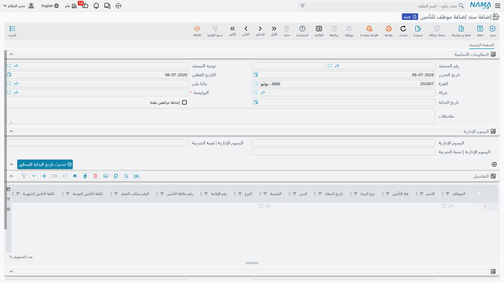
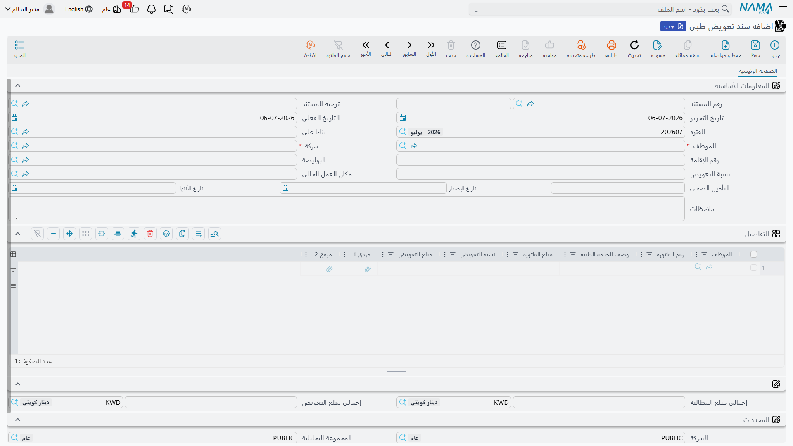
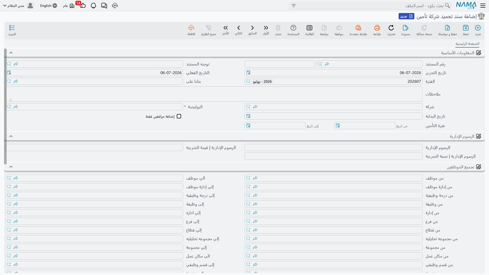

# التأمين الصحي للموظف (Employee Health Insurance)

في دول الخليج، التأمين الصحي الخاص ليس مجرد إجراء ورقي اختياري — بل التزام تفرضه الجهات الحكومية،
وتغطية فئة خاطئة، أو نسيان إضافة زوج/زوجة، أو ترك بوليصة تنتهي دون تجديد، كلّها أمور تُنشئ مسؤولية
حقيقية على الشركة. منطقة التأمين الصحي في نما تتابع تأمين الموظف من اليوم الذي تختار فيه الشركة عرض
تأمين، إلى اليوم الذي يُحذَف فيه هذا الموظف نهائيًا منه: تُعِدّ العرض الذي قدّمته شركة التأمين، وتُضيف
الموظفين (وأسرهم) إليه، وتُقدِّم مطالبات طبية عليه، وتُرقّي أحدهم إلى فئة تغطية أعلى في منتصف المدة،
وتُحوِّل دُفعة من الموظفين إلى شركة تأمين جديدة، وحين يغادر أحدهم — تحذفه بطريقة نظيفة.

::: info خاصّ بدول الخليج
كل مستند في هذه الصفحة يتطلّب رخصة التأمين الصحي الخليجي (Gulf Health Insurance)، وتقع كل مستنداتها
ضمن مجموعة قائمة مستقلة **الموارد البشرية ← التأمين الصحي**، منفصلة عن إجراءات العلاقات الحكومية
(الإقامة، رخصة العمل) رغم أن كليهما خاصّ بدول الخليج وكلاهما يقرأ ويكتب على ملف الموظف نفسه.
:::

## قبل إضافة أي أحد: التوجيه والعرض

يظهر في هذه المنطقة مفهومان مختلفان لكلمة "بوليصة"، ومن السهل الخلط بينهما لأن كليهما يُترجَم بشكل
تقريبي إلى "وثيقة تأمين":

- **عرض تأمين مقدم من شركة (Insurance Offer)** هو قائمة الأسعار التي قدّمتها شركة تأمين معيّنة
  لمؤسستك — مستند تُعِدّه بنفسك سطرًا سطرًا، مرة كل سنة أو كلما غيّرت شركة التأمين.
- **سياسة التأمينات الاجتماعية (Social Insurance Policy)** ملف رئيسي منفصل تمامًا وأبسط بكثير،
  يُستخدَم لشرائح اشتراك التأمينات الاجتماعية *الحكومية* على ملف الموظف (نسب ثابتة ومتغيرة، حسب فترة
  زمنية، بحدّ أدنى وأقصى) — يقع ضمن ترخيص الرواتب ولا علاقة له بعرض التأمين الصحي الخاص الموضّح لاحقًا.
  وسبب وجوده ضمن قائمة هذه المجموعة نفسها هو أن نما تُجمِّع إعدادات الصحة معًا فقط.

### تعبئة عرض التأمين

افتح **الموارد البشرية ← التأمين الصحي ← عرض تأمين مقدم من شركة** واختر **النوع (Type)** — عروض
التأمين الصحي تستخدم القيمة **صحي (Healthy)**، بينما تُستخدَم عائلة الشاشة نفسها في نما لأنواع تأمين
أخرى كالحريق والسيارات، لذا تأكّد دائمًا من اختيار **صحي**. اضبط **فترة التأمين (Insurance Period)**
(من تاريخ / إلى تاريخ) التي يغطيها العرض، ودوِّن مرجع شركة التأمين نفسها في **الوثيقة (Policy)** —
وهو حقل نصّي حر، وليس رابطًا لملف سياسة التأمينات الاجتماعية أعلاه.

جدول **التفاصيل (Details)** في العرض هو قائمة الأسعار الفعلية: سطر لكل توليفة من **فئة التأمين
(Insurance Category)** (الفئة — VIP Plus، VIP، A، AA، B، B Plus، C، CC)، ومن يغطيه السطر (**المؤمن
عليهم من (Insured From)** — موظفين، زوجات، أزواج، أطفال، وصولًا إلى الأبناء المسمّين ابن 1 إلى 5)،
وفئة عمرية (**العمر | من/إلى**)، و**النوع (Gender)**. يحمل كل سطر **القيمة** الخاصة به، و**اجمالى
التكلفة (Total Cost)** الناتجة، وسقف **التحمل (Coverage)** (نسبة و/أو قيمة قصوى) — وهو الجزء الذي
تتحمّله شركة التأمين مقابل ما يبقى على الشركة أو الموظف.

| الحقل (عربي) | التسمية الإنجليزية | الغرض |
|---|---|---|
| النوع | Type | نوع خط التأمين — اختر صحي لهذه المنطقة. |
| الوثيقة | Policy | مرجع شركة التأمين نفسها (حقل نصّي حر). |
| فترة التأمين | Insurance Period | تاريخا بداية ونهاية هذا العرض. |
| فئة التأمين | Insurance Category | فئة التغطية (VIP Plus، VIP، A، AA، B، B Plus، C، CC). |
| المؤمن عليهم من | Insured From | من يغطيه سطر السعر هذا — موظف، زوج/زوجة، ابن، إلخ. |
| التحمل | Coverage | النسبة و/أو القيمة القصوى التي تتحمّلها شركة التأمين في هذا السطر. |

بمجرد الاتفاق على عرض، تشير إليه كل المستندات اللاحقة في هذه الصفحة — الإضافة والمطالبات والترقيات
والتعميد — عبر حقل **البوليصة (Insurance Offer)**، فتصبح قائمة فئاته وقواعد تحمّله هي القائمة التي
يختار منها كل مستند لاحق.

::: tip تجميع الموظفين على طلب عروض
قبل الالتزام بعرض، تحتاج الموارد البشرية غالبًا إلى تقدير عدد الموظفين حسب الفئة. **طلب عروض تأمين
(Health Insurance Offer Request)** مُعَدّ لهذا بالضبط: اضبط نطاقًا من/إلى على الموظف والإدارة
والوظيفة والفرع والجنسية وغيرها، واضغط **تجميع الموظفين**، فتسحب نما كل موظف مطابق كسطر — طريقة سريعة
لتقدير حجم العرض قبل توقيعه، دون الالتزام بأي أحد فعليًا بعد.
:::

## إضافة موظف إلى التأمين

بعد الاتفاق على عرض، **سند إضافة موظف للتأمين (Employee Health Insurance)** هو المستند الذي يُضيف
الأشخاص فعليًا إليه. افتحه من **الموارد البشرية ← التأمين الصحي ← سند إضافة موظف للتأمين**، واختر
**شركة (Company)** و**البوليصة (Insurance Offer)**، واضبط **تاريخ البداية (Start Date)** — اليوم الذي
تبدأ فيه التغطية لكل من يُضاف في هذا المستند.

يحمل جدول **التفاصيل** سطرًا لكل شخص مؤمَّن عليه — وليس بالضرورة سطرًا لكل موظف، لأن الزوج/الزوجة أو
الابن له سطره الخاص بـ**نوع الربط (Relation Type)** الخاص به (نفسه، زوجة، زوج، ابن، ابنة، أب، أم،
وفئات أخرى وصولًا إلى درجة ثانية أو صديق). يَنسخ كل سطر **فئة التأمين**، و**تاريخ الميلاد**، و**السن**،
و**الجنسية**، و**النوع**، و**رقم الإقامة**، ويحسب **تكلفة التأمين اليومية / الشهرية**، إضافة إلى تقسيم
**التحمل** و**المستحق من الموظف** — أي مقدار من التكلفة تتحمّله الشركة مقابل ما يُخصَم من الموظف.

| الحقل (عربي) | التسمية الإنجليزية | الغرض |
|---|---|---|
| شركة | Company | شركة التأمين التي يُطبَّق عرضها. |
| البوليصة | Insurance Offer | العرض المُسعَّر الذي تستمدّ منه هذه الإضافة فئاتها وأسعارها. |
| تاريخ البداية | Start Date | اليوم الذي تبدأ فيه التغطية لأصحاب هذا المستند. |
| إضافة مرافقين فقط | Add Attendants Only | حصر المستند في إضافة أفراد الأسرة على موظف مؤمَّن عليه بالفعل، دون إعادة إضافة الموظف نفسه. |
| نوع الربط | Relation Type | صلة هذا السطر بالموظف — نفسه، زوج/زوجة، ابن، إلخ. |
| تكلفة التأمين الشهرية | Insurance Cost Per Month | القسط الشهري لهذا السطر، محسوب من العرض. |
| المستحق من الموظف | Employee Due | النسبة/القيمة من التكلفة التي تُخصَم من الموظف بدلًا من أن تتحمّلها الشركة. |

وعلى نحو منفصل، تسجّل **الرسوم الإدارية (Administrative Fees)** (بنسبة وقيمة ضريبة خاصة بها) أي رسم
تحصيل ثابت تفرضه شركة التأمين على كل إضافة، فوق الأقساط الفردية في الجدول — ويتيح إجراء **تحديث تاريخ
البداية للسطور (Update Start Date For Lines)** دفع تاريخ بداية مصحَّح واحد إلى كل السطور دفعة واحدة
بدلًا من تعديلها واحدًا واحدًا.

::: tip الطلب أولًا، إن أرادت مؤسستك موافقة مسبقة
تمامًا كأي منطقة أخرى في الموارد البشرية، يحمل **طلب إضافة موظف للتأمين (Employee Health Insurance
Request)** الشكل نفسه (شركة/عرض/تفاصيل) ويمرّ بدورة [الطلب ← المستند](../concepts/hr-requests-and-documents)
المعتادة قبول/إنشاء قبل إنشاء مستند الإضافة الفعلي — استخدمه حيث تحتاج إضافة أحد إلى موافقة مدير
أولًا، وتخطَّ إلى المستند مباشرة حيث لا تحتاج.
:::

## المطالبة بمصروف طبي

بمجرد أن يصبح الموظف مؤمَّنًا عليه، **سند تعويض طبي (Health Insurance Claim Document)** هو الطريقة
التي تُسترَدّ بها فاتورة طبية فعليًا. افتحه من **الموارد البشرية ← التأمين الصحي ← سند تعويض طبي**،
واختر **الموظف**، فتسحب نما **البوليصة** الحالية له، و**نسبة التعويض (Repaid Percentage)**، وقسم
**التأمين الصحي (Health insurance)** (**رقم** البطاقة، وتاريخ **الإصدار**، وتاريخ **الأنتهاء**) مباشرة
من تسجيله — فتُقيَّم المطالبة دائمًا مقابل التغطية الفعلية النشطة له.

يحمل جدول **التفاصيل** سطرًا لكل فاتورة: **رقم الفاتورة**، و**وصف الخدمة الطبية**، و**مبلغ الفاتورة**،
و**نسبة التعويض** الخاصة بالسطر، و**مبلغ التعويض** الناتج، وحتى مرفقين ممسوحين ضوئيًا للإيصال أو
التقرير الطبي. يجمع المستند كلًا من **إجمالى مبلغ المطالبة (Claim Total Amount)** (كل ما فُوتِر عبر
كل الأسطر) و**إجمالى مبلغ التعويض (Repaid Total Amount)** (ما تُعوِّضه شركة التأمين أو الشركة فعليًا).

| الحقل (عربي) | التسمية الإنجليزية | الغرض |
|---|---|---|
| الموظف | Employee | الموظف المؤمَّن عليه الذي تُقدَّم المطالبة باسمه. |
| البوليصة | Insurance Offer | العرض الذي يخضع له هذا الموظف، يُنسَخ تلقائيًا. |
| نسبة التعويض | Repaid Percentage | نسبة المطالبة التي تُعوَّض. |
| مبلغ الفاتورة | Invoice Amount | المبلغ المفوتَر في سطر فاتورة طبية واحد. |
| مبلغ التعويض | Repaid Value | التعويض المحسوب لذلك السطر. |
| إجمالى مبلغ المطالبة | Claim Total Amount | مجموع كل سطور الفواتير في المستند. |
| إجمالى مبلغ التعويض | Repaid Total Amount | المجموع المُعوَّض فعليًا عبر كل السطور. |

**مطالبة تعويض طبي (Health Insurance Claim Request)** يحمل الشكل نفسه (موظف/فاتورة/مرفقات) كخطوة
موافقة قبل سند التعويض — النمط نفسه قبول ثم إنشاء المستخدَم في كل مكان آخر بالموارد البشرية.

## الترقية إلى فئة أعلى في منتصف المدة

حين يحتاج موظف (أو فرد من أسرته على نفس البوليصة) إلى تغطية أغنى مما تقدّمه فئته الحالية — الانتقال
من B إلى A مثلًا — يتولّى **سند ترقية تأمين (Health Insurance Upgrade)** التبديل دون انتظار التجديد
القادم. يسمّي كل سطر في جدول **التفاصيل** الخاص به **فئة التأمين** التي يغادرها الشخص و**الفئه المراد
الترقية إليها (New Insurance Category)** التي ينتقل إليها، إلى جانب **عدد أيام الفئة السابقة** و**قيمة
تأمين الفئة السابقة** — الجزء غير المستخدَم مما دُفِع بالفعل للفئة القديمة — و**القيمة المستردة
(Refund Value)** (بنسبة وقيمة ضريبة خاصة بها) تُقيَّد هذه القيمة غير المستخدَمة مقابل تكلفة الفئة
الجديدة.

| الحقل (عربي) | التسمية الإنجليزية | الغرض |
|---|---|---|
| فئة التأمين | Insurance Category | الفئة التي يحملها الشخص حاليًا. |
| الفئه المراد الترقية إليها | New Insurance Category | الفئة التي يُرقَّى إليها. |
| قيمة تأمين الفئة السابقة | Previous Insurance Category Value | ما دُفِع بالفعل عن الفترة المتبقية من الفئة القديمة. |
| القيمة المستردة | Refund Value | القيمة غير المستخدَمة التي تُقيَّد مقابل تكلفة الفئة الجديدة. |

تعمل كتلة **الرسوم الإدارية** وإجراء **تحديث تاريخ البداية للسطور** تمامًا كما في مستند الإضافة، ويوفّر
**طلب ترقية تأمين (Health Insurance Upgrade Request)** المقابل خطوة الموافقة نفسها قبل اعتماد الترقية.

## تحويل دُفعة من الموظفين إلى شركة تأمين جديدة: التعميد

**سند تعميد شركة تأمين (Health Insurance Credence)** هو أداة الدُّفعات لإعادة تعيين مجموعة كاملة من
الموظفين المؤمَّن عليهم بالفعل إلى عرض تأمين جديد دفعة واحدة — عادةً حين تُغيِّر الشركة شركة التأمين
وتحتاج إعادة تسجيل كل حامل بوليصة حالي تحت عرض الشركة الجديدة، بدلًا من إنشاء سند إضافة موظف للتأمين
لكل شخص على حدة.

مثل طلب العروض أعلاه، يمكنه بناء قائمة موظفيه بنفسه: املأ نطاق **تجميع الموظفين** (الإدارة، الوظيفة/
الدرجة الوظيفية، الفرع، القطاع، الجنسية — إضافة إلى مرشّح **من/إلى شركة التأمين الطبى** الفريد لهذه
الشاشة، الذي يتيح لك استهداف الأشخاص المؤمَّن عليهم حاليًا لدى شركة التأمين التي تغادرها تحديدًا)
واضغط **تجميع الموظفين**. يُضاف كل موظف مطابق كسطر بتفاصيل الفئة/الربط/التكلفة نفسها الموضّحة في
الإضافة، جاهزًا للاعتماد تحت **البوليصة** الجديدة في حفظة واحدة.

## إخراج أحد من التأمين

حين لا يعود موظف (أو أحد المرتبطين به) بحاجة للتغطية — غادر الشركة، أو بلغ ابن سنّ الخروج من التغطية،
أو انتهت صلة قرابة — يُزيله **سند حذف تأمين موظف (Employee Health Insurance Delete)**. يحاكي المستند
حقول سند الإضافة حقلًا بحقل (شركة، البوليصة، تاريخ البداية، الرسوم
الإدارية، وجدول التفاصيل نفسه لسطور الموظف/الربط/الفئة) لكن أثره يسير في الاتجاه المعاكس: يُخرِج
الأشخاص المدرَجين من البوليصة اعتبارًا من التاريخ المحدَّد بدلًا من إضافتهم. ويوفّر **طلب حذف تأمين
موظف (Employee Health Insurance Delete Request)** خطوة الموافقة نفسها قبول ثم إنشاء، للمؤسسات التي
تتطلّب موافقة قبل إخراج أحد من التغطية.

## كيف تُعالَج

تشترك كل مستندات هذه الصفحة — الإضافة والترقية والتعميد والحذف — في المنطق المحاسبي نفسه، وتُعالَج عبر
جوانب التوجيه المُعَدّة: زوج مدين/دائن **تغطية (Covering)** للقسط الأساسي، وزوج **ضريبة** مطابق، وزوج
**ضريبة الموظف** لأي جزء ضريبي يُسترَدّ من الموظف، وحيث مُلئت **الرسوم الإدارية** — زوجا مدين/دائن
خاصّان بـ**قيمة الرسوم الإدارية** و**قيمة ضريبة الرسوم الإدارية**. ويُضيف **سند ترقية تأمين** كذلك
زوج مدين/دائن **فئة التأمين السابقة**، وزوج **ضريبة القيمة المستردة** للقيمة المُقيَّدة من الفئة
القديمة. يعمل هذا كله كـ**طلب أعمال** في الخلفية بـ**حالة معالجة**، تمامًا كأي تسوية محاسبية أخرى في
نما — أعِد محاولة التي تفشل من **قائمة طلبات الأعمال** بدلًا من إعادة حفظ المستند.

أما **سند تعويض طبي** فيُعالَج بشكل منفصل وأبسط: زوج **دائن 2 / مدين 2** واحد بقيمة **إجمالى مبلغ
التعويض** للمطالبة، يُحرِّك تكلفة العلاج المُعوَّضة بين الحسابات المُعَدّة على توجيه سند المطالبة نفسه.

## صفحات ذات صلة

- [معلومات الموارد البشرية للموظف](../setup/employee-hr-information) — ملف الموظف الرئيسي الذي تقرأ
  منه هذه المستندات، وتُقارَن معه تواريخ الإقامة/الجواز.
- [طلبات ومستندات الموارد البشرية](../concepts/hr-requests-and-documents) — نمط الموافقة العام
  الطلب ← المستند الذي تتّبعه كل شاشة "طلب" في هذه الصفحة.
