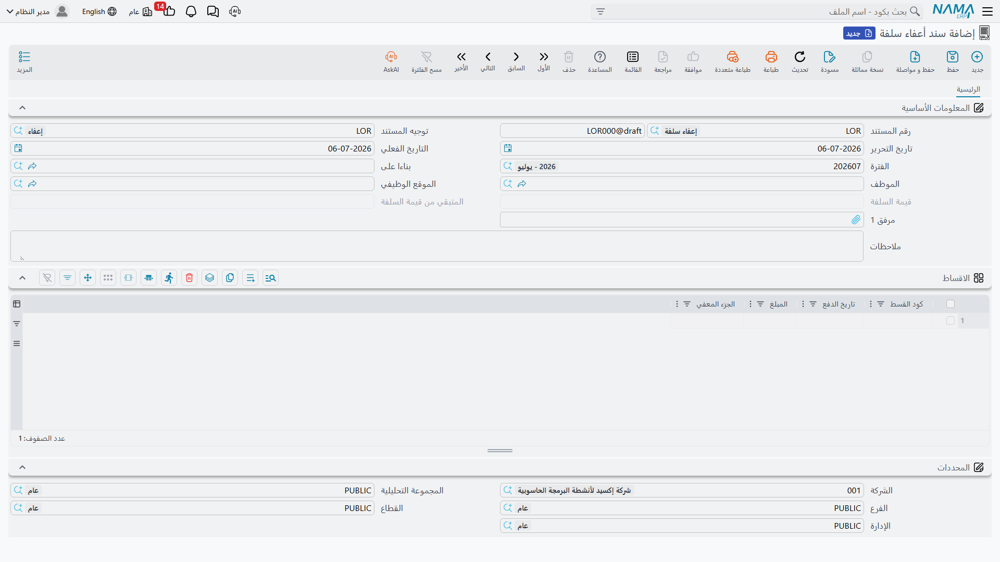
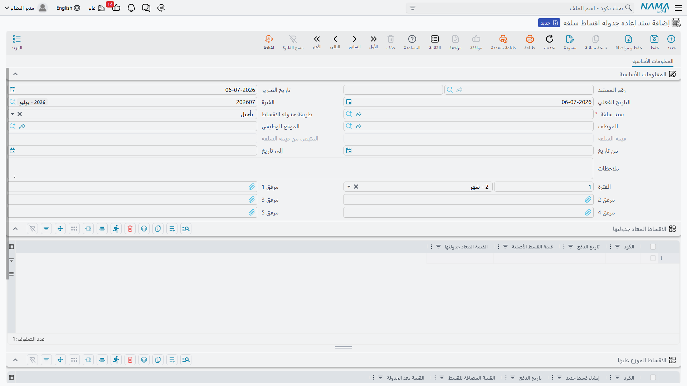

# تسويات السلف

بمجرد أن يصبح [سند السلفة](hr-loan-documents.md) قائماً وسارياً، تُستخدم ثلاث شاشات منفصلة لتعديله دون المساس بالصرف الأصلي: إعفاء جزء من الرصيد، أو تحريك الأقساط في الزمن، أو إيقاف (أو استئناف) السلفة بالكامل. الشاشات الثلاث جميعاً تشير إلى سند السلفة الذي تُعدّله وتشارك جدول أقساطه.

## إعفاء سلفة: سند أعفاء سلفة

يُسقط **سند أعفاء سلفة** (Loan Relief Document) كل أو جزءاً من رصيد سلفة مستحقة — مثلاً كإعفاء لظروف خاصة، أو كتسوية نهائية يُسقط فيها الرصيد المتبقي بدلاً من تحصيله. يعمل سطراً بسطر على أقساط السلفة نفسها، تماماً كسند السداد، إلا أن المبلغ يُعفى بدلاً من أن يُسدَّد.

**مكان الشاشة:** الرواتب > السلف / الأقساط > سند أعفاء سلفة.

| الحقل | English | ملاحظات |
|---|---|---|
| سند سلفة | Loan Document | السلفة التي يجري إعفاؤها. |
| قيمة السلفة / المتبقي من قيمة السلفة | Loan Amount / Remaining Loan Amount | لقطة للقراءة فقط من قيمة السلفة الأصلية وما تبقى منها مستحقاً وقت تحرير هذا السند. |
| كود القسط (بالجدول) | Installment Code | سطر القسط الجاري إعفاؤه. |
| الجزء المعفي (بالجدول) | Relief Amount | مقدار ما يُعفى من هذا القسط — يمكن أن يكون كامل القيمة المتبقية أو جزءاً منها فقط. |

## كيف تتم معالجته وما الذي يُرحَّل محاسبياً

عند الاعتماد، يُنشئ سند أعفاء السلفة أثره المحاسبي في صورة **طلب أعمال** في الخلفية له **حالة معالجة**، ويمكن إعادة محاولته من قائمة **طلبات الأعمال** إذا فشل. يُرحِّل كل سطر قسط مُعفى **الجزء المعفي** الخاص به عبر جانبي المدين والدائن المحددين في توجيه سند الإعفاء نفسه — وعادة ما يكون ذلك بتقييد حساب مصروف إعفاء/إسقاط ديون (مدين) وخصم (دائن) نفس حساب سلف الموظفين الذي دان به [سند السلفة](hr-loan-documents.md) الأصلي، بحيث يُسوَّى المستحق دون أي حركة نقدية إضافية.

## إعادة جدولة الأقساط: سند إعادة جدولة أقساط سلفة

يغيّر سند **إعاده جدوله اقساط سلفه** (Loan Installment Reschedule) *موعد* — أو *طريقة* — تحصيل أقساط سلفة غير مسددة، دون تغيير إجمالي المبلغ المستحق ودون أي ترحيل محاسبي؛ فهو تغيير جدولة بحت. يعمل بإحدى طريقتين تُختاران عبر **طريقة جدوله الاقساط** (Postpone Type):

- **تأجيل** (Postpone Installment) — يُختار نطاق تاريخ (**من تاريخ** / **إلى تاريخ**) ومدة زمنية (**الفترة**، مثل شهر واحد)؛ فيُزاح كل قسط غير مسدد وغير معفي يقع تاريخ سداده داخل هذا النطاق للأمام بمقدار تلك المدة. لا يتغير شيء في قيم الأقساط، فقط تواريخها.
- **إعادة جدولة** (Reschedule Installment) — تُختار أقساط معينة يُسحب منها المبلغ في جدول **الاقساط المعاد جدولتها** (To Schedule Lines)، وأقساط معينة يُضاف إليها ذلك المبلغ في جدول **الاقساط الموزع عليها** (To Schedule Over Lines)؛ ويجب أن يتساوى إجمالي الجانبين. يمكن أن يكون القسط في الجدول الثاني قسطاً موجوداً بالفعل في السلفة، أو — بتفعيل **إنشاء قسط جديد** (Generate New Installment) — قسطاً جديداً تماماً يُنشأ فورياً بتاريخ سداد خاص به.

**مكان الشاشة:** الرواتب > السلف / الأقساط > سند إعاده جدوله اقساط سلفه.

::: warning لا أثر محاسبي، ولا رجوع في الأقساط المسددة
لا تمس إعادة الجدولة إلا الأقساط التي ما زالت **غير مُسَدّدْ** — فلا يمكنها نقل قيمة إلى أو من قسط سُدد أو أُعفي بالفعل. ولأنها تغيّر فقط التواريخ وتوزيع القيمة المتبقية بين الأقساط، فهي لا تُنشئ أي قيد محاسبي على الإطلاق؛ ويبقى قيد الصرف الأصلي لسند السلفة كما هو دون مساس.
:::

## إيقاف سلفة: سند تعطيل سلفة

يوقف **سند تعطيل سلفة** (Loan Disable Document) — أو يستأنف — الاسترداد الآلي واليدوي لسلفة دون إسقاط أي شيء منها. تفعيل **تعطيل السلفة** يضع سند السلفة وكل أقساطه في حالة معطَّلة: يتوقف محرك الرواتب عن خصم مفرد استردادها، وتتوقف السلفة عن الظهور في قائمة اختيار السلف عند إنشاء [سندات سداد سلفة](hr-loan-documents.md) جديدة عليها. وإلغاء التفعيل (أو إلغاء اعتماد السند) يعكس ذلك ويستأنف الاسترداد بشكل طبيعي.

**مكان الشاشة:** الرواتب > السلف / الأقساط > سند تعطيل سلفة.

| الحقل | English | ملاحظات |
|---|---|---|
| سند سلفة | Loan Document | السلفة الجاري إيقافها أو استئنافها. |
| تعطيل السلفة | Disable Loan | مفعّل = إيقاف الاسترداد؛ غير مفعّل = استئنافه. |
| قيمة السلفة / المتبقي من قيمة السلفة | Loan Amount / Remaining Loan Amount | لقطة للقراءة فقط للمرجعية. |

::: tip لا يمكن إيقاف سلفة أثناء سدادها
لا يمكن تعطيل سلفة إذا كان لها بالفعل سداد مسجَّل بعد تاريخ هذا السند الفعلي — فالإيقاف منطقي فقط بالنظر إلى المستقبل، وليس للتراجع عن مبالغ حُصِّلت بالفعل. لا يُنشئ هذا السند أي قيد محاسبي خاص به؛ فهو فقط يبدّل علم التعطيل على السلفة.
:::

## أين تقع هذه الصفحة

- **[مستندات وسداد السلف](hr-loan-documents.md)** — الصرف وجدول الأقساط الذي تعمل عليه كل تسوية هنا.
- **[أنواع السلف](hr-loan-types.md)** — مفرد الاسترداد وقواعد الاستحقاق وراء السلفة الجاري تسويتها.
