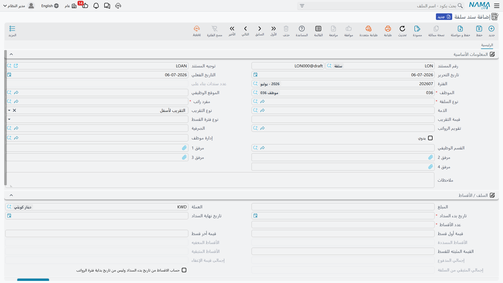
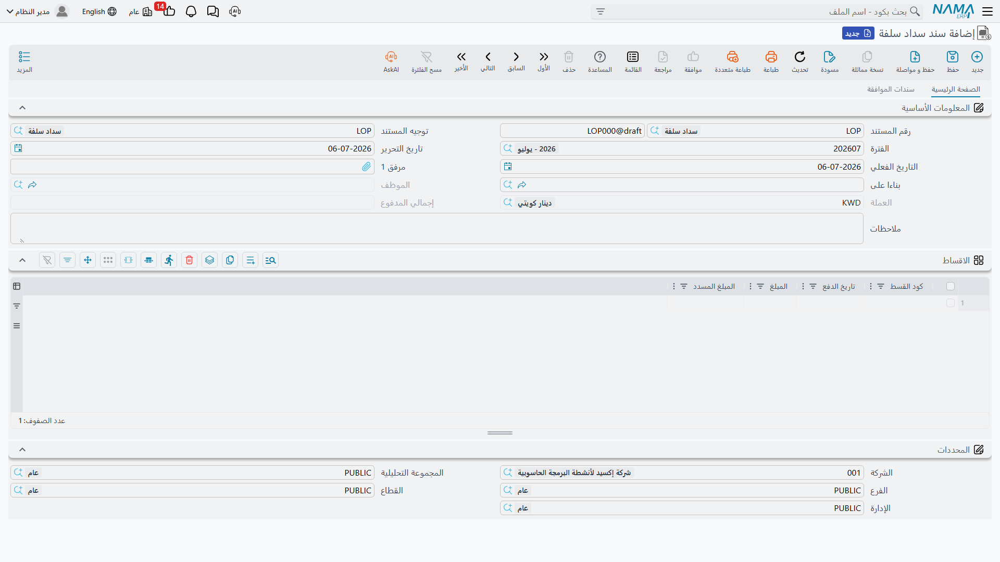

# مستندات وسداد السلف

تغطي هذه الصفحة الشاشات الثلاث التي تحوّل السلفة من طلب إلى مبلغ فعلي في يد الموظف، ثم تعيده مرة أخرى: زوج **طلب سلفة** و**سند سلفة**، و**سند سداد سلفة** المستخدم لتسجيل سداد يدوي. الثلاثة جميعاً تستمد حدودها وقواعد استردادها من [نوع السلفة](hr-loan-types.md) الذي تنتمي إليه السلفة.

## مسار الطلب → السند

يتبع **طلب السلفة** و**سند السلفة** نفس نمط الطلب/السند المستخدم في كل الموارد البشرية — راجع **[طلبات ومستندات الموارد البشرية والمستندات المجمعة](../concepts/hr-requests-and-documents.md)** للشرح الكامل. بالنسبة للسلف تحديداً:

1. يملأ الموظف (أو الموارد البشرية نيابة عنه) **طلب سلفة**: الموظف، نوع السلفة، قيمة السلفة، وتاريخ بدء السداد. اختيار نوع السلفة يعبئ تلقائياً القيمة الافتراضية وعدد الأقساط من [نوع السلفة](hr-loan-types.md)؛ وإدخال القيمة أو عدد الأقساط يعيد حساب الآخر. يبدأ الطلب بحالة مبدئي (Initial).
2. يضغط المراجع **قبول** (Accept) أو **رفض** (Reject).
3. تُنشئ الموارد البشرية بعد ذلك **سند سلفة** وتوجّه حقل **بناءا على** (From Document) فيه إلى الطلب المقبول، فتُنسخ منه بيانات الموظف ونوع السلفة والقيمة والتواريخ. لا تعرض هذه القائمة إلا الطلبات **المقبولة**.
4. الضغط على **إنشاء الأقساط** (Generate Installments) في سند السلفة يبني جدول الأقساط الفعلي — سطراً لكل قسط، بتاريخ وقيمة محسوبين وفق نوع فترة السلفة (أسبوعي/شهري) وقاعدة التقريب وأي قيمة مثبتة/أول قسط/آخر قسط مختلفة. هذا هو الجدول الذي يُصرف الموظف على أساسه فعلياً.

**مكان الشاشتين:** الرواتب > السلف / الأقساط > طلب سلفة / سند سلفة.

### الحقول الأساسية في سند السلفة

| الحقل (بالعربية) | English | ملاحظات |
|---|---|---|
| نوع السلفة | Loan Type | [نوع السلفة](hr-loan-types.md) الذي تنتمي إليه هذه السلفة — يحدد شروط الاستحقاق، ومفرد الاسترداد، وقاعدة السداد الآلي/اليدوي. |
| قيمة السلفة | Loan Amount | المبلغ المصروف فعلياً. |
| عدد الأقساط | Installments Count | عدد الأقساط التي تُقسَّم عليها السلفة. |
| تاريخ بدء السداد / تاريخ نهاية السداد | Payment Start / End Date | النطاق الذي تقع خلاله الأقساط؛ يُحسب تاريخ النهاية تلقائياً بمجرد معرفة العدد ونوع الفترة. |
| نوع فترة القسط | Loan Period Type | أسبوعي (Weekly) أو شهري (Monthly) — المسافة الزمنية بين الأقساط. |
| القيمة المثبته للقسط / قيمة أول قسط / قيمة أخر قسط | Installment Fixed / First / Last Value | قيم اختيارية بديلة: قيمة ثابتة لكل قسط عادي، أو قيمة مختلفة للقسط الأول أو الأخير فقط (لامتصاص فروق التقريب). |
| نوع التقريب / قيمة التقريب | Rounding Type / Value | طريقة تقريب قيم الأقساط — لأعلى، لأسفل، لأقرب رقم، أو بدون تقريب — مع قيمة تقريب اختيارية. |
| حساب الاقساط من تاريخ بدء السداد وليس من تاريخ بداية فترة الرواتب | Calc Installments From Payment Start Date Not Period Start Date | هل يُبنى الجدول انطلاقاً من تاريخ بدء السداد بالضبط أم من بداية فترة الرواتب التي يقع فيها. |
| تقويم الرواتب | HR Calendar | [التقويم](../setup/hr-calendar-and-holidays.md) المستخدم في توزيع تواريخ الأقساط. |
| بناءا على | From Document | يشير إلى طلب السلفة الذي تم إنشاء السند منه، عند وجوده. |

يحمل كل سطر قسط حالته الخاصة — **غير مُسَدّدْ** (Not Paid)، **مسدد** (Paid)، **معفي** (Exempt)، **مبدئي** (Initial)، أو **جاري التسديد** (Payment Is Being Made) — بالإضافة إلى إجمالي حي لما تم سداده فعلاً وما تبقى، بحيث يظل الجدول كاملاً مرئياً على السند في أي لحظة.

::: tip السداد الآلي مقابل اليدوي
علمَا **تخصم من الراتب آليا** و**يدوي** في [نوع السلفة](hr-loan-types.md) هما ما يحدد كيفية تحصيل الأقساط فعلياً. عندما يكون السداد آلياً، يقرأ محرك الرواتب القسط المستحق للفترة عبر مفرد راتب نوع السلفة نفسه ويخصمه كجزء من [سند الراتب](../payroll/salary-documents.md) العادي — دون أي إجراء منفصل. وعندما يكون السداد يدوياً (أو بالإضافة إلى الآلي، لسداد مبكر أو خارج دورة الرواتب)، يُسجَّل **سند سداد سلفة** بدلاً من ذلك.
:::

## سند سداد سلفة

يسجل **سند سداد سلفة** (Loan Payment Document) مبلغاً يُحصَّل من الموظف مقابل سلفة خارج نطاق خصم الراتب المعتاد، أو قبل موعده — مثل سداد مبكر بمبلغ إجمالي، أو استرداد سلفة لموظف لم يُضبط نوع سلفته على الخصم الآلي.

**مكان الشاشة:** الرواتب > السلف / الأقساط > سند سداد سلفة.

| الحقل | English | ملاحظات |
|---|---|---|
| الموظف | Employee | من يقوم بالسداد. |
| بناءا على | From Document | [سند السلفة](hr-loan-documents.md) الجاري سداده؛ لا تُعرض هنا إلا السلف غير [المعطَّلة](hr-loan-adjustments.md). |
| كود القسط (بالجدول) | Installment Code | سطر القسط في سند السلفة الذي ينطبق عليه هذا السداد؛ اختيار قسط يعبئ تلقائياً تاريخ سداده وما تبقى منه غير مسدد (قيمة القسط ناقص ما سُدد أو أُعفي منه بالفعل). |
| المبلغ المسدد (بالجدول) | Paid Amount | المبلغ المُحصَّل فعلياً لهذا القسط في هذا السند — يمكن أن يكون أقل من كامل القيمة المتبقية في حالة السداد الجزئي. |

## كيف تتم معالجته وما الذي يُرحَّل محاسبياً

يُنشئ كلا المستندين أثرهما المحاسبي في صورة **طلب أعمال** (Business Request) في الخلفية له **حالة معالجة**، ويمكن إعادة محاولته من قائمة **طلبات الأعمال** إذا فشل.

- **سند السلفة** — عند الاعتماد، تُرحَّل **قيمة السلفة** كاملة كسطر واحد، مديناً ودائناً للحسابين المحددين كـ"مدين" و"دائن" في توجيه السند نفسه، مرتبطاً بحسابات الموظف الفرعية. في الإعداد المعتاد يكون المدين حساب سلف/دفعات مقدمة للموظفين (أصل — فالشركة الآن لها مستحق على الموظف) والدائن حساب الخزينة/البنك (المبلغ الذي صُرف فعلياً). إلغاء اعتماد السند يعكس نفس القيد.
- **سند سداد السلفة** — عند الاعتماد، يُرحِّل كل سطر قسط **المبلغ المسدد** الخاص به عبر جانبي المدين والدائن المحددين في توجيه *سند السداد* نفسه — وعادة ما تكون صورة معكوسة لسند الصرف، حيث يُخصم (دائن) من حساب سلف الموظفين بالمبلغ المُحصَّل ويُقيَّد (مدين) للخزينة/البنك (أو أياً كانت قناة السداد المستخدمة).

::: info الاسترداد الآلي عبر الرواتب يُرحَّل من سند الراتب، لا من هنا
عندما يُسترد قسط السلفة آلياً، لا يُنشأ أي سند سداد سلفة على الإطلاق — فالمبلغ المستحق يُؤخذ ببساطة كسطر خصم على [سند الراتب](../payroll/salary-documents.md) العادي للموظف عن تلك الفترة، ويُرحَّل عبر حسابات مفرد الخصم نفسه تماماً كأي مفرد راتب آخر.
:::

## أين تقع هذه الصفحة

- **[أنواع السلف](hr-loan-types.md)** — قواعد الاستحقاق ومفرد الاسترداد التي تتبعها كل سلفة هنا.
- **[طلبات ومستندات الموارد البشرية والمستندات المجمعة](../concepts/hr-requests-and-documents.md)** — نمط الطلب → السند العام الذي تطبقه هذه الصفحة.
- **[سندات الرواتب](../payroll/salary-documents.md)** — أين يظهر القسط المسترد آلياً فعلياً ويُرحَّل محاسبياً.
- **[تسويات السلف](hr-loan-adjustments.md)** — إعفاء أو إعادة جدولة أو إيقاف سلفة قائمة بالفعل.
