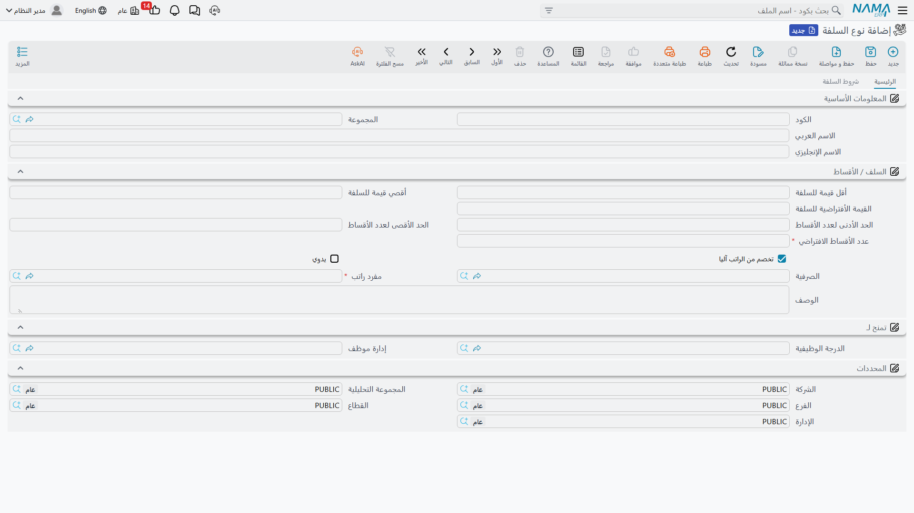

# أنواع السلف

كل سلفة أو دفعة مقدمة من الراتب في نظام Nama تبدأ من **نوع السلفة** (Loan Type) — ملف رئيسي يحدد ما يمكن أن يقترضه الموظف: القيمة الافتراضية والحدود المسموح بها للمبلغ، عدد الأقساط الافتراضي والحدود المسموح بها له، من يحق له استخدام هذا النوع، والأهم من ذلك كله: **أي مفرد راتب يقوم باسترداد قيمته من الراتب**. لا يفرّق Nama بين "سلفة بدون فوائد" و"خطة أقساط" كنوعين مختلفين من الكيانات؛ الفرق كله في طريقة إعداد نوع السلفة. فالنوع الذي يكون عدد أقساطه الافتراضي 1 يتصرف كسلفة تُصرف وتُسدَّد بالكامل في دورة رواتب واحدة، بينما النوع ذو الأقساط المتعددة يتصرف كخطة أقساط حقيقية تُسترد تدريجياً.

**مكان الشاشة:** الرواتب > السلف / الأقساط > نوع السلفة.

## الحقول الأساسية

| الحقل (بالعربية) | English | ملاحظات |
|---|---|---|
| عدد الأقساط الافتراضي | Default Installments Count | إجباري. يُستخدم لتعبئة [طلبات السلف](hr-loan-documents.md) الجديدة من هذا النوع تلقائياً. القيمة 1 تجعل النوع يتصرف كسلفة تُصرف دفعة واحدة. |
| أقل قيمة للسلفة / القيمة الأفتراضية للسلفة / أقصي قيمة للسلفة | Minimum / Default / Maximum Loan Amount | الحدود التي يجب أن يلتزم بها أي طلب سلفة من هذا النوع. |
| الحد الأدنى لعدد الأقساط / الحد الأقصى لعدد الأقساط | Minimum / Maximum Installments Count | نطاق عدد الأقساط المسموح به لهذا النوع. |
| الدرجة الوظيفية / إدارة موظف | Organization Position / Employee Department | يضيّق دائرة الموظفين الذين يحق لهم استخدام هذا النوع. عند ترك أي منهما فارغاً يصبح النوع متاحاً لكل الدرجات/الإدارات؛ وقائمة أنواع السلف التي يراها الموظف عند تقديم طلبه تُصفَّى لتشمل فقط الأنواع المطابقة لإدارته/درجته أو التي تُركت فارغة. |
| الصرفية | Salary Issuance | يقصر النوع على صرفية واحدة، وهي نفس مصنِّف الصرفيات المستخدم في بقية الوحدة (راجع [سنوات وفترات ونظام صرف الرواتب](../setup/hr-years-and-periods.md)). |
| مفرد راتب | Salary Component | إجباري. [مفرد الراتب](../payroll/salary-components.md) الوحيد — وعادة ما يكون خصماً مصنَّفاً كـ "قسط" — الذي يقوم محرك الرواتب من خلاله بخصم قسط هذه السلفة من الراتب تلقائياً كل فترة. |
| تخصم من الراتب آليا | Automatically Deducted From Salary | عند تفعيلها، تُسترد أقساط هذا النوع من السلف في كل دورة رواتب تلقائياً عبر مفرد الراتب أعلاه، دون أي إجراء إضافي. |
| يدوي | Manual | عند تفعيلها، يمكن أيضاً (أو حصراً) تسديد سلف هذا النوع يدوياً عبر سند سداد سلفة بدلاً من الخصم الآلي من الراتب أو بالإضافة إليه — راجع [مستندات وسداد السلف](hr-loan-documents.md). |

## شروط الاستحقاق

يمكن أن يحمل نوع السلفة جدول **الشروط الواجب توافرها في سند السلفه** — وهي القواعد التي يجب أن يستوفيها سند سلفة من هذا النوع قبل أن يتم اعتماده. يمكن أن يجمع كل سطر بين:

- استعلام أو معايير حرة على ملف الموظف أو على سند السلفة نفسه، لتغطية الحالات التي لا تغطيها الحقول الجاهزة أدناه.
- نطاقات سنوات الخبرة وأشهر الخدمة (من سنة خبرة / إلى سنة خبرة، من شهر خدمة / إلى شهر خدمة) — يجب أن يقع الموظف داخل النطاق ليكون مؤهلاً.
- نطاق لقيمة الراتب (قيمة سند الراتب أكبر من أو يساوي / أقل من) ونطاق لقيمة السلفة (قيمة السلفة أكبر من / أقل من)، بحيث يمكن لقاعدة ما أن تنطبق فقط على سلف بحجم معين لموظفين ضمن شريحة راتب معينة.
- سقف من نوع **نوع الحد الأقصى للقسط** يُعبَّر عنه كنسبة من الراتب الأساسي، أو نسبة من مفردات راتب معينة (المحدَّدة في جدول **مفردات الراتب** الخاص بالنوع نفسه)، أو نسبة من الراتب النهائي، أو قيمة ثابتة — بالإضافة إلى **الحد الأقصى للقسط** المقابل الذي يُطبَّق على كل قسط على حدة وليس على إجمالي السلفة.
- ما إذا كان يجب أخذ أقساط **نفس نوع السلفة الجارية بالفعل خلال هذا الشهر** في الاعتبار عند فحص هذه السقوف (الأخذ في الاعتبار الاقساط من نفس النوع في نفس الشهر)، وما إذا كان يجب البحث في **السلف السابقة من نفس النوع** للموظف من الأساس (البحث في السلف السابقة لنفس النوع).
- درجة وظيفية أو إدارة أو قسم يقيّد هذه القاعدة بعينها (أضيق من الحقول على مستوى النوع أعلاه)، ونطاق تاريخ على سند السلفة نفسه.

::: tip إعداد وليس موافقة
هذه الشروط بوابة تحقق (Validation) على سند السلفة، وليست مسار موافقات — فالسند الذي يخفق في أحد هذه الشروط لا يمكن اعتماده ببساطة. استخدم إعداد حالة الموافقة القياسية على توجيه المستند إذا كنت تحتاج أيضاً إلى موافقة بشرية قبل الصرف.
:::

## أين تقع هذه الصفحة

- **[مستندات وسداد السلف](hr-loan-documents.md)** — الطلب، ومستند الصرف، ومستند السداد اليدوي التي يغذيها هذا النوع.
- **[مفردات الراتب](../payroll/salary-components.md)** — حيث يقع تصنيف مفرد الاسترداد وسطور حساباته.
