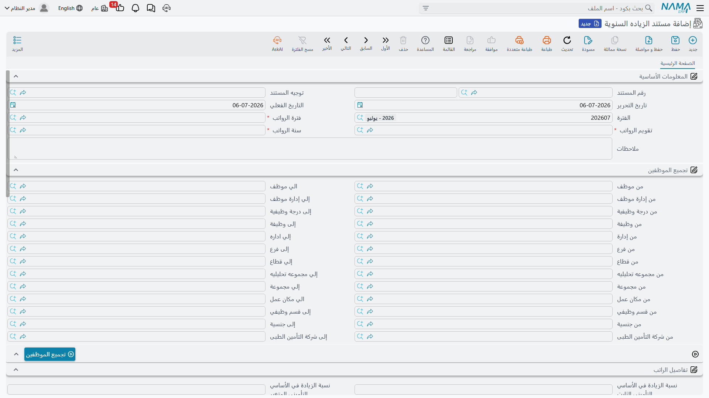

# الزيادات السنوية (Annual Increases)

الرواتب لا تبقى ثابتة. مرة كل عام — أو كلما قررت الشركة جولة زيادة — تحتاج أجور كل الموظفين إلى التحرك: نسبة على الراتب الأساسي، مبلغ ثابت يُضاف إلى بدل، وعاء تأميني جديد. وتنفيذ ذلك موظفاً موظفاً هو بالضبط نوع العمل المتكرر الذي يستدعي الأخطاء. **مستند الزيادة السنوية** (Annual Increases Document) يحوّل جولة الزيادة إلى مستند واحد قابل للمراجعة: تصف *من* تشمله الزيادة و*كيف*، ثم تجمّع الموظفين المطابقين، وتترك المستند يولّد التغييرات الفردية على الرواتب.

## أين تجده

**الرواتب > الأساسيات > مستند الزياده السنوية** (Payroll > Main > Annual Increases Document).

## لماذا وُجد

لجولة الزيادة جزآن متحركان يبقيهما هذا المستند معاً في مكان واحد: **النطاق** (أي الموظفين المشمولين بالجولة) و**القاعدة** (ما الذي يحدث لأجورهم). فبدلاً من تعديل مئات سجلات الموظفين يدوياً، تكتب القاعدة مرة واحدة، وتترك المستند يحصد الموظفين المؤهلين من معايير الفلترة، وينتج — لكل واحد منهم — التغيير الفردي الفعلي الذي يحمل الأرقام الجديدة إلى سجل الموظف.

::: info هذا المستند لا يرحّل إلى دفتر الأستاذ
مستند الزيادة السنوية إجراء **إعدادي في الرواتب**، لا إجراء محاسبي. فهو يغيّر ما سيتقاضاه الموظفون *مستقبلاً*؛ ولا ينشئ بذاته أي قيد في دفتر الأستاذ العام. الأثر المالي يظهر لاحقاً فقط، حين تُنشأ **[سندات الرواتب](salary-documents.md)** التالية بالأرقام المرفوعة.
:::

## الرأس: الفترة والنطاق والزيادات الشاملة

يثبّت أعلى المستند التوقيت والفئة المستهدفة، ويتيح بعض الزيادات على مستوى الفئة كاملة:

| الحقل (عربي) | التسمية الإنجليزية | الغرض |
|---|---|---|
| سنة الرواتب / فترة الرواتب / تقويم الرواتب | HR Year / HR Period / HR Calendar | **[سنة وفترة وتقويم الرواتب](../setup/hr-years-and-periods.md)** التي تنتمي إليها جولة الزيادة. |
| تاريخ الإصدار / التاريخ الفعلي | Issue Date / Value Date | متى حُرّر المستند، والتاريخ الفعلي الذي تسري منه الزيادة. |
| نوع الإنشاء | Generation Type | يتتبع ما إذا كانت سطور الموظفين قد تولّدت بعد، وما إذا كانت لا تزال قابلة للتعديل. |
| نسبة الزيادة في الأساسي التأميني الثابت / قيمة الزيادة في الأساسي التأميني الثابت | Basic Fixed Insurance Percent / Basic Fixed Insurance Value | نسبة أو مبلغ ثابت يُضاف إلى **الأساسي التأميني الثابت** لكامل الجولة. |
| نسبة الزيادة في الأساسي التأميني المتغير | Basic Variable Insurance Percent | نسبة تُضاف إلى **الأساسي التأميني المتغير**. |
| نسبة الزيادة في الأجر اليومي | Daily Salary Percent | نسبة تُضاف إلى **الأجر اليومي**، للعمالة اليومية. |
| الفرع / الإدارة / القطاع / الشركة / مجموعة التحليل | Branch / Department / Sector / Legal Entity / Analysis Set | **المحددات** المعتادة التي تحدد نطاق المستند. |

### من تشمله الزيادة — نطاق الموظفين

لا يأخذ المستند قائمة موظفين مكتوبة يدوياً. بل تحدّد **نطاقاً من المعايير** — مجموعة من فلاتر *من / إلى* — فيجمّع المستند كل من يطابقها. تغطي البنود المتاحة: الموظف، والإدارة، وإدارة الموظف، وقسم الإدارة، والفرع، والقطاع، والمجموعة، والوظيفة، والمسمى التنظيمي، ومكان العمل، والجنسية، وشركة التأمين الصحي، ومجموعة التحليل، وحقول المرجع/الوصف العامة. ترك البند مفتوحاً يوسّع الشبكة؛ وتضييقه يستهدف شريحة محددة من القوى العاملة — فرع واحد، جنسية واحدة، درجة وظيفية واحدة.

## القاعدة: أي المفردات تُرفع، وبأي مقدار

جدول **التفاصيل** (Details) هو حيث تسكن قاعدة الزيادة الفعلية. يستهدف كل سطر مفرد راتب ويحدد كيف يتحرك:

| الحقل (عربي ← إنجليزي) | الغرض |
|---|---|
| نوع المفرد (Component Type) | فئة **[مفرد الراتب](salary-components.md)** التي تنطبق عليها القاعدة. |
| مفرد الراتب هدف الزيادة (Target Salary Component) | المفرد المحدد الذي تُطبّق عليه الزيادة. |
| نوع الزيادة (Increase Type) | *كيف* يتحرك المفرد — انظر القيم أدناه. |
| نسبة/قيمة الزيادة (Increase Percentage / Value) | المقدار — يُقرأ كنسبة أو كمبلغ حسب نوع الزيادة. |

**نوع الزيادة** (Increase Type) يقرر الآلية:

| القيمة (عربي ← إنجليزي) | المعنى |
|---|---|
| نسبه مضافة (Addition Percentage) | رفع المفرد بنسبة من قيمته الحالية. |
| قيمة مضافة (Addition Value) | إضافة مبلغ ثابت إلى المفرد. |
| نسبه مخصومة (Deduction Percentage) | خفض المفرد بنسبة — جولة بالسالب. |
| قيمة مخصومة (Deduction Value) | خصم مبلغ ثابت من المفرد. |
| استبدال القيمة (Replace Value) | استبدال قيمة المفرد بالرقم المُدخل — يُستعمل حين يُحدَّد الأجر الجديد صراحةً بدل تعديله بمقدار. |

::: tip القواعد الشاملة تنطبق على كل من جُمِع — والاستثناءات تعالج الحالات الخاصة
جدول التفاصيل هو القاعدة *الشاملة* لكامل الجولة. وحين يجب معاملة حفنة من الموظفين معاملة مختلفة — زيادة أكبر لموظف متميز، أو عدم زيادة لمن لا يزال تحت الاختبار — تسجّلهم في جدول **الإستثناءات** (Exceptions) بدلاً من ذلك. يسمّي كل سطر استثناء الموظفَ، والمفرد المستهدف، ونوع زيادة ومقداراً خاصين به، متجاوزاً القاعدة الشاملة لذلك الشخص وحده.
:::

## سير العمل

1. **أنشئ** المستند من **الرواتب > الأساسيات > مستند الزياده السنوية**، واضبط سنة الرواتب والفترة والتقويم والتاريخ الفعلي.
2. **حدّد النطاق** بملء معايير نطاق الموظفين — بالسعة أو الضيق الذي تتطلبه الجولة.
3. **حدّد القاعدة (القواعد)** في جدول التفاصيل: لكل مفرد تريد تحريكه، اختر المفرد المستهدف، ونوع الزيادة، والمقدار. أضف أي تجاوزات فردية في الاستثناءات.
4. **جمّع الموظفين.** استخدم **تجميع الموظفين** (Collect Employees) لتحويل معايير النطاق إلى سطور موظفين فعلية، أو **تجميع الموظفين مع المفردات** (Collect Employees With Components) لإحضار كل موظف مع مفرداته المحلولة — لترى الأثر وتضبطه قبل الاعتماد.
5. **راجع السطور المتولّدة.** يظهر كل موظف مُجمَّع في جدول **سطور الموظفين** (Employees Lines)، موضّحاً الموظف، ومديره الأعلى، و — بعد المعالجة — رابطاً إلى مستند التغيير الفردي الذي يحمل الأرقام الجديدة فعلاً إلى سجل الموظف.
6. **احفظ وعالِج.** يولّد المستند حينئذٍ تغييراً واحداً لبيانات كل موظف مُجمَّع، مطبّقاً الأرقام المرفوعة مستقبلاً.

::: warning عدّل الحملة، لا التغييرات المتولّدة
كسائر المستندات المجمّعة في Nama، التغييرات الفردية التي يولّدها مستند الزيادة السنوية يديرها المستند *نفسه*. فإعادة التجميع أو إعادة المعالجة هي الطريقة الصحيحة لضبط الجولة — أما تعديل التغييرات الفردية المتولّدة مباشرةً فيجعلها غير متسقة مع الحملة التي تملكها.
:::

## كيف تُعالَج

عند الحفظ، يحلّل المستند نطاقه إلى سطور موظفين، ولكل سطر ينتج تغييراً فردياً يكتب الأرقام المرفوعة إلى سجل كل موظف. يحدث ذلك كـ**طلبات أعمال** في الخلفية بـ**حالة معالجة**؛ وإذا فشل سطر في المعالجة، يمكن إعادة محاولته من شاشة **طلبات الأعمال** كأي طلب آخر. لا يُرحَّل أي مبلغ إلى دفتر الأستاذ العام بهذا المستند — فالمال لا يتحرك إلا حين يلتقط *تشغيل الرواتب التالي* الأرقامَ الجديدة.

## صفحات ذات صلة

- **[مفردات الراتب](salary-components.md)** — المفردات التي تستهدفها قاعدة الزيادة، وحيث تسكن القيم المرفوعة في النهاية.
- **[سندات الرواتب](salary-documents.md)** — حيث تتحول الأرقام المرفوعة أخيراً إلى راتب مدفوع وأثر محاسبي.
- **[كيفية حساب الراتب](../concepts/hr-salary-engine.md)** — خط الأنابيب الكامل الذي تغذّيه المفردات المرفوعة.
- **[سنوات وفترات الرواتب والصرفية](../setup/hr-years-and-periods.md)** — تقويم الرواتب الذي ترتبط به جولة الزيادة.
