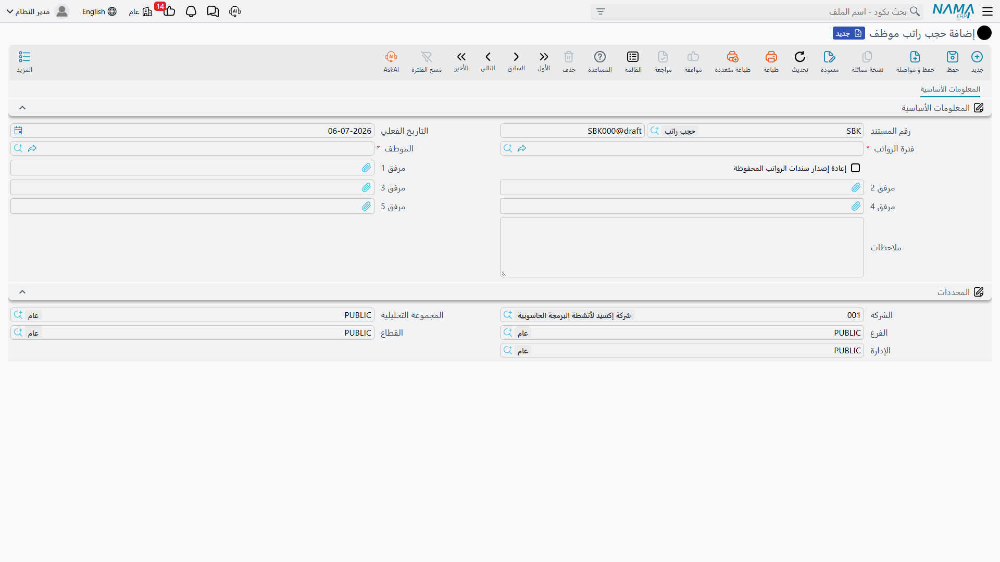
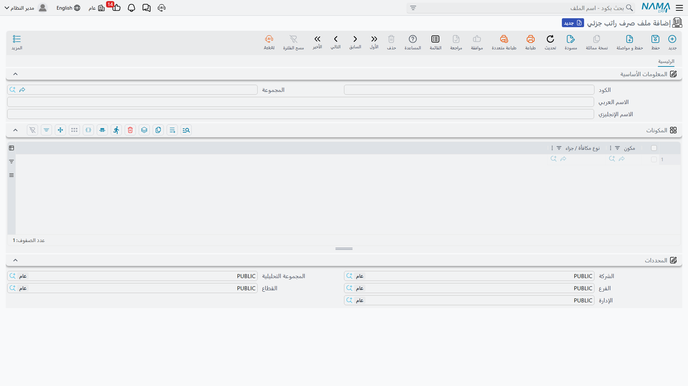

# حجب الرواتب والصرف الجزئي (Salary Blocking & Partial Payment)

أحياناً لا ينبغي صرف الراتب — على الأقل ليس بعد، وليس كاملاً. فموظف قيد التحقيق، أو لم يُعِد عهدة الشركة، أو لديه إخلاء طرف عالق؛ الأجر مستحَق ومحسوب، لكنه يحتاج إلى أن *يُحجَب* حتى تُحلّ الحالة. تعالج Nama ذلك بعائلة صغيرة من المستندات: **قاعدة** تقرر تلقائياً متى يُحجَب الأجر، و**مستند حجب** يقوم بالحجب، و**مستند إلغاء حجب** يحرّره، و**قالب صرف جزئي** لصرف جزء فقط من راتب محجوب (أو عادي).

## الأجزاء

| الشاشة | النوع | ما تفعله |
|---|---|---|
| قاعدة حجب مرتب (Salary Block Rule) | إعداد | شروط تقرر *تلقائياً* من يُحجَب أجره. |
| حجب راتب موظف (Salary Block) | مستند | يحجب أجر موظف محدد لفترة. |
| إلغاء حجب راتب (Salary UnBlock) | مستند | يحرّر الحجب، مُعيداً الصرف الطبيعي. |
| ملف صرف راتب جزئي (Partial Salary Payment) | إعداد | قالب قابل لإعادة الاستخدام يختار أي المكونات تُصرف في الصرف الجزئي. |

## قاعدة حجب مرتب — تقرير من يُحجَب تلقائياً

بدلاً من حجب الموظفين يدوياً واحداً واحداً، تتيح لك **قاعدة حجب مرتب** التعبير عن *الشروط* التي ينبغي عندها حجب الأجر، وترك النظام يطبّقها. توجد في **الرواتب > الإعدادات > قاعدة حجب مرتب** (Payroll > Settings > Salary Block Rule).

| الحقل (عربي ← إنجليزي) | الغرض |
|---|---|
| الاسم العربي / الاسم الإنجليزي (Arabic Name / English Name) | يعرّف القاعدة. |
| تفعيل (Activate) | يشغّل القاعدة أو يوقفها. |
| الحجب عند (Block on) | هل يجب تحقق **أي شرط** (Any Condition) أم **كل الشروط** (All Conditions) قبل حجب الأجر. |
| إدارة موظف (Employee Department) / المجموعة (Group) / فترة الرواتب (HR Period) | تحدد نطاق القاعدة على إدارة، أو مجموعة، أو فترة معينة. |

الشروط نفسها تسكن في جدول **قواعد الحجب** (Block Rules): يربط كل سطر **قاعدة** (Rule) — **[معادلة حساب](salary-calculation-formulas.md)**، نفس اللبنة المقيِّمة للشروط المستعملة في مواضع أخرى من الرواتب — تُقيَّم على الموظف. ويقرر إعداد **الحجب عند** ما إذا كان تحقق *أي* شرط مطابق كافياً لحجب الأجر، أم يجب تحقق *كلها*.

## حجب راتب موظف — حجز أجر الموظف

مستند **حجب راتب موظف** (**الرواتب > الرواتب > حجب راتب موظف** — Payroll > Payroll > Salary Block) هو الحجب الفعلي: يسمّي موظفاً وفترة، وما دام قائماً، يُمنَع صرف راتب ذلك الموظف عن تلك الفترة. يمكن تحريره يدوياً، أو توليده تلقائياً من قاعدة حجب طابقت.

| الحقل (عربي ← إنجليزي) | الغرض |
|---|---|
| الموظف (Employee) | من يُحجَب أجره. |
| فترة الرواتب (HR Period) | الفترة التي ينطبق عليها الحجب. |
| بناءا على (From Document) | المصدر الذي وُلّد منه — مثل تقييم القاعدة الذي حرّره. |
| تاريخ التحرير / التاريخ الفعلي (Issue Date / Value Date) | متى حُرّر، والتاريخ الفعلي. |
| إعادة إصدار سندات الرواتب المحفوظة (Regenerate Committed Salary Documents) | هل تُعاد قسراً إصدار سندات الرواتب المعتمدة المتأثرة بهذا الحجب، ليسري الحجب على أجر حُسِب بالفعل. |
| توجيه المستند (Term) | التوجيه الذي يحكم ترقيمه. |

## إلغاء حجب راتب — تحرير الحجب

حين تُحلّ الحالة، يعكس مستند **إلغاء حجب راتب** (**الرواتب > الرواتب > إلغاء حجب راتب** — Payroll > Payroll > Salary UnBlock) الحجبَ، مُعيداً قدرة الموظف على تقاضي أجره عن تلك الفترة. يماثل حقول الحجب (الموظف، الفترة، التواريخ، التوجيه)، و**بناءا على** (From Document) فيه يرتبط رجوعاً بالحجب الذي يرفعه — فيبقى الحجب وتحريره مقترنين وقابلين للتدقيق. وكالحجب، يمكنه إعادة إصدار سندات الرواتب المتأثرة قسراً ليسري التحرير فوراً.

## ملف صرف راتب جزئي — صرف جزء فقط

الراتب المحجوب — أو ببساطة راتب تختار الشركة صرفه على مراحل — يحتاج أحياناً إلى أن يُصرف *جزئياً*: هذا البدل الآن، والباقي لاحقاً. **ملف صرف راتب جزئي** (**الرواتب > إعدادات الراتب > ملف صرف راتب جزئي** — Payroll > Salary Configurations > Partial Salary Payment) هو **القالب** الذي يحدد *أي* الأجزاء تُصرف.

إنه سجل رئيسي قابل لإعادة الاستخدام، لا صرف بذاته. وإلى جانب اسمه العربي/الإنجليزي ومجموعته، جوهره هو جدول **المكونات** (Components):

| الحقل (عربي ← إنجليزي) | الغرض |
|---|---|
| مكون (Component) | **[مفرد راتب](salary-components.md)** يُضمَّن في الصرف الجزئي. |
| نوع مكافأة / جزاء (Reward / Penalty) | اختيارياً، **[مكافأة أو جزاء](../discipline/rewards-and-penalties.md)** محدد يُضمَّن. |

لاحظ أنه **لا يوجد مبلغ** على القالب — فهو يختار *أي المكونات* تشارك، لا كم. يأتي الرقم من المكونات نفسها حين يتم الصرف فعلاً.

## كيف يُعالَج / وماذا يرحّل

::: info قالب الصرف الجزئي يقود سند صرف — والسند هو ما يرحّل
هذا هو الجزء الجدير بالفهم الصحيح. لا مستند الحجب، ولا مستند إلغاء الحجب، ولا قالب الصرف الجزئي يرحّل شيئاً إلى دفتر الأستاذ العام بذاته — فمستندا الحجب/إلغاء الحجب ضابطان بشريان محضان يتحكمان في *ما إذا* كان يمكن صرف الراتب، وسجل الصرف الجزئي ليس إلا قالب اختيار مكونات.

الصرف النقدي الفعلي هو **سند صرف** (Payment Voucher — مستند دفع محاسبي قياسي): فحين يصرف مشغّل جزءاً من راتب، يُصدر سند صرف ويرفق به **ملف صرف الراتب الجزئي**، الذي يخبر السند *أي* مفردات الراتب (والمكافآت/الجزاءات) تُصرف في هذه الدفعة. و**سند الصرف** هو ما يرحّل المدين/الدائن الفعلي إلى دفتر الأستاذ — بجعل النقدية/البنك دائناً وتسوية استحقاق الراتب للمكونات المختارة — كـ**طلب أعمال** في الخلفية بـ**حالة معالجة**، قابل لإعادة المحاولة من شاشة **طلبات الأعمال**. ملف الصرف الجزئي يوفّر *ماذا*؛ والسند يقوم بالصرف والترحيل.
:::

## سير العمل

1. **(اختياري) عرّف قاعدة حجب** من **الرواتب > الإعدادات > قاعدة حجب مرتب** بالشروط التي ينبغي أن تحجب الأجر تلقائياً، واختر أي شرط / كل الشروط.
2. **احجب الأجر** — إما بترك قاعدة تولّد **حجب راتب موظف**، أو بتحرير واحد يدوياً للموظف والفترة. اضبط *إعادة إصدار سندات الرواتب المحفوظة* إن كان الأجر قد حُسِب بالفعل.
3. **اصرف جزئياً عند الحاجة** — أنشئ قالب **ملف صرف راتب جزئي** يسرد المكونات المراد صرفها، ثم أصدر **سند صرف** يشير إليه ليصرف (ويرحّل) ذلك الجزء فعلاً.
4. **حرّر الحجب** — حين تُحلّ الحالة، حرّر **إلغاء حجب راتب** من الحجب، مُعيداً الصرف الطبيعي.

## صفحات ذات صلة

- **[سندات الرواتب](salary-documents.md)** — الكشوف التي يحجزها الحجب ويحرّرها إلغاء الحجب.
- **[معادلات حساب الراتب](salary-calculation-formulas.md)** — معادلات الشروط التي تقيّمها قاعدة الحجب.
- **[مفردات الراتب](salary-components.md)** — المكونات التي يختار الصرف الجزئي صرفها.
- **[المكافآت والجزاءات](../discipline/rewards-and-penalties.md)** — المكافأة/الجزاء الذي يمكن أن يضمّنه الصرف الجزئي.
