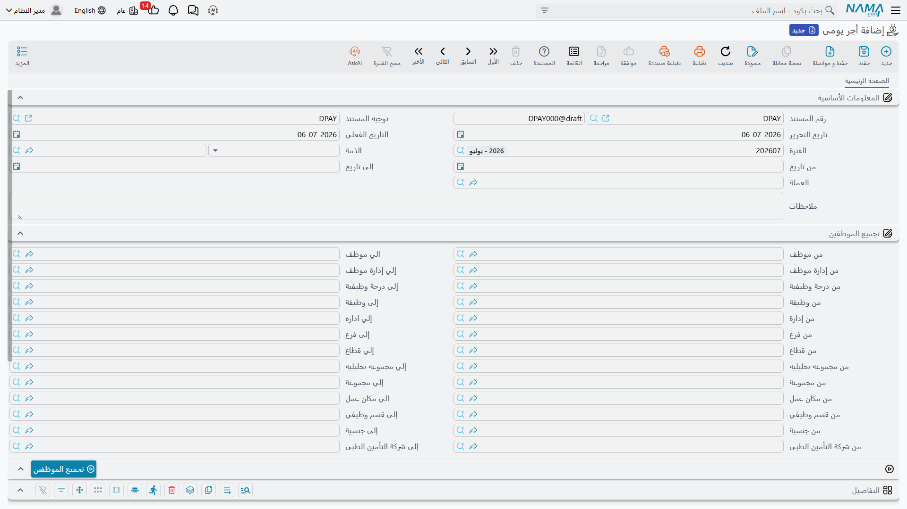

# معادلات حساب الراتب (Salary Calculation Formulas)

**[مفرد راتب](salary-components.md)** ذو **قيمة متغيرة** لا يحمل رقماً خاصاً به — بل يحمل **معادلة حساب مفرد** (Component Calc Formula)، وهي الوصفة التي تحوّل مدخلات الشهر إلى رقم. تغطي هذه الصفحة كيفية بناء المعادلات، كما تغطي مستند **الأجر اليومى** (Daily Salary) المنفصل المستخدم للموظفين الذين يُصرف لهم بالأجر اليومي لا بالراتب الشهري.

## معادلة حساب المفرد (Component Calc Formula) — الوصفة

توجد في **الرواتب > إعدادات الراتب > معادلة حساب المفرد**، وأهم إعداد فيها هو **نوع المعادلة** (Formula Type) — من أين يأتي الرقم أصلاً. تتوفر أكثر من عشرين مصدراً؛ وأكثرها شيوعاً لفريق الدعم:

| نوع المعادلة | English | يقرأ من |
|---|---|---|
| نسبة من الإجمالي / الإضافات / الأستقطاعات | Percentage From Totals / Additions / Deductions | شريحة من مبالغ مفردات أخرى. |
| نسبة من وعاء التأمينات (وتنويعاتها الثابتة/المتغيرة/للعامل/للشركة) | Insurance Percentage (and variants) | حصة العامل أو الشركة من وعاء التأمينات الثابت أو المتغير. |
| نسبة من وعاء الضرائب / الضرائب | Tax Percentage / Taxes | نسبة ثابتة، أو جدول ضريبة تصاعدي كامل (له جدول شرائح خاص به — انظر أدناه). |
| مرتبط بمؤشر أداء | Related To Performance Indecator | رقم مقاس — ساعات إضافية، مبيعات، حضور — من **[مؤشر أداء](../performance/performance-indicators.md)**. |
| مرتبط بمفرد | Related To Component | قيمة مفرد آخر، تُستعمل كلبنة بناء. |
| تتكون من معادلات أخري | Composite Formula | مزيج مرجَّح من معادلات أخرى، كل منها مضروب/مقسوم على معامله الخاص. |
| القيمة المثبتة بالعرض الوظيفي | Fixed Value In Offer | القيمة الصريحة المدوَّنة في العرض الوظيفي للموظف. |
| نسبة من نهاية الخدمة | Percentage From Service End | حصة من وعاء نهاية الخدمة — انظر **[المخصصات ونهاية الخدمة](../end-of-service/hr-provisions.md)** حين تُنشر. |
| رصيد حساب من حسابات الموظف (مدين-دائن / دائن-مدين) | Balance From Employee Account | الرصيد الجاري لأحد حسابات الموظف الخاصة — يُستعمل لأمور مثل استرداد رصيد مستحق. |

حين تكون المعادلة **مرتبطة بمؤشر أداء**، تحدد **طريقة التطبيق** (Applicability Method) كيفية تطبيق رقم المؤشر:

| طريقة التطبيق | English | السلوك |
|---|---|---|
| يومي | Daily | يُحسب المؤشر **لكل يوم عمل** على حدة. |
| فتري | Periodic | يُستعمل **إجمالي الشهر كله** للمؤشر مرة واحدة. |

### طريقة الحساب: معدل واحد، أو شرائح تصاعدية

| طريقة الحساب | English | السلوك |
|---|---|---|
| نسبة واحدة | One Percentage | معدل واحد يُطبَّق على الوعاء كله. |
| شرائح | Sections | شرائح تصاعدية — تُحسب كل شريحة من الوعاء بمعدلها الخاص، تماماً كجدول ضريبة الدخل. |

مع **الشرائح**، تحدد **سطور حساب المعادلة** الشرائح، ويمكن لكل سطر أن يجمع عدة أنواع من الشروط معاً:

- **المدى (Range)** — نطاق من/إلى على قيمة الوعاء (أو استعلام SQL لمدى محسوب)، إضافة إلى نطاق **مدة الخبرة بالأيام** (Experience Days) من/إلى منفصل للشرائح المبنية على الأقدمية.
- **المعدل (Rate)** — معاملا الضرب في/القسمة على، ومعدل ثابت، و**قيمة مضافة** فوق ذلك.
- **المعايير (Criteria)** — فلتر اختياري (على ملف الموظف، أو بيانات شئون الموظفين، أو سند الراتب نفسه) يجب أن ينطبق حتى تُطبَّق الشريحة أصلاً.
- **مرات التكرار (Occurrence Count)** — حدود من/إلى على عدد مرات تكرار هذه الشريحة هذه الفترة، أو خلال السنة/الفترة المجمعة، مفيدة لقواعد مثل "أول مرتين مجانيتان، والثالثة فما فوق تُغرَّم."
- **معاملات الأجازات / العطلات / نهاية الأسبوع** — مضاعِفات منفصلة تُطبَّق حين يقع اليوم المعني في أجازة، أو عطلة رسمية، أو يوم راحة أسبوعي.

ويمكن أيضاً تحديد المعادلة كلها بحد **أقصى** و**أدنى** للقيمة الإجمالية، بصرف النظر عمّا تحسبه الشرائح.

::: tip مثال محلول: بدل أقدمية بالشرائح
لنفترض أن مفرداً يصرف **بدل أقدمية** كنسبة من الراتب الأساسي، مُعرَّفاً بـ**الشرائح** باستخدام مدى **مدة الخبرة بالأيام** بدلاً من مدى القيمة:

- 0 – 365 يوم خدمة ← 0٪
- 366 – 1095 يوماً ← 5٪
- 1096 يوماً فأكثر ← 10٪

موظف لديه 900 يوم خدمة يقع في الشريحة الثانية، فيكون بدله **5٪ من الراتب الأساسي** — لا مزيجاً من الشرائح الأدنى، لأن شرائح مدة الخبرة (كشرائح القيمة) تختار شريحة **واحدة** مطابقة بدلاً من التراكم عبر جميعها كما تفعل شرائح الضريبة التصاعدية. ولو حمل المفرد ذاته أيضاً **معياراً** يقصره على إدارة بعينها، فلن يحصل موظف خارج تلك الإدارة على شيء إطلاقاً، بصرف النظر عن مدة خبرته.
:::

أما نوع المعادلة **الضرائب** تحديداً، فتُعرَّف شرائحه في جدول **شرائح الضرائب** (Tax Ranges) المخصص له بدلاً من سطور الحساب العامة: حد قيمة، ونسبة ضريبة، ونسبة خصم بحدين أدنى/أقصى خاصين بها، وللحساب السنوي "الدخل السنوي أكبر من / أقل من أو يساوي". وتُنقِّح مجموعة صغيرة من العلامات الإضافية (احتساب ضريبة على الضريبة، شرائح الضريبة شهرية، خصم تأمينات العامل قبل الضريبة، وغيرها) كيفية تفاعل هذا مع قواعد ضريبية خاصة ببلد معين.

أما **المعادلة المركبة** فتُدرج معادلات أخرى في جدول **المعادلات**، كل منها بمعامل ضرب/قسمة خاص بها، مما يتيح تجميع معادلة واحدة من عدة معادلات أبسط. ويمكن للمعادلة أيضاً أن تسحب أرقاماً من **حتى عشر صرفيات أخرى** (انظر **[سنوات وفترات الموارد البشرية](../setup/hr-years-and-periods.md)**) عند حساب معدلها — مفيد مثلاً حين تحتاج معادلة عمولة لرؤية إجماليات من مجرى رواتب "مبيعات" منفصل.

::: info أثر «لماذا صار هذا الرقم كذلك»
تتضمن إعدادات **الرواتب** (Salary Config) على مستوى وحدة الموارد البشرية إعداد **تسجيل تفاصيل حساب المرتب في قاعدة البيانات** (Log Salary Account Detail In Database). حين يُفعَّل، تُسجَّل كل شريحة تُطبَّق فعلياً أثناء حساب سند الراتب في قيد تدقيق تفصيلي — وهو الأثر الذي يعتمد عليه فريق الدعم حين يسأل موظف "لماذا بدلي بهذا المقدار لا ذاك؟"
:::

## الأجر اليومى (Daily Salary) — للموظفين بأجر يومي

ليس كل موظف يُصرف له راتب شهري مبني على المفردات. للموظفين بأجر يومي، تستخدم Nama مستنداً منفصلاً: **أجر يومى** (**الرواتب > الرواتب > أجر يومى**).

| الحقل | الغرض |
|---|---|
| رقم المستند (الدفتر / الكود) | ترقيم المستند الخاص به. |
| توجيه المستند (Term) | التوجيه الذي يحكم ترقيمه وتأثيره المحاسبي. |
| تاريخ التحرير / التاريخ الفعلي | متى حُرِّر، والتاريخ المحاسبي الذي يسري منه. |
| الفترة / الذمة | الفترة المحاسبية وذمة دفتر الأستاذ التي يُرحَّل عليها. |
| من تاريخ / إلى تاريخ | المدى الزمني الذي تغطيه هذه التشغيلة من الأجر اليومي. |

مجموعة **تجميع الموظفين** (من/إلى موظف، إدارة، فرع، قطاع، وظيفة/درجة وظيفية، جنسية، شركة تأمين طبي، وغيرها) مع زر **تجميع الموظفين** تسحب كل موظف مطابق دفعة واحدة، بدلاً من إضافتهم واحداً واحداً.

يحصل كل موظف مُجمَّع على سطر **تفاصيل** يضم: **الأجر اليومى** (عدد الأيام، القيمة اليومية، الإجمالي)، **الاضافي** (عدد الساعات، أجر الساعة، الإجمالي)، **اضافات أخرى**، **الاستقطاعات** (عدد الساعات، أجر الساعة، الإجمالي)، **استقطاعات أخرى**، و**الصافي** المحسوب.

## كيف يُعالَج وماذا يُرحِّل

على عكس مفرد الراتب — الذي يعتمد كلياً على سطور حسابات المفرد نفسه المحمولة عبر **[سند راتب](salary-documents.md)** شهري — **يُرحِّل الأجر اليومى أثره المحاسبي مباشرةً بنفسه**. فتوجيه مستنده يهيّئ جانبي مدين ودائن منفصلين لإجمالي الأجر اليومى، وإجمالي الاضافي، والاضافات الأخرى، وإجمالي الاستقطاعات، والاستقطاعات الأخرى، كل منها يُرحَّل كطلب أعمال خلفي مستقل. وإن فشلت معالجة مستند أجر يومى، تُعاد محاولته كأي طلب أعمال آخر، من نافذة طلبات الأعمال.

## صفحات ذات صلة

- **[مفردات الراتب](salary-components.md)** — أين تُسنَد معادلة، عبر قيمة متغيرة لمفرد.
- **[الحضور والإنصراف](../attendance/time-attendance.md)** — البصمات اليومية التي تغذّي في النهاية المعادلات المبنية على مؤشرات الأداء.
- **[مؤشرات الأداء](../performance/performance-indicators.md)** — الأرقام المقاسة التي تقرأها معادلة "مرتبط بمؤشر أداء".
- **[كيفية حساب الراتب](../concepts/hr-salary-engine.md)** — خط الأنابيب الكامل الذي تنتمي إليه هذه المعادلات.
