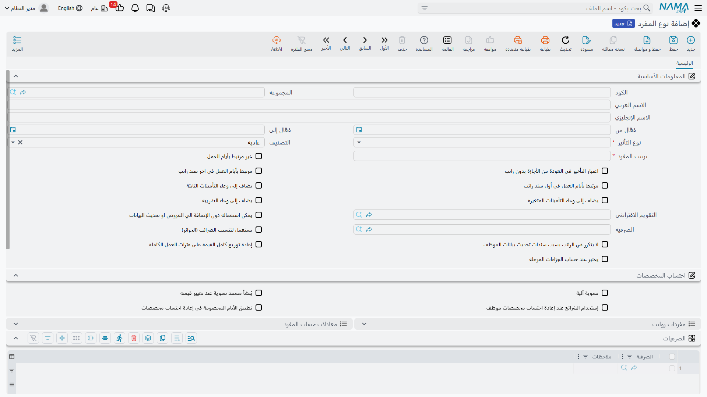

# مفردات الراتب (Salary Components)

يُبنى كل سند راتب من قطع صغيرة قابلة لإعادة الاستخدام: راتب أساسي، بدل سكن، ضريبة، سطر عمل إضافي، استقطاع تأميني. في Nama، توجد كل قطعة من هذه على مستويين — **نوع المفرد** (Salary Component Type)، الذي يحدد *فئة* الاستحقاق أو الاستقطاع والقواعد التي تحكمه، و**مفرد الراتب** (Salary Component)، وهو العنصر المُسعَّر الفعلي الذي يُسنَد للموظف. أما **مجموعة مفردات الراتب** (Salary Component Group) فوجودها لتنظيم قائمة مفردات طويلة فقط. تغطي هذه الصفحة الثلاثة جميعاً؛ أما كيف تُحسب قيمة مفرد ما حين لا تكون رقماً ثابتاً فموضوعه صفحة **[معادلات حساب الراتب](salary-calculation-formulas.md)**.

## نوع المفرد (Salary Component Type) — فئة الاستحقاق أو الاستقطاع

يوجد في **الرواتب > إعدادات الراتب > نوع المفرد**، ونوع المفرد هو الفئة — أساسي، سكن، انتقالات، ضريبة، حصة تأمين — ويحمل العلامات التي يرثها كل مفرد يُنشأ تحته.

| الحقل (عربي) | التسمية الإنجليزية | الغرض |
|---|---|---|
| الكود / المجموعة / الاسم العربي / الاسم الإنجليزي | Code / Group / Arabic Name / English Name | التعريف. |
| فعّال من / فعّال إلى | Active From / To | المدى الزمني الذي يكون فيه النوع نفسه ساري المفعول. |
| نوع التأثير | Component Effect Type | هل تُضاف مفردات هذا النوع إلى صافي الراتب، أم تُخصم منه، أم لا هذا ولا ذاك — انظر الجدول أدناه. |
| التصنيف | Classification | تصنيف أدق تستند إليه قواعد محددة في محرك الرواتب — انظر الجدول أدناه. |
| ترتيب المفرد | Component Order | تسلسل الحساب. **بالغ الأهمية**: فالمفرد الذي هو نسبة من مفرد آخر يجب أن يأتي ترتيبه **بعد** المفرد الذي يعتمد عليه. |
| التقويم الافتراضى | Default Calendar | **[تقويم الرواتب](../setup/hr-calendar-and-holidays.md)** الذي تعمل به مفردات هذا النوع ما لم يُستبدَل. |
| الصرفية | Issuance | تربط نوع المفرد بـ**[مجرى رواتب](../setup/hr-years-and-periods.md)** معيّن، فلا يغذّي إلا تشغيلته الخاصة. |

يحدد **نوع التأثير** ما يفعله المفرد فعلياً بسند الراتب:

| نوع التأثير | English | الدور |
|---|---|---|
| إضافة | Addition | يزيد الراتب — الأساسي، البدلات، العمل الإضافي. |
| إستقطاع | Deduction | يخفض الراتب — الضريبة، التأمينات، الجزاءات، الأقساط. |
| أخري | Other | للعلم فقط. يُسجَّل، لكنه لا يُضاف إلى صافي الراتب ولا يُطرح منه أبداً. |

ويضيّق **التصنيف** الفئة أكثر، ولبعض قيمه سلوك خاص مبني داخل محرك الرواتب:

| التصنيف | English | ملاحظات |
|---|---|---|
| عادية | Normal | عنصر استحقاق أو استقطاع عادي. |
| الراتب الأساسى | Basic Salary | الرقم الأساسي الذي تبني عليه معادلات كثيرة تعمل بالنسبة المئوية. |
| بدل سكن | Housing Allowance | لا يُصرف إلا لموظف فُعِّل مفتاح السكن على سجله الخاص في **[بيانات شئون الموظفين](../setup/employee-hr-information.md)** — النوع وحده لا يكفي. |
| بدل مواصلات | Transportation Allowance | القاعدة ذاتها المطبقة على السكن: مرهون بسجل الموظف نفسه. |
| نهاية خدمة | Work End | صفر عمداً في الراتب الشهري العادي؛ هذا التصنيف لا يحمل قيمة إلا داخل مستندات تصفية نهاية الخدمة. |
| قسط | Installment | صفر عمداً أيضاً في التشغيلة الشهرية العادية؛ استرداد الأقساط يتم عبر مستندات القروض الخاصة به لا عبر آلية المفردات الشهرية. |

::: tip حين يبدو المفرد وكأنه "لا يعمل"
إن كان مفرد ما يخرج دائماً صفراً، تحقق من تصنيفه ومن علامات الضريبة/التأمينات قبل افتراض وجود عطل. مفردات **«أخري»** صفر بالتصميم؛ وتصنيفا **«نهاية خدمة»** و**«قسط»** صفر خارج مستنداتهما المخصصة؛ وبدلا السكن/الانتقالات يحتاجان تفعيل المفتاح على سجل الموظف لا مجرد تعريف المفرد. انظر **[كيفية حساب الراتب](../concepts/hr-salary-engine.md)** لقائمة أسباب خروج القيمة صفراً كاملة.
:::

كما يحدد النوع هل تدخل مفرداته في **وعاء التأمينات الثابتة**، و**وعاء التأمينات المتغيرة**، و**وعاء الضريبة** — ثلاث علامات مستقلة نعم/لا — ويملك قائمتين مضمَّنتين للمرجعية: **مفردات رواتب** المُنشأة تحته، و**معادلات حساب المفرد** المرتبطة به.

## مفرد الراتب (Salary Component) — العنصر المُسعَّر

يوجد في **الرواتب > إعدادات الراتب > مفرد راتب**، وهو السجل الذي يُسنَد فعلياً إلى الموظف، إمّا مباشرةً على **[بيانات شئون الموظفين](../setup/employee-hr-information.md)** أو عبر **[هيكل راتب](salary-structures.md)**. والاختيار الأهم فيه هو **طريقة القيمة**:

| طريقة القيمة | English | المعنى |
|---|---|---|
| قيمة ثابتة | Constant Value | رقم ثابت صريح — مثلاً بدل سكن 1000. |
| متغير | Variable Value | مدفوع بـ**[معادلة حساب مفرد](salary-calculation-formulas.md)**، فيُعاد حسابه من مدخلاته كل فترة. |

يحمل المفرد أيضاً **ترتيب مفرد** و**أولوية** خاصين به (تُستعمل حين يمكن لعدة مفردات أن تنطبق ويجب أن يفوز واحد فقط)، وعدداً من العلامات الدقيقة: هل يُسمح أصلاً بتعديل قيمته على سند راتب مُصدر (**لا يمكن تعديل قيمة المفرد في سند الراتب**)، وهل تترك إعادة إصدار سجل الرواتب القيم المعدَّلة يدوياً كما هي (**عدم تعديل القيمة عند إعادة الإصدار**)، وهل يُسمح بقيم سالبة، ونفس علامات وعاء التأمينات الثابتة/المتغيرة والضريبة الموجودة على النوع (يمكن للمفرد أن يضيّق ما يسمح به نوعه، لا أن يوسّعه).

### على من ينطبق

في تبويب **مجال التطبيق** (Apply Scope)، يمكن تقييد المفرد بـ**معيار ملف الموظف** و**معيار معلومات شئون الموظفين** (فلاتر حرة على ملف الموظف الرئيسي وبياناته الوظيفية)، إضافة إلى مديات **من/إلى** صريحة على الشركة والفرع والإدارة والقطاع والمجموعة التحليلية والموظف وإدارة الموظف والوظيفة والجنسية والمجموعة. تركها مفتوحة يطبّق المفرد على نطاق واسع؛ وتضييقها يتيح لنوع مفرد واحد أن يحمل عدة مفردات بمجالات تطبيق مختلفة — مثل بدل انتقالات لا ينطبق إلا على فرع بعينه.

### أين يُرحَّل — سطور الحسابات

يحمل المفرد **سطور حسابات مدينة** و**سطور حسابات دائنة** خاصة به، لكل منها نسبة مشاركة ومصدر حساب قابل للتهيئة الكاملة (حساب ثابت، أو حساب يُقرأ من حقل مرجع، أو حساب يُختار من "حقيبة" حسابات حسب العملة) إضافة إلى قالب شرح. وهذا بالضبط ما يتيح لـ**[سند الراتب](salary-documents.md)** الترحيل إلى دفتر الأستاذ: فالسند نفسه لا يحمل أي منطق محاسبي خاص به — هو فقط يجمع سطور مفرداته ويُرحِّل عبر سطور حسابات كل مفرد. وتتوفر أيضاً مجموعة **الحسابات** الأبسط (حساب رئيسي وخمسة حسابات احتياطية مرقّمة) للمفردات التي لا تحتاج التهيئة الكاملة للمدين/الدائن.

## مجموعة مفردات راتب (Salary Component Group) — تنظيم فقط

**مجموعة مفردات راتب** (**الرواتب > إعدادات الراتب > مجموعة مفردات راتب**) تجمع فقط المفردات المرتبطة معاً لأغراض الفلترة والتقارير. ليس لها أي أثر على كيفية حساب مفرد أو أين يُرحَّل — تنظيم بحت، لا أكثر.

## صفحات ذات صلة

- **[معادلات حساب الراتب](salary-calculation-formulas.md)** — كيف يحصل مفرد ذو قيمة متغيرة على رقمه.
- **[هياكل الراتب](salary-structures.md)** — قوالب قابلة لإعادة الاستخدام تُسنِد المفردات لمجموعات من الموظفين.
- **[كيفية حساب الراتب](../concepts/hr-salary-engine.md)** — خط الأنابيب الكامل من خمس خطوات الذي تقع هذه الكيانات ضمنه.
- **[بيانات شئون الموظفين](../setup/employee-hr-information.md)** — أين تعيش سطور مفردات الموظف الخاصة، وأين تُفعَّل مفاتيح السكن/الانتقالات.
