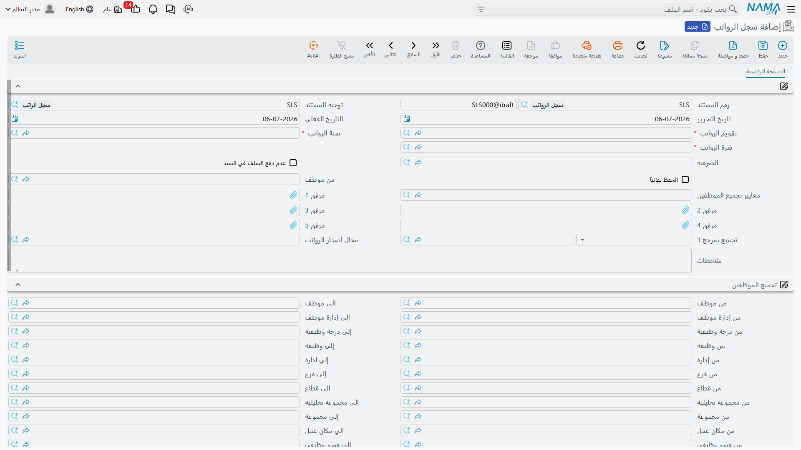
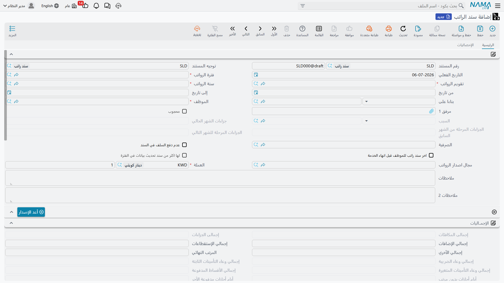

# مستندات الرواتب (Salary Documents)

كل ما في صفحات **[مفردات الراتب](salary-components.md)** و**[المعادلات](salary-calculation-formulas.md)** و**[الهياكل](salary-structures.md)** هو *إعداد* — الآلية التي تقرر كم يجب أن يتقاضى كل موظف. وهذه الصفحة هي حيث تعمل تلك الآلية أخيراً. مستندان يقومان بالمهمة: **سجل الرواتب** (Salary Sheet)، وهو التشغيل المجمّع لفترة رواتب كاملة، و**سند الراتب** (Salary Document)، وهو كشف المرتب الفردي الذي يُنتَج لكل موظف — ومصدر القيد المحاسبي.

## مستندان، مهمة واحدة

| | سجل الرواتب (Salary Sheet) | سند الراتب (Salary Document) |
|---|---|---|
| النطاق | **فترة + صرفية** واحدة لكثير من الموظفين | **موظف واحد** لفترة واحدة |
| الدور | التشغيل المجمّع: تجميع الموظفين، توليد كشوفهم | كشف المرتب الفردي، ومصدر المحاسبة |
| هل يرحّل إلى دفتر الأستاذ؟ | لا — يدير فقط | **نعم** — القيد يسكن هنا |

السجل هو الزر الذي تضغطه مرة كل شهر؛ والسندات هي ما يخرج منه، واحد لكل موظف. تراجع وتضبط على السجل، لكن المال يُحدَّد، سطراً سطراً، على كل سند.

## أين تجدها

- **سجل الرواتب** — **الرواتب > الرواتب > سجل الرواتب** (Payroll > Payroll > Salary Sheet).
- **سند الراتب** — **الرواتب > الرواتب > سند الراتب** (Payroll > Payroll > Salary Document).
- **مجال اصدار الرواتب** — **الرواتب > إعدادات الراتب > مجال اصدار الرواتب** (Payroll > Salary Configurations > Salary Generation Range).

## سجل الرواتب — التشغيل المجمّع

يُبنى السجل لـ**فترة رواتب** واحدة و**صرفية راتب** واحدة في المرة — وهذا بالضبط ما يتيح للشهر نفسه أن يحمل أكثر من تشغيل متوازٍ (انظر **[سنوات وفترات الرواتب والصرفية](../setup/hr-years-and-periods.md)**). يضبط رأسه الفترةَ والشيئين اللذين يقرران *من* يُجمَع:

| الحقل (عربي ← إنجليزي) | الغرض |
|---|---|
| تقويم الرواتب / فترة الرواتب / سنة الرواتب (HR Calendar / HR Period / HR Year) | **[الإطار الزمني](../setup/hr-years-and-periods.md)** الذي ينتمي إليه هذا التشغيل. |
| توجيه المستند (Term) | التوجيه الذي يحكم ترقيم السجل. |
| معايير تجميع الموظفين (Employee Criteria Definition) | فلتر معايير حر لأي الموظفين يُجمَعون. |
| مجال اصدار الرواتب (Salary Generation Range) | قالب اختيار موظفين محفوظ وقابل لإعادة الاستخدام (انظر أدناه) يُستعمل بدل كتابة المعايير في كل مرة. |
| نطاق الموظفين (من موظف / إلى موظف … From/To Employee، إدارة، فرع، قطاع، وظيفة، جنسية، وغيرها) | كتلة نطاق *من / إلى* صريحة تضيّق الفئة المُجمَّعة. |
| عدم دفع السلف في السند (Do Not Pay Loans) | منع استقطاعات الأقساط التلقائية لهذا التشغيل. |
| عدم حذف سندات الرواتب الموجودة بالسطور المحذوفة (Do Not Delete Salary Documents Of Removed Sheet Lines) | الإبقاء على الكشوف المتولّدة حتى لو حُذف سطرها من السجل. |
| الحفظ نهائياً (Save Finally) | حفظ التشغيل نهائياً بدل مسودة. |
| إجمالي الإضافات / إجمالي الإستقطاعات / إجمالي الأخرى / المرتب النهائي (Total Additions / Total Deduction / Total Other / Net Salary) | إجماليات تجميعية عبر كل السطور، يحسبها التشغيل. |

بعد التجميع، يظهر كل موظف كسطر في جدول **سجلات الرواتب** (Salary Sheet Lines)، حاملاً صافي راتب ذلك الموظف، وأيام العمل، وإجماليات الإضافات/الاستقطاعات/الأخرى، ومربع **اختيار** (Selected) لضمّه أو استبعاده من التوليد، و — بعد التوليد — رابطاً إلى **سند الراتب** المُنتَج له، ووقت آخر توليد.

### مجال اصدار الرواتب — اختيار قابل لإعادة الاستخدام

كتابة معايير اختيار الموظفين نفسها كل شهر جهد مهدور، لذا تتيح Nama حفظها مرة واحدة كـ**مجال اصدار رواتب** — سجل رئيسي مسمّى يحمل نفس كتلة معايير *من / إلى* التي يستعملها السجل، إضافةً إلى قائمة **قصر الإصدار على الموظفين التاليين** (Limit To Employees) اختيارية لتثبيت التشغيل على قائمة محددة. يشير السجل حينئذٍ إلى المجال بدل إعادة إدخال الفلاتر. إنه إعداد اختيار محض؛ لا يحسب شيئاً ولا يرحّل شيئاً.

## سند الراتب — كشف المرتب

يصبح كل سطر يولّده السجل **سند راتب** كاملاً: موظف واحد، فترة واحدة، والتفصيل الكامل لأجره. يحمل رأسه الفترة والإجماليات المحسوبة؛ ويحمل جدول تفاصيله سطور المفردات الفردية.

| الحقل (عربي ← إنجليزي) | الغرض |
|---|---|
| الموظف (Employee) | صاحب كشف المرتب هذا. |
| من تاريخ / إلى تاريخ (From Date / To Date) | المدة التي يغطيها الراتب — الفترة عادةً، أو أقصر لشهر جزئي. |
| أيام العمل / أيام عدم العمل (Working Days / None Working Days) | عدّ الأيام الذي يُنسّب الأجر تناسبياً. |
| أيام أجازات مدفوعة الأجر / أيام أجازات بدون مرتب (Paid Vacation Days / Vacation Days Without Salary) | أيام الأجازة مقسومة بحسب كونها مدفوعة أو لا. |
| أيام إيقاف عن العمل بدون مرتب (Suspension Days Without Salary) | أيام الإيقاف غير المدفوعة التي تخفض الأجر. |
| إجمالي الإضافات / إجمالي الإستقطاعات / إجمالي الآخري (Total Additions / Total Deductions / Others Total) | إجماليات أنواع التأثير الثلاثة. |
| جزاءات الشهر الحالي / الجزاءات المرحلة من الشهر السابق / المرحلة للشهر التالي (Current Month Penalties / Postponed From Previous Month / To Next Month) | كيف تُرحَّل جزاءات هذه الفترة داخلاً وخارجاً. |
| إجمالي الأقساط المدفوعة (Total Paid Installments) | أقساط السلف المستردة في هذا التشغيل. |
| إجمالي وعاء التأمينات الثابتة / المتغيرة / إجمالي وعاء الضريبة (Fixed / Variable Insurance Basis Total / Tax Basis Total) | أوعية التأمين والضريبة التي بنتها المعادلات. |
| المرتب النهائي (Net Salary) | السطر الأخير: الإضافات − الاستقطاعات. |
| ما تم صرفة / المتبقي (Issued Value / Remaining Value) | كم صُرف مقابل هذا السند، وكم لا يزال مستحقاً. |
| فترة غير مكتملة (جزئية) (Partial Period) | يشير إلى تشغيل يغطي جزءاً من الفترة فقط. |

جدول **مفردات السند** (Salary Document Lines) هو قلب كشف المرتب. يسمّي كل سطر **مكوناً** (Component)، و**نوع تأثيره** (Component Effect Type — إضافة / استقطاع / أخرى)، ومبلغي الإضافة والاستقطاع، والقيمتين الأصلية والأساسية، وقيمة مؤشر حين غذّى الرقمَ مؤشرُ أداء، وتفصيلاً كاملاً لعدّ الأيام (أيام العمل / الأجازة / عدم العمل، كل منها مقسوم بين إجازة أسبوعية ويوم راحة). وجدولان آخران يلتقطان **المكافآت / الجزاءات** المطبّقة في هذا التشغيل، و**الأقساط المدفوعة**، وكل سطر قسط يرتبط رجوعاً بـ**[سند سلفته](../loans/hr-loan-documents.md)**.

## سير العمل

1. **افتح الفترة.** تأكد أن **[فترة الرواتب](../setup/hr-years-and-periods.md)** المستهدفة مفتوحة — الفترة المغلقة تمنع التوليد.
2. **أنشئ سجل رواتب** لتلك الفترة و**[الصرفية](../setup/hr-years-and-periods.md)** المعنية.
3. **جمّع الموظفين** بـ**تجميع الموظفين** (Collect Employees) — يسحب السجل كل من يطابق معاييره / نطاقه / مجال إصداره، متجاوزاً من دُفع له بالفعل عن تلك الفترة. استخدم **اختيار الكل / ازالة الاختيار من الكل** (Select All / Deselect All) لضبط الفئة.
4. **ولّد السندات** بـ**إصدار سندات الرواتب** (Generate Salary Documents)، أو **إصدار سندات الرواتب بدون حفظ** (Generate Salary Documents Without Save) لمعاينة الأرقام قبل الاعتماد. يُنتَج سند راتب واحد لكل سطر مختار.
5. **راجع كل كشف** — سطور المفردات، وتفصيل الأساسي/الإضافة/الاستقطاع/الأخرى، والمرتب النهائي الناتج. فإن بدا رقم خاطئاً، تشرح أعمدة عدّ الأيام والمؤشر كيف تم التوصل إليه؛ وتسرد **[صفحة محرك الرواتب](../concepts/hr-salary-engine.md)** الأسباب المعتادة لخروج مفرد بصفر.
6. **أعد التوليد عند الحاجة.** **أعد الإصدار** (Re Generate) يعيد حساب السند؛ والمفردات المؤشَّرة *عدم التجاوز بعد إعادة الإصدار* تحتفظ بأي تعديلات يدوية.

::: warning عدّل عبر السجل، لا حوله
سندات الرواتب تنتمي إلى السجل الذي أنشأها. فضبط الفئة، وإعادة التجميع، وإعادة التوليد من السجل تُبقي كل شيء متسقاً — أما حذف سند فردي أو تعديله يدوياً خارج هذا المسار فيخاطر بجعله غير متسق مع التشغيل الذي جاء منه.
:::

## كيف يُعالَج / وماذا يرحّل

**سند الراتب** هو مصدر المحاسبة — السجل نفسه لا يرحّل شيئاً؛ إنما يدير فقط. وبمجرد اعتماد سند راتب، يُبنى أثره المحاسبي كـ**طلب أعمال** في الخلفية بـ**حالة معالجة**، قابل لإعادة المحاولة من شاشة **طلبات الأعمال** إن فشل.

لا يحمل السند **منطقاً محاسبياً خاصاً به**. بل يرحّل **سطراً سطراً عبر سطور حسابات المفردات التي تكوّنه**: فلكل **[مفرد راتب](salary-components.md)** على السند، تنتج **سطور الحسابات المدينة** و**سطور الحسابات الدائنة** الخاصة به القيدَ — مفرد بتأثير إضافة يجعل حساب مصروف الرواتب مديناً وحساب استحقاق دائناً، واستقطاع يجعل الالتزام المعني دائناً، وهكذا. وسطور المكافآت/الجزاءات ترحّل عبر سطور حساباتها بالطريقة نفسها. وهذا بالضبط سبب ضبط المحاسبة على المفردات لا هنا: فسند الراتب ببساطة يجمّع سطوره ويسوق كل واحد عبر حسابات مفرده.

::: info اختياري: توزيع تكلفة المقاولات
إلى جانب الترحيلات على مستوى المفردات، يمكن لتوجيه سند الراتب أن يوزّع تكلفة العمالة إضافةً كـ**تكلفة مقاولات** — زوج **مدين تكلفة المقاولات / دائن تكلفة المقاولات** (Contracting Cost Debit / Contracting Cost Credit) المضبوط على توجيه المستند — للمؤسسات التي تحمّل وقت الموظفين على تكلفة المشاريع/العقود. هذا إضافة إلى الترحيل الأساسي القائم على المفردات، لا بديل عنه، ولا ينطبق إلا حين تكون وحدة المقاولات قيد الاستخدام.
:::

## صفحات ذات صلة

- **[كيفية حساب الراتب](../concepts/hr-salary-engine.md)** — خط الأنابيب الكامل من خمس خطوات المؤدّي إلى هذا السند.
- **[مفردات الراتب](salary-components.md)** — حيث تُضبط سطور حسابات كل مفرد (وبالتالي الأثر المحاسبي).
- **[سنوات وفترات الرواتب والصرفية](../setup/hr-years-and-periods.md)** — الفترة والصرفية اللتان يعمل السجل عليهما.
- **[حجب الرواتب](salary-blocking.md)** — حجز راتب موظف، وصرف جزء منه.
- **[الزيادات السنوية](hr-annual-increases.md)** — كيف تصل قيم المفردات المرفوعة إلى تشغيل الرواتب التالي.
