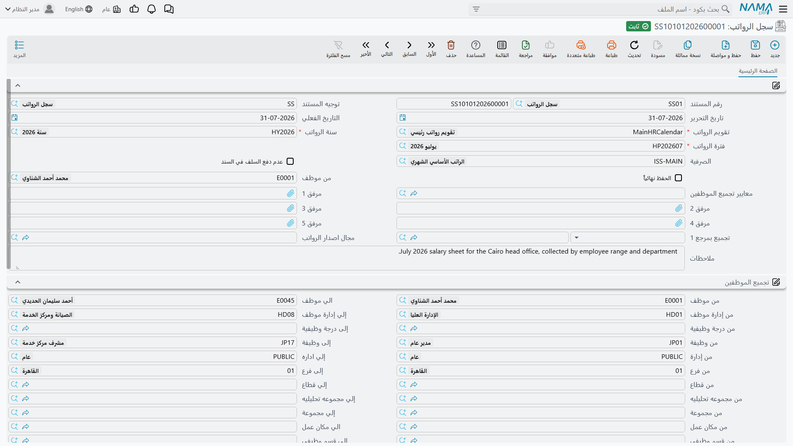
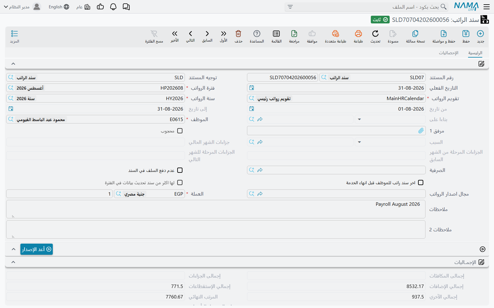

# مستندات الرواتب (Salary Documents)

كل ما في صفحات **[مفردات الراتب](salary-components.md)** و**[المعادلات](salary-calculation-formulas.md)** و**[الهياكل](salary-structures.md)** هو *إعداد* — الآلية التي تقرر كم يجب أن يتقاضى كل موظف. وهذه الصفحة هي حيث تعمل تلك الآلية أخيراً. مستندان يقومان بالمهمة: **سجل الرواتب** (Salary Sheet)، وهو التشغيل المجمّع لفترة رواتب كاملة، و**سند الراتب** (Salary Document)، وهو كشف المرتب الفردي الذي يُنتَج لكل موظف — ومصدر القيد المحاسبي.

## مستندان، مهمة واحدة

| | سجل الرواتب (Salary Sheet) | سند الراتب (Salary Document) |
|---|---|---|
| النطاق | **فترة + صرفية** واحدة لكثير من الموظفين | **موظف واحد** لفترة واحدة |
| الدور | التشغيل المجمّع: تجميع الموظفين، توليد كشوفهم | كشف المرتب الفردي، ومصدر المحاسبة |
| هل يرحّل إلى دفتر الأستاذ؟ | لا — يدير فقط | **نعم** — القيد يسكن هنا |

السجل هو الزر الذي تضغطه مرة كل شهر؛ والسندات هي ما يخرج منه، واحد لكل موظف. تراجع وتضبط على السجل، لكن المال يُحدَّد، سطراً سطراً، على كل سند.

## أين تجدها

- **سجل الرواتب** — **الرواتب > الرواتب > سجل الرواتب** (Payroll > Payroll > Salary Sheet).
- **سند الراتب** — **الرواتب > الرواتب > سند الراتب** (Payroll > Payroll > Salary Document).
- **مجال اصدار الرواتب** — **الرواتب > إعدادات الراتب > مجال اصدار الرواتب** (Payroll > Salary Configurations > Salary Generation Range).

## سجل الرواتب — التشغيل المجمّع

يُبنى السجل لـ**فترة رواتب** واحدة و**صرفية راتب** واحدة في المرة — وهذا بالضبط ما يتيح للشهر نفسه أن يحمل أكثر من تشغيل متوازٍ (انظر **[سنوات وفترات الرواتب والصرفية](../setup/hr-years-and-periods.md)**). يضبط رأسه الفترةَ وكل ما يقرر *من* يُجمَع:

| الحقل (عربي ← إنجليزي) | الغرض |
|---|---|
| تقويم الرواتب / فترة الرواتب / سنة الرواتب (HR Calendar / HR Period / HR Year) | **[الإطار الزمني](../setup/hr-years-and-periods.md)** الذي ينتمي إليه هذا التشغيل. |
| توجيه المستند (Term) | التوجيه الذي يحكم ترقيم السجل. |
| معايير تجميع الموظفين (Employee Criteria Definition) | فلتر معايير حر لأي الموظفين يُجمَعون. |
| مجال اصدار الرواتب (Salary Generation Range) | قالب اختيار موظفين محفوظ وقابل لإعادة الاستخدام (انظر أدناه) يُستعمل بدل كتابة المعايير في كل مرة. |
| نطاق الموظفين (من موظف / إلى موظف … From/To Employee، إدارة، فرع، قطاع، وظيفة، جنسية، وغيرها) | كتلة نطاق *من / إلى* صريحة تضيّق الفئة المُجمَّعة. |
| تجميع بمرجع 1 … 5 (Collect By Ref 1 … 5) | خمسة فلاتر مساواة على حقول **مرجع 1 … 5** الخاصة بالموظف — الطريقة المعتادة للتجميع بتصنيف لا تأتي به نما كحقل مستقل. |
| عدم دفع السلف في السند (Do Not Pay Loans) | منع استقطاعات الأقساط التلقائية لهذا التشغيل. |
| عدم حذف سندات الرواتب الموجودة بالسطور المحذوفة (Do Not Delete Salary Documents Of Removed Sheet Lines) | الإبقاء على الكشوف المتولّدة حتى لو حُذف سطرها من السجل. |
| الحفظ نهائياً (Save Finally) | حفظ التشغيل نهائياً بدل مسودة. |
| إجمالي الإضافات / إجمالي الإستقطاعات / إجمالي الأخرى / المرتب النهائي (Total Additions / Total Deduction / Total Other / Net Salary) | إجماليات تجميعية عبر كل السطور، يحسبها التشغيل. |

بعد التجميع، يظهر كل موظف كسطر في جدول **سجلات الرواتب** (Salary Sheet Lines)، حاملاً صافي راتب ذلك الموظف، وأيام العمل، وإجماليات الإضافات/الاستقطاعات/الأخرى، ومربع **اختيار** (Selected) لضمّه أو استبعاده من التوليد، و — بعد التوليد — رابطاً إلى **سند الراتب** المُنتَج له، ووقت آخر توليد.

### مجال اصدار الرواتب — اختيار قابل لإعادة الاستخدام

كتابة معايير اختيار الموظفين نفسها كل شهر جهد مهدور، لذا تتيح Nama حفظها مرة واحدة كـ**مجال اصدار رواتب** — سجل رئيسي مسمّى يحمل نفس كتلة معايير *من / إلى* التي يستعملها السجل، إضافةً إلى قائمة **قصر الإصدار على الموظفين التاليين** (Limit To Employees) اختيارية لتثبيت التشغيل على قائمة محددة. يشير السجل حينئذٍ إلى المجال بدل إعادة إدخال الفلاتر. إنه إعداد اختيار محض؛ لا يحسب شيئاً ولا يرحّل شيئاً.

## كيف يقرر «تجميع الموظفين» من يدخل السجل

**تجميع الموظفين** (Collect Employees) يبدو كصندوق بحث، لكنه يعمل كقُمع. يجري على مرحلتين: أولاً **يبحث في ملف الموظفين** بكل ما ملأته في رأس السجل، ثم **يمرّ على النتيجة سطراً سطراً** ويسقط كل من لا ينبغي صرف راتبه في هذا التشغيل بالذات. وكل سؤال من نوع «لماذا لم يظهر هذا الموظف في سجلي؟» يُجاب عليه تقريباً بتحديد أيّ المرحلتين أسقطته.

وهناك شرطان قبل أن يفعل الزر شيئاً أصلاً: **فترة الرواتب** يجب أن تكون مملوءة — وإلا ظهرت رسالة *من فضلك اختر الفترة* — وإذا كان توجيه السجل مؤشَّراً عليه **يجب تحديد مجال الإصدار** (Salary Range Must be Specified) فلا بد من اختيار **مجال اصدار الرواتب**، وإلا ظهرت رسالة *يجب ملء حقل مجال إصدار الرواتب*.

### المرحلة الأولى: البحث

كل فلتر في الرأس يُدمج مع غيره بـ**و** (and). فلا شيء تملؤه يلغي شيئاً آخر، ولا شيء يوسّع النتيجة: كل خانة تملؤها لا تستطيع إلا أن تُصغّر القائمة.

| الفلتر | ما الذي يطابقه |
|---|---|
| **فترة الرواتب** (HR Period) | فقط الموظفون الذين تقع **تاريخ المباشرة الفعلية** (Commencement date) لديهم في **تاريخ نهاية الفترة** أو قبله. فمن باشر بعد انتهاء الفترة بيوم لن يُجمَّع أبداً مهما ملأت من حقول أخرى. |
| **تجميع بمرجع 1–5** (Collect By Ref 1–5) | تطابق تام على حقول **مرجع 1 … مرجع 5** الخاصة بالموظف نفسه — انظر القسم التالي. |
| كتلة نطاق الموظفين (**من موظف / إلى موظف** … From/To Employee) | مقارنة *من / إلى* أبجدية على **الأكواد** لا على الأسماء — الموظف، والفرع، والقطاع، ومجموعة التحليل، والمجموعة، ومكان العمل، وقسم الإدارة، والجنسية، وشركة التأمين الطبي، والوظيفة، والإدارة، وإدارة الموظف، والوضع التنظيمي. |
| **مجال اصدار الرواتب** (Salary Generation Range) | كتلة *من / إلى* الخاصة بالمجال المحفوظ تُضاف **فوق** تلك المكتوبة على السجل، ومعها قائمة **قصر الإصدار على الموظفين التاليين** (Limit To Employees) ومعاييره الخاصة. |
| **معايير تجميع الموظفين** (Employee Criteria Definition) | سجل معايير حر، يُضاف إلى كل ما سبق. |
| محددات السجل نفسه (الشركة، الفرع، القطاع، مجموعة التحليل، الإدارة) | لا بد أن تحمل بيانات الموظف الوظيفية المحدد نفسه. والموظفون الذين محددهم هو القيمة العامة (`PUBLIC`) يجتازون اختبار الشركة دائماً. |

::: warning النطاق ومجال إصدار الرواتب لا يحل أحدهما محل الآخر
من المغري قراءة المجال المحفوظ على أنه «استعمل هذا بدل ما كتبته على السجل». وهو ليس كذلك — الاثنان **يتراكمان**. فإن قال السجل *من الموظف 1000 إلى 1999* وقال المجال *من الموظف 2000 إلى 2999*، طُبّق الشرطان معاً ولم يجمّع السجل أحداً. املأ أحدهما لا كليهما.
:::

ولاحظ ما ليس في تلك القائمة: حالة الموظف. ففي هذه المرحلة يعيد البحث **الجميع** عمداً، بمن فيهم المستقيلون والمُنهاة خدمتهم. والفلترة بالحالة مهمة المرحلة الثانية، لأن من استقال في منتصف الشهر لا يزال مستحقاً لجزء من الراتب.

### التجميع بمرجع 1 حتى 5: الفلترة على حقول مرجع الموظف نفسه

كل سجل رئيسي في نما — وبطاقة الموظف منها — يحمل خمسة حقول **مرجع عام** احتياطية، هي **مرجع 1** حتى **مرجع 5** (Reference 1 … Reference 5). وهي قادرة على الإشارة إلى أي نوع سجلات تشاء، ما يجعلها المكان القياسي لوضع تصنيف لا تأتي به نما جاهزاً: مجموعة رواتب، أو مصدر تمويل، أو نوع تعاقد، أو الشركة الدافعة، أو موقع.

وحقول **تجميع بمرجع 1** حتى **تجميع بمرجع 5** (Collect By Ref 1 … 5) في رأس سجل الرواتب هي الفلاتر المقابلة لتلك الخانات الخمس. فإن ملأت **تجميع بمرجع 2** بسجل ما، أبقى التجميع فقط الموظفين الذين يشير **مرجع 2** لديهم إلى *ذلك السجل بعينه*.

ويترتب على ذلك عدة أمور، وهي مواضع التعثّر المعتادة:

- **إنها مساواة، لا نطاق ولا تدرّج هرمي.** فلا يوجد لها زوج من/إلى، ولا تجميع صاعد: اختيار سجل أب لا يجلب الموظفين المشيرين إلى أبنائه. لا بد أن يكون مرجع الموظف هو السجل الذي اخترته بعينه.
- **حقل تجميع بمرجع الفارغ لا يفلتر شيئاً.** اتركه فارغاً وتمرّ الفئة كلها.
- **وحقل تجميع بمرجع الممتلئ يستبعد الموظفين الذين مرجعهم فارغ.** فما إن تستعمله، يسقط من التشغيل بصمت كل من لم يُملأ له ذلك التصنيف على بطاقته — وهذا أشهر أسباب عودة سجل مفلتر بهذه الطريقة ناقصاً.
- **الخمسة تُدمج مع بعضها، ومع كل ما عداها، بـ*و*.** فملء مرجع 2 ومرجع 3 معاً يعني وجوب تطابقهما كليهما.
- والفلاتر الخمسة نفسها تعمل بالسلوك ذاته في شاشة عرض العمل المجمّع، فما تتعلمه هنا ينتقل معك.

::: tip الظاهر افتراضياً هو «تجميع بمرجع 1» فقط
سجل الرواتب يخزّن الخمسة جميعاً، و**تجميع الموظفين** يقرأ الخمسة جميعاً — لكن شاشة التحرير القياسية لا تعرض إلا **تجميع بمرجع 1**. فإن احتجت 2 حتى 5، أضفها أولاً إلى شاشة تحرير سجل الرواتب عبر تعديل الشاشة؛ فما لم تكن على الشاشة فلا سبيل لملئها، والفارغ منها لا يفلتر شيئاً.

وما دمت هناك: بما أنها مراجع عامة، فمن الأفضل قصر كل واحد منها على نوع السجلات الذي يُقصد به فعلاً، وتسميته باسم يعني شيئاً للمستخدم، عبر **[القيم المسموح بها للمراجع العامة](/ar/platform/fields-and-entities-settings/fields-settings-reference-lookups)** — وإلا عُرضت على المستخدم قائمة أنواع بكل ما في النظام. وافعل الشيء نفسه على حقول مرجع 1 حتى 5 على الموظف، ووجّه الطرفين إلى **النوع نفسه**، وإلا فلن يتطابق الفلتر أبداً.
:::

### المرحلة الثانية: الاستبعادات

ما أعاده البحث يُفلتر الآن مرة أخرى، موظفاً موظفاً، بهذا الترتيب:

1. **الموظفون الموجودون أصلاً على هذا السجل يُتخطَّون.** فالضغط على تجميع الموظفين مراراً آمن — إنه يُلحق ولا يكرّر سطراً ولا يستبدل السطور الموجودة. أما السطور الفارغة التي لا تحمل موظفاً فتُنظَّف أولاً.
2. **من ليسوا على رأس العمل يُختبَرون للعمل الجزئي.** فمن حالته *على رأس العمل* يبقى. وأما البقية — المستقيلون، ومن في إجازة بدون راتب، والموقوفون — فيقرأ النظام تاريخ حالاتهم: إن تغيّرت حالتهم إلى *على رأس العمل* أو منها **داخل الفترة**، أو كان آخر تغيّر لحالتهم إجازة مدفوعة، أو كانوا ما زالوا عاملين فعلياً، أُبقوا وصُرف لهم عن الجزء الذي عملوه من الشهر. أما من يقع تاريخ إنهاء خدمته **قبل** بداية الفترة فلا يُعدّ عاملاً جزئياً أبداً، ومن ثم يسقط.
3. **من صُرف له عن هذه الفترة وهذه الصرفية يُستبعد.** فكل من له بالفعل سند راتب لنفس **فترة الرواتب** *و*نفس **صرفية الراتب** — والمسودات محسوبة — يُترك خارجاً، والسجل يخبرك بذلك: *There are N out of M employees already have salary documents for period …*. ولأن الصرفية جزء من هذا الاختبار، فإن فتح **صرفية ثانية** لنفس الشهر يجمّع الفئة كلها من جديد، وهذا بالضبط ما يتيح التشغيلات المتوازية.
4. **اختبار الشركة.** تُقرأ بيانات الموظف الوظيفية من جديد كما هي في **تاريخ استحقاق** السجل، ويسقط من كانت شركته في ذلك التاريخ ليست شركة السجل ولا الشركة العامة. وهذا ما يلتقط الموظفين المنقولين بين الشركات في منتصف السنة.
5. **من ليس له مفردات لهذه الصرفية قد يسقط** — انظر جدول الخيارات أدناه.
6. **ومن هو مدرج أصلاً على سجل رواتب آخر قد يسقط** — كذلك.

وما ينجو يُرتَّب **بكود الموظف** ويُلحَق بجدول السطور.

### خيارات تغيّر من يُجمَّع

ثلاثة مواضع مختلفة تحمل إعدادات تغيّر النتيجة بهدوء، ولهذا قد يجمّع سجلان بُنيا برأسين متطابقين أشخاصاً مختلفين:

| الإعداد | موضعه | أثره عند التأشير |
|---|---|---|
| **يجب تحديد مجال الإصدار** (Salary Range Must be Specified) | توجيه سجل الرواتب | يرفض التجميع حتى يُختار مجال اصدار رواتب — حارس جيد ضد أن يجمّع أحدهم الشركة كلها سهواً. |
| **عدم إعتبار الشركة عند تجميع الموظفين** (Ignore Legal Entity In Collecting Employees) | توجيه سجل الرواتب | يتخطى اختبار الشركة على مستوى الموظف في الخطوة 4. |
| **السماح بإصدار سندات الراتب للموظفين الذين هم بأجازة بدون راتب** (Allow Issue Salary Documents For Employees In Vacation Without Salary) | توجيه سجل الرواتب | يُبقي أيضاً من قضى **الفترة كاملة** في إجازة بدون راتب، ليُصدَر له سند يحمل مفردات *أخرى* فقط. |
| **تجميع الموظفين الذين حالتهم "علي رأس العمل" فقط في سجل الراتب** (Collect Working Employees Only In Salary Sheet) | إعدادات وحدة الموارد البشرية | يلغي الخطوة 2 تماماً: لا يُجمَّع إلا من حالتهم *على رأس العمل*. فمن استقال في منتصف الشهر يُستبعد، ويصير صرف راتبه الجزئي الأخير مسألة تُعالَج بطريقة أخرى. |
| **عدم تجميع الموظفين الذين لهم سجل رواتب على نفس الفترة** (Do not Collect Employees With Any Salary Sheet Line) | إعدادات وحدة الموارد البشرية | يستبعد من يظهر أصلاً على سجل رواتب **آخر** لنفس الفترة والصرفية، حتى لو لم يُولَّد منه سند راتب بعد. وبدونه قد يحمل سجلان نصف مكتملين الموظف نفسه. |
| **عدم تجميع الموظفين الذين ليس لهم مفردات لهذه الصرفية** (Do Not Collect Employees That Do Not Have Components For This Issuance) | صرفية الراتب | لا يُبقي إلا من له فعلاً **[مفرد راتب](salary-components.md)** مرتبط بهذه الصرفية — إما على سطر مفرداته هو، أو عبر نوع المفرد. مثالي لصرفية مكافأة أو عمولة تخصّ عدداً قليلاً من الناس. |

### حين لا يدخل موظف

انزل مع القُمع بالترتيب الذي يعمل به، وستجد الجواب عادةً في أول ثلاثة فحوص:

1. هل **تاريخ المباشرة الفعلية** لديه بعد نهاية الفترة؟
2. هل يشير أحد حقول **تجميع بمرجع** في الرأس إلى شيء لا يشير إليه حقل المرجع المقابل على بطاقته — بما في ذلك أن يكون ذلك المرجع فارغاً أصلاً؟
3. هل كتلة نطاق السجل **و**مجال إصدار الرواتب مملوءان معاً، وهل يتناقضان؟
4. هل تعمل مقارنات النطاق على **كوده**؟ فنطاق من `A100` إلى `A200` لن يلتقط الموظف `B050` مهما كان ترتيب اسمه.
5. هل حالته ليست *على رأس العمل*، مع تفعيل **تجميع الموظفين الذين حالتهم "علي رأس العمل" فقط في سجل الراتب**؟
6. هل له بالفعل سند راتب — **ولو مسودة** — لهذه الفترة *و*هذه الصرفية؟ الرسالة الظاهرة بعد التجميع تخبرك بعدد من سقطوا بهذا السبب.
7. هل شركته، كما هي في تاريخ استحقاق السجل، مختلفة عن شركة السجل؟
8. هل تشترط الصرفية مفرداً لا يملكه؟

## سند الراتب — كشف المرتب

يصبح كل سطر يولّده السجل **سند راتب** كاملاً: موظف واحد، فترة واحدة، والتفصيل الكامل لأجره. يحمل رأسه الفترة والإجماليات المحسوبة؛ ويحمل جدول تفاصيله سطور المفردات الفردية.

| الحقل (عربي ← إنجليزي) | الغرض |
|---|---|
| الموظف (Employee) | صاحب كشف المرتب هذا. |
| من تاريخ / إلى تاريخ (From Date / To Date) | المدة التي يغطيها الراتب — الفترة عادةً، أو أقصر لشهر جزئي. |
| أيام العمل / أيام عدم العمل (Working Days / None Working Days) | عدّ الأيام الذي يُنسّب الأجر تناسبياً. |
| أيام أجازات مدفوعة الأجر / أيام أجازات بدون مرتب (Paid Vacation Days / Vacation Days Without Salary) | أيام الأجازة مقسومة بحسب كونها مدفوعة أو لا. |
| أيام إيقاف عن العمل بدون مرتب (Suspension Days Without Salary) | أيام الإيقاف غير المدفوعة التي تخفض الأجر. |
| إجمالي الإضافات / إجمالي الإستقطاعات / إجمالي الآخري (Total Additions / Total Deductions / Others Total) | إجماليات أنواع التأثير الثلاثة. |
| جزاءات الشهر الحالي / الجزاءات المرحلة من الشهر السابق / المرحلة للشهر التالي (Current Month Penalties / Postponed From Previous Month / To Next Month) | كيف تُرحَّل جزاءات هذه الفترة داخلاً وخارجاً. |
| إجمالي الأقساط المدفوعة (Total Paid Installments) | أقساط السلف المستردة في هذا التشغيل. |
| إجمالي وعاء التأمينات الثابتة / المتغيرة / إجمالي وعاء الضريبة (Fixed / Variable Insurance Basis Total / Tax Basis Total) | أوعية التأمين والضريبة التي بنتها المعادلات. |
| المرتب النهائي (Net Salary) | السطر الأخير: الإضافات − الاستقطاعات. |
| ما تم صرفة / المتبقي (Issued Value / Remaining Value) | كم صُرف مقابل هذا السند، وكم لا يزال مستحقاً. |
| فترة غير مكتملة (جزئية) (Partial Period) | يشير إلى تشغيل يغطي جزءاً من الفترة فقط. |

جدول **مفردات السند** (Salary Document Lines) هو قلب كشف المرتب. يسمّي كل سطر **مكوناً** (Component)، و**نوع تأثيره** (Component Effect Type — إضافة / استقطاع / أخرى)، ومبلغي الإضافة والاستقطاع، والقيمتين الأصلية والأساسية، وقيمة مؤشر حين غذّى الرقمَ مؤشرُ أداء، وتفصيلاً كاملاً لعدّ الأيام (أيام العمل / الأجازة / عدم العمل، كل منها مقسوم بين إجازة أسبوعية ويوم راحة). وجدولان آخران يلتقطان **المكافآت / الجزاءات** المطبّقة في هذا التشغيل، و**الأقساط المدفوعة**، وكل سطر قسط يرتبط رجوعاً بـ**[سند سلفته](../loans/hr-loan-documents.md)**.

## سير العمل

1. **افتح الفترة.** تأكد أن **[فترة الرواتب](../setup/hr-years-and-periods.md)** المستهدفة مفتوحة — الفترة المغلقة تمنع التوليد.
2. **أنشئ سجل رواتب** لتلك الفترة و**[الصرفية](../setup/hr-years-and-periods.md)** المعنية.
3. **جمّع الموظفين** بـ**تجميع الموظفين** (Collect Employees) — يسحب السجل كل من يطابق معاييره ونطاقه ومجال إصداره وفلاتر «تجميع بمرجع»، ثم يُسقط من صُرف له بالفعل عن تلك الفترة وتلك الصرفية. واقرأ الرسالة التي تظهر بعده: فهي تخبرك بعدد من طابقوا المعايير ثم استُبعدوا لأن لهم سند راتب بالفعل. واضغط الزر ثانيةً بعد تغيير أي فلتر — فهو يُلحق ولا يكرّر. استخدم **اختيار الكل / ازالة الاختيار من الكل** (Select All / Deselect All) لضبط الفئة، وراجع قسم «كيف يقرر تجميع الموظفين من يدخل السجل» أعلاه حين يغيب أحدهم.
4. **ولّد السندات** بـ**إصدار سندات الرواتب** (Generate Salary Documents)، أو **إصدار سندات الرواتب بدون حفظ** (Generate Salary Documents Without Save) لمعاينة الأرقام قبل الاعتماد. يُنتَج سند راتب واحد لكل سطر مختار.
5. **راجع كل كشف** — سطور المفردات، وتفصيل الأساسي/الإضافة/الاستقطاع/الأخرى، والمرتب النهائي الناتج. فإن بدا رقم خاطئاً، تشرح أعمدة عدّ الأيام والمؤشر كيف تم التوصل إليه؛ وتسرد **[صفحة محرك الرواتب](../concepts/hr-salary-engine.md)** الأسباب المعتادة لخروج مفرد بصفر.
6. **أعد التوليد عند الحاجة.** **أعد الإصدار** (Re Generate) يعيد حساب السند؛ والمفردات المؤشَّرة *عدم التجاوز بعد إعادة الإصدار* تحتفظ بأي تعديلات يدوية.

::: warning عدّل عبر السجل، لا حوله
سندات الرواتب تنتمي إلى السجل الذي أنشأها. فضبط الفئة، وإعادة التجميع، وإعادة التوليد من السجل تُبقي كل شيء متسقاً — أما حذف سند فردي أو تعديله يدوياً خارج هذا المسار فيخاطر بجعله غير متسق مع التشغيل الذي جاء منه.
:::

## كيف يُعالَج / وماذا يرحّل

**سند الراتب** هو مصدر المحاسبة — السجل نفسه لا يرحّل شيئاً؛ إنما يدير فقط. وبمجرد اعتماد سند راتب، يُبنى أثره المحاسبي كـ**طلب أعمال** في الخلفية بـ**حالة معالجة**، قابل لإعادة المحاولة من شاشة **طلبات الأعمال** إن فشل.

لا يحمل السند **منطقاً محاسبياً خاصاً به**. بل يرحّل **سطراً سطراً عبر سطور حسابات المفردات التي تكوّنه**: فلكل **[مفرد راتب](salary-components.md)** على السند، تنتج **سطور الحسابات المدينة** و**سطور الحسابات الدائنة** الخاصة به القيدَ — مفرد بتأثير إضافة يجعل حساب مصروف الرواتب مديناً وحساب استحقاق دائناً، واستقطاع يجعل الالتزام المعني دائناً، وهكذا. وسطور المكافآت/الجزاءات ترحّل عبر سطور حساباتها بالطريقة نفسها. وهذا بالضبط سبب ضبط المحاسبة على المفردات لا هنا: فسند الراتب ببساطة يجمّع سطوره ويسوق كل واحد عبر حسابات مفرده.

::: info اختياري: توزيع تكلفة المقاولات
إلى جانب الترحيلات على مستوى المفردات، يمكن لتوجيه سند الراتب أن يوزّع تكلفة العمالة إضافةً كـ**تكلفة مقاولات** — زوج **مدين تكلفة المقاولات / دائن تكلفة المقاولات** (Contracting Cost Debit / Contracting Cost Credit) المضبوط على توجيه المستند — للمؤسسات التي تحمّل وقت الموظفين على تكلفة المشاريع/العقود. هذا إضافة إلى الترحيل الأساسي القائم على المفردات، لا بديل عنه، ولا ينطبق إلا حين تكون وحدة المقاولات قيد الاستخدام.
:::

## صفحات ذات صلة

- **[كيفية حساب الراتب](../concepts/hr-salary-engine.md)** — خط الأنابيب الكامل من خمس خطوات المؤدّي إلى هذا السند.
- **[مفردات الراتب](salary-components.md)** — حيث تُضبط سطور حسابات كل مفرد (وبالتالي الأثر المحاسبي).
- **[سنوات وفترات الرواتب والصرفية](../setup/hr-years-and-periods.md)** — الفترة والصرفية اللتان يعمل السجل عليهما.
- **[حجب الرواتب](salary-blocking.md)** — حجز راتب موظف، وصرف جزء منه.
- **[الزيادات السنوية](hr-annual-increases.md)** — كيف تصل قيم المفردات المرفوعة إلى تشغيل الرواتب التالي.
- **[حقول المرجع والبحث](/ar/platform/fields-and-entities-settings/fields-settings-reference-lookups)** — قصر وتسمية حقول مرجع 1–5 العامة التي يطابق عليها «تجميع بمرجع».
