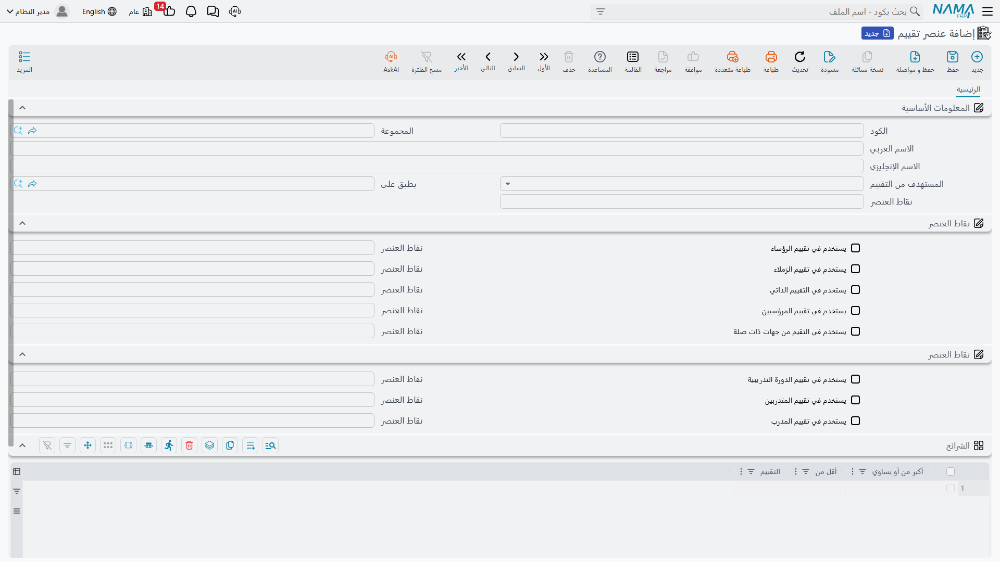
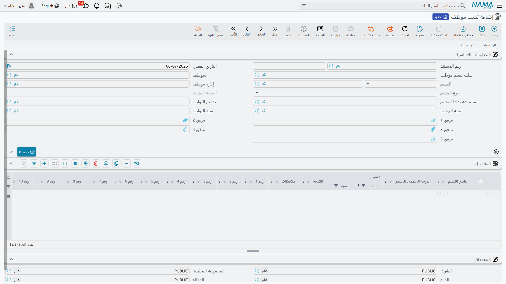

# تقييم الموظف (Employee Evaluation)

بينما تقيس **[مؤشرات الأداء](performance-indicators.md)** أشياء يمكن عدّها آلياً — ساعات، مرات تكرار، مبيعات — فإن **تقييم موظف** (Employee Evaluation) مخصص للجوانب من الأداء التي تحتاج إلى **حكم بشري**: مدى جودة تواصل الموظف، مدى انتظامه في العمل، كيف يتعامل مع عميل صعب. تغطي هذه الصفحة كيف يُبنى تقييم دوري من كتالوج معايير مُقيَّمة بنقاط، وكيف يمكن لهذا التقييم بدوره أن يصبح مؤشر أداء بحد ذاته.

## أين تجدها

| الشاشة | مسار القائمة |
|---|---|
| عنصر تقييم (الكتالوج) | الموارد البشرية > الأساسيات > عنصر تقييم |
| مجموعة نقاط تقييم | الموارد البشرية > التدريب > مجموعة نقاط تقييم |
| طلب تقييم موظف | الموارد البشرية > سندات التوظيف > طلب تقييم موظف |
| تقييم موظف | الموارد البشرية > سندات التوظيف > تقييم موظف |

## عنصر تقييم — معيار تقييم واحد

**عنصر تقييم** (Evaluation Element) هو معيار واحد مسمّى — "الانتظام في المواعيد"، "العمل الجماعي"، "جودة العمل" — له **نقاط العنصر** (Default Weight)، أي الحد الأقصى من النقاط الذي يستحقه. ما يجعل العنصر قابلاً لإعادة الاستخدام عبر أنواع مختلفة تماماً من التقييم هو أنه يحمل **وزنه الخاص لكل زاوية تقييم**: يمكن أن يستحق عنصر "التواصل" 10 نقاط حين يقيّمه مدير موظفاً، لكن 5 نقاط فقط حين يقيّم الزملاء بعضهم بعضاً.

| زاوية التقييم | English | علامة الاستخدام | حقل النقاط الخاص بها |
|---|---|---|---|
| رؤساء | Upper | يستخدم في تقييم الرؤساء | نقاط العنصر (تقييم الرؤساء) |
| مرؤسيين | Lower | يستخدم في تقييم المرؤسيين | نقاط العنصر (تقييم المرؤوسين) |
| زملاء | Peer | يستخدم في تقييم الزملاء | نقاط العنصر (تقييم الزملاء) |
| ذاتي | Self | يستخدم في التقييم الذاتي | نقاط العنصر (التقييم الذاتي) |
| جهة من الخارج | External | يستخدم في التقيم من جهات ذات صلة | نقاط العنصر (التقييم الخارجي) |

يحمل سجل العنصر نفسه ثلاث زوايا إضافية يعيد التدريب استخدامها — **تقييم الدورة التدريبية**، **تقييم المتدربين**، و**تقييم المدرب** — كل منها بعلامة استخدام ونقاط خاصة بها، بحيث يمكن لنفس كتالوج المعايير أن يخدم تقييماً دورياً للموظفين وتقييماً بعد دورة تدريبية على السواء (انظر **[تقييم الدورة التدريبية](../training/hr-course-evaluation.md)**).

يمكن أيضاً قصر العنصر على **يطبق على** وظيفة معينة، وهو يحمل جدول **الشرائح** (Ranges) الخاص به الذي يحوّل درجة خام إلى تسمية نوعية:

| عمود الشرائح | English | المعنى |
|---|---|---|
| أكبر من أو يساوي | Greater Than Or Equal | الحد الأدنى لهذه الشريحة. |
| أقل من | Less Than | الحد الأعلى لهذه الشريحة. |
| التقييم | Evaluation | التسمية التي تقابلها هذه الشريحة (مثلاً "ممتاز"، "جيد"، "يحتاج تحسين"). |

## مجموعة نقاط تقييم — حزمة معايير قابلة لإعادة الاستخدام

بدلاً من اختيار العناصر واحداً واحداً في كل تقييم، تجمع **مجموعة نقاط تقييم** (Evaluation Elements Group) مجموعة ثابتة من العناصر — مع ملحوظة لكل عنصر — تحت كود واحد، مرتبطة بـ**المستهدف من التقييم**. فمجموعة "تقييم المدير"، مثلاً، قد تجمع الانتظام في المواعيد وجودة العمل والعمل الجماعي، جاهزة لسحبها إلى تقييم بضغطة واحدة.

## طلب تقييم موظف — التخطيط للتقييم

يهيّئ **طلب تقييم موظف** (Employee Evaluation Request) من الذي سيُقيَّم، ومن الذي يقيِّمه، وضد أي معايير، قبل أن تبدأ عملية التقييم فعلياً: الموظف، المقيم، إدارة الموظف، **نوع التقييم** (أي من الزوايا الخمس أعلاه ينطبق)، **مجموعة نقاط التقييم** التي تُسحب منها المعايير، وتقويم/سنة/فترة الرواتب التي ينتمي إليها التقييم. الضغط على زر **تجميع** (Collect) يسحب كل عنصر من مجموعة نقاط التقييم المختارة مباشرة إلى جدول تفاصيل الطلب، فلا يحتاج المقيِّم إلى إضافة كل معيار يدوياً.

## تقييم موظف — التقييم فعلياً

يحمل **تقييم موظف** نفس رأس الطلب، إضافة إلى رابط يعود إليه عبر حقله الخاص **طلب تقييم موظف** — بحيث يتحول تقييم مخطَّط له إلى تقييم مُقيَّم دون إعادة إدخال من ومن ومقابل أي معايير. ويمكن فتحه مباشرة أيضاً، دون أن يبدأ من طلب على الإطلاق.

| الحقل | English | ملاحظات |
|---|---|---|
| طلب تقييم موظف | Employee Evaluation Request | الطلب الذي خُطِّط له هذا التقييم منه، إن وُجد. |
| الموظف / المقيم | Employee / Evaluator | من يُقيَّم، ومن يقوم بالتقييم. |
| إدارة موظف | Employee Department | إدارة الموظف، لأغراض التقارير. |
| نوع التقييم | Evaluation Type | أي من الزوايا الخمس (رؤساء/مرؤوسين/زملاء/ذاتي/خارجي) يمثلها هذا التقييم. |
| النسبة النهائية | Final Percentage | النتيجة المجمّعة عبر كل عنصر مُقيَّم. |
| مجموعة نقاط التقييم | Elements Group | حزمة المعايير التي يستمد منها هذا التقييم. |
| تقويم / سنة / فترة الرواتب | HR Calendar / Year / Period | فترة الموارد البشرية التي ينتمي إليها هذا التقييم. |

يسحب زر **تجميع** مرة أخرى معايير مجموعة نقاط التقييم إلى جدول **التفاصيل**، حيث يحمل كل سطر: **عنصر التقييم**، **الدرجة العظمى للعنصر** (السقف من نقاط العنصر الافتراضية)، **النقاط** المُحرَزة فعلياً، **النسبة** الناتجة، و**النتيجة** — التسمية النوعية الناتجة عن مطابقة الدرجة مع شرائح العنصر نفسه. تتوفر أيضاً عشر خانات **رقم** حرة وعشر خانات **وصف** حرة لكل سطر، لأي ملاحظات منظَّمة إضافية يريد المقيِّم الاحتفاظ بها (تقييم حادثة معينة، اسم عميل، وما إلى ذلك).

صفحة ثانية، **التوصيات**، هي حيث يتحول التقييم إلى خطوات تالية: جدول من **الموصى**، **الموقع الوظيفي** له، و**التوصيات** الحرة — الإجراءات الملموسة (زيادة، دورة تدريبية، إنذار، ترقية) التي نتجت عن التقييم.

::: tip مثال محلول
لنفترض أن مجموعة نقاط تقييم "تقييم المدير" تجمع ثلاثة عناصر: الانتظام في المواعيد (نقاط افتراضية 30)، جودة العمل (نقاط افتراضية 50)، والعمل الجماعي (نقاط افتراضية 20). يمنح المدير الموظف 25 و40 و15 نقطة على الترتيب — 80 نقطة من أصل 100 ممكنة، أي نسبة نهائية إجمالية 80٪. فإذا كانت شرائح عنصر "جودة العمل" نفسه تقول "70 فأكثر = جيد"، فستظهر نتيجة هذا العنصر كـ**جيد**، حتى لو وقعت النسبة الإجمالية للتقييم في شريحة مختلفة وفق معاييرها الخاصة.
:::

## إلى أين تذهب نتائج التقييم بعد ذلك

النسبة النهائية للتقييم ليست مرتبطة بالراتب بحد ذاتها — لكنها ليست مضطرة للبقاء سجلاً قائماً بذاته أيضاً. يمكن إعداد **[مؤشر أداء](performance-indicators.md)** من نوع **نظامى** ليستمد قيمته من **عنصر تقييم**، مما يعني أن نتيجة تقييم مُعرَّفة جيداً يمكن أن تتدفق إلى **[معادلة حساب راتب](../payroll/salary-calculation-formulas.md)** تماماً كما يفعل مؤشر مبني على الحضور — فمثلاً، تحويل تقييم ربع سنوي قوي إلى إضافة مكافأة تلقائية على **[سند راتب](../payroll/salary-documents.md)** التالي.

## صفحات ذات صلة

- **[مؤشرات الأداء](performance-indicators.md)** — كيف يمكن لنتيجة تقييم أن تصبح هي نفسها مؤشراً مقيساً يغذّي معادلة راتب.
- **[تقييم الدورة التدريبية](../training/hr-course-evaluation.md)** — إعادة استخدام نفس كتالوج عناصر التقييم من جانب التدريب.
- **[كيفية حساب الراتب](../concepts/hr-salary-engine.md)** — خط الأنابيب الكامل الذي يغذّيه في النهاية مؤشر مبني على تقييم.
