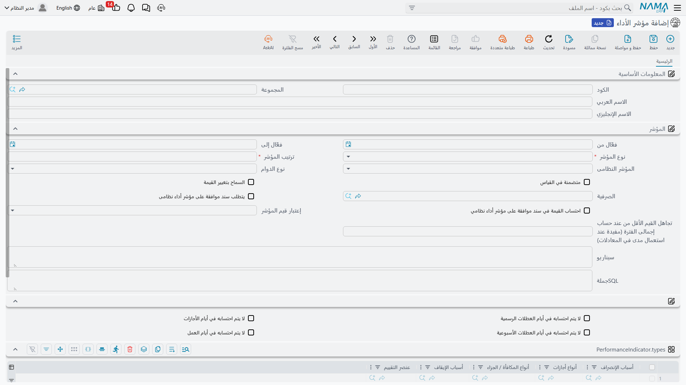
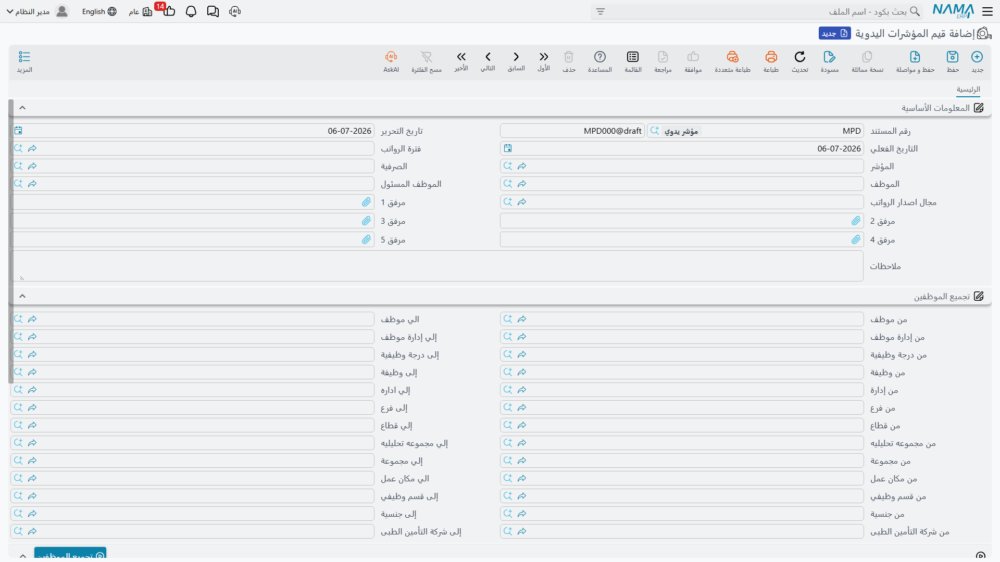

# مؤشرات الأداء (Performance Indicators)

بعض عناصر راتب الموظف ليست أرقاماً ثابتة — بل تعتمد على شيء يجب **قياسه** أولاً: كم ساعة عمل إضافية، كم مرة تأخير، كم عملية بيع أُنجزت، أو كيف كانت نتيجة آخر تقييم للموظف. **مؤشر الأداء** (Performance Indicator) هو طريقة Nama لتسمية هذا الشيء المقاس حتى تستطيع **[معادلة حساب الراتب](../payroll/salary-calculation-formulas.md)** قراءته. تغطي هذه الصفحة كيفية تعريف المؤشر، والطرق الثلاث لإدخال قيمته أو اعتمادها، وكيف يصل أثره في النهاية إلى الراتب.

## أين تجدها

| الشاشة | مسار القائمة |
|---|---|
| مؤشر الأداء (الكتالوج) | الرواتب > مؤشرات الأداء > مؤشر الأداء |
| قيمة مؤشر أداء | الرواتب > مؤشرات الأداء > قيمة مؤشر أداء |
| قيم المؤشرات اليدوية | الرواتب > مؤشرات الأداء > قيم المؤشرات اليدوية |
| موافقة على مؤشر أداء نظامى | الرواتب > مؤشرات الأداء > موافقة على مؤشر أداء نظامى |

## مؤشر الأداء — تسمية ما سيُقاس

مؤشر الأداء سجل رئيسي صغير، وأهم إعداد فيه هو **نوع المؤشر** — من أين تأتي قيمته أصلاً:

| نوع المؤشر | English | من أين تأتي القيمة |
|---|---|---|
| يدوي | Manual | تُكتب يدوياً، لكل موظف على حدة، على مستند **قيم المؤشرات اليدوية** (انظر أدناه). |
| نظامى | System | تُقرأ تلقائياً من كتالوج آخر موجود مسبقاً في Nama — انظر أدناه. |
| من سيناريو | Script | تُحسب بسيناريو (Script) مكتوب لهذا المؤشر. |
| SQL من جملة | SQL Statement | تُحسب باستعلام SQL مكتوب لهذا المؤشر. |
| Groovy Script | Groovy Script | تُحسب بسكربت Groovy مكتوب لهذا المؤشر. |

حين يكون نوع المؤشر **نظامى**، فهو لا يقرأ الحضور مباشرة — بل يعتمد على أحد خمسة كتالوجات موجودة أصلاً في الموارد البشرية، تُختار في جدول **الأنواع** الخاص به: أسباب الإنصراف، أنواع الأجازات، أنواع المكافأة/الجزاء، أسباب الإيقاف، أو **[عنصر التقييم](employee-evaluation.md)**. فمثلاً، يمكن ربط مؤشر "عدد مرات التأخير" بسبب إنصراف معين، بحيث يزيد عداد المؤشر تلقائياً كلما سُجِّل هذا السبب على موظف — دون أي كتابة يدوية.

مجموعة أخرى من الإعدادات تحدد سلوك المؤشر بمجرد أن يبدأ في تجميع القيم:

| الحقل | English | الغرض |
|---|---|---|
| فعّال من / فعّال إلى | Active From / Active To | المدى الزمني الذي يكون فيه المؤشر سارياً. |
| ترتيب المؤشر | Indicator Order | ترتيب هذا المؤشر بالنسبة لغيره، حين تغذّي أكثر من مؤشر نفس الحساب. |
| نوع الدوام | Shift Type | هل يُحتسب المؤشر خلال **الدوام الأساسي**، أو **الدوام الإضافي**، أو **أى منهما**. |
| متضمنة في القياس | Included In Measures | هل يُلتقط هذا المؤشر عند تجميع الموظفين في دفعة قيمة مؤشر أداء. |
| السماح بتغيير القيمة | Allow Overriding | هل يمكن تصحيح قيمة محسوبة نظامياً يدوياً بعد ذلك. |
| يتطلب سند موافقة على مؤشر أداء نظامى | Require Indicator Approval | يفرض مروراً بمستند **موافقة على مؤشر أداء نظامى** قبل قبول قيمة من نوع نظامى (انظر أدناه). |
| احتساب القيمة في سند موافقة على مؤشر أداء نظامي | Calculate Value In System Approval | هل يحسب مستند الموافقة نفسه القيمة، بدلاً من مجرد مراجعة قيمة محسوبة مسبقاً. |
| إعتبار قيم المؤشر | Indicator Values Consider | كيف تتراكم القيم المتكررة عبر الفترة — **سنوية**، أو **فترات مجمعة**، أو **فترة الراتب**، أو **بدون**. |
| تجاهل القيم الأقل من عند حساب إجمالى الفترة | Ignore Values Less Than When Calculating Max Value Per Period | يستبعد القيم الصغيرة من حد أقصى الفترة — مفيد حين تستعمل المعادلة مدى/شرائح على المؤشر. |
| لا يتم احتسابه في أيام العطلات الرسمية / الأجازات / العطلات الأسبوعية / أيام العمل | Not Included In Holiday / Vacations / Week Ends / WorkDays | يستبعد أثر المؤشر في أي من أنواع الأيام هذه. |
| الصرفية | Issuance | تربط المؤشر بصرفية واحدة (انظر **[سنوات وفترات الموارد البشرية](../setup/hr-years-and-periods.md)**)، للشركات التي تُشغِّل أكثر من مجرى رواتب. |

يمكن أيضاً تحديد نطاق المؤشر عبر **المحددات** (الشركة، المجموعة التحليلية، الفرع، القطاع، الإدارة)، وتعرض قائمة **معادلات حساب المفرد** للقراءة فقط في السجل كل **[معادلة حساب راتب](../payroll/salary-calculation-formulas.md)** تقرأ هذا المؤشر بالفعل — طريقة سريعة لمعرفة أين يُستخدم قياس معين فعلياً قبل تعديله.

## قيم المؤشرات اليدوية — كتابة قيمة يدوياً

حين يكون نوع المؤشر **يدوي**، تُدخَل قيمه على مستند **قيم المؤشرات اليدوية** — مستند واحد لكل دفعة من الموظفين والفترة. مجموعة **تجميع الموظفين** (من/إلى موظف، إدارة، فرع، قطاع، وظيفة/درجة وظيفية، جنسية، شركة تأمين طبي، وغيرها) مع زر **تجميع الموظفين** تسحب كل موظف مطابق دفعة واحدة، بدلاً من إضافتهم سطراً سطراً.

يحصل كل موظف مُجمَّع على سطر **تفاصيل** يضم: **المؤشر**، **القيمة**، **ملحوظة** حرة، وحتى مرفقين — مفيد لإرفاق دليل (كشف حضور موقَّع، تقرير مبيعات) خلف رقم معين.

## قيمة مؤشر أداء — الدفعة التي توفّق بين القيم اليدوية والنظامية

**قيمة مؤشر أداء** هي الدفعة الأوسع على مستوى الفترة: فيها تعيش القيم اليدوية والقيم المحسوبة تلقائياً لما يصل إلى **عشرين خانة مؤشر لكل موظف** جنباً إلى جنب، صفحة بصفحة:

| الصفحة | English | ماذا تحوي |
|---|---|---|
| المعلومات الأساسية (بجدول المؤشرات اليدوية) | Manual Details | حتى 20 زوج مؤشر/قيمة مكتوبة يدوياً لكل موظف، إضافة إلى نفس مجموعة تجميع الموظفين الموصوفة أعلاه. |
| المؤشرات الآلية | System Details | حتى 10 قيم مؤشرات محسوبة تلقائياً بواسطة النظام للفترة. |
| المؤشرات المحسوبة | Calculated Details | حتى 10 مؤشرات تُعرض **جنباً إلى جنب** — القيمة اليدوية بجوار القيمة النظامية — بحيث يرى المراجع بلمحة أين يختلف الاثنان قبل اعتماد الرقم نهائياً. |

هذا التخطيط الثلاثي هو بالضبط الطريقة التي توفّق بها Nama بين "ما كتبه شخص ما" و"ما قاسه النظام"، قبل السماح لأي منهما بتغذية معادلة راتب.

## موافقة على مؤشر أداء نظامى — تسقيف واعتماد قيمة نظامية

حين تكون علامة **يتطلب سند موافقة على مؤشر أداء نظامى** مفعَّلة على المؤشر، فإن قيمة من نوع نظامى لا تدخل مباشرة إلى الراتب — بل تمر أولاً بمستند **موافقة على مؤشر أداء نظامى**. هذا هو البوابة التي تتيح للمراجع تسقيف رقم مقيس تلقائياً واعتماده قبل احتسابه، وهو أهم ما يكون في أمور مثل ساعات العمل الإضافي، حيث يمكن لقراءة نظامية غير مراجَعة أن تضخِّم الراتب.

| الحقل | English | الغرض |
|---|---|---|
| مؤشر الأداء / المؤشر النظامى | Performance Indicator / System Indicator | أي مؤشر تغطيه هذه الموافقة. |
| أقصى عدد ساعات لليوم الواحد | Max Value Per Day / Max Value Per Day (Time) | سقف لقيمة المؤشر لأي يوم واحد. |
| تجاهل القيم الأقل من عند حساب إجمالى الفترة | Ignore Values Less Than When Calculating Max Value Per Period | نفس فكرة المؤشر نفسه — القيم الصغيرة لا تُحتسب ضمن سقف الفترة. |
| من تاريخ / إلى تاريخ | From Date / To Date | المدى الزمني الذي تغطيه هذه الموافقة. |
| التفاصيل (جدول) | Details | سطر لكل موظف، يكرر إعداد المؤشر/الموظف/المدى الزمني إضافة إلى **قيمة مؤشر الأداء خلال الفترة** الناتجة — الرقم المسقَّف الذي يُعتمَد فعلياً. |

بدلاً من لقطة شاشة منفصلة، تخيَّل نفس نمط شاشة مؤشر الأداء أعلاه: رأس يحمل المؤشر والسقف اليومي والمدى الزمني، فوق جدول تفاصيل يسرد رقماً مسقَّفاً واحداً لكل موظف.

## كيف يصبح المؤشر جزءاً من الراتب

لا تمسّ أي من الشاشات الأربع أعلاه الراتب بنفسها — لا يؤثر المؤشر في راتب إلا حين تُعدَّ **[معادلة حساب راتب](../payroll/salary-calculation-formulas.md)** لقراءته. المعادلة التي يكون **نوعها** "مرتبط بمؤشر أداء" تشير إلى مؤشر واحد، وتحدد **طريقة التطبيق** كيفية استعمال قراءته:

- **يومي** — يُحتسب المؤشر **لكل يوم عمل** على حدة.
- **فتري** — يُستعمل **إجمالي الفترة كله** للمؤشر مرة واحدة.

::: tip مثال محلول
لنفترض أن "ساعات العمل الإضافي" مؤشر **نظامى**، مرتبط بالحضور ومحاطٌ بموافقة على مؤشر أداء نظامى بسقف 3 ساعات لليوم. يسجل موظف 5 ساعات عمل إضافي في يوم واحد؛ يسقِّف مستند الموافقة أثر ذلك اليوم عند 3 ساعات. عبر الفترة، يغذّي إجمالي ساعاته الإضافية المعتمدة معادلة نوعها "مرتبط بمؤشر أداء" بطريقة تطبيق **فترية**، تضرب إجمالي الساعات في أجر ساعة إضافية لإنتاج الإضافة على **[سند راتب](../payroll/salary-documents.md)** ذلك الموظف.
:::

انظر **[كيفية حساب الراتب](../concepts/hr-salary-engine.md)** لمعرفة موضع هذا في خط الأنابيب الكامل ذي الخطوات الخمس، و**[الحضور والإنصراف](../attendance/time-attendance.md)** لمعرفة كيف تتحول البصمات اليومية إلى نوع الأرقام الخام التي تستهلكها المؤشرات النظامية والمعادلات في النهاية.

## صفحات ذات صلة

- **[معادلات حساب الراتب](../payroll/salary-calculation-formulas.md)** — نوع المعادلة "مرتبط بمؤشر أداء" الذي يقرأ فعلياً قيمة المؤشر.
- **[كيفية حساب الراتب](../concepts/hr-salary-engine.md)** — خط الأنابيب الكامل الذي تغذّيه هذه المؤشرات.
- **[الحضور والإنصراف](../attendance/time-attendance.md)** — البصمات اليومية وراء المؤشرات النظامية المبنية على الحضور.
- **[تقييم الموظف](employee-evaluation.md)** — درجات التقييم يمكن أن تصبح هي نفسها مصدراً لمؤشر نظامى.
