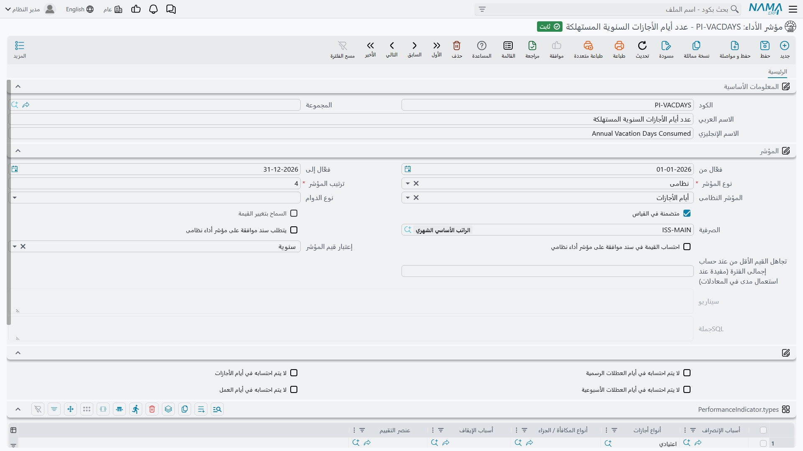
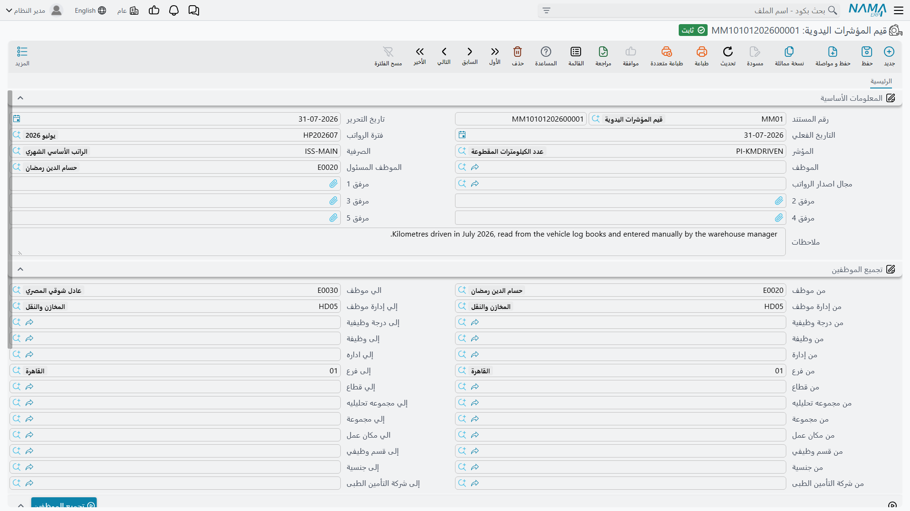

# مؤشرات الأداء (Performance Indicators)

بعض عناصر راتب الموظف ليست أرقاماً ثابتة — بل تعتمد على شيء يجب **قياسه** أولاً: كم ساعة عمل إضافية، كم مرة تأخير، كم عملية بيع أُنجزت، أو كيف كانت نتيجة آخر تقييم للموظف. **مؤشر الأداء** (Performance Indicator) هو طريقة Nama لتسمية هذا الشيء المقاس حتى تستطيع **[معادلة حساب الراتب](../payroll/salary-calculation-formulas.md)** قراءته. تغطي هذه الصفحة كيفية تعريف المؤشر، والطرق الثلاث لإدخال قيمته أو اعتمادها، وكيف يصل أثره في النهاية إلى الراتب.

## أين تجدها

| الشاشة | مسار القائمة |
|---|---|
| مؤشر الأداء (الكتالوج) | الرواتب > مؤشرات الأداء > مؤشر الأداء |
| قيمة مؤشر أداء | الرواتب > مؤشرات الأداء > قيمة مؤشر أداء |
| قيم المؤشرات اليدوية | الرواتب > مؤشرات الأداء > قيم المؤشرات اليدوية |
| موافقة على مؤشر أداء نظامى | الرواتب > مؤشرات الأداء > موافقة على مؤشر أداء نظامى |

## مؤشر الأداء — تسمية ما سيُقاس

مؤشر الأداء سجل رئيسي صغير، وأهم إعداد فيه هو **نوع المؤشر** — من أين تأتي قيمته أصلاً:

| نوع المؤشر | English | من أين تأتي القيمة |
|---|---|---|
| يدوي | Manual | تُكتب يدوياً، لكل موظف على حدة، على مستند **قيم المؤشرات اليدوية** (انظر أدناه). |
| نظامى | System | تُقرأ تلقائياً من كتالوج آخر موجود مسبقاً في Nama — انظر أدناه. |
| من سيناريو | Script | تُحسب بسيناريو (Script) مكتوب لهذا المؤشر. |
| SQL من جملة | SQL Statement | تُحسب باستعلام SQL مكتوب لهذا المؤشر. |
| Groovy Script | Groovy Script | تُحسب بسكربت Groovy مكتوب لهذا المؤشر. |

حين يكون نوع المؤشر **نظامى**، فحقل ثانٍ هو الذي يقرر كل شيء: **المؤشر النظامى** (System Indicator) يسمي *أي* قراءة يأخذها النظام — واحدة من 73 قياساً جاهزاً للحضور والوقت الإضافي والأجازات والمكافآت والتقييم وغيرها. ويصير مطلوباً بمجرد أن يكون النوع نظامياً، والقائمة كاملة في آخر هذه الصفحة.

وجدول **الأنواع** في الشاشة نفسها ليس مصدر القيمة — إنما هو **فلتر**، ولا يقبله إلا بعض المؤشرات. فالمؤشر الذي يعدّ الأجازات يمكن قصره على **أنواع أجازات** بعينها أو **أسباب إنصراف** بعينها؛ والذي يعدّ المكافآت أو الجزاءات على **أنواع مكافأة/جزاء** بعينها؛ وعدّاد الإيقاف على **أسباب إيقاف** بعينها؛ وقراءة التقييم على **[عنصر تقييم](employee-evaluation.md)** بعينه. أما المؤشرات التي تقرأ الحضور فلا تقبل فلتراً أصلاً — لأنها تقرأ سجل الحضور نفسه — وترفض الشاشة حفظ مؤشر منها وفي جدوله سطور، وتردّ بأنه «{0}لا يمكن ربط نوع سطور الأسباب بمؤشر من نوع».

::: tip قاعدتان أخريان يجلبهما النوع
**مؤشر يدوي يومي من جملة SQL** هو المؤشر النظامي الوحيد الذي تكتب قراءته بنفسك: فـ**جملة SQL** مطلوبة فيه، ويُحسب يوماً بيوم. و**إعتبار قيم المؤشر** يجب أن يبقى **بدون** ما لم يكن المؤشر نظامياً — ففي بقية الأنواع تُرفض *سنوية* و*فترات مجمعة* و*فترة الراتب* عند الحفظ.
:::

## المؤشرات النظامية الـ 73

هذه هي القيم التي يعرضها حقل **المؤشر النظامى**، بنصها كما تظهر على الشاشة. وأكثرها مفهوم بمجرد معرفة العائلة التي ينتمي إليها؛ والذي يستحق المراجعة قبل بناء معادلة على أحدها هو العمود الثالث، فهو يقول هل يقبل هذا المؤشر سطراً في جدول **الأنواع** فلتراً أم لا. وما كان عليه علامة — فهو يقرأ سجل الحضور مباشرة ويُرفض حفظه إذا كان في الجدول سطور.

وحيث ينتهي اسم المؤشر بـ*دوام 1* أو *دوام 2* أو *دوام 3* فهو يقيس جزءاً واحداً من يوم عمل مقسَّم؛ أما الاسم نفسه بغير رقم فيقيس اليوم كله.

#### الحضور والغياب وأيام العمل

| المؤشر النظامى | English | جدول الأنواع |
|---|---|---|
| ساعات الحضور (بالساعة) | Attend Hours (Hours) | — |
| ساعات الحضور دوام 1 (بالساعة) | Attend Hours Shift 1 (Hours) | — |
| ساعات الحضور دوام 2 (بالساعة) | Attend Hours Shift 2 (Hours) | — |
| ساعات الحضور دوام 3 (بالساعة) | Attend Hours Shift 3 (Hours) | — |
| ايام العمل الفعلية | Actual Work Days  | — |
| أيام العمل | Working Days | يُقبل |
| أيام عدم العمل | None Working Days | يُقبل |
| ايام العطلات الأسبوعية | Week End Days | — |
| ايام العطلات الرسمية | Holiday Days | — |
| أيام الغياب | Absense Days | — |
| غياب دوام 1 | Shift 1 Absence | — |
| غياب دوام 2 | Shift 2 Absence | — |
| غياب دوام 3 | Shift 3 Absence | — |
| شهور العمل الكلية | Total Working Months | يُقبل |
| يوم خبرة (يستخدم مع مخصص نهاية الخدمة) | Experience Day (Use With End Of Service Component) | — |
| فرق الأيام بين تاريخ المباشرة وتاريخ العودة | Days difference between work starting date and return date | يُقبل |

#### الوقت الإضافي

| المؤشر النظامى | English | جدول الأنواع |
|---|---|---|
| وقت إضافي (بالساعة) | OverTime (Hours) | — |
| وقت إضافي يوم عادي (بالساعة) | OverTime Normal Day (Hours) | — |
| وقت إضافي اى اجازة (بالساعة) | OverTime Other Than Normal Day (Hours) | — |
| وقت إضافي عطلة أسبوعية (بالساعة) | OverTime In Week Ends (Hours) | — |
| وقت إضافي يوم عطلة (بالساعة) | OverTime In Holidays (Hours) | — |
| وقت إضافي في اجازة (بالساعة)  | OverTime In Vacations (Hours) | — |
| وقت إضافي دوام 1 (بالساعة) | OverTime Shift1 (Hours) | — |
| وقت إضافي دوام 2 (بالساعة) | OverTime Shift2 (Hours) | — |
| وقت إضافي دوام 3 (بالساعة) | OverTime Shift3 (Hours) | — |

#### التأخير والحضور المبكر ونقص الدوام

| المؤشر النظامى | English | جدول الأنواع |
|---|---|---|
| ساعات التأخير (بالساعة) | Late Hours (Hours) | — |
| حضور متأخر دوام 1 (بالساعة) | Late Arrival Shift1 (Hours) | — |
| حضور متأخر دوام 2 (بالساعة) | Late Arrival Shift2 (Hours) | — |
| حضور متأخر دوام 3 (بالساعة) | Late Arrival Shift3 (Hours) | — |
| ساعات الحضور المبكر (بالساعة) | Early Hours (Hours) | — |
| حضور مبكر دوام 1 (بالساعة) | Early Arrival Shift1 (Hours) | — |
| حضور مبكر دوام 2 (بالساعة) | Early Arrival Shift2 (Hours) | — |
| حضور مبكر دوام 3 (بالساعة) | Early Arrival Shift3 (Hours) | — |
| إنصراف مبكر (بالساعة) | Early Leave (Hours) | — |
| إنصراف مبكر دوام 1 (بالساعة) | Early Leave Shift1 (Hours) | — |
| إنصراف مبكر دوام 2 (بالساعة) | Early Leave Shift2 (Hours) | — |
| إنصراف مبكر دوام 3 (بالساعة) | Early Leave Shift3 (Hours) | — |
| ساعات الخروج أثناء الدوام 1 | Out Time during shift 1 | — |
| ساعات الخروج أثناء الدوام 2 | Out Time during shift 2 | — |
| ساعات الخروج أثناء الدوام 3 | Out Time during shift 3 | — |
| إجمالي الوقت المتبقي لتحقق الدوام (بالساعة) | Under Time (Hours) | — |
| الوقت المتبقي لتحقق الدوام 1 (بالساعة) | Under Time 1 (Hours) | — |
| الوقت المتبقي لتحقق الدوام 2 (بالساعة) | Under Time 2 (Hours) | — |
| الوقت المتبقي لتحقق الدوام 3 (بالساعة) | Under Time 3 (Hours) | — |

#### البصمات الناقصة

| المؤشر النظامى | English | جدول الأنواع |
|---|---|---|
| عدم تسجيل بصمة دخول | No Check In | — |
| عدم تسجيل بصمة خروج | No Check Out | — |
| عدم تسجيل بصمة دخول دوام 1 | Shift 1 No Check In | — |
| عدم تسجيل بصمة خروج دوام 1 | Shift 1 No Check Out | — |
| عدم تسجيل بصمة دخول دوام 2 | Shift 2 No Check In | — |
| عدم تسجيل بصمة خروج دوام 2 | Shift 2 No Check Out | — |
| عدم تسجيل بصمة دخول دوام 3 | Shift 3 No Check In | — |
| عدم تسجيل بصمة خروج دوام 3 | Shift 3 No Check Out | — |

#### الأجازات والأذون والإيقاف

| المؤشر النظامى | English | جدول الأنواع |
|---|---|---|
| أيام الأجازات | Vacation Days Value  | يُقبل |
| أيام الأجازات يومي (يطبق عليه تكرارات) | Vacation Type Value Daily | — |
| عدد أجازات | Vacation Types Count | يُقبل |
| ساعات الأذون | Permissions Hours (Hours) | — |
| ساعات الأذون من نوع معين | Permissions Hours of Specific Type (Hours) | يُقبل |
| عدد أذون إنصراف | Permission Types Count | يُقبل |
| نوع ايقاف | Suspension Type | يُقبل |

#### المأموريات

| المؤشر النظامى | English | جدول الأنواع |
|---|---|---|
| مأمورية بالأيام | Days Missions | — |
| مأمورية بالساعات | Hours Missions | — |
| إجمالي عدد ساعات المأموريات من السندات (لا تأخذ التقاطع في الحسبان) | Total Mission Hours From Mission Doc (Does not consider intersections) | يُقبل |
| بدل مأمورية | Mission Allownce | يُقبل |

#### المكافآت والجزاءات

| المؤشر النظامى | English | جدول الأنواع |
|---|---|---|
| عدد مكافأت | Reward Types Count | يُقبل |
| عدد الجزاءات | Penalty Types Count | يُقبل |
| مكافأه - جزاء يومي (يطبق عليه تكرارات) | Reward Penalty Daily | — |
| الجزاءات المرحلة إلى الشهر القادم | Penalties Postponed To Next Month | يُقبل |
| الجزاءات المرحلة من الشهر السابق | Penalties Postponed From Previous Month | يُقبل |

#### التقييم

| المؤشر النظامى | English | جدول الأنواع |
|---|---|---|
| نقاط التقييم | Evaluation Points | يُقبل |
| مقلوب نقاط التقييم | Inverse Evaluation Points | يُقبل |
| نسبة التقييم | Evaluation Percent | يُقبل |
| مقلوب نسبة التقييم | Inverse Evaluation Percent | يُقبل |

#### ما تكتبه بنفسك

| المؤشر النظامى | English | جدول الأنواع |
|---|---|---|
| مؤشر يدوي يومي من جملة SQL | Daily Indicator From SQL | — |

مجموعة أخرى من الإعدادات تحدد سلوك المؤشر بمجرد أن يبدأ في تجميع القيم:

| الحقل | English | الغرض |
|---|---|---|
| فعّال من / فعّال إلى | Active From / Active To | المدى الزمني الذي يكون فيه المؤشر سارياً. |
| ترتيب المؤشر | Indicator Order | ترتيب هذا المؤشر بالنسبة لغيره، حين تغذّي أكثر من مؤشر نفس الحساب. |
| نوع الدوام | Shift Type | هل يُحتسب المؤشر خلال **الدوام الأساسي**، أو **الدوام الإضافي**، أو **أى منهما**. |
| متضمنة في القياس | Included In Measures | هل يُلتقط هذا المؤشر عند تجميع الموظفين في دفعة قيمة مؤشر أداء. |
| السماح بتغيير القيمة | Allow Overriding | هل يمكن تصحيح قيمة محسوبة نظامياً يدوياً بعد ذلك. |
| يتطلب سند موافقة على مؤشر أداء نظامى | Require Indicator Approval | يفرض مروراً بمستند **موافقة على مؤشر أداء نظامى** قبل قبول قيمة من نوع نظامى (انظر أدناه). |
| احتساب القيمة في سند موافقة على مؤشر أداء نظامي | Calculate Value In System Approval | هل يحسب مستند الموافقة نفسه القيمة، بدلاً من مجرد مراجعة قيمة محسوبة مسبقاً. |
| إعتبار قيم المؤشر | Indicator Values Consider | كيف تتراكم القيم المتكررة عبر الفترة — **سنوية**، أو **فترات مجمعة**، أو **فترة الراتب**، أو **بدون**. |
| تجاهل القيم الأقل من عند حساب إجمالى الفترة | Ignore Values Less Than When Calculating Max Value Per Period | يستبعد القيم الصغيرة من حد أقصى الفترة — مفيد حين تستعمل المعادلة مدى/شرائح على المؤشر. |
| لا يتم احتسابه في أيام العطلات الرسمية / الأجازات / العطلات الأسبوعية / أيام العمل | Not Included In Holiday / Vacations / Week Ends / WorkDays | يستبعد أثر المؤشر في أي من أنواع الأيام هذه. |
| الصرفية | Issuance | تربط المؤشر بصرفية واحدة (انظر **[سنوات وفترات الموارد البشرية](../setup/hr-years-and-periods.md)**)، للشركات التي تُشغِّل أكثر من مجرى رواتب. |

يمكن أيضاً تحديد نطاق المؤشر عبر **المحددات** (الشركة، المجموعة التحليلية، الفرع، القطاع، الإدارة)، وتعرض قائمة **معادلات حساب المفرد** للقراءة فقط في السجل كل **[معادلة حساب راتب](../payroll/salary-calculation-formulas.md)** تقرأ هذا المؤشر بالفعل — طريقة سريعة لمعرفة أين يُستخدم قياس معين فعلياً قبل تعديله.

## قيم المؤشرات اليدوية — كتابة قيمة يدوياً

حين يكون نوع المؤشر **يدوي**، تُدخَل قيمه على مستند **قيم المؤشرات اليدوية** — مستند واحد لكل دفعة من الموظفين والفترة. مجموعة **تجميع الموظفين** (من/إلى موظف، إدارة، فرع، قطاع، وظيفة/درجة وظيفية، جنسية، شركة تأمين طبي، وغيرها) مع زر **تجميع الموظفين** تسحب كل موظف مطابق دفعة واحدة، بدلاً من إضافتهم سطراً سطراً.

يحصل كل موظف مُجمَّع على سطر **تفاصيل** يضم: **المؤشر**، **القيمة**، **ملحوظة** حرة، وحتى مرفقين — مفيد لإرفاق دليل (كشف حضور موقَّع، تقرير مبيعات) خلف رقم معين.

## قيمة مؤشر أداء — الدفعة التي توفّق بين القيم اليدوية والنظامية

**قيمة مؤشر أداء** هي الدفعة الأوسع على مستوى الفترة: فيها تعيش القيم اليدوية والقيم المحسوبة تلقائياً لما يصل إلى **عشرين خانة مؤشر لكل موظف** جنباً إلى جنب، صفحة بصفحة:

| الصفحة | English | ماذا تحوي |
|---|---|---|
| المعلومات الأساسية (بجدول المؤشرات اليدوية) | Manual Details | حتى 20 زوج مؤشر/قيمة مكتوبة يدوياً لكل موظف، إضافة إلى نفس مجموعة تجميع الموظفين الموصوفة أعلاه. |
| المؤشرات الآلية | System Details | حتى 10 قيم مؤشرات محسوبة تلقائياً بواسطة النظام للفترة. |
| المؤشرات المحسوبة | Calculated Details | حتى 10 مؤشرات تُعرض **جنباً إلى جنب** — القيمة اليدوية بجوار القيمة النظامية — بحيث يرى المراجع بلمحة أين يختلف الاثنان قبل اعتماد الرقم نهائياً. |

هذا التخطيط الثلاثي هو بالضبط الطريقة التي توفّق بها Nama بين "ما كتبه شخص ما" و"ما قاسه النظام"، قبل السماح لأي منهما بتغذية معادلة راتب.

## موافقة على مؤشر أداء نظامى — تسقيف واعتماد قيمة نظامية

حين تكون علامة **يتطلب سند موافقة على مؤشر أداء نظامى** مفعَّلة على المؤشر، فإن قيمة من نوع نظامى لا تدخل مباشرة إلى الراتب — بل تمر أولاً بمستند **موافقة على مؤشر أداء نظامى**. هذا هو البوابة التي تتيح للمراجع تسقيف رقم مقيس تلقائياً واعتماده قبل احتسابه، وهو أهم ما يكون في أمور مثل ساعات العمل الإضافي، حيث يمكن لقراءة نظامية غير مراجَعة أن تضخِّم الراتب.

| الحقل | English | الغرض |
|---|---|---|
| مؤشر الأداء / المؤشر النظامى | Performance Indicator / System Indicator | أي مؤشر تغطيه هذه الموافقة. |
| أقصى عدد ساعات لليوم الواحد | Max Value Per Day / Max Value Per Day (Time) | سقف لقيمة المؤشر لأي يوم واحد. |
| تجاهل القيم الأقل من عند حساب إجمالى الفترة | Ignore Values Less Than When Calculating Max Value Per Period | نفس فكرة المؤشر نفسه — القيم الصغيرة لا تُحتسب ضمن سقف الفترة. |
| من تاريخ / إلى تاريخ | From Date / To Date | المدى الزمني الذي تغطيه هذه الموافقة. |
| التفاصيل (جدول) | Details | سطر لكل موظف، يكرر إعداد المؤشر/الموظف/المدى الزمني إضافة إلى **قيمة مؤشر الأداء خلال الفترة** الناتجة — الرقم المسقَّف الذي يُعتمَد فعلياً. |

بدلاً من لقطة شاشة منفصلة، تخيَّل نفس نمط شاشة مؤشر الأداء أعلاه: رأس يحمل المؤشر والسقف اليومي والمدى الزمني، فوق جدول تفاصيل يسرد رقماً مسقَّفاً واحداً لكل موظف.

## كيف يصبح المؤشر جزءاً من الراتب

لا تمسّ أي من الشاشات الأربع أعلاه الراتب بنفسها — لا يؤثر المؤشر في راتب إلا حين تُعدَّ **[معادلة حساب راتب](../payroll/salary-calculation-formulas.md)** لقراءته. المعادلة التي يكون **نوعها** "مرتبط بمؤشر أداء" تشير إلى مؤشر واحد، وتحدد **طريقة التطبيق** كيفية استعمال قراءته:

- **يومي** — يُحتسب المؤشر **لكل يوم عمل** على حدة.
- **فتري** — يُستعمل **إجمالي الفترة كله** للمؤشر مرة واحدة.

::: tip مثال محلول
لنفترض أن "ساعات العمل الإضافي" مؤشر **نظامى**، مرتبط بالحضور ومحاطٌ بموافقة على مؤشر أداء نظامى بسقف 3 ساعات لليوم. يسجل موظف 5 ساعات عمل إضافي في يوم واحد؛ يسقِّف مستند الموافقة أثر ذلك اليوم عند 3 ساعات. عبر الفترة، يغذّي إجمالي ساعاته الإضافية المعتمدة معادلة نوعها "مرتبط بمؤشر أداء" بطريقة تطبيق **فترية**، تضرب إجمالي الساعات في أجر ساعة إضافية لإنتاج الإضافة على **[سند راتب](../payroll/salary-documents.md)** ذلك الموظف.
:::

انظر **[كيفية حساب الراتب](../concepts/hr-salary-engine.md)** لمعرفة موضع هذا في خط الأنابيب الكامل ذي الخطوات الخمس، و**[الحضور والإنصراف](../attendance/time-attendance.md)** لمعرفة كيف تتحول البصمات اليومية إلى نوع الأرقام الخام التي تستهلكها المؤشرات النظامية والمعادلات في النهاية.

## رسائل قد تظهر لك

| الرسالة | لماذا | ما تفعله |
|---|---|---|
| «{0}لا يمكن ربط نوع سطور الأسباب بمؤشر من نوع» | **المؤشر النظامى** المختار في المؤشر هو أحد قراءات الحضور، وهي لا تقبل فلتراً أصلاً، ومع ذلك يحتوي جدول **الأنواع** على سطور. | أفرغ جدول الأنواع. فمؤشرات الحضور تقرأ سجل الحضور نفسه، ولا يقبل الفلتر إلا مؤشرات الأجازات والمكافآت/الجزاءات والإيقاف والتقييم. |
| «لا يمكن جعل الحقل {0} سنوي او فترات مجمعة إلا إذا كان نوع المؤشر نظامي» | حقل **إعتبار قيم المؤشر** مضبوط على *سنوية* أو *فترات مجمعة* أو *فترة الراتب* في مؤشر نوعُه ليس **نظامى**. | اترك الحقل على **بدون**، أو اجعل نوع المؤشر نظامياً إن كان قراءة نظامية فعلاً. |
| *The employee {0} is repeated more than once* | في **قيمة مؤشر أداء** ظهر الموظف نفسه مرتين في جدول المؤشرات اليدوية أو المحسوبة. وهذه الرسالة ليس لها نص عربي، فتظهر بالإنجليزية على الشاشات العربية. | احذف السطر المكرر — سطر واحد لكل موظف في كل خانة مؤشر. |
| «مؤشر أداء آخر {0} - للموظف {1} - منشأ على نفس الفترة  - داخل المؤشرات اليدوية سطر رقم {2}» | يوجد مستند قيمة مؤشر أداء آخر **لنفس فترة الموارد البشرية** يحمل سطراً يدوياً لهذا الموظف، فتُحتسب أرقام الفترة مرتين. | افتح المستند المذكور في الرسالة وأضف قيم الموظف فيه، أو استبعد الموظف من هذه الدفعة. |
| «مؤشر أداء آخر {0} - للموظف {1} - منشأ على نفس الفترة - داخل المؤشرات المحسوبة سطر رقم {2}» | التداخل نفسه في الجانب المحسوب: مستند آخر للفترة يحمل سطراً محسوباً للموظف. | اجمع الفترة في مستند قيمة مؤشر أداء واحد لكل موظف. |
| «مؤشر الأداء {0} ليس مؤشر نظامي» | أحد سطور **الموافقة على مؤشر أداء نظامى** يشير إلى مؤشر نوعُه يدوي أو معادلة أو Groovy؛ ولا تُسقَّف وتُعتمد بهذه الطريقة إلا القراءات النظامية. | اختر مؤشراً نظامياً، أو احذف السطر — فالقيمة اليدوية تُدخل وتُراجع في مستند قيمة المؤشر. |
| «المؤشر النظامي لمؤشر الأداء {0} نوعه {1}، حيث أنه غير مسموح به في المؤشر النظامي في السند {2}» | المؤشر نظامي فعلاً، لكن قراءته النظامية بعينها ليست من القراءات التي يقبلها مستند الموافقة هذا (فأنواع الموافقة محصورة في قراءات ساعات حضور معينة). | استخدم مستند الموافقة الذي يغطي تلك القراءة، أو اختر مؤشراً نوعه النظامي مسموح به في هذا المستند. |
| «لا يمكنك ترك الحقلين {0}، {1} فارغين» | سطر موافقة لم يُملأ فيه **أقصى قيمة لليوم** ولا **أقصى قيمة للفترة**، فلا يوجد سقف تُعتمد القيمة مقابله. | أدخل أحد السقفين على الأقل في ذلك السطر. |

## صفحات ذات صلة

- **[معادلات حساب الراتب](../payroll/salary-calculation-formulas.md)** — نوع المعادلة "مرتبط بمؤشر أداء" الذي يقرأ فعلياً قيمة المؤشر.
- **[كيفية حساب الراتب](../concepts/hr-salary-engine.md)** — خط الأنابيب الكامل الذي تغذّيه هذه المؤشرات.
- **[الحضور والإنصراف](../attendance/time-attendance.md)** — البصمات اليومية وراء المؤشرات النظامية المبنية على الحضور.
- **[تقييم الموظف](employee-evaluation.md)** — درجات التقييم يمكن أن تصبح هي نفسها مصدراً لمؤشر نظامى.
