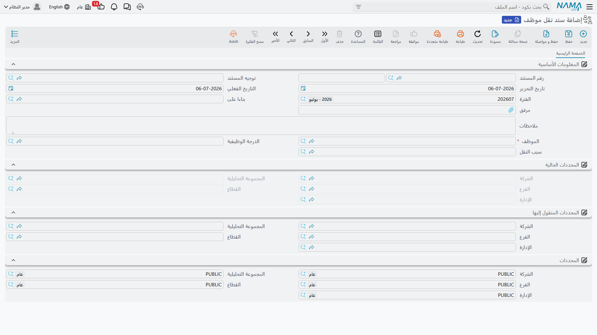
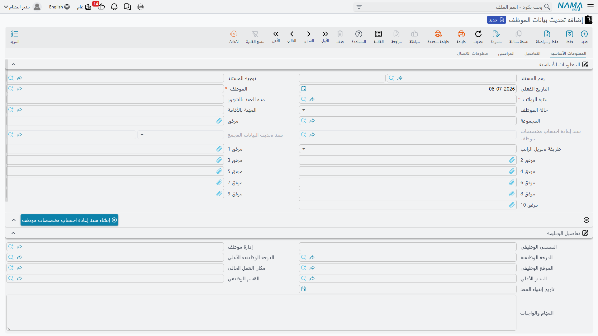

# نقل الموظف

يتغيّر الأشخاص وسجلاتهم بعد التعيين: فرع تُعاد هيكلته وتنتقل إدارة كاملة معه، موظف يحتاج علاوة أو مسمى وظيفي جديد، جواز سفر يُجدَّد، أو مشروع يحتاج مجموعة أشخاص للعمل في مكان آخر لبضعة أسابيع. تُقسّم Nama هذه الحالات إلى أدوات مستقلة بدلاً من شاشة واحدة ضخمة لـ"تعديل الموظف"، لأن لكل منها أثراً مختلفاً — أحدها يُعيد توزيع أرصدة محاسبية تاريخية، ولا يفعل ذلك أي من الباقي.

## سند نقل موظف (Employee Relocate)

يوجد في **الموارد البشرية > سندات التوظيف > سند نقل موظف**، و**سند نقل موظف** هو نقل دائم لموظف واحد من موقع تنظيمي إلى آخر — فرع مختلف، إدارة، قطاع، أو مجموعة تحليلية.

| الحقل | الغرض |
|---|---|
| الموظف (Employee) | من يُنقَل. |
| الدرجة الوظيفية (Organization Position) | الموقع في الهيكل التنظيمي الذي ينطبق عليه النقل. |
| سبب النقل (Relocate Reason) | سبب حدوث النقل. |
| المحددات الحالية — الشركة / الفرع / الإدارة / القطاع / المجموعة التحليلية (Current Dimensions) | موقع الموظف كما هو حالياً (تُقرأ من سجله). |
| المحددات الجديدة — الشركة / الفرع / الإدارة / القطاع / المجموعة التحليلية (New Dimensions) | إلى أين يُنقَل الموظف. |

::: warning لا يمكن أن يتجاوز النقل حدود الشركة
يجب أن تطابق الشركة تحت المحددات الجديدة شركة الموظف الحالية — تمنع Nama الحفظ خلاف ذلك. نقل شخص إلى شركة مختلفة هو نوع مختلف تماماً من المعاملات (علاقة توظيف جديدة، من الناحيتين المحاسبية والقانونية)، وليس نقلاً.
:::

## كيف تتم المعالجة / ما الذي تُرحّله

حفظ سند نقل موظف يفعل شيئين في آن واحد:

1. يُحدّث فوراً سجل الموظف نفسه بحيث يصبح فرعه وإدارته وقطاعه ومجموعته التحليلية هي المحددات الجديدة.
2. يبحث في تاريخ الموظف المحاسبي عن أي **حساب من حسابات الميزانية** (وليس حسابات قائمة الدخل مثل المصروفات أو الإيرادات) لا يتساوى مدينه ودائنه تحت تركيبة المحددات *القديمة* — عادة رصيد مستحق أو مخصص محمّل على ذلك الموظف — ويُرحّل قيداً يعيد التوزيع، فيُدين تركيبة محددات ويُدين الأخرى، بحيث يتبع الرصيد الموظف إلى موقعه الجديد بدلاً من أن يبقى موزَّعاً بصمت بين موقعين.

مفتاح **بدون تأثير محاسبي** في توجيه المستند يمكنه إيقاف الخطوة الثانية للمنشآت التي لا تريد أن يمس النقل دفتر الأستاذ إطلاقاً؛ أما الخطوة الأولى (تحديث سجل الموظف نفسه) فتحدث دائماً بصرف النظر.

### طلب نقل موظف (Employee Relocate Request)

**طلب نقل موظف**، في نفس مجموعة قائمة **الموارد البشرية > سندات التوظيف**، هو طبقة الموافقة الاختيارية القياسية الموضحة في **[طلبات ومستندات ومستندات مجمعة شئون الموظفين](../concepts/hr-requests-and-documents.md)**: نفس حقول الموظف/السبب/المحددات، بالإضافة إلى حالة الموافقة مبدئي/مقبول/مرفوض/تمت معالجته. بعد القبول، أنشئ سند نقل الموظف الفعلي منه.

## تحديث بيانات الموظف (Update Employee Info)

يوجد في **الرواتب > الأساسيات > تحديث بيانات الموظف**، وهذا السند هو الطريقة العامة لتغيير أي شيء تقريباً في بيانات موظف موجود في نقطة زمنية محددة: المسمى الوظيفي والموقع، قيم مفردات الراتب، البيانات الشخصية والمستندات الرسمية (البيانات البنكية، جواز السفر، الإقامة، رخصة العمل، التأمين الاجتماعي والصحي، تأشيرة الدخول)، تواريخ العقد، وحالة الموظف نفسها.

**المعلومات الأساسية:**

| الحقل | الغرض |
|---|---|
| الموظف | من ينطبق عليه هذا التغيير. |
| فترة الرواتب / تاريخ مباشرة العمل الفعلي (HR Period / Value Date) | الفترة التي يقع فيها التغيير، واليوم الدقيق الذي يسري منه. |
| حالة الموظف (Employee State) | تسجل تغيير حالة — **على رأس العمل**، **مستقيل**، **تم فصله**، **على المعاش**، **موقوف**، وغيرها — اعتباراً من التاريخ الفعلي. |
| تاريخ المباشرة الفعلية / تاريخ إنتهاء العقد / مدة العقد بالشهور | تواريخ مدة التوظيف. |
| المجموعة (Group) | مجموعة الموظفين التي ينتمي إليها هذا الشخص. |
| طريقة تحويل الراتب (Salary Payment Method) | طريقة صرف راتب الموظف. |

**تفاصيل الوظيفة:**

| الحقل | الغرض |
|---|---|
| المسمي الوظيفي / إدارة موظف / الدرجة الوظيفية / الدرجة الوظيفيه الأعلي / الموقع الوظيفي / المدير الأعلي | مكان الوظيفة في الهيكل التنظيمي، مطابقة لنفس الحقول في **[عرض وظيفي](job-offers-and-tests.md)**. |
| مكان العمل الحالي (Current Work Place) | موقع العمل الفعلي. |
| القسم الوظيفي (Department Section) | تجميع أدق تحت الإدارة. |
| المهام والواجبات (Duties And Tasks) | وصف للدور الوظيفي. |

يسرد جدول **مفردات رواتب** مفردات راتب الموظف مع **قيمة مفرد الراتب** الجديدة و**قيمة مفرد الراتب السابقة** جنباً إلى جنب لكل سطر، لتتجمّع في رقمين للقراءة فقط: **إجمالي الراتب السابق** و**إجمالي الراتب** — فيظهر التغيير في الراتب كرقم واحد قبل الحفظ. جدول **الأجازات** يتيح تعديل الاستحقاق (الأيام المخصصة، ملف الرصيد، أساس عدد أيام السنة) بنفس الطريقة. صفحات أخرى تحمل بيانات التواصل الشخصية للموظف، البيانات البنكية ورقم IBAN، المستندات الرسمية (جواز السفر، الإقامة، رخصة العمل، الرقم القومي، التأمين الاجتماعي، التأمين الصحي، تأشيرة الدخول)، ومع مفتاحي **تحديث المرافقين** / **تحديث المؤهلات**، خيار إعادة مزامنة المرافقين والمؤهلات من مكان آخر إلى سجل الموظف نفسه.

::: tip لماذا هذا السند هو ما يُقسّم حساب الراتب
تحديث بيانات الموظف هو بالضبط الآلية وراء تحذير **[محرك الرواتب](../concepts/hr-salary-engine.md)** من أن "تغيير بيانات في منتصف الفترة يُقسّم الحساب إلى قطاعات". لأن تاريخه الفعلي يمكن أن يقع في أي يوم داخل فترة رواتب — وليس فقط أول يوم فيها — فإن أي علاوة أو نقل أو تغيير آخر يُسجَّل هنا يسري اعتباراً من ذلك التاريخ بالضبط. وعندما يعمل سجل رواتب تلك الفترة لاحقاً، يجد سطور مفردات الموظف مؤرَّخة على قطاعين (القيم القديمة حتى اليوم السابق، والقيم الجديدة من التاريخ الفعلي فصاعداً) ويحسب كل قطاع على حدة. إذا بدا إجمالي مفرد ما غير صحيح في ذلك الشهر، فهذا السند — وتاريخه الفعلي — هو أول مكان يجب التحقق منه.
:::

يظهر زر **إنشاء سند إعادة احتساب مخصصات موظف** عندما يكون أحد المفردات المتغيرة معلَّماً بالتعديل التلقائي عند التغيير؛ فيُنشئ سند **[إعادة احتساب المخصصات](../end-of-service/hr-provisions.md)** المطابق ليبقى مخصص نهاية الخدمة متوافقاً مع قيم المفردات الجديدة.

### سند تحديث بيانات موظف مجمع (Aggregated Update Employee Info)

يوجد في **الرواتب > الأساسيات > سند تحديث بيانات موظف مجمع**، وهذه هي النسخة المجمّعة لتطبيق *نفس* تغيير البيانات على عدة موظفين دفعة واحدة — تعديل غلاء معيشة لإدارة كاملة، مثلاً. حدد نطاق الموظفين أو المعايير، واضغط **تجميع البيانات** لسحب كل موظف مطابق، سطر واحد لكل موظف في جدول **معلومات الموظف**. جدولا **مفردات الراتب** و**الأجازات** المشتركان يحملان تغييرات المفردات والاستحقاق المطبَّقة على كل موظف مُجمَّع، مع اختيار **نوع تحديث مفردات الراتب** / **نوع تحديث الأجازات** بين **إضافة وتحديث** (إضافة سطور جديدة وتحديث المطابق منها) أو **استبدال** (استبدال سطور الموظف الحالية كلياً). كل سطر موظف مُجمَّع ينشئ سند تحديث بيانات موظف عادياً خاصاً به تحته — كما هو الحال مع أي **[مستند مجمع](../concepts/hr-requests-and-documents.md)**، اعمل في الدفعة، لا في الأفراد التي تنتجها.

## تحديث مكان العمل (Work Place Update)

يوجد في **الموارد البشرية > الأساسيات > تحديث مكان العمل**، وهذه أداة أخف وأضيق نطاقاً من الأداتين أعلاه: تُغيّر فقط مكان عمل الموظف الفعلي، لفترة زمنية محددة، دون المساس بأي شيء آخر في سجله — مفيدة لتكليف مؤقت بمشروع أو انتداب قصير المدى لموقع آخر.

| الحقل | الغرض |
|---|---|
| مكان العمل الحالي / من تاريخ / إلى تاريخ (في الترويسة) | القيم الافتراضية المطبَّقة على كل سطر لا يحدد قيمه الخاصة. |
| الموظف (لكل سطر) | من يُعاد تكليفه مؤقتاً. |
| مكان العمل / مكان العمل السابق (لكل سطر) | الموقع الجديد، والموقع الذي يحل محله (يُلتقط تلقائياً). |
| من تاريخ / إلى تاريخ (لكل سطر) | الفترة التي يغطيها إعادة تكليف هذا السطر تحديداً. |

::: tip أثر مرتبط بالتاريخ
مكان العمل الجديد لا يسري إلا على السطور التي يشمل نطاقها من/إلى التاريخ الحالي في لحظة حفظ السند. إذا كان نطاق سطر ما يبدأ في المستقبل، أعد حفظ السند عند حلول ذلك التاريخ (أو استخدم آلية جدولة/مستند مصدر) حتى يسري إعادة التكليف فعلياً على سجل الموظف.
:::

## صفحات ذات صلة

- **[كيف يُحسب الراتب](../concepts/hr-salary-engine.md)** — لماذا يُقسّم تحديث بيانات موظف في منتصف الفترة حساب الشهر إلى قطاعات.
- **[بيانات شئون الموظفين](../setup/employee-hr-information.md)** — السجل الذي تُحدّث هذه المستندات سطور مفرداته وتفاصيله.
- **[طلبات ومستندات ومستندات مجمعة شئون الموظفين](../concepts/hr-requests-and-documents.md)** — نمط الطلب/المستند/المجمع خلف طلب نقل موظف وسند تحديث بيانات موظف مجمع.
- **[مخصصات شئون الموظفين](../end-of-service/hr-provisions.md)** — إعادة احتساب نهاية الخدمة التي قد يُطلقها تغيير بيانات تلقائياً.
