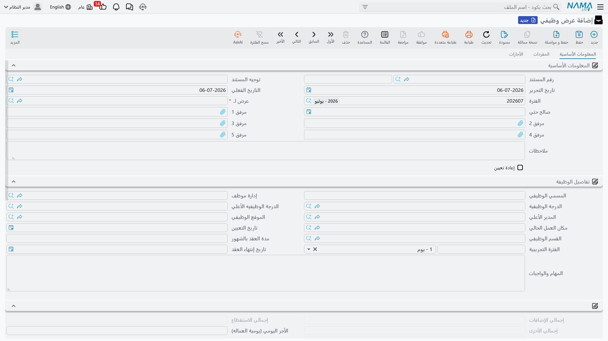
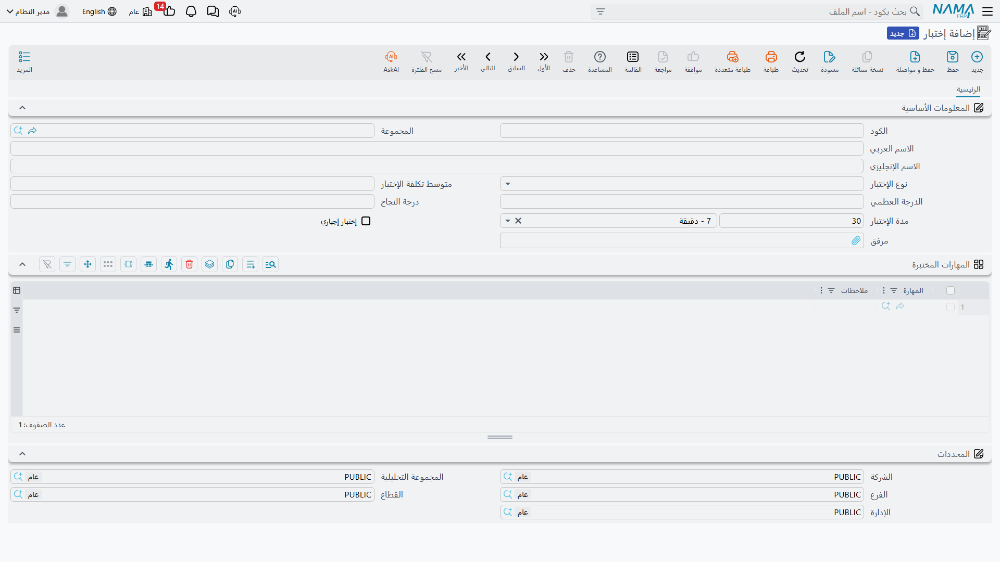

# عروض العمل والاختبارات (Job Offers & Tests)

**[المتقدم](vacancies-and-candidates.md)** الذي يجتاز المقابلات والاختبارات لا يُوظَّف بمصافحة فقط — تضع Nama شروط التوظيف المقترحة في مستند خاص بها أولاً، فيكون المسمى الوظيفي وباقة الراتب وتاريخ البداية التي نُوقشت مع المتقدم موثقة قبل أن يوقّع أحد على أي شيء.

## عرض وظيفي (Job Offer)

يوجد في **الرواتب > سندات التوظيف > عرض وظيفي**، و**عرض وظيفي** مستند يوضح ما يُعرَض: لمن، وتفاصيل الوظيفة، وباقة الراتب كاملة.

**المعلومات الأساسية وتفاصيل الوظيفة:**

| الحقل | الغرض |
|---|---|
| رقم المستند / توجيه المستند / تاريخ التحرير / التاريخ الفعلي / الفترة | حقول هوية المستند القياسية المشتركة بين كل مستندات Nama. |
| عرض لـ | لمن يستهدف العرض — هذا حقل مرجع عام، فيمكن أن يشير إلى متقدم مسجل أو، في حالة إعادة تعيين، إلى موظف موجود بالفعل. |
| إعادة تعيين | يُعلّم العرض على أنه إعادة توظيف لشخص عمل بالشركة سابقاً. |
| صالح حتي | تاريخ انتهاء صلاحية العرض. |
| المسمي الوظيفي / إدارة موظف / الدرجة الوظيفية / الدرجة الوظيفيه الأعلي / المدير الأعلي / الموقع الوظيفي | مكان الوظيفة في الهيكل التنظيمي. |
| مكان العمل الحالي | موقع العمل الفعلي المخصص. |
| تاريخ البداية / مدة العقد بالشهور / تاريخ إنتهاء العقد / الفترة التجريبية | مدة التوظيف المقترحة. |
| المهام والواجبات | وصف لمسؤوليات الدور. |

تحمل **معلومات الموظف** الشروط الشخصية — الجنسية، الحالة الأجتماعية، رقم الإقامة، الشركة المؤمنة في التأمين (للتأمينات الاجتماعية)، التقويم، حالة العرض (**بأنتظار الموافقة**، **مقبول**، أو **مرفوض**)، التذاكر | التصنيف، والبيانات البنكية (المعرف البنكي، رقم حساب البنك، رقم IBAN).

::: tip العرض الوظيفي ينسخ هيكل الراتب
حقل **هيكل راتب** في العرض الوظيفي يعمل تماماً كما يعمل في أي مكان آخر في شئون الموظفين — انظر **[هياكل الراتب](../payroll/salary-structures.md)**. أي هيكل يُختار هنا يصبح البديل الاحتياطي لكل مفرد لا يُسعِّره جدول **مفردات رواتب** الخاص بالعرض صراحةً — ولأن العرض يصبح أول سجل شئون موظفين للموظف الجديد، فنفس هذا الهيكل يستمر كبديله الاحتياطي بعد التعيين. اقتراح الهيكل الصحيح على العرض هو فعلياً اقتراح باقة راتب الموظف بأكملها في خطوة واحدة.
:::

تكرر صفحة **مفردات رواتب** الشكل المألوف (تقويم الرواتب، نوع المفرد، قيمة مفرد الراتب، معادلة حساب المفرد، الصرفية، من/إلى تاريخ، المعايير) إلى جانب مفاتيح بدل السكن وبدل المواصلات، واستحقاقات التذاكر، والأرقام للقراءة فقط لإجمالي الإضافات / الاستقطاع / الأخرى / الراتب — فتُراجَع الباقة كاملة كرقم واحد قبل إرسالها للمتقدم. صفحة **الأجازات** تتيح للعرض أن يُسبِق تخصيص استحقاق الأجازة (نوع الأجازة، الأيام المخصصة، ملف أرصدة الأجازات) للموظف الجديد، وهي نفس المعلومات التي تظهر لاحقاً على سجله في **[بيانات شئون الموظفين](../setup/employee-hr-information.md)**.

يُغلق العرض بإجراءين: **تجميع الأجازات** يسحب سطور الاستحقاق من ملفات أرصدة الأجازات المختارة، و**رفض** يسجل أن المتقدم — أو الشركة — تراجع عن العرض.

## عرض وظيفي لمتقدم للعمل (Candidate Job Offer)

**عرض وظيفي لمتقدم للعمل**، في **الرواتب > سندات التوظيف > عرض وظيفي لمتقدم للعمل**، هي نفس الفكرة مُضيَّقة لاستخدام واحد محدد: تحمل حقل **المتقدم للعمل** مباشرة بدلاً من حقل «عرض لـ» العام، وهي المستند الذي يُنشأ تلقائياً عندما يضغط المسؤول عن التوظيف زر **تحويل المتقدم للعمل لموظف وإنشاء عرض وظيفي** على **[سجل المتقدم](vacancies-and-candidates.md)**. كل ما عدا ذلك — تفاصيل الوظيفة، مفردات الراتب، الأجازات، إجراء **رفض** — مطابق للعرض الوظيفي العادي.

## عرض وظيفي مجمع (Aggregated Job Offer)

نادراً ما يحدث التوظيف شخصاً واحداً في كل مرة عندما تبدأ مجموعة كاملة معاً — افتتاح فرع جديد، أو توظيف موسمي. **عرض وظيفي مجمع**، في **الرواتب > سندات التوظيف > عرض وظيفي مجمع**، هو النسخة المجمعة: حدد نطاق موظفين أو معايير (الإدارة، الدرجة الوظيفية، الموقع الوظيفي، الفرع، القطاع، الجنسية، وغيرها) في كتلة **تجميع الموظفين**، اضغط زر **تجميع الموظفين**، وتسحب Nama كل شخص مطابق إلى جدول **موظفين** — سطر واحد لكل شخص، مع إشارة مرجعية إلى **العرض الوظيفي المنشأ** له.

نفس صفحات تفاصيل الوظيفة، مفردات الراتب، والأجازات تظهر هنا، مُطبَّقة مرة واحدة على كل الأسطر المجمعة؛ زوج **دفتر المستند المصدر آليا / توجيه المستند المصدر آليا** يخبر Nama بالدفتر والتوجيه المستخدمين للعروض الفردية التي ينشئها، و**إنشاء العروض فقط و عدم تحديثها مع إعادة حفظ السند** يتحكم فيما إذا كانت إعادة حفظ الدفعة مسموحاً لها بلمس عروض أُنشئت بالفعل. كما هو الحال مع أي **[مستند مجمع](../concepts/hr-requests-and-documents.md)**، اعمل في الدفعة — لا في الأفراد المنشأة تحتها.

## إختبار (HR Test)

يوجد في **الرواتب > سندات التوظيف > إختبار**، و**إختبار** يحدد نمط تقييم واحد يمكن أن يخضع له المتقدم في طريقه إلى عرض وظيفي: **نوع الإختبار** (اختبار كتابي، مقابلة، عمل تجريبي، أو أحد ثلاثة أنواع مخصصة)، **متوسط تكلفة الإختبار**، **الدرجة العظمي**، **درجة النجاح**، **مدة الإختبار**، وهل هو **إختبار إجباري**، بالإضافة إلى جدول **المهارات المختبرة** الذي يربطه بالمهارات التي يقيسها. نوع فرصة العمل (انظر **[الوظائف الشاغرة والمرشحون](vacancies-and-candidates.md)**) يسرد الاختبارات المتوقعة من أي متقدم لها، بوزنه ودرجة نجاحه الخاصين لكل نوع فرصة عمل.

## نتائج الإختبار (HR Test Result)

**نتائج الإختبار**، في **الرواتب > سندات التوظيف > نتائج الإختبار**، هي حيث يتم التقييم الفعلي. اختر **فرصة عمل** و**الإختبار** المطلوب تقييمه، استخدم **تجميع المتقدمين** لسحب كل من ينتظر ذلك الاختبار، ثم املأ **درجة الإختبار** لكل متقدم في جدول **التفاصيل**؛ تقارن Nama الدرجة بـ**درجة النجاح** وتسجل **نتيجة الأختبار** — **ناجح**، أو **ناجح جزئيا**، أو **راسب** — لذلك السطر. هذه النتائج لكل اختبار هي ما تلخصه درجات المتقدم الإجمالية وحالته بعد الاختبار.

## من العرض إلى الموظف

قبول العرض ليس ضغطة زر منفصلة على العرض نفسه — التعيين يحدث مرة أخرى على **[سجل المتقدم](vacancies-and-candidates.md)**، الذي يحوّل زرّا **إنشاء موظف** أو **تحويل المتقدم للعمل لموظف وإنشاء عرض وظيفي** المتقدم إلى موظف فعلي. من هناك، يستمر التعيين مع **[بدء العمل](work-starting.md)**، الذي يضع الموظف الجديد على كشف الرواتب وينشئ سجله في **[بيانات شئون الموظفين](../setup/employee-hr-information.md)**.

## صفحات ذات صلة

- **[الوظائف الشاغرة والمرشحون](vacancies-and-candidates.md)** — فتح الفرصة وفرز المتقدمين الذين يصلون في النهاية إلى عرض.
- **[هياكل الراتب](../payroll/salary-structures.md)** — الباقة الاحتياطية التي يقترحها العرض الوظيفي وينقلها معه.
- **[بدء العمل](work-starting.md)** — خطوة التعيين التي تلي قبول العرض.
- **[طلبات ومستندات ومستندات مجمعة شئون الموظفين](../concepts/hr-requests-and-documents.md)** — نمط التجميع العام خلف العرض الوظيفي المجمع.
