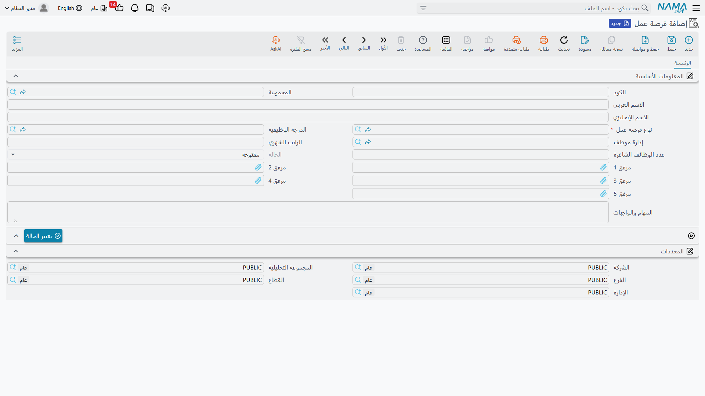
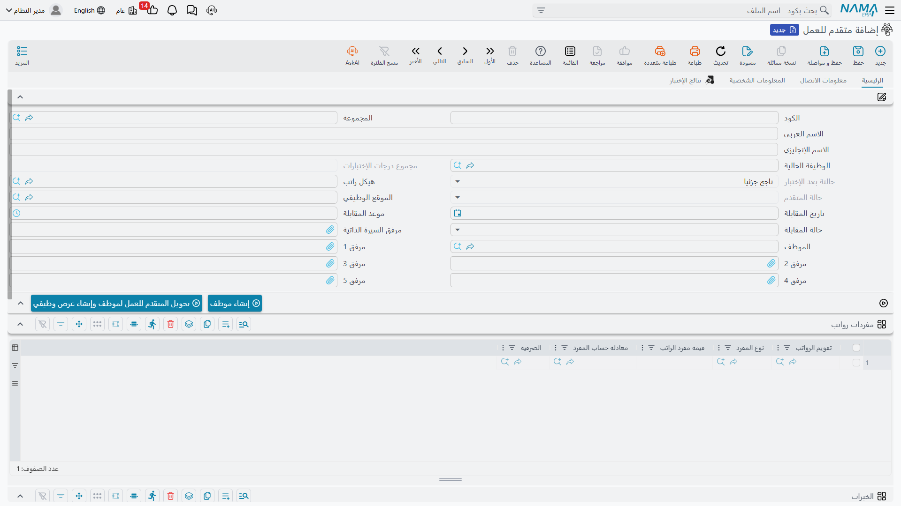

# الوظائف الشاغرة والمرشحون (Vacancies & Candidates)

التوظيف في Nama يبدأ قبل أن يتقدّم أي شخص لأي وظيفة. تحدّد أولاً **ما** الذي تُوظّف من أجله — فرصة عمل — وبعدها فقط يُقارَن بها طابور من **المتقدمين**. الفصل بين الاثنين هو ما يتيح لإدارة الموارد البشرية معرفة "كم شخصاً قابلنا لهذه الفرصة تحديداً" بدلاً من خلط كل السير الذاتية في كومة واحدة غير مصنّفة.

## نوع فرصة عمل (HR Vacancy Type) — الملف الوظيفي القابل لإعادة الاستخدام

يوجد في **الرواتب > سندات التوظيف > نوع فرصة عمل**، و**نوع فرصة عمل** قالب تُعرّفه مرة واحدة لدور يتكرر فتحه — «مندوب مبيعات»، مثلاً — فلا تُعيد إدخال متطلباته من المهارات والاختبارات في كل مرة تُفتح فيها فرصة جديدة لنفس الدور.

| الحقل | الغرض |
|---|---|
| الكود / المجموعة / الاسم العربي / الاسم الإنجليزي | التعريف. |
| الدرجة الوظيفية / إدارة موظف | الدرجة والإدارة اللتان ينتمي إليهما هذا الملف عادةً. |
| متوسط الراتب الشهري / متوسط التكاليف الشهرية | أرقام تُستخدم عند التخطيط للتوظيف لهذا الدور. |

يحمل جدولان محتوى الملف الفعلي:

- **المهارات** — كل سطر يحدد **المهارة**، و**المستوي المطلوب** لها (من **غير موجودة** مروراً بـ **ضعيفة جدا**، **ضعيفة**، **جيدة**، **جيدة جدا**، وصولاً إلى **ممتازة**)، وهل هي **إجبارى**.
- **الإختبارات** — كل سطر يحدد **الإختبار** (انظر الإختبار لاحقاً في هذه الصفحة)، و**ترتيب الاختبار**، و**نقاط الإختبار**، و**درجة النجاح** التي يجب أن يتجاوزها المتقدم.

لا يفرض أي من الجدولين شيئاً تلقائياً على فرصة العمل — إنهما ملف مرجعي يقرأه المسؤول عن التوظيف أثناء فرز المتقدمين لأي فرصة تُفتح تحت هذا النوع.

## فرصة عمل (HR Vacancy) — الشاغر الفعلي

يوجد في **الرواتب > سندات التوظيف > فرصة عمل**، و**فرصة عمل** هي الوظيفة المحددة التي تُوظّف لها الآن.

| الحقل | الغرض |
|---|---|
| الكود / المجموعة / الاسم العربي / الاسم الإنجليزي | التعريف. |
| نوع فرصة عمل | الملف الوظيفي (نوع فرصة عمل، أعلاه) الذي أُنشئت منه هذه الفرصة. |
| الدرجة الوظيفية / إدارة موظف | أين سيجلس الموظف الجديد بعد التعيين. |
| الراتب الشهري | الراتب المرصود لهذه الفرصة بعينها. |
| عدد الوظائف الشاغرة | عدد الأشخاص المطلوبين لملئها — فرصة عمل واحدة قد تمثل عدة مقاعد شاغرة. |
| الحالة | **مفتوحة** أو **مغلقة**. |
| المهام والواجبات | وصف نصي حر للدور، مفيد لإعلانات الوظائف والمقابلات على حد سواء. |

تحمل فرصة العمل أيضاً **المحددات** المعتادة (الشركة، الفرع، القطاع، الإدارة، المجموعة التحليلية)، فيمكن تحديد نطاق التوظيف بنفس طريقة أي سجل رئيسي آخر في Nama.

بمجرد ملء كل المقاعد — أو إلغاء الفرصة — يستخدم المسؤول عن التوظيف زر **تغيير الحالة** لتحويلها من مفتوحة إلى مغلقة، بدلاً من حذفها؛ فتبقى الفرصة المغلقة في السجل كتاريخ لما جرى توظيفه ومتى.

## متقدم للعمل (HR Candidate) — تسجيل المتقدم

يوجد في **الرواتب > سندات التوظيف > متقدم للعمل**، و**متقدم للعمل** هو ملف تقديم شخص واحد لوظيفة. يحمل أكثر بكثير من مجرد اسم وسيرة ذاتية — إنه السجل الذي يعيش فيه المسؤول عن التوظيف من أول مكالمة هاتفية وحتى قرار التعيين.

**المعلومات الأساسية:**

| الحقل | الغرض |
|---|---|
| الكود / المجموعة / الاسم العربي / الاسم الإنجليزي | التعريف. |
| الوظيفة الحالية | فرصة العمل التي يُقيَّم هذا التقديم مقابلها الآن. |
| الموقع الوظيفي | الوظيفة المحددة المتقدَّم لها. |
| هيكل راتب | **[هيكل راتب](../payroll/salary-structures.md)** مقترح — يُحمَل لاحقاً إذا عُرضت الوظيفة على هذا المتقدم. |
| حالة المتقدم | تتبع وضع المتقدم — **بأنتظار الموافقة** أثناء انتظار القرار، و**مْعين** بعد التعيين، بالإضافة إلى نفس حالات الحياة الوظيفية (على رأس العمل، مستقيل، تم فصله، موقوف، على المعاش، في أجازة…) المستخدمة لاحقاً على سجل الموظف نفسه، لأن المتقدم الذي يُوظَّف يستمر بنفس هذا الحقل. |
| مجموع درجات الإختبارات / حالتة بعد الإختبار | مجموع درجات المتقدم عبر كل نتائج الاختبارات المسجلة (انظر نتائج الإختبار لاحقاً في هذه الصفحة)، والنتيجة النهائية — **ناجح**، أو **ناجح جزئيا**، أو **راسب**. |
| تاريخ المقابلة / موعد المقابلة | متى تكون المقابلة مجدولة. |
| حالة المقابلة | أين يقف المتقدم في قُمع المقابلات: **لم يتم الاتصال**، **لم يتم الرد**، **غير متاح**، **بانتظار المقابلة**، **تمت المقابلة**، **من أفضل المتقدمين**، **مقبول**، **مرفوض**، **بانتظار مقابلة أخرى**، أو **تمت المقابلة الأخرى**. |
| مرفق السيرة الذاتية | السيرة الذاتية المرفقة للمتقدم. |
| الموظف | يُملأ تلقائياً بمجرد تعيين المتقدم وتحوله إلى سجل موظف. |

ثلاثة تبويبات تكمل الملف:

- **معلومات الاتصال** — العنوان وبيانات الهاتف/البريد الإلكتروني، بنفس شكل كتلة معلومات الاتصال المستخدمة في كل أنحاء Nama.
- **المعلومات الشخصية** — النوع، الجنسية، تاريخ/محل الميلاد، الحالة الأجتماعية، الديانة، بالإضافة إلى جدول **المؤهلات** (مؤهل، جهة التخرج، تاريخ التخرج، التقدير).
- **نتائج الإختبار** — قائمة للقراءة فقط بكل سطر من نتائج الاختبار المسجلة لهذا المتقدم.

جدولان في الصفحة الرئيسية يحملان الخبرة العملية ونطاق التقديم:

- **الخبرات** — المسمي الوظيفي، إسم الشركة، مشروع تم العمل عليه، من/إلى تاريخ، سنوات/أشهر الخبرة، وملاحظات — تاريخ عمل المتقدم.
- **فرص العمل** — سطر واحد لكل فرصة عمل تقدّم لها هذا الشخص نفسه، مع عمود ملاحظات. يمكن تتبع متقدم واحد مقابل أكثر من فرصة في آن واحد.

يوجد أيضاً جدول **مفردات رواتب**، بنفس شكل الجدول الموجود في **[بيانات شئون الموظفين](../setup/employee-hr-information.md)** — مكان لتدوين مفردات الراتب قيد النقاش مع هذا المتقدم قبل وجود أي عرض وظيفي رسمي.

::: tip طريقتان لتحويل متقدم إلى موظف
يحمل سجل المتقدم زرين لإغلاق تقديم ناجح:

- **إنشاء موظف** — يوظّف المتقدم مباشرة، دون أي عرض وظيفي بينهما.
- **تحويل المتقدم للعمل لموظف وإنشاء عرض وظيفي** — يوظّف المتقدم *و*ينشئ سجل العرض الوظيفي المطابق في نفس الخطوة، فتكون الشروط التي نُوقشت موثقة على الورق.

تستخدم معظم المؤسسات المسار الثاني كي يوجد دائماً عرض موثّق خلف كل تعيين — انظر **[عروض العمل والاختبارات](job-offers-and-tests.md)** لمعرفة شكل ذلك المستند.
:::

## إختبار (HR Test) ونتائج الإختبار (HR Test Result)

يوجد في **الرواتب > سندات التوظيف > إختبار**، و**إختبار** يحدد نوع تقييم واحد يمكن أن يخضع له المتقدم — اختبار كتابي، مقابلة، أو عمل تجريبي — بـ**نوع الإختبار** الخاص به، و**متوسط تكلفة الإختبار**، و**الدرجة العظمي**، و**درجة النجاح**، و**مدة الإختبار**، وهل هو **إختبار إجباري**، بالإضافة إلى جدول **المهارات المختبرة** الذي يربطه بالمهارات التي يقيسها.

**نتائج الإختبار**، في **الرواتب > سندات التوظيف > نتائج الإختبار**، هي حيث يتم التقييم الفعلي: اختر **فرصة عمل** و**الإختبار** المطلوب تقييمه، استخدم زر **تجميع المتقدمين** لسحب كل من ينتظر ذلك الاختبار، ثم قيّم كل متقدم في جدول **التفاصيل** — **درجة الإختبار** والنتيجة الناتجة **نتيجة الأختبار** (ناجح / ناجح جزئيا / راسب). هذه النتائج لكل اختبار هي ما يتجمع في مجموع درجات المتقدم وحالته بعد الاختبار.

## إلى أين يقود هذا

بمجرد أن يجتاز المتقدم المقابلات والاختبارات، الخطوة التالية الطبيعية هي جعل الأمر رسمياً — انظر **[عروض العمل والاختبارات](job-offers-and-tests.md)** لمعرفة كيف يُعَدّ العرض (ناقلاً معه هيكل الراتب المقترح هنا) وكيف يتحول إلى تعيين فعلي.
