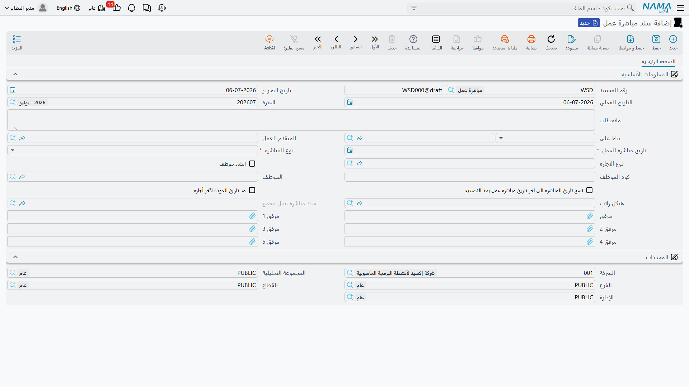

# بدء العمل

قبول عرض وظيفي، انتهاء إيقاف، أو انقضاء مدة أجازة طويلة — لا شيء من هذا، وحده، يعيد الشخص فعلياً إلى كشف الرواتب. تسجل Nama أول يوم فعلي للعودة إلى العمل كحدث مستقل خاص به: **سند مباشرة عمل**. والمثير في هذا المستند أنه لا يهتم من أين أتى الشخص — فعرض وظيفي، أو عودة من أجازة، أو مجرد طلب مباشرة عمل، كلها تغذي نفس السند، لأن إعادة شخص إلى العمل هي دائماً نفس الفعل بصرف النظر عن الطريق الذي أوصله إليه.

## طلب مباشرة عمل (Work Starting Request)

يوجد في **الموارد البشرية > سندات التوظيف > طلب مباشرة عمل**، وهو طبقة الموافقة الاختيارية الموضحة في **[طلبات ومستندات ومستندات مجمعة شئون الموظفين](../concepts/hr-requests-and-documents.md)**: نفس الحقول التجارية للسند أدناه، بالإضافة إلى حالة الموافقة (**مبدئي**، **مقبول**، **مرفوض**، **تمت معالجته**) وزرّي **قبول**/**رفض**. استخدمه كلما احتجت موافقة مدير على تاريخ العودة قبل أن يصبح فعلياً — مثلاً، لتأكيد تاريخ العودة بعد أجازة طويلة بدون أجر.

| الحقل | الغرض |
|---|---|
| تاريخ مباشرة العمل (Starting Date) | اليوم الذي من المفترض أن يعود فيه الشخص للعمل. |
| نوع المباشرة (Work Start Type) | نوع هذه المباشرة — انظر الخيارات أدناه. |
| المتقدم للعمل / الموظف (Candidate / Employee) | من الذي يباشر: متقدم يُوظَّف لأول مرة، أو موظف موجود يعود للعمل. |
| نوع الأجازة (Vacation Type) | رصيد الأجازة الذي ترتبط به هذه العودة، عند الحاجة. |
| هيكل راتب (Salary Structure) | **[هيكل الراتب](../payroll/salary-structures.md)** الاحتياطي الذي يُنقل مع الموظف. |
| فتح وردية (Open Shift) | **[وردية الحضور](../attendance/attendance-plans-and-shifts.md)** التي تُفتح للشخص اعتباراً من هذا التاريخ. |
| نسخ تاريخ المباشرة إلى آخر تاريخ مباشرة عمل / مد تاريخ العودة لآخر أجازة | مفاتيح تنظيمية تُبقي تاريخ آخر مباشرة للموظف وتاريخ عودته من الأجازة متوافقين مع هذا السجل. |

بعد أن يقبل المراجع الطلب، تحوّله الموارد البشرية إلى سند مباشرة العمل الفعلي — إما من زر الإنشاء في الطلب، أو باختيار الطلب المقبول كـ**من مستند** في السند.

## سند مباشرة عمل (Work Starting Document)

يوجد في **الرواتب > سندات التوظيف > سند مباشرة عمل**، وهو حيث تحدث العودة للعمل فعلياً. حقل **نوع المباشرة** هو ما يخبر Nama بأي من الأصول الثلاثة يتعلق الأمر:

| نوع المباشرة | بالإنجليزية | المعنى |
|---|---|---|
| تعيين جديد | New Hiring | متقدم ينضم لأول مرة — هذا هو السند الذي يلي **[عرضاً وظيفياً مقبولاً](job-offers-and-tests.md)**. |
| عودة من أجازة | Back From Vacation | موظف موجود يعود من أجازة. |
| عودة من إيقاف | Back From Suspension | موظف موجود يعود من إيقاف تأديبي. |
| أخرى 1 / أخرى 2 / أخرى 3 | Other 1 / 2 / 3 | فتحات حرة لسيناريوهات عودة خاصة بالشركة لا تندرج تحت الأنواع الثلاثة أعلاه. |

| الحقل | الغرض |
|---|---|
| تاريخ مباشرة العمل | اليوم الذي يبدأ (أو يستأنف) فيه الشخص العمل فعلياً. |
| المتقدم للعمل | يُحدَّد عندما يكون السند يُباشِر متقدماً لأول مرة. |
| إنشاء موظف (Create Employee) | يُفعَّل ليُنشئ Nama سجل **الموظف** نفسه من بيانات المتقدم — انظر أدناه. |
| كود الموظف (Employee Code) | الكود الذي يُعطى لسجل الموظف الجديد عند تفعيل إنشاء موظف. |
| الموظف | يُحدَّد مباشرة عندما يكون السند لموظف موجود بالفعل (عودة، وليست تعييناً أول). |
| نوع الأجازة | رصيد الأجازة الذي تُغلق هذه العودة حسابه، في حالة العودة من أجازة. |
| هيكل راتب | **[هيكل الراتب](../payroll/salary-structures.md)** الاحتياطي الذي يُنقل إلى سجل الموظف. |
| من مستند (From Document) | العرض الوظيفي، أو سند الأجازة، أو طلب مباشرة العمل الذي أُنشئ منه هذا السند. |
| فتح وردية | وردية الحضور التي تُفتح اعتباراً من هذا التاريخ. |
| نسخ تاريخ المباشرة إلى آخر تاريخ مباشرة عمل / مد تاريخ العودة لآخر أجازة | نفس مفاتيح التنظيم الموجودة في الطلب. |

## كيف تتم المعالجة

حفظ سند مباشرة العمل هو اللحظة التي يعود فيها الشخص فعلياً للعمل: تضع Nama الهدف — الموظف الجديد أو العائد — في حالة **على رأس العمل**، اعتباراً من تاريخ مباشرة العمل، وتنقل هيكل الراتب المختار إلى سجله كبديل احتياطي.

- في مباشرة من نوع **تعيين جديد** مع تفعيل **إنشاء موظف**، لا يكتفي الحفظ بتعليم سجل موجود مسبقاً — بل يُنشئ سجل **الموظف** وسجله المرافق **[بيانات شئون الموظفين](../setup/employee-hr-information.md)** من الصفر، ناقلاً اسم المتقدم ومفردات راتبه معه. هذه هي اللحظة بالضبط التي يتحول فيها متقدم إلى موظف حقيقي.
- في مباشرة من نوع **عودة من أجازة** ومُنشأة من سند أجازة، تكتب Nama أيضاً تاريخ العودة الفعلي على ذلك السند، فتُغلق الحلقة بين "المدة المفترضة للأجازة" و"وقت عودة الشخص فعلياً".
- السند نفسه ليس له تأثير محاسبي — فهو حدث خاص باستحقاق شئون الموظفين والرواتب فقط، وليس مستند معالجة محاسبية.

## سند مباشرة عمل أجازة مجمعة (Aggregated Vacation Work Starting Document)

لا يعود بعض الموظفين من الأجازة مرة واحدة فقط في السنة — فكّر في العاملين بنظام التناوب أو في المواقع البعيدة الذين يتناوبون بين عدة فترات حضور وغياب منفصلة. بدلاً من فتح سند مباشرة عمل جديد لكل عودة على حدة، يتيح **سند مباشرة عمل أجازة مجمعة**، في **الرواتب > سندات التوظيف > سند مباشرة عمل أجازة مجمعة**، للموارد البشرية سرد كل عودات **موظف واحد** كسطور في دفعة واحدة. كل سطر — بتاريخ بداية وتاريخ عودة خاصين به، ونوع الأجازة الذي يُخصم منه، والرصيد قبل وبعد، وسبب الأجازة — ينشئ **سند مباشرة عمل** عادياً خاصاً به تحته (انظر أعلاه)، متتبَّعاً بإشارة مرجعية على السطر.

| الحقل | الغرض |
|---|---|
| الموظف | الموظف الواحد الذي تخص كل هذه الدفعة. |
| تاريخ البداية / تاريخ العودة (لكل سطر) | تاريخا مغادرة وعودة تلك الفترة تحديداً. |
| مدة الأجازة / مدة الأجازة الفعلية / مدة الأجازة اليدوية (لكل سطر) | المدة المخططة للفترة مقابل المدة المسجلة فعلياً، مع إمكانية تجاوز يدوي عندما لا يكون الحساب التلقائي صحيحاً. |
| الرصيد / الرصيد المتبقي بعد الاجازة (لكل سطر) | رصيد الأجازة المتاح، وما يتبقى منه بعد خصم تلك الفترة. |
| سبب الأجازة (لكل سطر) | سبب أخذ هذه الفترة تحديداً. |
| مد تاريخ العودة لآخر أجازة / نسخ تاريخ المباشرة إلى آخر تاريخ مباشرة عمل | نفس مفاتيح التنظيم الموجودة في سند مباشرة العمل المفرد، مُطبَّقة على الدفعة كلها. |

كما هو الحال مع أي **[مستند مجمع](../concepts/hr-requests-and-documents.md)**، سندات مباشرة العمل الفردية تحته مُدارة آلياً من النظام — أضف واحذف وعدّل السطور في الدفعة، لا في الأفراد التي تنتجها.

## صفحات ذات صلة

- **[طلبات ومستندات ومستندات مجمعة شئون الموظفين](../concepts/hr-requests-and-documents.md)** — نمط الطلب/المستند/المجمع الذي يتبعه هذا المجال بأكمله.
- **[بيانات شئون الموظفين](../setup/employee-hr-information.md)** — السجل الذي تنشئه مباشرة من نوع تعيين جديد، وحيث تعيش مفردات راتب الموظف الخاصة به بعد ذلك.
- **[عروض العمل والاختبارات](job-offers-and-tests.md)** — العرض الوظيفي المقبول الذي يلي عادةً سند مباشرة عمل من نوع تعيين جديد.
