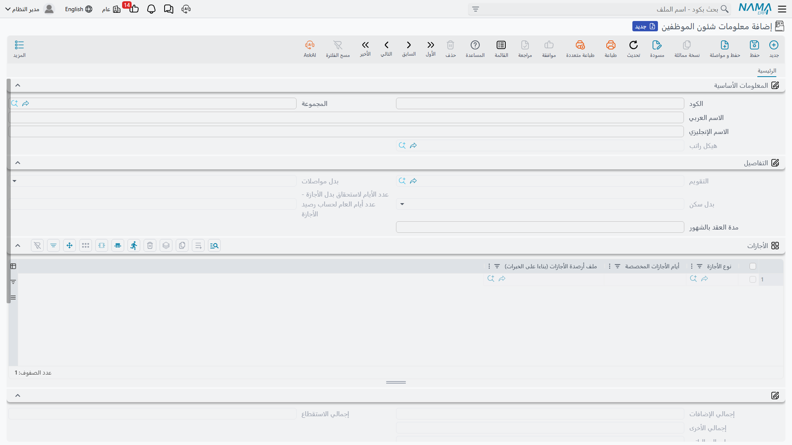
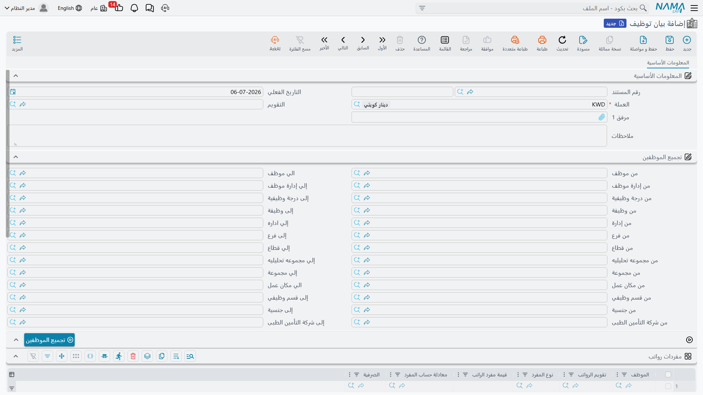

# معلومات شئون الموظف

بمجرد التحاق شخص بالشركة، ينقسم سجله بشكل طبيعي إلى طبقتين. **بياناته الشخصية والوظيفية** — الاسم، بيانات الاتصال، جواز السفر والإقامة، الإدارة، الموقع الوظيفي، الحساب البنكي — تعيش على سجله الرئيسي كموظف. أما كل ما يحتاجه **محرك حساب الراتب** فوق ذلك — أي تقويم يتبعه، أي بدلات تنطبق عليه، وسطور مفردات راتبه الشخصية — فيعيش على سجل مصاحب: **معلومات شئون الموظف**.

## معلومات شئون الموظف (Employee HR Information) — الطبقة الخاصة بالرواتب

يوجد في **الرواتب > الأساسيات > معلومات شئون الموظف**، وهو ملف رئيسي بسجل واحد لكل موظف. أهميته أكبر مما توحي به قائمة حقوله القصيرة، لأنه بالضبط ما تقصده صفحة [كيف يُحسب الراتب](../concepts/hr-salary-engine.md) عندما تقول "سطور مفردات الموظف الخاصة تُقرأ أولاً؛ ولا يُرجَع إلى هيكل الراتب إلا إذا لم يكن لدى الموظف أي سطر خاص به". هذه السطور الشخصية موجودة هنا بالضبط.

**المعلومات الأساسية:**

| الحقل | الغرض |
|---|---|
| الكود / المجموعة / الاسم العربي / الاسم الإنجليزي | بيانات التعريف (تعكس اسم الموظف نفسه). |
| هيكل راتب | [هيكل الراتب](../payroll/salary-structures.md) القابل لإعادة الاستخدام الذي يُستخدم كبديل احتياطي إذا لم يكن لهذا الموظف سطور مفردات خاصة به. |

**التفاصيل:**

| الحقل | الغرض |
|---|---|
| التقويم | أي [تقويم رواتب](hr-calendar-and-holidays.md) تتبعه حسابات راتب هذا الموظف. |
| بدل مواصلات / بدل سكن | كل منهما إما **بدون**، أو **مطبق**، أو **مؤمن** — وهذا بالضبط المفتاح الذي يقف خلف تحذير محرك الراتب بأن "بدلي السكن والمواصلات يتصفران تلقائياً ما لم يُفعَّلا فعلياً على سجل الموظف نفسه". هيكل الراتب وحده لا يكفي؛ يجب تفعيلهما هنا. |
| عدد الأيام لاستحقاق بدل الأجازة - عدد أيام العام لحساب رصيد الأجازة | الأساس المستخدم لحساب استحقاق هذا الموظف من الأجازة المدفوعة. |
| مدة العقد بالشهور | للعقود محددة المدة. |

يسرد جدول **الأجازات** تجاوزات استحقاق الأجازة الخاصة بالموظف — نوع الأجازة، أيام الأجازات المخصصة، وملف أرصدة الأجازات (راجع [أنواع الأجازات والأرصدة](../vacations/vacation-types-and-balances.md)) — يليه قسم **إجماليات** للقراءة فقط (إجمالي الإضافات / الاستقطاع / الأخرى / الراتب) بحيث يمكن لموظفي الدعم مراجعة إجمالي راتب الموظف بنظرة سريعة دون فتح سند الراتب.

أهم جزء في الشاشة هو جدول **مفردات رواتب**: تقويم الرواتب، نوع المفرد، قيمة مفرد الراتب، معادلة حساب المفرد، **الصرفية**، من تاريخ، إلى تاريخ. هذه هي قائمة سطور المفردات الشخصية التي يقرأها محرك الراتب أولاً. أمران يستحقان الملاحظة:

- كل سطر يمكن أن يكون **مؤرخاً** (من/إلى تاريخ)، بحيث يمكن جدولة زيادة، أو بدل مؤقت، أو تاريخ انتهاء دون حذف أي تاريخ سابق.
- كل سطر موسوم **بصرفية** — راجع [سنوات وفترات الموارد البشرية وإصدار الرواتب](hr-years-and-periods.md) — بحيث يمكن لموظف واحد أن يحمل مجموعة مفردات "الراتب الأساسي" ومجموعة منفصلة "العمولات"، كل منها تغذي مجرى الصرف الخاص بها فقط.

## بيان توظيف (Employment Information) — توظيف بالجملة

**بيان التوظيف**، في **الموارد البشرية > سندات التوظيف > بيان توظيف**، هو نوع مختلف تماماً: ليس ملفاً رئيسياً بل مستنداً، مبنياً لتوظيف دفعة كاملة من الموظفين الجدد دفعة واحدة بدلاً من فتح سجل معلومات شئون كل موظف على حدة.

يحدد قسم **تجميع الموظفين** مجالاً أو معايير — من/إلى موظف، إدارة، درجة وظيفية، وظيفة، فرع، قطاع، مجموعة تحليلية، مجموعة، مكان عمل، قسم وظيفي، جنسية، شركة تأمين طبي — وزر **تجميع الموظفين** يجلب كل موظف يطابق هذا المجال. وبعد التجميع:

- جدول **مفردات رواتب** (بنفس شكل جدول معلومات شئون الموظف: الموظف، تقويم الرواتب، نوع المفرد، القيمة، المعادلة، الصرفية) يتيح لشئون الموظفين إدخال نفس إعداد المفردات للدفعة كاملة في خطوة واحدة.
- زر **تجميع الأجازات** يملأ جدول أجازات، بحيث يمكن تحديد الأجازات المخصصة مسبقاً لنفس الدفعة.

::: info ليس مستند رواتب ولا مستند محاسبي
بيان التوظيف لا يُنتج أي أثر محاسبي ولا يشغّل رواتب من تلقاء نفسه. هو مجرد أداة مساعدة لكتابة نفس إعداد المفردات وأجازات دفعة كاملة من الموظفين في عملية واحدة — وعادة مباشرة بعد أن تمر دفعة من الموظفين الجدد بعملية [بدء العمل](../recruitment/work-starting.md).
:::

## كيف يتناسب هذا مع التوظيف

عادة ما يتكوّن سجل الموظف الجديد بهذا الترتيب: [عرض وظيفي](../recruitment/job-offers-and-tests.md) يقترح هيكل راتب، ثم مستند [بدء العمل](../recruitment/work-starting.md) ينشئ الموظف (وسجل معلومات شئونه)، وإذا التحقت دفعة كاملة دفعة واحدة، يقوم بيان التوظيف بملء سطور مفرداتهم واستحقاقات أجازاتهم بالجملة في عملية واحدة. ومن حينها، التعديلات اليومية لموظف واحد تتم مباشرة على سجل معلومات شئونه.

يحمل سجل الموظف الرئيسي نفسه أيضاً المستندات الرسمية للهوية والسفر — جواز السفر، الإقامة، رخصة العمل، التأمينات الاجتماعية — التي تقرأها وتحدّثها لاحقاً عمليات [العلاقات الحكومية](../government-relations/government-relations-overview.md) عند تجديد التأشيرات والإقامات.

## صفحات ذات صلة

- **[كيف يُحسب الراتب](../concepts/hr-salary-engine.md)** — لماذا تتقدم سطور المفردات في هذه الصفحة على هيكل الراتب.
- **[بدء العمل](../recruitment/work-starting.md)** — كيف ينشأ سجل الموظف الجديد ومعلومات شئونه.
- **[العلاقات الحكومية](../government-relations/government-relations-overview.md)** — حيث تُتابع وتُجدَّد المستندات الرسمية للموظف.
