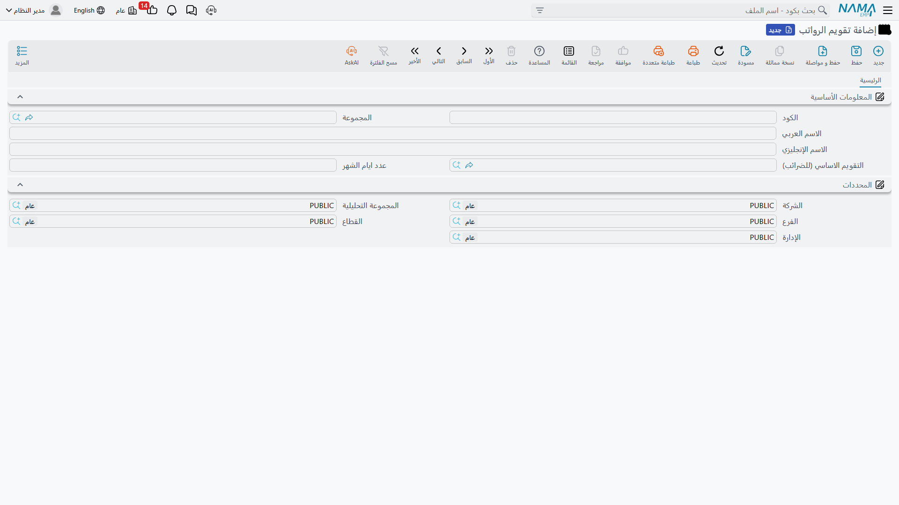
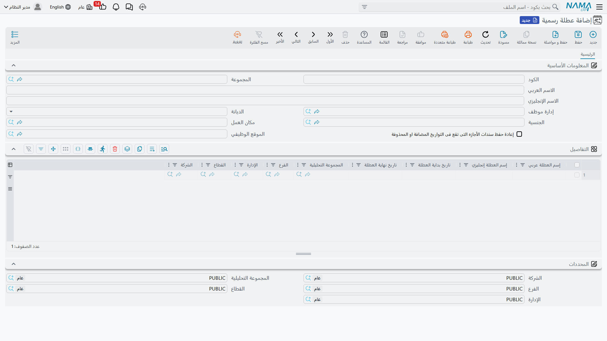

# تقويم الموارد البشرية والعطلات وأيام الراحة الأسبوعية

كل عملية تجميع حضور، وكل احتساب رصيد أجازة، وكل رقم في الراتب في نما يجيب في النهاية عن سؤال واحد: هل كان هذا يوم عمل، أم يوم راحة أسبوعية، أم عطلة رسمية؟ ثلاثة إعدادات تجيب عن هذا السؤال — تقويم الرواتب، العطلات الرسمية، وربما بشكل غير متوقع، خطة الدوام.

## تقويم الرواتب (HR Calendar)

يوجد في **الرواتب > الإعدادات > تقويم الرواتب**، وهو المرجع الذي تشير إليه كل [سنة رواتب](hr-years-and-periods.md)، وكل سجل [معلومات شئون الموظف](employee-hr-information.md)، وكل سجل رواتب عندما يحتاج لمعرفة "أي تقويم أعمل عليه". الشركة التي تشغّل أكثر من تقويم رواتب واحد — مثلاً معايير مختلفة لعدد أيام الشهر لشركات قانونية مختلفة — تحتفظ بها كسجلات تقويم منفصلة بدلاً من إعداد عام واحد.

| الحقل | الغرض |
|---|---|
| الكود / المجموعة / الاسم العربي / الاسم الإنجليزي | بيانات التعريف. |
| التقويم الاساسي (للضرائب) | رابط اختياري إلى تقويم رواتب آخر يُستخدم كمرجع للضرائب — بحيث لا يلزم أن يكون تقويم عمل الشركة الخاص هو نفسه التقويم الذي تعتمد عليه حسابات الضرائب. |
| عدد ايام الشهر | معيار عدد الأيام (عادة 30) المستخدم أينما احتجنا لاشتقاق قيمة يومية من رقم شهري. |

## عطلة رسمية (Holidays)

يُحدد في **الرواتب > الإعدادات > عطلة رسمية** مجموعة تواريخ العطلات الرسمية — الأعياد الوطنية والدينية وما شابه — التي يجب أن تعتبرها حسابات الحضور والأجازات أيام غير عمل. وبما أنه ليست كل عطلة تنطبق على كل موظف، يمكن تضييق نطاق سجل مجموعة العطلات:

| حقل النطاق | الغرض |
|---|---|
| إدارة موظف | قصر العطلات على إدارة واحدة. |
| الديانة | عطلة دينية تنطبق فقط على موظفي هذه الديانة. |
| الجنسية | عطلة وطنية تنطبق فقط على موظفي هذه الجنسية. |
| مكان العمل / الموقع الوظيفي | تضييق إضافي لتحديد الموظفين الذين تنطبق عليهم المجموعة. |

داخل السجل، يسرد جدول **التفاصيل** تواريخ العطلات الفعلية، كل منها باسمه العربي/الإنجليزي، و**تاريخ بداية العطلة** و**تاريخ نهاية العطلة**، ونطاق محدداته الخاص (الشركة، الفرع، القطاع، الإدارة، المجموعة التحليلية) — بحيث يمكن لسجل عطلة رسمية واحد أن يحتوي على أحداث عطلات منفصلة لسنة كاملة.

::: tip إعادة حفظ سندات الأجازه التى تقع فى التواريخ المضافة او المحذوفة
إذا أُضيف تاريخ عطلة أو حُذف **بعد** حفظ سندات أجازة تشمل هذا التاريخ، فتفعيل خيار **إعادة حفظ سندات الأجازه التى تقع فى التواريخ المضافة او المحذوفة** يجعل نما يعيد احتساب سندات الأجازة الموجودة بحيث يعكس عدد أيامها التغيير بشكل صحيح، بدلاً من تركها قديمة دون تنبيه.
:::

## أيام الراحة الأسبوعية: تُضبط على خطة الدوام، وليس على التقويم

على عكس العطلات الرسمية، **يوم الراحة الأسبوعية** لا يُضبط على تقويم الرواتب إطلاقاً — بل يعيش على **خطة الدوام** (Attendance Plan، **الرواتب > حضور / إنصراف > خطة الدوام**)، الموضحة بالتفصيل في صفحة [الحضور](../attendance/attendance-plans-and-shifts.md). تحمل كل خطة سطور راحة أسبوعية — محددة النطاق حسب الموظف والإدارة والموقع الوظيفي ومدى تاريخي — تسمّي حتى ثلاثة أيام راحة أسبوعية (**راحة أسبوعية 1 / 2 / 3**، من السبت حتى الجمعة). هذا ما يسمح لخطة دوام باعتماد الجمعة والسبت كعطلتها الأسبوعية بينما تعتمد خطة أخرى الأحد فقط.

بعض الشركات تفضل إدارة أيام الراحة الأسبوعية كمستند مستقل بدلاً من تعديل خطة الدوام في كل مرة؛ ولأجل ذلك يوجد **سند الراحات الأسبوعية** (Weekend Document، **الرواتب > حضور / إنصراف > سند الراحات الأسبوعية**)، وإعداد عام على مستوى الوحدة — **اعتماد الراحات الأسبوعية من سندها الخاص بدلاً من خطة الدوام** — يحوّل الشركة بالكامل لاعتماد أيام الراحة من هذا السند.

## لماذا يهم هذا لاحقاً

العطلات وأيام الراحة الأسبوعية ليست مجرد تفاصيل تقويمية — فهي تغيّر كيفية ظهور أرقام الحضور والراتب:

- يمكن لسطر احتساب (شريحة) في [معادلة راتب](../payroll/salary-calculation-formulas.md) أن يحمل **المعامل للعطلات الإسبوعية** الخاص به، بحيث يُصرف الوقت الإضافي في يوم راحة أسبوعية بمعامل مختلف عن يوم عادي.
- يمكن وسم مؤشر أداء بأنه **لا يتم احتسابه في أيام العطلات الأسبوعية**، فيُستبعد من الحساب في تلك الأيام تماماً.
- على [نوع الأجازة](../vacations/vacation-types-and-balances.md) نفسه، يحدد خيار **تشمل العطلة الأسبوعية (أرصدة)** ما إذا كانت الراحة الأسبوعية الواقعة داخل أجازة متعددة الأيام تُخصم من رصيد الموظف، بينما يتحكم إعداد منفصل — **معاملة أجازة اسبوعية (رواتب)** (مثل الأرصدة، تشمل، أو لاتشمل) — في كيفية معاملة نفس الراحة الأسبوعية من ناحية الراتب، بشكل مستقل عن قرار الرصيد.

باختصار: التقويم ومجموعة العطلات يحددان *أي التواريخ استثنائية*؛ وخطة الدوام تحدد *أي يوم في الأسبوع هو الراحة الأسبوعية*؛ والمعادلات والمؤشرات وأنواع الأجازات تحدد *ما قيمة هذا الاستثناء* في الحضور والراتب.

## صفحات ذات صلة

- **[سنوات وفترات الموارد البشرية وإصدار الرواتب](hr-years-and-periods.md)** — كل سنة رواتب تشير إلى تقويم رواتب واحد.
- **[خطط الدوام والورديات](../attendance/attendance-plans-and-shifts.md)** — حيث يُضبط يوم الراحة الأسبوعية فعلياً.
- **[أنواع الأجازات والأرصدة](../vacations/vacation-types-and-balances.md)** — كيف تتفاعل أيام الراحة الأسبوعية مع أرصدة الأجازات والراتب.
