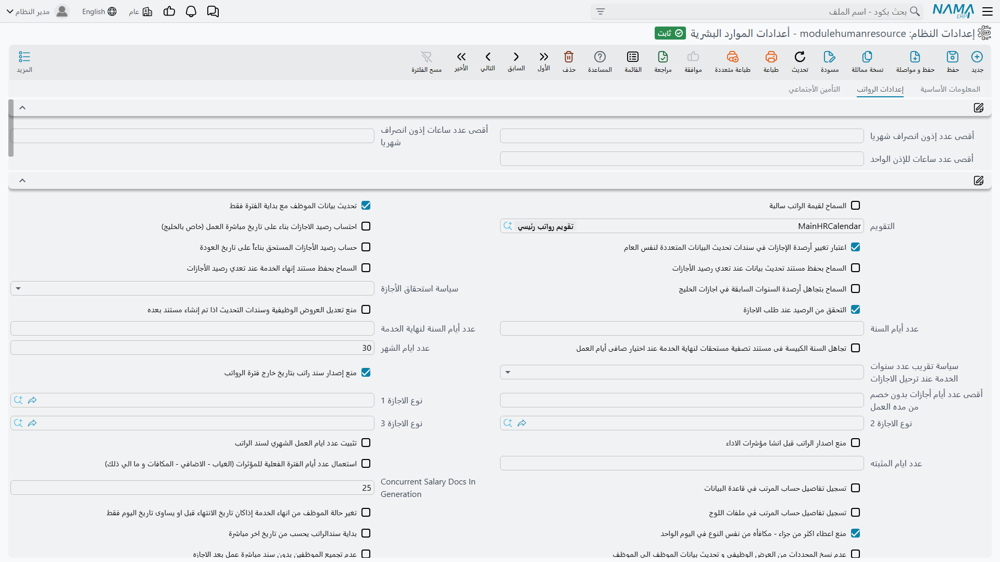
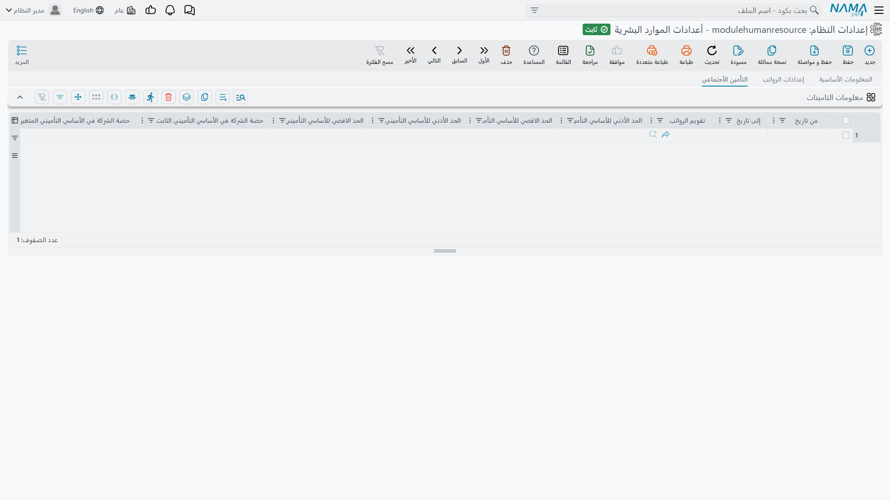

# إعدادات الموارد البشرية

كل ما يفعله محرك الرواتب ولا يكون مكتوبًا على المستند نفسه مكتوب هنا: هل يكلّف يوم الغياب الموظف
جزءًا من ثلاثين من الشهر أم حصة من عدد أيام الشهر الفعلية، وهل يبدأ الوقت الإضافي من نهاية الدوام أم
من آخر بصمة، وكم إذن انصراف يسمح به الشهر، وأي سياسة لرصيد الإجازات تتبعها فروع الخليج. كل ذلك يعيش
في سجل واحد يُقرأ في كل مرة يصدر فيها سند راتب.

أول مفاجأة هي موضع الشاشة في القائمة: اسمها **أعدادات الموارد البشرية** وهي تحت **الرواتب ←
الإعدادات**، لا تحت الموارد البشرية. والثانية أن الصفحة التي تحمل معظم هذه الخيارات عنوانها
**إعدادات الرواتب**، لأن أغلب ما فيها ينتهي رقمًا في سند راتب. إن بحثت عن «إعدادات الموارد البشرية»
داخل قائمة الموارد البشرية فلن تجدها.

## أين تعيش الإعدادات ولمن تنطبق

الإعدادات سجل **إعدادات نظام** كوده `modulehumanresource` واسمه *أعدادات الموارد البشرية* — والاسم
العربي المشحون مع المنتج ينقصه الهمزة في أوله. يفتح السجل على **ثلاث صفحات**:

- **البيانات الأساسية** — ترويسة السجل نفسه: الكود والاسم ومجموعة الإعدادات والنوع والمحددات التي
  ينطبق عليها. لا شيء خاصًا بالموارد البشرية.
- **إعدادات الرواتب** — كل ما في هذه الصفحة عدا القسم الأخير.
- **التأمينات الاجتماعية** — جدول واحد مؤرَّخ لشرائح التأمين.

**سجل واحد لا غير، ويغطي قاعدة البيانات كلها.** كل سجل إعدادات نظام سجل عام واحد، وسجل الموارد
البشرية ليس استثناءً: «عدد ايام الشهر» واحد، وسياسة إجازات واحدة، ومجموعة قواعد خصم واحدة لكل شركة
وفرع وإدارة وقطاع في قاعدة البيانات. فمجموعة تدير سبع شركات في قاعدة بيانات واحدة تشتغل الشركات
السبع كلها على إعدادات الموارد البشرية نفسها.

وتعرض صفحة البيانات الأساسية مجموعة إعدادات ونوعًا ومحددات، ومن الطبيعي أن تُقرأ على أنها وسيلة
لقصر السجل على شركة بعينها. **وليست كذلك.** فقد صُمِّمت إعدادات لكل شركة سنة ٢٠١٤ ولم تُعتمد، وهذه
الحقول بقيتها. فلا تُنشئ سجل إعدادات موارد بشرية ثانيًا وتتوقع أن تتبعه شركة واحدة؛ اترك السجل
المشحون وحده، ومحدداته عامة.

ومن ثَمّ، حين تحتاج شركتان فعلًا إلى حساب شهر مختلف أو قواعد خصم مختلفة فلن تعطيهما هذه الشاشة ذلك.
بل لا بد أن يأتي الفرق مما هو **لكل مستند أو لكل موظف**: خطة الدوام، أو مفردات الراتب، أو هيكل
الراتب، أو الدفتر والتوجيه اللذين يوزّعهما سجل الراتب.

**التغيير يسري فورًا.** تُحفظ نحو اثني عشر خيارًا من خيارات الحضور في ذاكرة مؤقتة تسريعًا، لكن تلك
الذاكرة تُفرَّغ لحظة حفظ سجل الإعدادات، فيستعمل المستند التالي القيمة الجديدة. ولا يُجمَّد شيء داخل
سند الراتب لحظة إنشائه، لذا فتغيير قاعدة خصم في منتصف الشهر ثم إعادة إصدار سندات الأسبوع الماضي
**سيغيّر أرقامها**. غيّر هذه الإعدادات عن قصد، ولا تغيّرها في وسط
دورة رواتب.

**كل شيء تقريبًا يبدأ مطفأً.** سبعة خيارات تُشحن مفعّلة: «تحديث بيانات الموظف مع بداية الفترة فقط»،
و«التحقق من الرصيد عند طلب الاجازة»، و«منع إصدار سند راتب بتاريخ خارج فترة الرواتب»، و«اعتبار الحضور الممتد تابعا لليوم الاول فقط»، و«معالجة التداخل بين الحضور و الانصراف و الاذون»، و«منع اعطاء اكثر من جزاء - مكافأه من نفس النوع في اليوم الواحد»، و«إضافةالمستقطعات والإضافات الافتراضية لمستند التصفية».
وبعض الأرقام تُشحن بقيمة: ٣٠ يومًا في الشهر، و٢٣ ساعة كأقصى حضور متواصل، و٢٥ سند راتب تُصدر معًا،
و١٨ ساعة كأوسع فجوة يقبلها النظام عند ربط بصمة حضور ببصمة انصراف، و١/٢/٣/٤ لأولويات التداخل. وما عدا
ذلك مطفأ أو فارغ، ومعناه أن سلوك الموديول الافتراضي هو السلوك البسيط الموصوف في هذه الصفحات.

## قراءة صفحة إعدادات الرواتب

نحو مئة وخمسين حقلًا في صفحة واحدة موزعة على اثنتي عشرة مجموعة، ويستحسن معرفة ثلاثة أمور عن تخطيطها
قبل البحث عن خيار:

- **المجموعتان الأوليان بلا عنوان.** في إحداهما حدود الأذون الثلاثة، وفي الأخرى نحو ستين خيارًا غير
  مترابط بلا ترتيب معيّن. هكذا بُنيت الشاشة، وليس خللًا في تركيبك.
- **أربعة عناوين مجموعات تظهر باسمها الداخلي بدل ترجمتها** — `AttendanceConfig` و
  `overtimeInMultiVacationDayHandling` و `SalaryDeductions` و `ProvisionCalculation` تظهر بهذه
  الصورة في الواجهتين العربية والإنجليزية معًا، لأن أحدًا لم يسجّل لها ترجمة. وهي على الترتيب مجموعة
  الحضور، ومجموعة تعارض أنواع الأيام، ومجموعة خصم أيام عدم العمل، ومجموعة المخصصات.
- **بعض الحقول بلا عنوان أصلًا** وتظهر باسمها الداخلي: خانات مفردات الراتب العشر ومجموعات الراتب
  الثابت الخمس (انظر «خانات مفردات الراتب ومجموعات الراتب الثابت» أدناه).

ولأن المجموعة الكبيرة غير مرتبة، **استعمل بحث المتصفح بدل التمرير**. وهذه الصفحة تتجاهل ترتيب الشاشة
تمامًا وتجمع الخيارات حسب ما تؤثر فيه.

## حدود أذون الانصراف

المجموعة الأولى بلا عنوان هي سياسة أذون الانصراف كلها: كم إذنًا يأخذ الموظف وكم تطول.

| الخيار | الحقل | ماذا يفعل |
|---|---|---|
| **أقصى عدد إذون انصراف شهريا** | `value.maxPermissionsPerMonth` | عدد أذون الانصراف المسموح بها للموظف الواحد في الشهر. الفراغ يعني بلا حد. |
| **أقصى عدد ساعات إذون انصراف شهريا** | `value.maxPermissionsHoursPerMonth` | مجموع ساعات الأذون في الشهر مهما توزعت على مستندات. |
| **أقصى عدد ساعات للإذن الواحد** | `value.maxSinglePermissionHours` | أطول ما يكون الإذن الواحد. |
| **أقصى عدد لإذون الانصراف يكون لفترة الرواتب وليس للفترات المالية** | `value.maxPermissionCountPerHrPeriod` | يحتسب الحد على **فترة الرواتب** بدل الشهر المالي. فعّله حيثما لا تبدأ فترة الرواتب في أول الشهر، أو إذا كان الحد يُقاس على نافذة خاطئة. |
| **أقصي عدد أذون شهريا لكل سبب على حدة** | `value.maxPermissionCountPerReason` | يطبّق العدد الشهري **على كل سبب إذن على حدة** بدل تطبيقه على الأذون مجتمعة. فإذنان لموعد طبي وإذنان لظرف شخصي يُحتسبان اثنين واثنين لا أربعة. |

::: tip الحد رفض لا تنبيه
تجاوز أي من هذه الحدود يمنع حفظ مستند الإذن. فإن كان لا بد من تسجيل الزيادة فالحد أداة خاطئة: ارفعه
واضبط الزيادة عبر الاعتمادات بدلًا منه.
:::

وخيارات «منع عمل … مع عدم وجود خطة دوام» الثلاثة في مجموعة الحضور هي النصف الآخر من الحكاية: تقرر هل
يجوز أصلًا وجود إذن أو مأمورية أو إجازة لموظف بلا خطة دوام في ذلك التاريخ. انظر
قسم «الحضور» أدناه.

## التقويم والسنة والشهر

هذه هي الأرقام التي تحوّل الراتب الشهري إلى معدل يومي أو ساعي، وهي التي يجب ضبطها قبل أول دورة رواتب
حقيقية، فكل معادلة تقسم على عدد أيام تقرأ واحدًا منها.

| الخيار | الحقل | ماذا يفعل |
|---|---|---|
| **التقويم** | `value.calender` | تقويم الرواتب الذي يستعمله الموديول حين لا يسمّي المستند تقويمًا. |
| **عدد ايام الشهر** | `value.daysInMonth` | المقسوم عليه الثابت للشهر. يُشحن بـ **٣٠**. |
| **عدد أيام السنة** | `value.numberOfDaysOfYear` | المقسوم عليه الثابت للسنة. |
| **عدد أيام السنة لنهاية الخدمة** | `value.daysOfYearForTermination` | طول سنة منفصل يُستعمل في حساب نهاية الخدمة وحده، لأن القانون كثيرًا ما ينص على غيره. |
| **تجاهل السنة الكبيسة فى مستند تصفية مستحقات لنهاية الخدمة عند اختيار صافى أيام العمل** | `value.ignoreLeapYearInTerminationDuesLiquidationNetDays` | يترك ٢٩ فبراير خارج الحساب عند عدّ صافي أيام العمل في مستند التصفية. |
| **تثبيت عدد ايام العمل الشهري لسند الراتب** | `value.makeWorkDaysFixedForSalaryDoc` + `value.fixedWorkDaysCount` | يصدر كل سند راتب بعدد أيام عمل واحد مهما كان الشهر. والعدد يأتي من «عدد ايام المثبته». |
| **استعمال عدد أيام الفترة الفعلية للمؤثرات** | `value.usePeriodActualDaysForFactors` | تُقسم مؤثرات الغياب والإضافي والمكافآت وغيرها على أيام الفترة **الفعلية** بدل الشهر الثابت. والعنوان نفسه يعدّدها: «(الغياب - الاضافي - المكافات و ما الي ذلك)». |
| **بداية سندالراتب يحسب من تاريخ اخر مباشرة** | `value.salaryWorthFromLastWorkStart` | يبدأ استحقاق سند الراتب من تاريخ **آخر** مباشرة للموظف بدل بداية الفترة. هذا هو الخيار المناسب لمن عاد من إجازة بلا راتب في منتصف الشهر. |

::: warning الشهر الثابت في مقابل الشهر الفعلي
«عدد ايام الشهر» و«استعمال عدد أيام الفترة الفعلية للمؤثرات» يجيبان عن السؤال نفسه بطريقتين
متعاكستين، ويقرؤهما جزآن مختلفان من الحساب. فالمقسوم عليه ٣٠ مع مؤثرات محسوبة على الأيام الفعلية
تركيبة صحيحة وشائعة، لكن إن بدا خصم ما خاطئًا بيوم أو يومين باستمرار في فبراير وفي الشهور ذات
الواحد والثلاثين يومًا، فهذا الزوج أول ما يُنظر فيه.
:::

## استحقاق الإجازات والرصيد

| الخيار | الحقل | ماذا يفعل |
|---|---|---|
| **سياسة استحقاق الأجازة** | `value.calcPolicy` | قاعدة الاستحقاق التي يتبعها الموديول. |
| **احتساب رصيد الاجازات بناء على تاريخ مباشرة العمل** | `value.calcVacBalanceBasedOnWorStart` | يستحق من تاريخ مباشرة الموظف بدل السنة الميلادية، والعنوان يصفه بأنه «خاص بالخليج». |
| **التحقق من الرصيد عند طلب الاجازة** | `value.validateBalanceOnVacRequest` | **مفعّل افتراضيًا.** يُرفض طلب الإجازة إذا كان الرصيد لا يكفيه. |
| **حساب رصيد الأجازات المستحق بناءاً على تاريخ العودة** | `value.calculateWorthVacationBalanceOnReturnDate` | يُحسب الاستحقاق بتاريخ العودة بدل بداية الإجازة، وهو ما يهم في إجازة تعبر حدّ استحقاق. |
| **السماح بتجاهل أرصدة السنوات السابقة في اجازات الخليج** | `value.allowIgnorePreviousYearsBalance` | يسمح لحساب إجازات الخليج بإسقاط المُرحَّل. |
| **سياسة تقريب عدد سنوات الخدمة عند ترحيل الاجازات** | `value.approxPolicyForVacTrans` | التقريب المطبَّق على سنوات الخدمة عند ترحيل رصيد الإجازات. |
| **أقصى عدد أيام أجازات بدون خصم من مده العمل** | `value.maxPermitDaysForVacWithoutCut` | كم يومًا من الإجازة يُؤخذ قبل أن يبدأ الغياب في اقتطاع مدة الخدمة. |
| **نوع الاجازة ١ / ٢ / ٣** | `value.vacation1Type` … `value.vacation3Type` | ثلاثة أنواع إجازات يشير إليها المحرك والمعادلات بالموضع، فتستطيع معادلة أن تتكلم عن «الإجازة ١» دون تسمية نوع بعينه. |
| **السماح بحفظ مستند تحديث بيانات عند تعدي رصيد الأجازات** | `value.allowSaveEmployeeUpdateDocIfBalanceExceeded` | يسمح بحفظ مستند تحديث البيانات وإن دفع الرصيد إلى السالب. |
| **السماح بحفظ مستند إنهاء الخدمة عند تعدي رصيد الأجازات** | `value.allowSaveFiringDocIfBalanceExceeded` | المثل لمستند إنهاء الخدمة، وكثيرًا ما يلزم لأن التصفية النهائية هي بالضبط حيث يظهر الرصيد المستهلك زيادة. |
| **عدم التأكد من الرصيد المستهلك مع سند تحديث بيانات موظف** | `value.doNotCheckConsumedVacationWithUpdateDoc` | يتخطى فحص الرصيد المستهلك على مستندات تحديث البيانات كلها. |
| **اعتبار تغيير أرصدة الإجازات في سندات تحديث البيانات المتعددة لنفس العام** | `value.considerMultipleUpdateDocumentsBalanceChangesWithinYear` | حين يكون للموظف عدة مستندات تحديث في السنة، يُؤخذ أثر كل منها في الرصيد بدل الاكتفاء بالأخير. |
| **منع حفظ سند التصفية اذا كان بناءا على سند اجازة نوعها غير سنوي** | `value.preventDuesDocFromNonAnnualVacationType` | يمنع تصفية مبنية على إجازة ليست من النوع السنوي. |

أنواع الإجازات والأرصدة والمستندات نفسها مشروحة في
[أنواع الإجازات والأرصدة](/ar/modules/hr/vacations/vacation-types-and-balances).

## بيانات الموظف والعروض الوظيفية وإنهاء الخدمة

| الخيار | الحقل | ماذا يفعل |
|---|---|---|
| **تحديث بيانات الموظف مع بداية الفترة فقط** | `value.updateInfoWithPeriodStart` | **مفعّل افتراضيًا.** يسري تغيير بيانات الموظف من بداية فترة رواتب لا من منتصفها. |
| **طريقة معالجة أكثر من سند تحديث بيانات موظف لنفس المدّة** | `value.multipleUpdateInfoInPeriodHandling` | كيف يوفّق المحرك بين أكثر من مستند تحديث يغطي المدة نفسها. وهذا الاختيار يقرر أيضًا أي مجموعات الخصم الأربع تنطبق — انظر قسم «أيام الغياب وأيام بلا راتب ومجموعات الخصم الأربع». |
| **السماح بعمل أكثر من سند تحديث بيانات موظف لنفس الموظف في نفس اليوم** | `value.allowMoreThanOneUpdateEmployeeInfoDocForSameEmpInSameDay` | يرفع قيد المستند الواحد في اليوم. |
| **منع تعديل العروض الوظيفية وسندات التحديث اذا تم إنشاء مستند بعده** | `value.preventEditingJobOffersAndUpdateEmpInfoDocsIfThereADocAfter` | يقفل العرض الوظيفي أو مستند التحديث متى وُجد أي مستند لاحق للموظف، حتى لا يُعاد كتابة التاريخ تحت راتب صدر فعلًا. |
| **عدم نسخ المحددات من العرض الوظيفي و تحديث بيانات الموظف الي الموظف** | `value.dontCopyDimensionsToEmployee` | يمنع نسخ الفرع والإدارة والقطاع والمجموعة التحليلية من العرض الوظيفي أو مستند التحديث إلى ملف الموظف. |
| **تغير حالة الموظف من انهاء الخدمة إذاكان تاريخ الانتهاء قبل او يساوى تاريخ اليوم فقط** | `value.updateEmpStatusFromFiringDocInSameDate` | لا تتغير حالة الموظف إلا متى حلّ تاريخ الانتهاء فعلًا؛ فمستند إنهاء خدمة مؤرَّخ بالشهر القادم يُبقي الموظف على رأس العمل حتى ذلك الحين. |
| **منع إنشاء أكثر من مستند تصفية في نفس تاريخ التصفية** | `value.preventMoreThanOneLiquidationAtTheSameLiquidationDate` | تصفية واحدة لكل تاريخ تصفية. |
| **إضافةالمستقطعات والإضافات الافتراضية لمستند التصفية** | `value.addDefaultDuesLiquidationAdditionsAndDeductions` | **مفعّل افتراضيًا.** تُملأ التصفية مسبقًا بالإضافات والاستقطاعات المعتادة. |
| **Always Create Salary Document For Dues Liquidation** | `value.alwaysCreateSalaryDocumentForDuesLiquidation` | تنتج التصفية دائمًا سند راتب خاصًا بها. عنوان هذا الخيار غير مترجم، فتظهر الشاشة العربية نصه الإنجليزي. |

## ما يمنع إصدار سند الراتب

هذه هي الرفوض، وكل واحد منها موجود لأن أحدهم أصدر رواتب ما كان ينبغي أن تصدر.

| الخيار | الحقل | ماذا يمنع |
|---|---|---|
| **السماح لقيمة الراتب سالبة** | `value.allowNegativeSalary` | مطفأً يُرفض صافي الراتب دون الصفر، ومفعّلًا يُسمح به — ولا يُراد ذلك عادة إلا حيث يُتوقع أن تبتلع سلفة أو جزاء الشهر كله ويُرحَّل الفرق. |
| **منع إصدار سند راتب بتاريخ خارج فترة الرواتب** | `value.prevIssuOfSalarySheetOutOfHRPeriod` | **مفعّل افتراضيًا.** سجل راتب مؤرَّخ خارج فترة الرواتب التي يتبعها. |
| **منع اصدار الراتب قبل انشا مؤشرات الاداء** | `value.preventSalaryBeofreMeasures` | سند راتب يصدر قبل وجود مؤشرات أداء الفترة. |
| **منع اصدار سند الراتب إذا كان مجموع السلف اكبر من المرتب** | `value.preventIssueIfLoansMore` | سند راتب تتجاوز فيه أقساط السلف الصافي. |
| **عدم سداد السلف اّليا إذا لم توجد اي مفردات إضافة في سند الراتب** | `value.doNotPayLoansAuto` | خصم أقساط السلف من سند لا إضافات فيه أصلًا. والعنوان يذكر الاستثناء: «(ما عدا اخر راتب)». |
| **تجميع الموظفين الذين حالتهم "علي رأس العمل" فقط في سجل الراتب** | `value.collectWorkingEmployeesOnlyInSalarySheet` | تجميع غير العاملين في السجل أصلًا. |
| **عدم تجميع الموظفين بدون سند مباشرة عمل بعد الاجازه** | `value.doNotCollectEmpsWithNoWorkStartingDocAfterVacation` | تجميع من ذهب في إجازة ولم يُسجَّل رجوعه إلى العمل. |
| **عدم تجميع الموظفين الذين لهم سجل رواتب على نفس الفترة** | `value.doNotCollectEmployeesWithAnySalarySheetLine` | تجميع موظف له سطر في **أي** سجل للفترة، لا المدفوع منها فقط. |
| **السماح بإصدار الراتب إذا تضمنت الإجازة عطلة رسمية** | `value.allowSalaryIssueIfVacationIncludesHoliday` | (يسمح لا يمنع) بإصدار راتب على إجازة ابتلعت عطلة رسمية. |

وخيارا التجميع هنا جزء من آلية اختيار السجل لموظفيه فحسب؛ أما القمع الكامل — بحث الموظفين وخانات
«التجميع حسب مرجع» الخمس والمديات التي تتراكم — ففي
[سندات وسجلات الرواتب](/ar/modules/hr/payroll/salary-documents).

## إعادة إصدار سندات وسجلات الرواتب

إعادة الإصدار أخطر ما يفعله مستخدم الرواتب، فلها محرك سياسات صغير خاص بها: مفتاح رئيسي وثلاثة جداول
وقالبا تنبيه.

**السماح بإعادة إصدار سندات الرواتب المدفوعة** `value.allowRegeneratePaidSalaryDocuments` — بدونه لا
يمكن إعادة إصدار سند قُبض أصلًا.

**جدولة إصدار الرواتب حسب تاريخ ووقت إعادة الإصدار** `value.scheduleSalaryDocsRegenByDateTime` —
تُدرج إعادة الإصدار لتعمل في التاريخ والوقت المسجلين على الطلب بدل أن تعمل فورًا.

ثم تقرر ثلاثة جداول **متى** يُسمح بإعادة الإصدار، وهي الجزء المفيد:

- **الحالات المسموح بإعادة إصدار سندات الرواتب** `value.regenSalaryDocsAllowedStatuses` — سطر لكل
  تركيبة من حالة السند وحالة سجل الراتب الذي يقع فيه، مع «السماح بالإصدار» وقالبي رسالة. وعمودا
  الرسالة — عربي وإنجليزي — هما النص الذي يراه المستخدم حين يرفض السطر، فيستطيع السطر أن يشرح نفسه
  بكلمات الفريق الذي وضع القاعدة.
- **الحالات المسموح بإعادة إصدار سجلات الرواتب** `value.regenSalarySheetsAllowedStatuses` — المثل
  للسجلات.
- **منع إصدار سندات الرواتب إذا وجد التالي** `value.preventRegenerateSalaryDocs` — الاختبار المعاكس:
  سمِّ نوع مستند ومعيارًا فتُمنع إعادة الإصدار متى وُجد مستند مطابق. ويخفّف منه عمودان — «السماح بالإصدار إذا كان المستند مسودة» و«السماح بالإصدار إذا كان المستند بانتظار الاعتماد» — حتى لا يعطّل
  مستند لاحق ما زال مسودة دورةَ الرواتب.

ويستطيع كل سطر أن يحمل **معيارًا** فتنطبق القاعدة على بعض الموظفين أو المستندات دون بعض؛ والمعايير
مشروحة في [تعريفات المعايير](/ar/platform/criteria-definitions).

أما القالبان، **قالب تنبيهات إعادة إصدار سندات الرواتب** `value.regenSalaryDocsNotificationTemplate`
و**قالب تنبيهات فشل إعادة إصدار سندات الرواتب** `value.regenSalaryFailureNotificationTemplate`، فهما
الرسالتان المرسلتان عند انتهاء إعادة الإصدار أو فشلها، ويُشحن كلاهما بنص افتراضي يربط بالمستند.

## أيام الغياب وأيام بلا راتب ومجموعات الخصم الأربع

هذه هي المجموعة المعنونة `SalaryDeductions`، وفيها ثلث خيارات الصفحة، وهي منبع البلاغات، فيستحسن فهم
شكلها بدل قراءة حقولها الثلاثين واحدًا واحدًا.

يفرّق المحرك بين **نوعين من الأيام غير المعمولة**:

- **أيام عدم العمل** — أيام خارج المدة التي يغطيها سند الراتب فعلًا، كالأيام قبل المباشرة أو بعد
  ترك العمل.
- **أيام الإجازة بدون راتب** — الإجازات بلا راتب والإيقاف داخل الفترة.

ولكل نوع يسأل سؤالين ثم سؤالين آخرين:

1. **المعاملة** — *خصم الأيام* (تُخصم الأيام من الراتب) أو *إضافة الأيام الأخرى* (يُدفع ما عُمل
   بدلًا منها). وتُشحن **خصم الأيام** في كل الحالات.
2. **الأساس** — *أيام الفترة الفعلية* (القسمة على أيام الفترة الحقيقية) أو *أيام الفترة الثابتة*
   (القسمة على «عدد ايام الشهر»). أيام عدم العمل تُشحن على **الفعلية**، وأيام بلا راتب على
   **الثابتة**.
3. **هل تُخصم العطلات الأسبوعية أيضًا؟** — خيار نعم/لا.
4. **هل تُخصم أيام الراحة الأسبوعية أيضًا؟** — خيار نعم/لا منفصل. فالعطلة الأسبوعية والراحة الأسبوعية
   شيئان مختلفان في خطة الدوام، والإعدادات تفصل بينهما في كل موضع.

ثم تتكرر هذه المجموعة الرباعية **أربع مرات**، لأن الجواب الصحيح يتوقف على مدى اضطراب شهر الموظف.
والنظام هو الذي يختار المجموعة:

| المجموعة | متى تنطبق | الحقول |
|---|---|---|
| **سند تحديث واحد** | للموظف مستند **واحد** لتحديث البيانات في الفترة — الحالة العادية. | `value.nonWorkingDaysSingleBehavior` و `…SingleBasis` و `value.weekEndDaysDeductionSingleBehaviourFor…` و `value.weeklyRestDaysDeductionSingleBehaviourFor…` |
| **سندات متعددة وفترة كاملة** | أكثر من مستند تحديث، والمستند يغطي فترة كاملة. | `…MultipleBehavior` و `…MultipleBasis` و `…MultipleBehaviourFor…` |
| **سندات متعددة وفترة غير كاملة** | أكثر من مستند تحديث، والمستند يغطي جزءًا من فترة. | `…MultiplePartialBehavior` و `…MultiplePartialBasis` و `…MultiplePartialBehaviourFor…` |
| **آخر سند راتب** | المستند هو **آخر سند راتب للموظف قبل إنهاء الخدمة** — والحقل على السند نفسه اسمه «اخر سند راتب للموظف قبل انهاء الخدمة». | `value.nonWorkingDaysInLastDocBehavior` و `…InLastDocBasis` و `…InLastDocFor…` |

::: warning مجموعة آخر سند راتب تتصرف تصرفًا مختلفًا
في آخر سند راتب قبل إنهاء الخدمة، تعود المعاملة أو الأساس **الفارغان** إلى أي المجموعات الثلاث كانت
ستنطبق. أما خيارات خصم العطلة والراحة الأسبوعية الأربعة فلا تعود: تُقرأ من مجموعة آخر سند وحدها،
وخانة غير مؤشَّرة فيها تعني «لا تخصم» حتى لو كانت نظيرتها في مجموعة السند الواحد أو المتعددة
مؤشَّرة. فإن خصمت تصفية نهائية عددًا من أيام العطلة مخالفًا لكل شهر آخر، فهذا هو السبب.
:::

ويقع في المجموعة نفسها خياران آخران:

**عدم اعتبار العطلات الاسبوعية في ايام عدم العمل** `value.doNotConsiderWeekendsInNonWorkingDays` —
لا تُحتسب العطلات الأسبوعية الواقعة داخل مدة عدم عمل ضمن أيام عدم العمل.

وله نظير على السجل، «عدم اعتبار العطلات الاسبوعية في ايام العمل»، لكنه ليس على الشاشة — انظر
قسم «خيارات موجودة على السجل وليست على الشاشة».

## الحضور

المجموعة المعنونة `AttendanceConfig` تقرر كيف تصير البصمات ساعات. ونصفها الخاص بالوقت الإضافي مشروح
كاملًا في [الوقت الإضافي والتأخير](/ar/modules/hr/attendance/overtime-and-lateness)، وهذا هو
الباقي.

**بأي محددات تُختار خطة الدوام.** ستة مفاتيح — «استخدام الشركة / المجموعة التحليلة / الفرع / الإدارة / القطاع / الموقع الوظيفي في خطط الدوام» (`value.useLegalEntityInAttPlan` و
`value.useAnalysisSetInAttPlan` و `value.useBranchInAttPlan` و `value.useDepartmentInAttPlan` و
`value.useSectorInAttPlan` و `value.useJobPositionInAttPlan`) — تضيف ذلك المحدد إلى المطابقة التي
تجريها خطة الدوام حين تبحث عن الخطة المنطبقة على موظف في تاريخ. فعّل ما تستعمله فعلًا فقط: كل محدد
زائد طريق آخر تفشل به المطابقة فيبقى الموظف بلا خطة أصلًا.

**حساب الحضور والإنصراف يدويا** `value.attendanceManualCalculation` — يُحسب الحضور حين يطلب المستخدم
لا تلقائيًا.

**أقصى عدد ساعات حضور متواصل** `value.maxContinuousAttendance` — يُشحن بـ **٢٣**. وسطر الحضور الأطول
من ذلك يُعامَل خطأً لا ورديةً طويلة جدًا.

**اعتبار الحضور الممتد تابعا لليوم الاول فقط** `value.considerExtendedAttendanceInFirstDay` —
**مفعّل افتراضيًا.** الحضور الممتد بعد منتصف الليل يتبع كله اليوم الذي بدأ فيه.

**اعتبار الحضور يبدأ مع بداية الدوام الثاني عند وجود سطر حضور و انصراف يشمل أكثر من دوام**
`value.considerAttendanceStartIsTheSecondShiftStart` — حين يغطي سطر حضور واحد أكثر من وردية، تُؤخذ
البداية على أنها بداية الوردية الثانية.

**ربط سطور الحضور بدون انصراف مع سطور الانصراف بدون حضور** `value.mergeLinesMissingPucnhInOrOut` —
يربط بصمة حضور يتيمة ببصمة انصراف يتيمة، في حدود الفجوة التي يسمح بها **أقصى فرق في الساعات لربط
سطور حضور بدون انصراف مع سطور انصراف بدون حضور** `value.maxDiffInHoursToMergeLinesMissingPucnhInOrOut`
المشحون بـ **١٨** ساعة. وهذا هو الزوج الذي يُلجأ إليه حين تُسقط ماكينة بصمات.

**احتساب توقيت الحضور لنفس يوم العمل عند الحضور قبل بداية الدوام بمدة**
`value.considerArrivalTimeForWorkDayWithPeriod` (يُشحن بـ **٢** ساعة) و**عدم احتساب السطر حضور لنفس
يوم العمل اذا تاخر عن ميعاد الانصراف بمدة** `value.doNotConsiderArrivalTimeForWorkDayWithPeriod`
(يُشحن بـ **١٠** ساعات) — النافذة على طرفي الوردية التي تظل فيها بصمة مبكرة أو شديدة التأخر محسوبة
على يوم العمل ذاك.

**احتساب الحضور خارج الوقت الرسمي** `value.unOfficialWorkingTime` — ماذا يُفعل بالساعات المعمولة
خارج الوقت الرسمي: *تجاهل* أو احتسابها *وقتًا إضافيًا* أو احتسابها ساعات *عادية*.

**اذن الانصراف يبدأ اليوم** `value.leavePermissionStartsTheDay` — والعنوان يشرح نفسه: «(التاخير لا يضيف الفرق بين انتهاء الاذن و بداية الحضور الفعلي)». أي أنه مع إذن صباحي لا تُحتسب الفجوة بين انتهاء
الإذن ووصول الموظف فعلًا تأخيرًا.

**منع عمل إذن انصراف / سند مأموريه / سند اجازه مع عدم وجود خطة دوام**
`value.preventLeaveDocWithInNoAttendencePlan` و `value.preventMissionDocWithInNoAttendencePlan` و
`value.preventVacationDocWithInNoAttendencePlan` — ترفض كلًا من المستندات الثلاثة لموظف بلا خطة دوام
في ذلك التاريخ. ويستحسن تفعيلها: بلا خطة لا يوجد ما يُقاس عليه الغياب، فيسجّل المستند نية لا يستطيع
المحرك تسعيرها.

**اعتماد الراحات الأسبوعية من سندها الخاص بدلاً من خطة الدوام**
`value.takeWeekendsFromWeekendDocNotAttPlan` — تؤخذ أيام الراحة الأسبوعية من سندها المخصص بدل خطة
الدوام.

**المأمورية / الاذن لا تؤثر في اول وقت حضور / اخر وقت انصراف**
`value.missionDoesNotAffectInFirstInTime` و `value.missionDoesNotAffectInLastOutTime` و
`value.permissionDoesNotAffectInFirstInTime` و `value.permissionDoesNotAffectInLastOutTime` — تمنع
اعتبار المأمورية أو الإذن أول بصمة حضور في اليوم أو آخر بصمة انصراف. وبدونها يبدأ يوم الموظف
بالمأمورية الصباحية، فيتغير التأخير والوقت الإضافي معًا.

## التداخل بين الحضور والمأموريات والأذون والإجازات الجزئية

قد يغطي اليومَ الواحدَ سطرُ حضور مبصوم ومأمورية وإذن انصراف وإجازة جزئية في آن. وخمسة خيارات تقرر ما
يحدث.

**معالجة التداخل بين الحضور و الانصراف و الاذون** `value.handleOverlapBetweenAttendanceAndMissions` —
**مفعّل افتراضيًا.** وبإطفائه تُحتسب السجلات المتداخلة كلها فتُدفع الساعات مرتين.

**السماح بتجاهل سندات الحضور والانصراف المتقاطعة** `value.allowIgnoreOverlappingAttendance` — يتيح
للمستخدم وسم مستند حضور متقاطع بالتجاهل. ولهذه الآلية صفحتها:
[تجاهل الحضور المتقاطع](/ar/modules/hr/ignore-overlapping-attendance).

ثم ترتّب أربعة أرقام المصادرَ حين يغطي اثنان منها الدقائق نفسها. الأصغر يفوز، وتُشحن مرتبة
**المأمورية (١) ثم الحضور (٢) ثم الإذن (٣) ثم الإجازة الجزئية (٤)**:

| الخيار | الحقل | يُشحن بـ |
|---|---|---|
| **اولوية المأموريات عند التداخل** | `value.missionDocPriorityWithOverlap` | ١ |
| **اولوية الحضور و الانصراف عند التداخل** | `value.timeAttendancePriorityWithOverlap` | ٢ |
| **اولوية الأذون عند التداخل** | `value.leavePermissionPriorityWithOverlap` | ٣ |
| **اولوية الاجازات الجزئية عند التداخل** | `value.partialVacationPriorityWithOverlap` | ٤ |

## حين يتعارض نوعا يوم

قد يكون التاريخ الواحد عطلة رسمية وعطلة أسبوعية **و**يوم إجازة معًا، وعلى المحرك أن يختار له هوية
واحدة، لأن الجواب يغيّر هل اليوم مدفوع أم مخصوم أم يحوّل الحضور كله وقتًا إضافيًا. والمجموعة
المعنونة `overtimeInMultiVacationDayHandling` تحمل الأحكام الأربعة:

| التعارض | الحقل | يُشحن بـ |
|---|---|---|
| عطلة رسمية **و**عطلة أسبوعية | `value.holidayAndWeekEnd` | العطلة الرسمية |
| عطلة رسمية **و**إجازة | `value.holidayAndVacation` | العطلة الرسمية |
| عطلة أسبوعية **و**إجازة | `value.weekEndAndVacation` | الإجازة |
| الثلاثة معًا | `value.holidayWeekEndAndVacation` | العطلة الرسمية |

والثلاثة الأولى مقصورة على النوعين المذكورين في اسمها، والرابع يعرض الثلاثة. والأجوبة المشحونة هي
السخية: يوم إجازة يقع في عطلة رسمية يصير عطلة رسمية فلا ينفق الموظف رصيد إجازته عليه، وعطلة أسبوعية
داخل إجازة تصير إجازة.

ويقع في المجموعة نفسها خياران لا صلة لهما بذلك: **عدم استخدام مؤشرات الأداء**
`value.doNotUsePerformanceMeasures` الذي يخرج مؤشرات الأداء من حساب الراتب كله، و**السماح بإصدار
الراتب إذا تضمنت الإجازة عطلة رسمية** `value.allowSalaryIssueIfVacationIncludesHoliday`.

## تجاهل الحضور الإلكتروني

أحيانًا تكون الماكينات مخطئة والسجلات اليدوية صحيحة. وتتيح هذه المجموعة إسقاط الحضور الإلكتروني
جملةً أو انتقاءً.

**تجاهل الحضور والإنصراف الإلكتروني** `value.ignoreElectronicAttendance` هو المفتاح الفظّ: لا
يُستعمل حضور إلكتروني عند حساب الرواتب وبيانات الحضور. والأربعة الأخرى تضيّقه، وتأتي زوجين — زوج
ينتقي **المستندات** وزوج ينتقي **الموظفين**:

| الخيار | الحقل | ينتقي |
|---|---|---|
| **تجاهل فقط سندات الحضور الإلكتروني التي ينطبق عليها المعيار** | `value.ignoreElectronicAttendanceCriteria` | مستندات الحضور الإلكتروني التي يطابقها معيار فقط. |
| **تجاهل فقط سندات الحضور الإلكتروني التي ينطبق عليها الاستعلام** | `value.ignoreElectronicAttendanceQuery` | المثل، لكن باستعلام. |
| **تجاهل الحضور الإلكتروني للموظفين الذين ينطبق عليهم المعيار** | `value.ignoreElectronicAttendanceEmployeeCriteria` | كل الحضور الإلكتروني للموظفين الذين يطابقهم معيار. |
| **تجاهل الحضور الإلكتروني للموظفين الذين ينطبق عليهم الاستعلام** | `value.ignoreElectronicAttendanceEmployeeQuery` | المثل، لكن باستعلام. |

وزوج الموظفين هو المناسب لمجموعة موظفين سجلاتهم على الماكينة غير موثوقة: موقع فيه قارئ معطوب، أو
موظفون ميدانيون لا يمرون بقارئ أصلًا.

## السلف

**حالات الموظف المسموح بإنشاء سند او طلب سلفة لها** `value.allowedEmployeeStatusesForLoanDocument`
جدول بحالات الموظف. من كانت حالته مذكورة فيه جاز له سند سلفة أو طلب سلفة، وغيره لا. واتركه فارغًا
فلا تُقيَّد أي حالة.

وخيارا السلف في قسم «ما يمنع إصدار سند الراتب» — «منع اصدار سند الراتب إذا كان مجموع السلف اكبر من المرتب» و«عدم سداد السلف اّليا إذا لم توجد اي مفردات إضافة» — هما النصف الآخر.
وآليات السلف في [سندات السلف](/ar/modules/hr/loans/hr-loan-documents).

## الجزاءات

المجموعة المعنونة باسم حقلها الأول تحدّ ما يُخصم من الجزاء في الشهر الواحد وتقول أين يذهب الباقي.

**أقصى جزاء شهريا** `value.maxPenaltyPerMonth` — الحد. وما لا يُخصم هذا الشهر لا يسقط بل يُؤجَّل،
ويحمله المفردان التاليان:

- **مفرد الجزاءات المؤجلة للشهر التالي** `value.penaltiesPostponedToNextMonthComponentType` — المفرد
  الذي يُركن فيه الباقي غير المخصوم في سند هذا الشهر.
- **مفرد الجزاءات المؤجلة من الشهر السابق** `value.penaltiesPostponedFromPreviousMonthComponentType`
  — المفرد الذي يصل فيه الشهر القادم.

ولا بد من ضبط الاثنين ليعمل التأجيل؛ فحدٌّ بلا مفردات يُضيع الزيادة بلا ضجيج.

و**منع اعطاء اكثر من جزاء - مكافأه من نفس النوع في اليوم الواحد**
`value.preventMultiRewardPenaltyOfSameTypePerDay`، في المجموعة الكبيرة بلا عنوان، **مفعّل افتراضيًا**
ويمنع وقوع جزاءين (أو مكافأتين) من النوع نفسه في يوم واحد.

## خانات مفردات الراتب ومجموعات الراتب الثابت

خمسة عشر حقلًا في مجموعة *salaryComponentConfigurations* **بلا عنوان في أي من اللغتين** وتظهر باسمها
الداخلي على الشاشة. ولذلك تحديدًا يستحق أمرها الإيضاح.

- `value.sComponentValue1` … `value.sComponentValue10` — عشرة أنواع مفردات راتب يشير إليها المحرك
  ومعادلات الراتب **بالموضع**. فتقول المعادلة «قيمة المفرد ١» ويوجّه كل تركيب المفردَ ١ إلى ما يسميه
  الراتب الأساسي عنده. وهذا ما يجعل المعادلة قابلة للنقل بين العملاء.
- `value.employeeConstantSalary1Gruop` … `value.employeeConstantSalary5Gruop` — خمس **مجموعات**
  مفردات تُستعمل خانات للراتب الثابت للموظف. واسم الحقل يحمل خطأً إملائيًا مشحونًا في كلمة «Group»،
  وهو ما يظهر على الشاشة أيضًا.

اضبط هذه قبل كتابة معادلات الراتب لا بعدها: فالمعادلة التي تشير إلى الخانة ٣ يتغير معناها لحظة إعادة
توجيه الخانة ٣. والمعادلات نفسها في
[معادلات حساب الراتب](/ar/modules/hr/payroll/salary-calculation-formulas).

## أي محددات يحملها سطر الراتب

أربع مجموعات صغيرة متطابقة — *analysisSetConfigurations* و *branchConfigurations* و
*departmentConfigurations* و *sectorConfigurations* — تقرر من أين يأتي كل محدد في **سطر سند الراتب**.
وفي كل منها الحقلان نفسهما:

- **المرجع** (`value.analysisSetConfig_sourceDimension` وأخواته الثلاثة) — إما **المستند** (تؤخذ
  القيمة من ترويسة سند الراتب) أو **الموظف** (تؤخذ من بيانات الموظف بتاريخ ذلك السطر).
- **النسخ دائما** (`value.analysisSetConfig_alwaysOverride` وأخواته) — تُكتب القيمة فوق قيمة موجودة
  في السطر، لا أن تملأ الفارغ فقط.

والقاعدة التي يتبعها المحرك لكل محدد من الأربعة قصيرة ويستحق معرفتها بدقة:

1. إن لم تُضبط المجموعة أصلًا، أخذ السطر محدد **الموظف**.
2. وإن كان «النسخ دائما» مؤشَّرًا **أو** كان السطر بلا قيمة، أخذ السطر ما يسميه «المرجع».
3. وإلا أبقى السطر ما فيه.

أي أن ترك «النسخ دائما» مطفأً لا يعني «لا تغيّره أبدًا» — فالسطر الفارغ يُملأ من المرجع على كل حال.
و**الشركة ليست في هذه المجموعة**: يأخذ سطر الراتب دائمًا شركة مستنده، ولا إعداد يغيّر ذلك.

وهكذا تهبط تكلفة الرواتب على الفرع أو مركز التكلفة الصحيح دون أن يكتبها أحد. والمحددات نفسها مشروحة
في [صفحة المحددات في الإعدادات العامة](/ar/platform/global-config/global-config-dimensions).

## المخصصات

المجموعة المعنونة `ProvisionCalculation` صغيرة وذات أثر.

| الخيار | الحقل | ماذا يفعل |
|---|---|---|
| **تاريخ بداية إعادة حساب مخصصات الموظف** | `value.employeeProvisionRecalculationFromDate` | أبكر تاريخ تستطيع إعادة حساب المخصصات أن ترجع إليه. |
| **اعتبار سند الإجازات الافتتاحي في أول مستند تصفية** | `value.considerOpeningVacDocInFirstLiquidationDoc` | يؤخذ رصيد الإجازات الافتتاحي في حسبان أول تصفية. |
| **حساب نهاية الخدمة على المدة كلها** | `value.terminationCalculationBasedOnWholePeriod` | تُحسب نهاية الخدمة على مدة الخدمة كلها بدل حسابها فترةً ففترة. |

انظر [مخصصات الموارد البشرية](/ar/modules/hr/end-of-service/hr-provisions) لمعرفة ما هي المخصصات
وكيف تؤثر محاسبيًا.

## ماكينات الحضور

حقلان، أحدهما لغة كاملة.

**اعتبار الشركة في البحث عن الموظف** `value.considerLegalEntityToFindEmployee` — يُطابَق كود الموظف
على الماكينة داخل الشركة أيضًا، وهو ما تحتاجه حين تستعمل شركتان في قاعدة بيانات واحدة أرقام موظفين
متداخلة على قارئاتهما.

**معادلة ماكينة الحضور** `value.attendanceMachineFormula` — معادلة التحليل التي تحوّل ملف سجل
الماكينة الخام إلى سطور حضور، وإلى جوارها على الشاشة نحو أربعين زر رمز (`hrfEmployeeID` و
`hrfInDateTime` و `hrfAlternatingPunch` و `hrfSeparator` وغيرها). ولهذه اللغة صفحتها:
[معادلة ماكينة الحضور](/ar/modules/hr/attendance-machine-formula). وتركيب الماكينات في
[ماكينات الحضور](/ar/modules/hr/attendance/attendance-machines).

## التسجيل والإنتاجية

**تسجيل تفاصيل حساب المرتب في قاعدة البيانات** `value.logSalaryDetailInDB` و**تسجيل تفاصيل حساب
المرتب في ملفات اللوج** `value.logSalaryDetailInLogFile` يسجّلان كيف تم التوصل إلى كل رقم في الراتب،
الأول في قاعدة البيانات والثاني في ملفات سجل الخادم. وكلاهما مطفأ افتراضيًا وكلاهما يكلّف أداءً في
الدورات الكبيرة، لكنهما حين يعترض عميل على رقم السبيلُ الوحيد للجواب دون إعادة اشتقاق الحساب يدويًا.
فعّل أحدهما للدورة التي تريد تفسيرها ثم أطفئه.

**Concurrent Salary Docs In Generation** `value.concurrentSalaryDocsInGeneration` يُشحن بـ **٢٥** وهو
عدد سندات الرواتب التي تُصدر على التوازي. ولم يُترجم عنوانه قط، فتظهر الشاشة العربية نصه الإنجليزي.

## التقييم

خياران للتقييم يقعان في المجموعة الكبيرة بلا عنوان لا مع الأداء:

**حساب النسبة النهائية للتقييم بناء على المجموع الكلى لنقاط التقييم مقسوما على إجمالي الدرجات العظمي**
`value.calcEvaluationFinalPercentageFromTotalPointsDividedByTotalMaxWeights` — يغيّر النسبة النهائية
في التقييم إلى مجموع النقاط على مجموع الأوزان العظمى.

**السماح بتكرار عنصر التقييم** `value.allowEvaluationElementDuplicate` — يتيح ظهور العنصر نفسه مرتين
في تقييم واحد.

والتقييمات في [تقييم الموظفين](/ar/modules/hr/performance/employee-evaluation).

## التأمينات الاجتماعية

الصفحة الثالثة من الشاشة جدول واحد، **معلومات التامينات** `value.insuranceInfo`، وهو مؤرَّخ: سطر لكل
مدة سرت فيها شرائح التأمين ونسبه. وهذا هو المقصود منه: حين تغيّر الجهة حدًّا تضيف سطرًا بدل تعديل
القديم، فتحتفظ سندات الرواتب التاريخية بالأرقام التي كانت صحيحة حينها.

يحمل كل سطر **من تاريخ** و**إلى تاريخ** و**تقويم رواتب**، والحد الأدنى والأقصى للأساس التأميني الثابت
والمتغير (**الحد الأدني/الاقصي للأساسي التأميني الثابت** و**المتغير**) وأربع نسب: حصة **الشركة**
وحصة **العامل** في كل من الأساسين الثابت والمتغير.

ومستندات التأمينات الاجتماعية وجانب الموظف منها في
[التأمينات الاجتماعية والكفالة](/ar/modules/hr/government-relations/social-insurance-and-sponsorship).

## خيارات موجودة على السجل وليست على الشاشة

ثلاثة خيارات معرَّفة على سجل الإعدادات ويقرؤها المحرك، لكن تخطيط الشاشة القياسي لا يعرضها. وهي تتصرف
كغيرها تمامًا، غير أنها غير مرئية حتى يضيفها معدِّل شاشة، كما أن «تجميع بمرجع» ٢–٥ موجودة على
سجل الراتب دون أن تكون على شاشته الافتراضية.

| الخيار | الحقل | ماذا يفعل |
|---|---|---|
| **عدم اعتبار العطلات الاسبوعية في ايام العمل** | `value.doNotConsiderWeekendsInWorkingDays` | نظير خيار أيام عدم العمل: لا تُحتسب العطلات الأسبوعية ضمن أيام العمل. |
| *استخدام موقع عمل الموظف في خطط الدوام* | `value.useEmpWorkPlaceInAttPlan` | محدد سابع لمطابقة خطة الدوام إلى جانب الستة التي **على** الشاشة. وهو بلا عنوان في أي من اللغتين. |
| *إجازات مصر غير المرحّلة بالنظام الجديد* | `value.egyptionVacationNotMigratedByNewSystem` | راية ترحيل لأرصدة الإجازات المصرية المنقولة من نظام أقدم. بلا عنوان في أي من اللغتين، واسم الحقل يحمل خطأً إملائيًا مشحونًا في «Egyptian». |

فإن احتجت أحدها فأضفه إلى الشاشة بـ
[معدِّل الشاشة](/ar/platform/screen-modifier/screen-modifier-edit-screen) بدل تعديل السجل مباشرة.

## رسائل قد تظهر لك

كل رسالة أدناه يثيرها خيار على هذه الشاشة، فأسرع طريق للجواب عنها فتح الإعدادات والنظر في الخيار
المذكور في عمود «لماذا».

| الرسالة | لماذا | ماذا تفعل |
|---|---|---|
| *You Must Entre Calender In HR configuration* | لا تقويم مضبوط في الإعدادات وشيء ما يحتاج إليه. والنص المشحون يخطئ إملاء «Enter». | اضبط «التقويم» في الإعدادات. ولا نص عربي لهذه الرسالة، فتظهر بالإنجليزية على الشاشات العربية أيضًا. |
| «يجب ملء حقل مجال إصدار الرواتب» | جُمِّع سجل راتب بلا مدى إصدار رواتب، فلا سبيل للتجميع أن يعرف من في النطاق. | املأ المدى في السجل، أو اضبطه على الإصدار ليرثه السجل. |
| «الموظف {0} ليس له خطة دوام في اليوم {1}» | الموظف بلا خطة دوام تغطي يومًا في مدى المستند، وخيار «منع عمل إذن انصراف / سند مأموريه / سند اجازه مع عدم وجود خطة دوام» المقابل مفعّل. | أعطِ الموظف خطة لتلك التواريخ. وإن كانت الخطة موجودة فعلًا فراجع مفاتيح المحددات الستة في مجموعة الحضور: خطة موجودة قد تفشل مطابقتها على محدد. |
| *Performance Measures was not created for employee {0}* | «منع اصدار الراتب قبل انشا مؤشرات الاداء» مفعّل ولم تُنشأ مؤشرات أداء الفترة لهذا الموظف بعد. | أنشئ مؤشرات أداء الفترة ثم أعد الإصدار. ولا نص عربي لهذه الرسالة. |
| *Salary For {0} is negative* | خرج الصافي دون الصفر و«السماح لقيمة الراتب سالبة» مطفأ. | ابحث عما ابتلع الشهر، وغالبًا قسط سلفة أو جزاء. ولا تفعّل «السماح لقيمة الراتب سالبة» إلا إذا كان تحمّل صافٍ سالب سياستك فعلًا. ولا نص عربي لهذه الرسالة. |
| «صافي المرتب {0} للموظف {1} اقل من مجمل السلف {2}» | «منع اصدار سند الراتب إذا كان مجموع السلف اكبر من المرتب» مفعّل وأقساط الشهر تتجاوز الصافي. | أعد جدولة القسط أو أعفِ منه هذا الشهر، أو ارفع الحد لهذا الموظف من سند السلفة بدل إطفاء الفحص عن الجميع. |
| «لا يمكن إعادة إصدار الراتب للموظف {0} لأنه تم قبضه بالفعل» | السند مقبوض و«السماح بإعادة إصدار سندات الرواتب المدفوعة» مطفأ. | قرّر عن قصد: إما أن تعكس القبض، وإما أن تفعّل الخيار مدة التصحيح. |
| «لا يمكن إعادة الإصدار لأن المستند {0} لا يقابله أي سطر في جريد {1} الموجود في إعدادات الموارد البشرية» | إعادة الإصدار تحكمها جداول الحالات المسموح بها، وتركيبة حالة المستند لا يقابلها سطر — وانعدام السطر انعدام إذن. | أضف سطرًا في الجدول الذي تسميه الرسالة لهذه التركيبة، مؤشَّرًا فيه «السماح بالإصدار». |
| «الموظف لديه  {0} إذن شهريا وانت تحاول ان تعطيه  {1} إذن» | حد «أقصى عدد إذون انصراف شهريا». | ارفع الحد أو سجّل الزيادة بطريق آخر. وراجع «أقصي عدد أذون شهريا لكل سبب على حدة» و«أقصى عدد لإذون الانصراف يكون لفترة الرواتب وليس للفترات المالية» أيضًا، فهما يغيّران ما يُعدّ. |
| «الموظف لديه عدد {0} ساعات إذن شهريا وانت تحاول ان تعطيه  {1} ساعات إذن» | حد «أقصى عدد ساعات إذون انصراف شهريا». | كما سبق. |
| «أقصى عدد ساعات للإذن الواحد للموظف هي {0} ساعات وانت تحاول ان تعطيه  {1} ساعات إذن» | حد «أقصى عدد ساعات للإذن الواحد» — وهذا عن المستند الواحد لا عن الشهر. | قسّم الإذن إلى إذنين، أو ارفع حد الإذن الواحد. |
| *This document can not be used if the option manual attendance is selected* | «حساب الحضور والإنصراف يدويا» مفعّل وهذا المستند لا يعمل إلا مع الحساب التلقائي. | إما أن تطفئ الحساب اليدوي وإما أن تكفّ عن استعمال هذا المستند. وللمسارات رسالة مقابلة: *The entity flow {0} can not be used if the option manual attendance is selected*. ولا نص عربي لأي منهما. |
| «{1} السند {0} تم إنشاؤه في نفس التاريخ» | رفضت قاعدةُ «واحد في اليوم» مستندًا ثانيًا — وهي لمستندات تحديث بيانات الموظف «السماح بعمل أكثر من سند تحديث بيانات موظف لنفس الموظف في نفس اليوم»، وللتصفيات «منع إنشاء أكثر من مستند تصفية في نفس تاريخ التصفية». | عدّل المستند القائم بدل إضافة ثانٍ، أو فعّل الخيار المعني إن كان مستندان في اليوم صحيحين هنا. |

::: info الرسائل المقتبسة هنا منسوخة لا مترجمة
حيث لا يكون للرسالة نص عربي في المنتج تظهر بالإنجليزية على الشاشات العربية كذلك. وهذا سلوك المنتج لا
نقص في هذه الصفحة.
:::

والرسائل التي تثيرها الطبقة العامة في كل شاشة — رفوض المسودة والمراجَع والصلاحية والترخيص وتكرار
الكود — في [الرسائل والرفوض](/ar/platform/messages-and-refusals).
