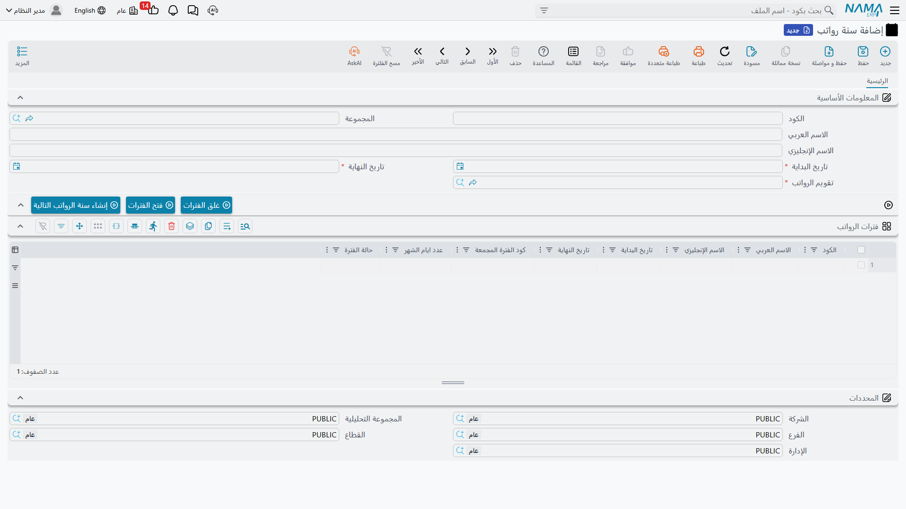
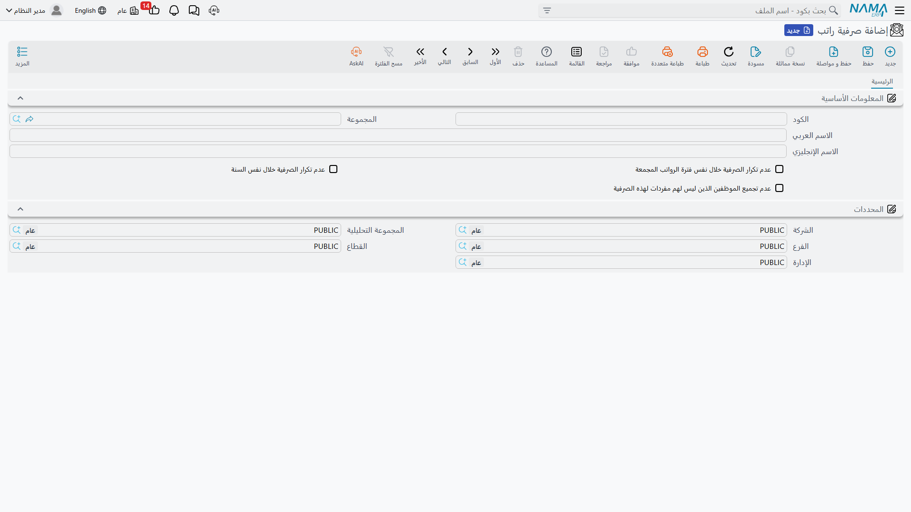

# سنوات وفترات الموارد البشرية وإصدار الرواتب

قبل حساب أي راتب، يحتاج نما لمعرفة أمرين: **الفترة الزمنية** التي تخص هذا التشغيل، و**مجرى الصرف** الذي ينتمي إليه. السؤال الأول تجيب عنه تقويم الرواتب — سنة الرواتب وفترة الرواتب. أما السؤال الثاني فتجيب عنه إعدادة صغيرة لكن يسهل فهمها خطأ، وهي **الصرفية**.

## تقويم الرواتب: سنة الرواتب وفترة الرواتب

**سنة الرواتب** (HR Year) هي سنة تقويمية خاصة بالرواتب فقط — وهي منفصلة عمداً عن السنة المالية المحاسبية، لأن دورة صرف الرواتب في الشركة لا يلزم أن تتطابق مع سنتها المالية. تجدها في **الرواتب > الإعدادات > سنة رواتب**.

| الحقل | الغرض |
|---|---|
| الكود / المجموعة / الاسم العربي / الاسم الإنجليزي | بيانات التعريف المعتادة لأي ملف رئيسي. |
| تاريخ البداية / تاريخ النهاية | حدود سنة الرواتب. |
| تقويم الرواتب (HR Calendar) | أي [تقويم رواتب](hr-calendar-and-holidays.md) تعتمد عليه حسابات هذه السنة — قد تحتفظ الشركة بأكثر من تقويم واحد، وهنا تختار كل سنة تقويمها الخاص. |

تحتوي سنة الرواتب على جدول مضمن من **فترات الرواتب** — عادة اثنتي عشرة فترة، واحدة لكل شهر، وإن لم يكن هذا الشكل إلزامياً. كل سطر فترة يحمل الكود والاسم العربي/الإنجليزي وتاريخ البداية/النهاية، و**عدد ايام الشهر** (المعيار المستخدم في حساب القيم اليومية)، و**كود الفترة المجمعة**، و**حالة الفترة** التي تكون إما **مفتوح** أو **مغلقة**.

نفس سجل الفترة موجود أيضاً ككيان مستقل قائم بذاته في **الرواتب > الإعدادات > فترة رواتب**، بنفس الحقول بالإضافة إلى مرجع يعيدها إلى سنة الرواتب الخاصة بها — وهذا مفيد عندما تحتاج للبحث أو إعداد تقرير عن فترة واحدة دون فتح السنة كاملة.

::: tip كود الفترة المجمعة
يمكن لفترتين عاديتين أن تشتركا في نفس **كود الفترة المجمعة**، مما يسمح للتقارير والمستندات المجمعة بتجميع عدة فترات تحت مسمى واحد — مثلاً معاملة تشغيلين نصف-شهريين كشهر واحد في التقارير. هذا لا يغيّر طريقة حساب الراتب، بل يؤثر فقط على كيفية تجميع الفترات لاحقاً.
:::

توجد ثلاثة أزرار على شاشة سنة الرواتب:

- **غلق الفترات** — يقفل الفترات المختارة (تصبح حالتها مغلقة)، مما يمنع أي إصدار رواتب جديد عليها. هذا هو مفتاح الأمان بعد اعتماد أرقام شهر معين نهائياً.
- **فتح الفترات** — يعكس ذلك، للحالات النادرة التي تحتاج فيها فترة مغلقة إلى تصحيح.
- **إنشاء سنة الرواتب التالية** — ينشئ سنة جديدة بالكامل (وفتراتها) تلقائياً، فلا يضطر مسؤولو الرواتب لبناء التقويم من الصفر كل عام.

## الصرفية: علامة على مجرى الصرف، وليست عملية صرف

::: warning الصرفية لا تصرف رواتب لأحد
**الصرفية** (Salary Issuance، **الرواتب > الإعدادات > صرفية راتب**) **لا** ترحّل حسابياً و**لا** تحرّك أي أموال. هي مجرد **مصنِّف — علامة على مجرى صرف** يسمح لنفس الفترة بإنتاج أكثر من تشغيل رواتب متوازٍ. تخيّلها كملصق تصنيف، وليست خطوة الصرف نفسها؛ فالمال يمر بالكامل عبر سجل الرواتب وسند الراتب الموضحين في [كيف يُحسب الراتب](../concepts/hr-salary-engine.md).
:::

لماذا قد تحتاج فترة واحدة لأكثر من مجرى صرف؟ حالة شائعة: تشغّل شركة راتبها الشهري الأساسي تحت صرفية واحدة ("الراتب الأساسي")، وتشغّل صرفية عمولات أو مكافآت منفصلة لنفس الشهر تحت صرفية ثانية ("العمولات"). كلاهما يستهدف نفس فترة الرواتب، لكنهما ينتجان سجل رواتب وسندات رواتب مستقلة تماماً، ويمكن وسم [سطور مفردات الراتب](employee-hr-information.md) الخاصة بكل موظف بحيث تُغذّي فقط الصرفية التي تخصها.

بجانب حقول التعريف (الكود، المجموعة، الاسم العربي، الاسم الإنجليزي)، تحمل الصرفية ثلاث أعلام لمنع التكرار، وظيفتها الوحيدة هي منع تشغيل نفس المجرى مرتين بالخطأ:

| العلم | ما الذي يمنعه |
|---|---|
| عدم تكرار الصرفية خلال نفس فترة الرواتب المجمعة | إصدار هذه الصرفية أكثر من مرة للفترات التي تشترك في نفس كود الفترة المجمعة. |
| عدم تكرار الصرفية خلال نفس السنة | إصدار هذه الصرفية أكثر من مرة في أي مكان ضمن نفس سنة الرواتب. |
| عدم تجميع الموظفين الذين ليس لهم مفردات لهذه الصرفية | تجميع موظفين ليس لديهم أي سطور مفردات راتب موسومة بهذه الصرفية أصلاً — فيمنع مثلاً صرفية "العمولات" من تجميع كل موظفي الشركة. |

عند إصدار سجل رواتب، يتم بناؤه لتوليفة واحدة من **فترة رواتب + صرفية** في كل مرة — وهذا بالضبط ما يجعل المجاري المتوازية ممكنة دون أن تتعارض مع بعضها.

## كيف تترابط كل هذه العناصر

سنة نموذجية تسير هكذا: تُنشأ سنة رواتب "2026" (بزر إنشاء سنة الرواتب التالية من سنة 2025)، وتحمل اثنتي عشرة فترة رواتب من يناير حتى ديسمبر، جميعها مرتبطة بتقويم رواتب واحد. كل شهر، تُصدر الرواتب سجل رواتب لفترة الشهر تحت صرفية "الراتب الأساسي"؛ ويصدر فريق آخر سجل رواتب ثانٍ لنفس الفترة تحت صرفية "العمولات"، مقتصرة على موظفي المبيعات. وبمجرد اعتماد أرقام الشهر، تُغلق فترته حتى لا يستطيع أي إصدار جديد لمسها بالخطأ.

## صفحات ذات صلة

- **[كيف يُحسب الراتب](../concepts/hr-salary-engine.md)** — خطوات الحساب الخمس الكاملة التي يشغّلها سجل الرواتب فعلياً.
- **[تقويم الموارد البشرية والعطلات وأيام الراحة الأسبوعية](hr-calendar-and-holidays.md)** — التقويم الذي تشير إليه سنة الرواتب.
- **[معلومات شئون الموظف](employee-hr-information.md)** — حيث تُوسم سطور مفردات كل موظف بصرفية معينة.
