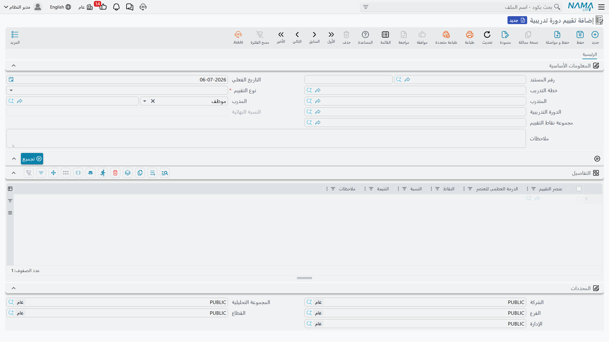

# تقييم الدورة التدريبية (Course Evaluation)

يقيّم [تقييم الموظف](../performance/employee-evaluation.md) أداء الموظفين المستمر مقابل كتالوج من المعايير المُقيَّمة بنقاط. أما **تقييم دورة تدريبية** (Course Evaluation) فيطبّق آلية التقييم ذاتها على التدريب، مباشرة بعد انتهاء الدورة — لكن الفرق هنا أن الجهة التي يجري تقييمها يمكن أن تكون **الدورة** نفسها، أو **المتدرب** الذي حضرها، أو **المدرب** الذي قدّمها. وهو يعتمد على نفس كتالوج **عنصر تقييم** (Evaluation Element) الموضّح في صفحة تقييم الموظف، مع مجموعة من أوزان التقييم الخاصة بالتدريب مضافة فوقه.

## أين تجدها

| الشاشة | مسار القائمة |
|---|---|
| تقييم دورة تدريبية (Course Evaluation) | الموارد البشرية > التدريب > تقييم دورة تدريبية |
| عنصر تقييم — الكتالوج المشترك (Evaluation Element) | الموارد البشرية > الأساسيات > عنصر تقييم |
| مجموعة نقاط تقييم (Evaluation Elements Group) | الموارد البشرية > التدريب > مجموعة نقاط تقييم |

## عنصر تقييم — زوايا التدريب الخاصة

كتالوج عنصر تقييم موصوف بالكامل في صفحة [تقييم الموظف](../performance/employee-evaluation.md) — **نقاط العنصر** (Default Weight)، وظيفة **يطبق على**، وجدول **الشرائح (Ranges)** الذي يحوّل درجة خام إلى نتيجة نوعية. وإلى جانب زوايا تقييم الموظفين الخمس (رؤساء / مرؤوسين / زملاء / ذاتي / جهة خارجية)، يحمل نفس سجل العنصر مجموعة ثانية من الزوايا مخصصة لإعادة الاستخدام من جانب التدريب:

| الحقل (بالعربية) | الاسم الإنجليزي | ملاحظات |
|---|---|---|
| يستخدم في تقييم الدورة التدريبية (Used In Course Evaluation) | Used In Course Evaluation | يجعل هذا العنصر متاحًا للاختيار حين تكون الجهة المُقيَّمة هي الدورة نفسها. |
| نقاط العنصر (تقييم الدورة التدريبية) (Course Evaluation Rate) | Course Evaluation Rate | وزن هذا العنصر عند تقييمه ضمن تقييم موضوعه الدورة، ويحل محل نقاط العنصر الافتراضية. |
| يستخدم في تقييم المتدربين (Used In Student Evaluation) | Used In Student Evaluation | يجعل هذا العنصر متاحًا للاختيار حين تكون الجهة المُقيَّمة متدربًا. |
| نقاط العنصر (تقييم المتدربين) (Student Evaluation Rate) | Student Evaluation Rate | وزن هذا العنصر عند تقييمه ضمن تقييم موضوعه متدرب. |
| يستخدم في تقييم المدرب (Used In Instructor Evaluation) | Used In Instructor Evaluation | يجعل هذا العنصر متاحًا للاختيار حين تكون الجهة المُقيَّمة مدربًا. |
| نقاط العنصر (تقييم المدرب) (Instructor Evaluation Rate) | Instructor Evaluation Rate | وزن هذا العنصر عند تقييمه ضمن تقييم موضوعه مدرب. |

لا يُعرض في جدول التفاصيل الخاص بتقييم الدورة التدريبية، ولا في حقل مجموعة نقاط التقييم، إلا العناصر المُصنَّفة على هذا النحو — ومجموعات نقاط التقييم المحدَّدة نطاقها للتدريب — بحيث لا تختلط معايير الوحدتين رغم اشتراكهما في كتالوج واحد.

## تقييم دورة تدريبية — تسجيل الدرجات

يبدأ رأس تقييم دورة تدريبية بـ**نوع التقييم** (Evaluation Type): **دورة تدريبية**، **متدرب**، أو **مدرب** — أيّ من هذه الثلاثة يجري تقييمه. ما يُطلب بعد ذلك في الرأس يتبع هذا الاختيار: عند اختيار دورة تدريبية يصبح حقل **الدورة التدريبية (Course)** إلزاميًا؛ وعند اختيار متدرب أو مدرب يصبح حقل **المتدرب (Trainee)** إلزاميًا بدلًا منه. حقل **المدرب (Trainer)** متاح دائمًا أيضًا، ويشير إما إلى موظف أو إلى جهة تدريب خارجية — نفس التمييز بين الداخلي والخارجي الذي يمكن أن تحمله الدورة التدريبية نفسها. ويربط حقل **خطة التدريب (Training Plan)** التقييم بالخطة التي تنتمي إليها الدورة، إن وُجدت.

| الحقل (بالعربية) | الاسم الإنجليزي | ملاحظات |
|---|---|---|
| نوع التقييم (Evaluation Type) | Evaluation Type | دورة تدريبية، متدرب، أو مدرب. |
| المتدرب (Trainee) | Trainee | إلزامي ما لم يكن نوع التقييم دورة تدريبية. |
| المدرب (Trainer) | Trainer | موظف أو جهة تدريب خارجية. |
| الدورة التدريبية (Course) | Course | إلزامي عندما يكون نوع التقييم دورة تدريبية. |
| مجموعة نقاط التقييم (Elements Group) | Elements Group | حزمة اختيارية من العناصر يُسحب منها، محددة نطاقها للتدريب. |
| النسبة النهائية (Final Percentage) | Final Percentage | النتيجة الإجمالية المجمّعة عبر كل عنصر مُقيَّم. |

يمكن تعبئة جدول التفاصيل بطريقتين. اختيار **مجموعة نقاط تقييم (Elements Group)** ينسخ كل عنصر تحمله الحزمة، مع ملحوظته، دفعة واحدة. أما الضغط على **تجميع (Collect)** فيسحب عناصر كتالوج التدريب مباشرة، دون المرور عبر مجموعة. وفي كلتا الحالتين، يحمل كل سطر تفاصيل **عنصر التقييم (Evaluation Element)**، **الدرجة العظمى للعنصر (Max Weight)** المحسوبة، **النقاط (Points)** المسجَّلة فعليًا، **النسبة (Percentage)** الناتجة، و**النتيجة (Finding)** — التسمية النوعية المطابَقة مع جدول الشرائح الخاص بالعنصر نفسه، تمامًا كما في تقييم الموظف.

الدرجة العظمى للعنصر هي حيث تظهر أوزان التدريب الخاصة من كتالوج العنصر: تبدأ من نقاط العنصر الافتراضية، ثم يحل محلها أي من الأوزان الخاصة التي تطابق نوع التقييم في هذا السجل — نقاط العنصر (تقييم الدورة التدريبية) عندما تكون الجهة المُقيَّمة دورة تدريبية، أو نقاط العنصر (تقييم المتدربين) عندما تكون متدربًا، أو نقاط العنصر (تقييم المدرب) عندما تكون مدربًا (وتعود إلى نقاط العنصر الافتراضية إذا كان ذلك الوزن الخاص فارغًا).

::: tip مثال توضيحي
لنفترض أن نوع التقييم مضبوط على **دورة تدريبية**، وأن جدول التفاصيل يتضمن عنصر "جودة محتوى الدورة" — بنقاط عنصر افتراضية 20، لكن مع نقاط عنصر (تقييم الدورة التدريبية) مضبوطة على 30 في تعريف العنصر نفسه. ولأن نوع التقييم في هذا السجل هو دورة تدريبية، تصبح الدرجة العظمى لهذا العنصر هنا 30 وليس 20. درجة قدرها 27 نقطة تعني نسبة 90%؛ وإذا كان جدول الشرائح الخاص بهذا العنصر ينص على "80 فأكثر = ممتازة"، فإن نتيجته تظهر كـ**ممتازة**.
:::

## صفحات ذات صلة

- **[الدورات وخطط التدريب](training-courses-and-plans.md)** — سجلات الدورة والخطة والتسجيل والإنهاء التي يلي تقييم دورة تدريبية عادةً.
- **[تقييم الموظف](../performance/employee-evaluation.md)** — كتالوج عناصر التقييم المشترك وزوايا تقييم الموظفين.
