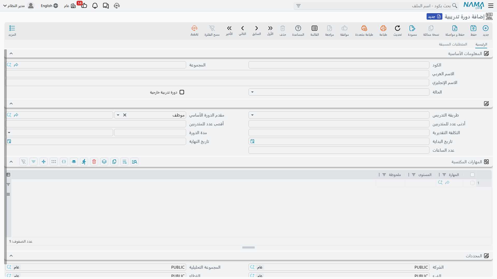
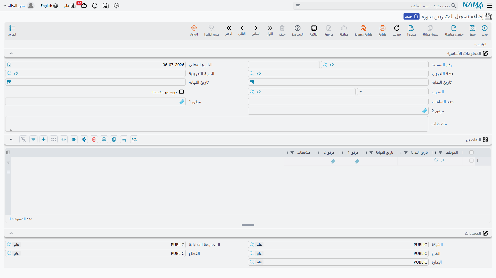

# الدورات وخطط التدريب

قبل أن يتدرب أي موظف، لا بد أن يكون هناك شيء يُتدرَّب عليه أصلًا. **الدورة التدريبية** (Training Course) هي هذا التعريف الأساسي في الكتالوج — تعريف قابل لإعادة الاستخدام لدورة ما، بمعزل عمّن سيلتحق بها أو متى. **خطة التدريب** (Training Plan) هي ما يحوّل هذا الكتالوج إلى جدول فعلي: أي الموظفين يحتاجون أي المهارات، وأي الدورات ستوصلهم إليها. أما **تسجيل المتدربين بدورة** (Course Enrollment) فيسجّل التنفيذ الفعلي — من حضر، مع أي مدرب، وفي أي تواريخ — بينما **إنهاء دورة تدريبية** (End Training Course) يُغلق مشاركة كل موظف على حدة، مسجّلًا مستوى المهارة الذي حقّقه فعليًا. تستعرض هذه الصفحة الشاشات الأربع بالترتيب الذي تمر به دورة الحياة الطبيعية للدورة التدريبية.

## أين تجدها

| الشاشة | مسار القائمة |
|---|---|
| الدورة التدريبية (Training Course) | الموارد البشرية > التدريب > دورة تدريبية |
| خطة التدريب (Training Plan) | الموارد البشرية > التدريب > خطة تدريب |
| تسجيل المتدربين بدورة (Course Enrollment) | الموارد البشرية > التدريب > تسجيل المتدربين بدورة |
| إنهاء دورة تدريبية (End Training Course) | الموارد البشرية > التدريب > إنهاء دورة تدريبية |

## الدورة التدريبية — التعريف في الكتالوج

تُعرَّف الدورة التدريبية مرة واحدة ويُعاد استخدامها في كل خطة وتسجيل يحتاجها: **كود**، **مجموعة**، اسم عربي وإنجليزي، و**حالة** (Status) تكون إما غير فعال أو فعال أو مقترح — بحيث يمكن صياغة الدورة ومراجعتها قبل فتحها للتسجيل.

| الحقل (بالعربية) | الاسم الإنجليزي | ملاحظات |
|---|---|---|
| دورة تدريبة خارجية (External Course) | External Course | يُفعَّل عندما تكون الدورة تُدار عبر جهة تدريب خارجية بدلًا من التدريب الداخلي. |
| طريقة التدريس (Delivery Method) | Delivery Method | مدرب، دراسة ذاتية، أو تدريب أثناء العمل. |
| مقدم الدورة الأساسي (Default Provider) | Default Provider | من يقدّم الدورة عادةً — موظف بشكل افتراضي، وإن كانت الدورة خارجية فيمكن أن تشير إلى جهة خارجية بدلًا من ذلك. |
| أدنى / أقصى عدد للمتدربين (Minimum / Maximum Student Number) | Minimum / Maximum Student Number | لا يمكن أن يكون الحد الأدنى أكبر من الحد الأقصى — ترفض الدورة هذا التوليفة مباشرة. |
| التكلفة التقديرية (Estimated Cost) | Estimated Cost | الرقم التخطيطي الذي تسحبه خطة التدريب عند جدولة الدورة (انظر أدناه). |
| مدة الدورة (Course Duration) | Course Duration | قيمة مع وحدة (أيام، ساعات، وغيرها) تصف طول تنفيذ واحد للدورة. |
| تاريخ البداية / تاريخ النهاية (Start Date / End Date) | Start Date / End Date | التواريخ الافتراضية لتعريف الدورة نفسه — يمكن لتسجيل معيّن أن يُنفَّذ بتواريخ مختلفة عنها. |
| عدد الساعات (Number Of Hours) | Number Of Hours | إجمالي ساعات التواصل التي تمثلها الدورة. |

يكمل التعريف جدولان في تبويبين منفصلين:

- **المهارات المكتسبة (Course Skills)**، في التبويب الرئيسي — المهارات التي تهدف الدورة لبنائها، كل واحدة منها مع **مستوى** مستهدف (Level) (من غير موجودة، مرورًا بضعيفة جدا، ضعيفة، جيدة، جيدة جدا، إلى ممتازة) وملحوظة اختيارية. لا يمكن أن تتكرر نفس المهارة داخل الدورة الواحدة؛ إضافتها مرتين تُرفض. وهذا الجدول بالذات هو ما تبحث فيه خطة التدريب لاحقًا لمطابقة دورة مع احتياج (انظر **تجميع الدورات** أدناه).
- **المتطلبات المسبقة (Prerequisites)**، في تبويب مستقل — المهارات (ومستوياتها) التي يُفترض أن يمتلكها المتدرب مسبقًا قبل الالتحاق، مُدرجة إلى جانب الدورة لمن يخطط عمليات التسجيل.

::: tip الحالة مقابل طريقة التدريس
الحالة تتبع دورة حياة سجل الدورة نفسه (لا تزال مقترحة، أو مفتوحة وفعالة)؛ بينما طريقة التدريس تصف كيفية تدريسها. يمكن أن تكون الدورة فعالة وتظل في الوقت نفسه دراسة ذاتية أو تدريبًا أثناء العمل — لا يفرض أي حقل منهما قيمة الآخر.
:::

## خطة التدريب — مطابقة الأشخاص بالدورات

خطة التدريب هي حيث يُدوَّن الاحتياج الفعلي قبل جدولة أي دورة عليه: **مدير التدريب** و**المنسق**، مدى زمني، وإجماليات جارية لـ**التكلفة التقديرية** و**التكلفة الفعلية**.

جدول **المهارات (Skills)** في الخطة هو نقطة الانطلاق — سطر واحد لكل **موظف** والـ**مهارة** التي يحتاج تطويرها، مع مستوى **مخطط** (Expected) (الهدف) بجانب مستوى **فعلي** (Actual) يبدأ فارغًا ولا يُملأ إلا بعد إتمام التدريب فعليًا (انظر إنهاء دورة تدريبية أدناه).

الضغط على **تجميع الدورات** (Collect Courses) يحوّل هذه القائمة إلى جدول فعلي: لكل سطر في جدول المهارات، يبحث النظام في كتالوج الدورات عن دورة تدريبية يتضمن جدول المهارات المكتسبة الخاص بها نفس المهارة بنفس المستوى أو أعلى، ويضيف سطرًا مطابقًا إلى جدول **التفاصيل (Details)** الخاص بالخطة — الموظف، الدورة التي وُجدت، حالة **لم تبدأ (Not Started)**، وتكلفة تلك الدورة التقديرية التي تُضاف أيضًا إلى إجمالي التكلفة التقديرية للخطة.

| عمود التفاصيل (بالعربية) | الاسم الإنجليزي | ملاحظات |
|---|---|---|
| الموظف (Employee) | Employee | من يتم جدولته. |
| الدورة التدريبية (Course) | Course | الدورة التي طابقها النظام من الكتالوج (أو اختيرت مباشرة). |
| الحالة (Status) | Status | لم تبدأ، قيد التنفيذ، انتهى بنجاح، لم يتم الانتهاء بنجاح، أو منتهى. |
| التكلفة \| المخطط / الفعلي (Cost \| Estimated / Actual) | Cost \| Estimated / Actual | التكلفة التخطيطية للدورة إلى جانب ما كلّفت فعليًا. |
| تاريخ البداية / تاريخ النهاية \| المخطط / الفعلي (Start Date / End Date \| Estimated / Actual) | Start Date / End Date \| Estimated / Actual | التواريخ المخططة إلى جانب التواريخ التي يُثبّتها لاحقًا تسجيل المتدربين وإنهاء الدورة التدريبية. |

لا شيء في سطر التفاصيل مقيّد بما وجده تجميع الدورات — يمكن إضافة دورة إلى الجدول يدويًا بنفس السهولة، حتى بدون سطر مطابق في جدول المهارات إطلاقًا.

::: tip مثال توضيحي
لنفترض أن سطرًا في جدول المهارات يطلب أن يصل **أحمد** إلى **المستوى 5 (جيدة جدا)** في "التفاوض". يبحث تجميع الدورات في الكتالوج ويجد دورة "التفاوض المتقدم" التي يتضمن جدول مهاراتها المكتسبة "التفاوض" بالمستوى 6 (ممتازة) — وهذه مطابقة، لأن "ممتازة" تساوي أو تفوق الهدف عند المستوى 5. يُضاف سطر تفاصيل: أحمد، التفاوض المتقدم، لم تبدأ، مع إضافة التكلفة التقديرية لتلك الدورة إلى إجمالي الخطة الجاري.
:::

## تسجيل المتدربين بدورة — تنفيذ الدورة

بينما تُجدول خطة التدريب دورة ما، يسجّل تسجيل المتدربين بدورة تنفيذًا فعليًا واحدًا لها — **مدرب** (Instructor) محدد، يمتد من **تاريخ بداية** إلى **تاريخ نهاية**، مع التحاق موظف واحد أو أكثر. اختيار **خطة (Plan)** في رأس المستند يملأ تاريخ البداية والنهاية تلقائيًا من تلك الخطة؛ أما دورة تُنفَّذ خارج أي خطة فتُعلَّم فقط بأنها **دورة غير مخططة (Unplanned Course)** بدلًا من ربطها بخطة.

يحتوي جدول **التفاصيل (Details)** على سطر واحد لكل **موظف** ملتحق، لكل منهم تاريخ بداية ونهاية خاص به — تُملأ افتراضيًا من تواريخ الرأس، وإذا كان الجدول يحتوي سطرًا واحدًا بالضبط، فإن تعديل تاريخ نهاية الرأس يُحدّث تاريخ نهاية ذلك السطر أيضًا. يجب أن يقع تاريخ نهاية الرأس دائمًا بعد تاريخ بدايته.

حفظ التسجيل يرجع إلى خطة التدريب: لكل زوج موظف/دورة، يبحث النظام عن سطر مطابق في تفاصيل الخطة، ويثبّت تاريخ بداية التسجيل كـ**تاريخ البداية الفعلي** لذلك السطر — وإذا كان السطر لا يزال عند "لم تبدأ"، يرفع حالته إلى **قيد التنفيذ (In Progress)**. بعبارة أخرى، تسجيل الأشخاص هو ما يُخبر الخطة بأن دورة مجدولة قد بدأت فعلًا.

## إنهاء دورة تدريبية — إغلاق مشاركة موظف

يُغلق سجل إنهاء دورة تدريبية مشاركة **موظف** واحد في **دورة** واحدة ضمن **خطة تدريب** واحدة — **حالة** (نفس مجموعة لم تبدأ / قيد التنفيذ / انتهى بنجاح / لم يتم الانتهاء بنجاح / منتهى المستخدمة في الخطة)، **نسبة نهائية (Final Percentage)**، **تاريخ نهاية (End Date)**، وجدول **تطوير المهارات (Skill Development)** يسرد كل مهارة عمل عليها الموظف فعليًا، مع **المستوى (Level)** الذي حققه.

حفظ السجل يُعيد تغذية خطة التدريب بأمرين دفعة واحدة:

1. يجد السطر المطابق في التفاصيل (نفس الموظف، نفس الدورة) وينسخ تاريخ نهاية هذا المستند إلى **تاريخ النهاية الفعلي** لذلك السطر، مع حالته أيضًا.
2. لكل مهارة في جدول تطوير المهارات بهذا المستند، يجد سطر المهارات المطابق في الخطة (نفس الموظف، نفس المهارة)، ويرفع مستواه **الفعلي (Actual)** إلى المستوى الذي تحقق للتو — لكن فقط إذا كان أعلى مما هو مسجَّل بالفعل، بحيث لا تُلغي نتيجة لاحقة أضعف نتيجة أقوى سابقة.

::: tip استكمالًا للمثال
ينهي أحمد دورة "التفاوض المتقدم"، ويُظهر سجل إنهاء دورته وصوله إلى **المستوى 6 (ممتازة)** في التفاوض — مستوى أعلى من المستوى 5 الذي طلبته الخطة أصلًا. سطر المهارات الخاص بأحمد/التفاوض في الخطة يُحدَّث مستواه الفعلي إلى ممتازة، رغم أن المطلوب كان جيدة جدا فقط، لأن إنهاء دورة تدريبية يرفع المستوى المسجَّل فقط ولا يخفضه أبدًا.
:::

## إلى أين يذهب بعد ذلك

انتهاء الدورة ليس نهاية القصة عادةً — يليه غالبًا **تقييم دورة تدريبية**، يقيّم إما الدورة نفسها، أو المتدرب، أو المدرب، باستخدام نفس آلية معايير التقييم المسجّلة التي تستخدمها الموارد البشرية في تقييمات الموظفين. انظر [تقييم الدورة التدريبية](hr-course-evaluation.md) لمعرفة كيفية عملها.

## صفحات ذات صلة

- **[تقييم الدورة التدريبية](hr-course-evaluation.md)** — التقييم اللاحق للدورة الذي يلي عادةً إنهاء دورة تدريبية.
