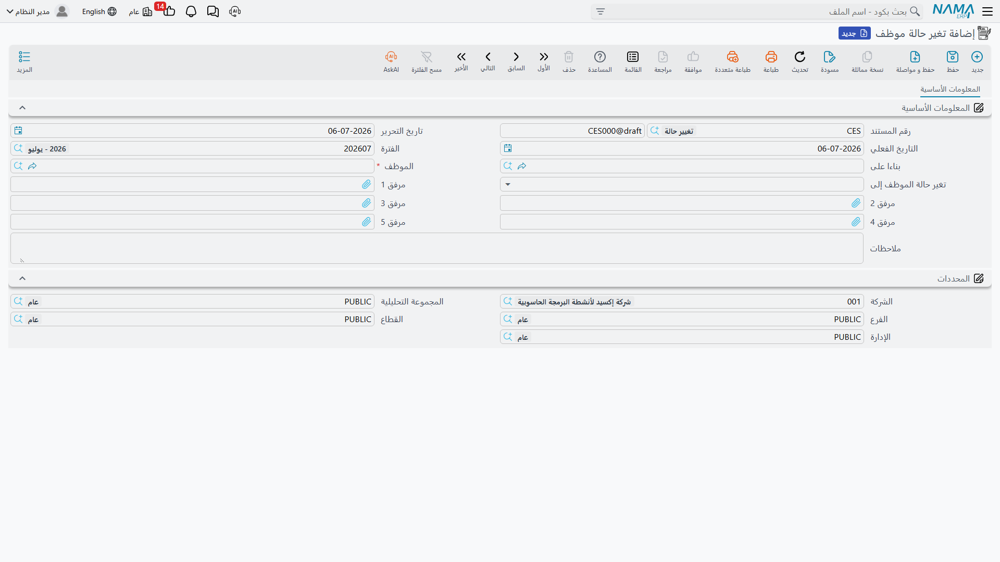

# تغيير حالة الموظف

يحمل كل موظف حالة عمل واحدة في كل لحظة — على رأس العمل، في أجازة، موقوف، مستقيل، تم فصله، على المعاش، وكذلك مجموعة من حالات "أخرى" المفتوحة التي يمكن للشركة أن تعطيها المعنى الذي تريده. **تغير حالة موظف** (Change Employee State) هي الشاشة الوحيدة التي تسجل تغييراً في هذه الحالة مباشرة، مع تاريخ سريانها، بشكل مستقل عن أي مستند آخر.

**مكان الشاشة:** الرواتب > الأجازات > تغير حالة موظف.

| الحقل (بالعربية) | English | ملاحظات |
|---|---|---|
| الموظف | Employee | الموظف الذي تتغير حالته. |
| التاريخ الفعلي | Value Date | التاريخ الذي تسري منه الحالة الجديدة. |
| تغير حالة الموظف إلى | Change Employee State To | الحالة الجديدة: `على رأس العمل` (Working)، `في أجازة` (In Vacation)، `موقوف` (Suspended)، `مستقيل` (Resigned)، `تم فصله` (Dismissed)، `على المعاش` (Pension)، `مْعين` (Appointed)، `بأنتظار الموافقة` (Offered)، أو عشر حالات حرة من نوع `أخرى` يمكن للشركة أن تحدد معناها الخاص بها. |
| بناءا على | From Document | تُملأ تلقائياً عندما يُنشأ هذا السند من سند أجازة — انظر أدناه. |

حفظ هذا السند يقوم بأمرين: يكتب حالة الموظف الحالية مباشرة على سجله، ويضيف **سجلاً مؤرَّخاً لتاريخ الحالات**، بحيث يعرف النظام دائماً في أي حالة كان الموظف في أي تاريخ سابق — وليس فقط حالته الآن.

## طريقتان لإنشاء هذا السند

في معظم الأحيان لن تفتح هذه الشاشة مباشرة: يمكن أن يحمل [نوع الأجازة](vacation-types-and-balances.md) إعداد **تغير حالة الموظف إلى** الخاص به (مثلاً، تحويل الموظف إلى `في أجازة` أو `موقوف`)، وكل [سند أجازة](vacation-documents.md) من هذا النوع يُنشئ سجل تغيير حالة مطابقاً تلقائياً طوال مدته، ويعيد الحالة عند العودة. حقل **بناءا على** هو ما يربط السجل المُنشأ تلقائياً بسند الأجازة الذي أنشأه.

أما في باقي الحالات — إنهاء أجازة بدون مرتب مبكراً، تسجيل موظف كـ`مستقيل`/`تم فصله`/`على المعاش` خارج [مسار الفصل](../end-of-service/firing-and-termination.md)، أو إعادة تفعيل موظف كانت حالته قد ضُبطت إلى `موقوف` عبر تسجيل يدوي في تغير حالة موظف (غالباً بالتزامن مع [سند إيقاف عن العمل](../discipline/hr-suspension.md)) — تفتح الموارد البشرية شاشة تغير حالة موظف مباشرة وتسجل التغيير يدوياً.

::: info لا تأثير محاسبي
تغير حالة موظف لا يمس دفتر الأستاذ إطلاقاً. وجوده الوحيد هو الإجابة على سؤال واحد — "ما هي حالة عمل هذا الموظف في هذا التاريخ؟" — ليقرأه كل شيء آخر في الموارد البشرية والرواتب.
:::

## تأثيرها على الرواتب

سجل تاريخ الحالات هذا ليس مجرد معلومة — فخطوة إنشاء [كشف الراتب](../payroll/salary-documents.md) تقرأه لكل موظف قبل أن تُصدر له سند راتب عن فترة معينة. يجب أن يكون الموظف `على رأس العمل` لجزء من الفترة على الأقل (أو أن يقع تاريخ فصله ضمنها) حتى يُصدر راتب الفترة أصلاً؛ أما الفترة التي يقضيها الموظف بالكامل `موقوف`، أو `مستقيل`، أو `تم فصله`، أو `على المعاش`، أو في إحدى حالات `أخرى`، فتُستبعد عادة من إصدار الراتب، إلا إذا قضى الموظف جزءاً من نفس الفترة `في أجازة` بموجب نوع أجازة مدفوع أو مدفوع جزئياً (وعندها يعتبر محرك الرواتب الفترة عملاً جزئياً).

عملياً، هذا يعني أن تسجيل إيقاف أو عودة إلى العمل عبر تغير حالة موظف — سواء أُدخل مباشرة أو أُنشئ تلقائياً من سند أجازة — هو ما يحدد ما إذا كان هذا الموظف سيُدرج أصلاً في تشغيلة الرواتب القادمة.

## أين يقع هذا ضمن السياق العام

- **[إيقاف الموظف](../discipline/hr-suspension.md)** — سند الإيقاف التأديبي؛ وهو مرتبط بهذه الشاشة لكنه منفصل عنها — تسجيله وحده **لا** يغيّر حالة الموظف. لإدخال الموظف فعلياً في حالة `موقوف` لا بد من تسجيل سند تغير حالة موظف، وهو ما يتم هنا.
- **[مستندات الرواتب](../payroll/salary-documents.md)** — حيث يُقرأ سجل تاريخ الحالات لتحديد ما إذا كان يمكن إصدار سند راتب لموظف في فترة معينة.
