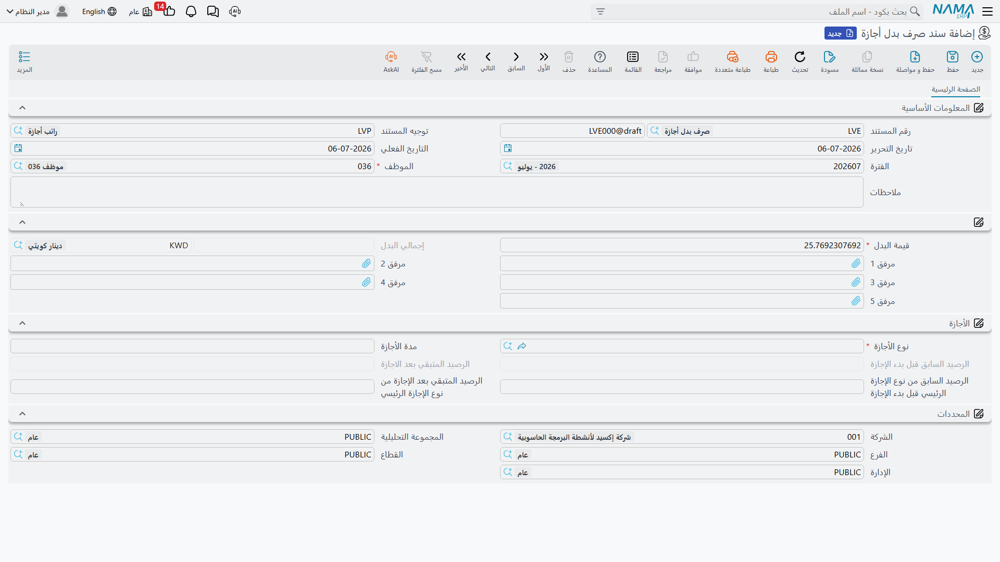

# تعويض ونقل الأجازات

ليست كل مستندات الأجازات تتعلق بغياب الموظف فعلياً عن العمل. تغطي هذه الصفحة أربع شاشات تقوم بدلاً من ذلك بـ**صرف قيمة نقدية** بدل الرصيد غير المستهلك (**سند صرف بدل أجازة** / Vacation Compensation)، أو **ترحيل الرصيد إلى سنة موارد بشرية جديدة** (**سند ترحيل أجازات** / Vacation Transfer Document)، أو **تعديل رصيد يدوياً** (**سند تعديل رصيد أجازة** / Vacation Changing Document)، أو **تحويل أيام العمل الفعلي في عطلة رسمية أو راحة أسبوعية إلى رصيد** (**بدل أرصده راحات أسبوعية و عطلات رسمية** / Holidays And Rest Days Balance Compensation Document). كل هذه الشاشات الأربع تقرأ وتكتب على نفس الأرصدة المُعرَّفة في [أنواع وأرصدة الأجازات](vacation-types-and-balances.md).

## سند صرف بدل أجازة: تحويل الرصيد غير المستهلك إلى نقد

**سند صرف بدل أجازة** (Vacation Compensation) يصرف للموظف مبلغاً مالياً بدلاً من أن يأخذ (أو يستمر باستحقاق) عدداً من أيام الأجازة — وهو الوجه الخاص بـ"تعويض" (Repaid) من **سياسة ترحيل الأجازة** (Vacation Transfer Policy، انظر [أنواع وأرصدة الأجازات](vacation-types-and-balances.md)) الخاصة بنوع الأجازة. على خلاف سند الأجازة العادي، هذا السند لا يُغيّب الموظف عن العمل؛ هو فقط يستهلك رصيداً وينشئ مبلغاً مستحق الصرف.

**مكان الشاشة:** الرواتب > الأجازات > سند صرف بدل أجازة.

| الحقل (بالعربية) | English | ملاحظات |
|---|---|---|
| الموظف | Employee | من يُصرف له التعويض. |
| نوع الأجازة | Vacation Type | الرصيد الذي يُصرف بدلاً عنه؛ يجب أن يكون لنوع الأجازة تصنيف اجازة (Vacation Class) محدد. |
| مدة الأجازة | Vacation Period | عدد أيام الرصيد التي يغطيها هذا التعويض — يجب أن تكون أكبر من صفر. |
| قيمة البدل | Compensation Value | القيمة المالية **ليوم واحد** من هذا التعويض. يمكن إدخالها مباشرة، أو — إذا كان التوجيه يحتوي على معادلة حساب البدل (Compensation Calc Formula) — تُحسب تلقائياً من بيانات راتب الموظف الفعلية لتلك الفترة، بنفس محرك الحساب المستخدم لتسعير [مفردات الراتب](../payroll/salary-calculation-formulas.md). |
| إجمالي البدل (المبلغ / العملة) | Total Compensation | `قيمة البدل × مدة الأجازة` — المبلغ الفعلي الذي سيُصرف. |
| الرصيد السابق قبل بدء الإجازة / الرصيد المتبقي بعد الاجازة | Previous Balance Before Starting Vacation / Reminder Balance After Vacation | رصيد نوع الأجازة نفسه، قبل وبعد استهلاك هذا التعويض لعدد أيام `مدة الأجازة` منه. |
| الرصيد السابق من نوع الإجازة الرئيسي / الرصيد المتبقي بعد الإجازة من نوع الإجازة الرئيسي | Previous Main Vacation Type Balance / Main Vacation Type Balance Remainder | نفس الأرقام قبل/بعد، لكن للرصيد السنوي الرئيسي للموظف، عندما يكون نوع الأجازة المُعوَّض مرتبطاً به. |

تتطلب هذه الشاشة مكوّن الترخيص `humanresource-payroll`.

## كيف تتم معالجته وماذا يُرحّل

حفظ سند صرف بدل أجازة يقوم بأمرين في آنٍ واحد. أولاً، وتماماً كسند الأجازة العادي، يستهلك عدد أيام `مدة الأجازة` من رصيد الموظف لهذا النوع من الأجازة. ثانياً — وعلى خلاف سند الأجازة العادي — يُنشئ **طلب أعمال** (Business Request) يُرحّل قيداً محاسبياً فعلياً: سطر مدين وسطر دائن، كلاهما بقيمة **إجمالي البدل**، إلى أي حسابات مُعرَّفة على توجيه سند صرف بدل أجازة (الجانبان يُسميان هناك **مدين 2** / **دائن 2**). تعديل سند تعويض سبق ترحيله يعيد إصدار هذا القيد بالقيمة الجديدة؛ وحذفه يعكس القيد ويعيد الأيام إلى الرصيد.

## سند ترحيل أجازات: نقل الأرصدة إلى سنة موارد بشرية جديدة

عند إغلاق سنة موارد بشرية، لا بد من تحديد مصير رصيد كل موظف المتبقي: هل يضيع، أم يُرحَّل إلى السنة الجديدة، أم يحتاج إلى تعويض نقدي (عبر سند صرف بدل أجازة أعلاه)؟ **سند ترحيل أجازات** (Vacation Transfer Document) هو أداة الدفعات التي تنفذ خطوة "الترحيل إلى السنة الجديدة" لكل نوع أجازة تكون **سياسة ترحيل الأجازة** الخاصة به `ترحيل` (Migrated).

**مكان الشاشة:** الرواتب > الأجازات > سند ترحيل أجازات.

| الحقل | English | ملاحظات |
|---|---|---|
| من سنة | From Year | سنة الموارد البشرية التي يتم إغلاقها. |
| إلى سنة | To Year | سنة الموارد البشرية التي تُنقل إليها الأرصدة. يجب أن تكون لاحقة لـ**من سنة**. |
| التاريخ الفعلي | Value Date | يجب أن يساوي تاريخ بداية **إلى سنة**. |
| التفاصيل — الموظف | Details — Employee | قائمة الموظفين الذين يُنفَّذ لهم الترحيل. |

حفظ السند يوسّع قائمة الموظفين هذه إلى جدول **التفاصيل** المحسوب — سطر واحد لكل مجموعة موظف/نوع أجازة:

| الحقل | English | المعنى |
|---|---|---|
| الرصيد المخصص | Assigned Balance | استحقاق الموظف من هذا النوع من الأجازة، وقت الترحيل. |
| الرصيد المتبقي من العام الماضى | Reminder From Previous Year | كم من رصيد العام الماضي غير المستهلك ينتقل فعلياً — محدود بسقف الترحيل الخاص بنوع الأجازة، وبسنوات خبرة الموظف. |
| الرصيد الكلى | Total Balance | ما يصل إلى السنة الجديدة: `الرصيد المخصص` للأنواع التي لا تُرحَّل، أو `الرصيد المخصص + الرصيد المتبقي من العام الماضى` للأنواع من نوع `ترحيل`. |

::: warning يعمل فقط مع نظام السنوات التقويمية (كما في مصر)
يعمل هذا السند فقط عندما تُحسب أرصدة الأجازات في نظام الموارد البشرية بناءً على سنة تقويمية مشتركة لكل الموظفين (النظام المتبع تاريخياً في مصر). أما إذا كانت أرصدة الأجازات تُحسب اعتماداً على تاريخ بدء عمل كل موظف على حدة، فهذا السند يكون محظور الاستخدام تماماً — لأن ذلك الإعداد يرحّل الأرصدة تلقائياً لكل موظف بمفرده.
:::

لا يوجد أي تأثير محاسبي: هذا السند فقط يعيد كتابة سجلات رصيد الأجازات الخاصة بالسنتين — فهو يُعلِّم رصيد السنة القديمة على أنه لم يعد سارياً، ويضع `الرصيد الكلى` المحسوب كرقم الرصيد الافتتاحي للسنة الجديدة.

## سند تعديل رصيد أجازة: تصحيح رصيد يدوياً

أحياناً يكون الرصيد خاطئاً ببساطة — مكافأة أقدمية يدوية، تصحيح بعد مراجعة رواتب، منح استثنائي لأيام إضافية — ولا يوجد مسار طلب/سند يناسب هذه الحالة. **سند تعديل رصيد أجازة** (Vacation Changing Document) موجود لهذا الغرض بالتحديد: تعديل مباشر وموثَّق لرصيد موظف واحد أو عدة موظفين.

**مكان الشاشة:** الرواتب > الأجازات > سند تعديل رصيد أجازة.

| الحقل | English | ملاحظات |
|---|---|---|
| الرصيد المضاف | Added Balance | تعديل افتراضي على مستوى الرأس (موجب لإضافة أيام، سالب لخصمها) يُطبَّق على كل سطر لا يُحدد قيمته الخاصة. |
| تاريخ بدء العمل (موحد) | Work Start Date (Unified) | يظهر فقط عندما تُحسب الأجازات اعتماداً على تاريخ بدء عمل كل موظف — يضبط تاريخ بدء عمل واحد لكل الأسطر دفعة واحدة. |
| نطاق الموظفين | — | فلتر من/إلى (الفرع، الإدارة، القطاع، الوظيفة، وغيرها) لسحب عدد كبير من الموظفين إلى الجدول دفعة واحدة بدلاً من إضافتهم واحداً تلو الآخر. |

**جدول الأجازات** (سطر واحد لكل موظف + نوع أجازة):

| الحقل | English | المعنى |
|---|---|---|
| الموظف / نوع الأجازة | Employee / Vacation Type | صاحب الرصيد، ونوع الأجازة. |
| تاريخ بدء العمل | Work Start Date | تاريخ بدء العمل الخاص بالسطر (فقط في نظام تاريخ بدء العمل الفردي). |
| الرصيد المضاف | Added Balance | التعديل الخاص بهذا السطر، بقيمة افتراضية من حقل الرأس أعلاه. |
| الرصيد الحالي / المستهلك الحالى / المتبقي الحالى | Current Balance / Current Consumed / Current Remainder | أرقام الرصيد **قبل** هذا السند، تُقرأ مباشرة من سجل رصيد أجازات الموظف الحي. |
| الرصيد المعدل / المتبقي المعدل | New Balance / New Remainder | `الرصيد الحالي + الرصيد المضاف`، والمتبقي المقابل له. |

لا يوجد تأثير محاسبي هنا أيضاً — هذا السند يكتب مباشرة إلى سجل رصيد أجازات الموظف؛ ولا يمس المحاسبة.

## بدل أرصده راحات أسبوعية و عطلات رسمية

الموظف الذي يُستدعى للعمل في عطلة رسمية أو في يوم راحته الأسبوعية يكون، من الناحية العملية، مستحقاً لشيء مقابل ذلك. **بدل أرصده راحات أسبوعية و عطلات رسمية** (Holidays And Rest Days Balance Compensation Document) يفحص سجل حضور الموظف خلال فترة معينة، ويحوّل كل يوم عطلة رسمية أو راحة أسبوعية حضر فيها الموظف فعلياً إلى رصيد أجازة.

**مكان الشاشة:** الرواتب > الأجازات > بدل أرصده راحات أسبوعية و عطلات رسمية.

| الحقل | English | ملاحظات |
|---|---|---|
| من تاريخ / إلى تاريخ | From Date / To Date | فترة الحضور التي سيتم فحصها. |
| التفاصيل — الموظف | Details — Employee | الموظفون الذين سيتم فحصهم. |
| التفاصيل — عدد أيام حضور عطلات رسمية | Details — Attendance Holidays Count | عدد الأيام في الفترة المُعلَّمة كعطلة رسمية والتي لا يزال للموظف فيها بصمة حضور/انصراف فعلية — تُحسب تلقائياً، ولا تُدخل يدوياً. |
| التفاصيل — عدد أيام حضور راحات أسبوعية | Details — Attendance Rest Days Count | نفس الفكرة، لكن لأيام الراحة الأسبوعية (التي ليست عطلة رسمية في الوقت نفسه). |

إعدادان في توجيه هذا السند يحددان **أين** تُقيَّد هذه الأيام المحسوبة:

| إعداد التوجيه | English | المعنى |
|---|---|---|
| نوع أجازة لبدل أيام العطلات الرسمية | Holidays Compensation Vacation Type | نوع الأجازة الذي يُقيَّد له كل يوم عطلة رسمية محسوب. |
| نوع أجازة لبدل أيام الراحة | Rest Days Compensation Vacation Type | نوع الأجازة الذي يُقيَّد له كل يوم راحة أسبوعية محسوب. |
| إعادة حساب الحضور والإنصراف النظامي | Recalculate Employee Attendance Lines | يعيد تشغيل حساب الحضور والانصراف لهذه الفترة قبل الإحصاء، بحيث تعكس الأرقام آخر البصمات/التصحيحات. |

::: warning يتطلب حضوراً محسوباً بواسطة النظام
لا يمكن استخدام هذا السند عندما يكون نظام الموارد البشرية مُعداً على إدخال حضور يدوي بالكامل — فهو يعتمد على سطور الحضور المحسوبة بواسطة النظام لمعرفة أي الأيام كانت عطلات/راحات أسبوعية وهل حضر الموظف فيها فعلياً أم لا.
:::

كسند تعديل رصيد أجازة، هذا سند يخص الرصيد فقط — لا يُنشئ قيداً محاسبياً؛ القيمة التي يُنشئها هي *أيام*، وليست مالاً، وتُقيَّد في نوع الأجازة الذي تحدده إعدادات التوجيه. الموظف الذي يكون نوع أجازته `سياسة ترحيل الأجازة = تعويض` يمكنه لاحقاً تحويل هذه الأيام إلى نقد عبر سند صرف بدل أجازة الموضح أعلاه.

## أين يقع هذا ضمن السياق العام

- **[أنواع وأرصدة الأجازات](vacation-types-and-balances.md)** — قواعد نوع الأجازة (سياسة الترحيل، تصنيف الاجازة، حدود الرصيد) التي تقرأ منها أو تكتب إليها كل الشاشات الأربع في هذه الصفحة.
- **[مستندات الأجازات](vacation-documents.md)** — زوج الطلب/السند والتجميعات التي تستهلك الرصيد بالطريقة الاعتيادية، بإرسال الموظف في أجازة.
