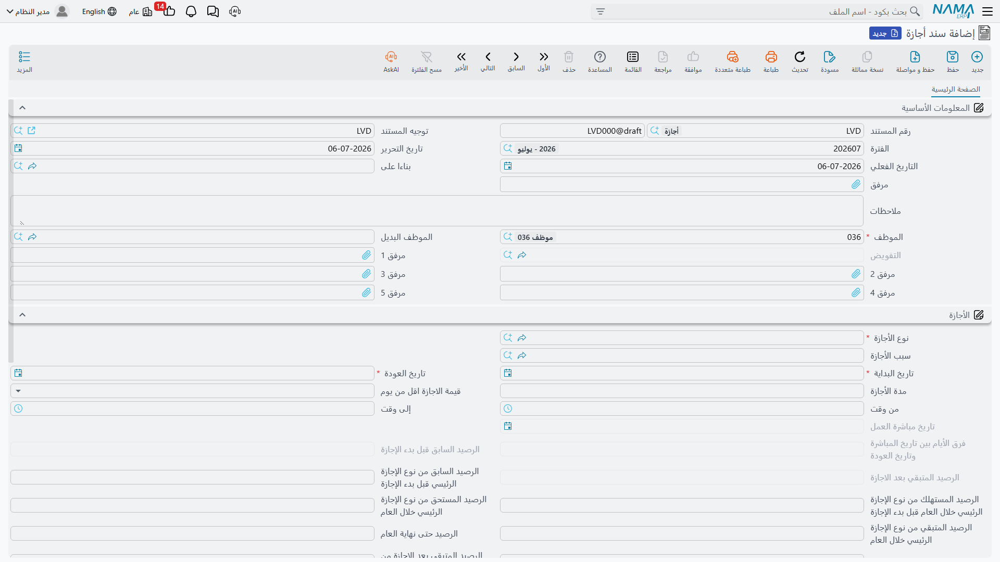
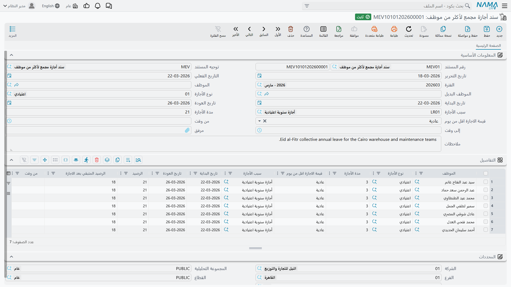

# مستندات الأجازات

تغطي هذه الصفحة الشاشات التي تضع الموظف فعلياً في أجازة: زوج **طلب أجازة** (Vacation Request) و**سند أجازة** (Vacation Document)، و**مستند خطة أجازة** (Vacation Plan Document) المستخدم لتخطيط الأجازة مسبقاً، وشاشتي التجميع اللتين تُجمّعان الأجازات عبر عدة موظفين أو عدة مقاطع — **سند أجازة مجمع لأكثر من موظف** (Multi Employee Vacation) و**سند أجازه مجمع** (Aggregated Vacation Document). كل هذه الشاشات تقرأ قواعدها من [نوع الأجازة](vacation-types-and-balances.md) الذي تنتمي إليه الأجازة.

## مسار الطلب إلى السند

يتبع **طلب الأجازة** و**سند الأجازة** نمط الطلب/السند العام المستخدم في كل أنحاء الموارد البشرية — انظر **[مسارات الطلبات والمستندات والمستندات المجمعة في الموارد البشرية](../concepts/hr-requests-and-documents.md)** للشرح الكامل لهذا النمط. باختصار:

1. تُدخل الموارد البشرية (أو الموظف عبر الخدمة الذاتية) **طلب أجازة**، باختيار الموظف ونوع الأجازة والتواريخ. يبدأ الطلب بحالة مبدئي (Initial).
2. يضغط المراجع على **قبول** (Accept) أو **رفض** (Reject).
3. عند القبول، يؤدي الضغط على **إنشاء سند أجازة** (Generate Vacation Doc) في الطلب إلى إنشاء **سند الأجازة** المطابق، وهو ما يستهلك الرصيد فعلياً. تتحول حالة الطلب إلى تمت معالجته (Processed).

**مكان الشاشتين:** الرواتب > الأجازات > طلب أجازة / سند أجازة.

### أهم حقول سند الأجازة

| الحقل (بالعربية) | English | ملاحظات |
|---|---|---|
| نوع الأجازة | Vacation Type | [نوع الأجازة](vacation-types-and-balances.md) الذي تُؤخذ هذه الأجازة على أساسه — يحدد كل قواعد الرصيد والراتب التالية. |
| سبب الأجازة | Vacation Reason | عنصر من كتالوج أسباب الأجازة (Leave Reason)؛ بعض أنواع الأجازات تفرض إدخاله (`عدم الحفظ إذا كان سبب الأجازة فارغاً`). |
| تاريخ مباشرة العمل | Starting Date | التاريخ الذي يتوقف فيه العمل فعلياً بسبب هذه الأجازة. |
| تاريخ العودة | Return Date | التاريخ المتوقع لعودة الموظف. |
| مدة الأجازة | Vacation Period | طول الأجازة المحسوب، بالأيام. |
| قيمة الاجازة اقل من يوم | Value less Than Day | لأجازة جزء من اليوم: عادي (Normal)، نصف يوم (Half Day)، أو ربع يوم (Quarter Day). |
| من وقت / إلى وقت | From Time / To Time | تُستخدم مع إعداد نصف/ربع اليوم لأجازة جزء من اليوم. |
| الرصيد المستهلك من نوع الإجازة الرئيسي خلال العام قبل بدء الإجازة | Main Vacation Type consumed Days | كم يوماً من الرصيد الرئيسي استُهلك هذا العام قبل هذه الأجازة. |
| الرصيد المتبقي بعد الإجازة من نوع الإجازة الرئيسي | Main Vacation Type Balance Remainder | ما يتبقى من الرصيد بعد خصم هذه الأجازة. |
| الرصيد حتى نهاية العام | Balance Till End Of Year | توقع للرصيد حتى نهاية العام، مفيد لتخطيط أجازات لاحقة. |
| الموظف البديل | Alternative Employee | من يغطي عمل الموظف أثناء غيابه. |
| التفويض | Delegation | تفويض رسمي اختياري لصلاحيات الموظف/مهامه طوال مدة الأجازة. |
| بناءا على | From Document | يشير إلى طلب الأجازة الذي أُنشئ منه السند، عند وجوده. |

يحتوي السند أيضاً على قسم صغير لـ"بيانات الاتصال أثناء الأجازة" (العنوان، الجوال، البريد الإلكتروني) حتى تستطيع الموارد البشرية التواصل مع الموظف إن استدعى الأمر ذلك حقاً أثناء غيابه.

## كيف تتم معالجته

لا ينشئ سند الأجازة قيداً في دفتر الأستاذ — فالتأثير المحاسبي لراتب الموظف يُحسب لاحقاً على سند الراتب الخاص بالفترة. ما يفعله سند الأجازة فعلاً هو تسجيل الغياب مقابل سجل حضور الموظف خلال هذه التواريخ، ومقابل رصيده. عندما يُحسب [محرك الرواتب](../concepts/hr-salary-engine.md) لاحقاً تلك الفترة، فإنه يقرأ الأجازة المسجلة ليقرر ما إذا كانت هذه الأيام تُصرف بالكامل، أو جزئياً، أو بدون مرتب — تماماً كما هو مُعرَّف في نوع الأجازة (`بدون مرتب...` / `استقطاع نسبة من المفردات`). بعبارة أخرى: أثر سند الأجازة يظهر في الحضور ثم في الراتب، وليس في دفتر الأستاذ مباشرة.

## تخطيط الأجازة مسبقاً: مستند خطة أجازة

قبل أن يتقدم الموظف بطلب أجازة فعلي، تحتاج الموارد البشرية أحياناً إلى تخطيطها مسبقاً — خصوصاً ذلك النوع من "أجازة الوطن" السنوية الشائعة في عقود العمل الخليجية، حيث قد تكون تذكرة السفر جزءاً من الاستحقاق. **مستند خطة أجازة** (Vacation Plan Document) موجود لخطوة التخطيط هذه، منفصلاً عن زوج الطلب/السند أعلاه؛ حفظ الخطة لا يستهلك أي رصيد.

**مكان الشاشة:** الرواتب > الأجازات > مستند خطة أجازة.

| الحقل | English | ملاحظات |
|---|---|---|
| الموظف | Employee | الموظف الذي يُخطط لأجازته. |
| نوع الأجازة | Vacation Type | نوع الأجازة المخطط لها. |
| تاريخ البداية / تاريخ العودة | Start Date / Return Date | التواريخ المخطط لها. |
| مدة الاجازة المطلوبة | Requested Vacation Period | عدد الأيام المخطط لها. |
| مدة الاجازة طبقاً للتعاقد | Vacation Balance From Contract | الاستحقاق الذي يعِد به عقد الموظف، للمقارنة مع ما هو مخطط/متاح فعلياً. |
| نوع التذكرة | Ticket Type | نقدي (Cash)، تتحملها الشركة (Insured By Company)، أو بدون تذكرة (Without Ticket) — هل تذكرة السفر جزء من هذه الأجازة المخطط لها، ومن يتحمل تكلفتها. |
| نوع الربط | Relation Type | عندما تغطي التذكرة أيضاً أحد أفراد الأسرة، تحدد صلة قرابته (زوج/زوجة، ابن، والد، إلخ). |

## الإجراءات في هذه الشاشة

- **إنشاء سند أجازة** (Generate Vacation Doc) (في **طلب أجازة**) — يفتح سند أجازة جديدًا يحمل موظف الطلب ونوع الأجازة وسببها والتواريخ والمدة وبيانات الاتصال والمحددات، مع حقل **بناءا على** يشير إلى الطلب. يجب حفظ الطلب أولًا، ولا يُخزَّن السند الجديد حتى تحفظه.
- **تجميع الموظفين** (Collect Employees) (في **مستند خطة أجازة**) — يسأل عن نطاق (موظف، إدارة، مجموعة تحليلية، فرع، قطاع) ويملأ جدول الخطة بسطر لكل موظف مطابق، يظهر فيه رصيده طبقًا للتعاقد من **نوع الأجازة** المحدد في الخطة — فاختر النوع أولًا. ويُضاف أسفل كل موظف أفراد عائلته المعلَّمون في ملفه بأن التذكرة تشملهم. يُعاد بناء الجدول في كل مرة.

لا أزرار خاصة بشاشات **سند أجازة** و**سند أجازة مجمع لأكثر من موظف** و**سند أجازه مجمع**.

## محوَرا التجميع

يوفر نما شاشتي تجميع مختلفتين للأجازات، وتُجمّعان على **محورين مختلفين تماماً** — يجب عدم الخلط بينهما. هذا التمييز موضح بشكل عام في [مسارات الطلبات والمستندات والمستندات المجمعة في الموارد البشرية](../concepts/hr-requests-and-documents.md)؛ وفيما يلي ما يعنيه هذا التمييز تحديداً للأجازات.

### سند أجازة مجمع لأكثر من موظف — عدة موظفين، إجراء واحد

**سند أجازة مجمع لأكثر من موظف** (Multi Employee Vacation) يرسل **عدة موظفين مختلفين** في أجازة ضمن دفعة واحدة — نفس نوع الإجراء، مطبق على مجموعة. عبّئ حقول الرأس السريعة (الموظف، نوع الأجازة، التواريخ، السبب) ويُضيف كل إدخال سطراً في الجدول أسفله؛ ويمكنك أيضاً إضافة/تعديل الأسطر مباشرة. **كل سطر ينشئ سند أجازة عادياً خاصاً به** عند حفظ الدفعة، ويتتبع كل سطر حقول رصيده الخاصة (`الرصيد`، `الرصيد المتبقي بعد الاجازة`) بشكل مستقل، لأن كل موظف له رصيد مختلف.

**مكان الشاشة:** الرواتب > الأجازات > سند أجازة مجمع لأكثر من موظف.

### سند أجازه مجمع — موظف واحد، عدة مقاطع

**سند أجازه مجمع** (Aggregated Vacation Document) هو الفكرة المعاكسة: أجازة طويلة **لموظف واحد**، مقسّمة إلى عدة **مقاطع** — مثلاً جزء من غياب طويل يُخصم من الرصيد السنوي، والباقي يُسجل كأجازة بدون مرتب. كل سطر في الجدول هو مقطع له نوع أجازته وتواريخه ومدته الخاصة (`مدة الأجازة الفعلية` يمكن أن تختلف عن المدة المطلوبة)، و— تماماً كما في شاشة تعدد الموظفين — **كل سطر ينشئ أيضاً سند أجازة مفرداً خاصاً به**.

**مكان الشاشة:** الرواتب > الأجازات > سند أجازه مجمع.

::: warning عدّل الدفعة، لا السندات المُنشأة
في كلتا الشاشتين، سندات الأجازة المفردة مُنشأة وتُدار بواسطة النظام. إضافة أو حذف سطر في الدفعة يُنشئ أو يحذف سنده المفرد تلقائياً. إذا احتجت لتغيير شيء في أجازة موظف واحد (سند أجازة مجمع لأكثر من موظف) أو في مقطع واحد (سند أجازه مجمع)، عدّل ذلك السطر في الدفعة — تعديل السند المفرد المُنشأ مباشرة يجعله غير متطابق مع الدفعة الأم.
:::

| المحور | ماذا يعني سطر واحد في الجدول | الشاشة | English |
|---|---|---|---|
| عدة موظفين | نفس الأجازة، لموظف مختلف في كل سطر | سند أجازة مجمع لأكثر من موظف | Multi Employee Vacation |
| موظف واحد، عدة مقاطع | جزء من أجازة طويلة واحدة، مقسّمة حسب الرصيد/النوع | سند أجازه مجمع | Aggregated Vacation Document |

## رسائل قد تظهر لك

أغلب حالات رفض الأجازة سببها قواعد **[نوع الأجازة](vacation-types-and-balances.md)**، فالحل يكون عادةً في نوع الأجازة وليس في السند نفسه.

| الرسالة | السبب | ما العمل |
|---|---|---|
| «المستند {0} مدة الأجازة يجب ان تكون اقل من او تساوي {1} للنوع {2} , الموظف {3}» | مدة الأجازة أطول من الرصيد المتبقي للموظف من هذا النوع. {1} هو الرصيد المتاح في تلك اللحظة، فإذا ظهر **0** فالرصيد مستنفد. و{0} ليس دائماً السند الذي تحفظه: عند تعديل أو حذف سند أجازة أو سند رصيد سابق يعيد النظام حساب كل الأجازات التالية، فيظهر في {0} السند اللاحق الذي سيقصر رصيده. | راجع الرصيد، أو سجّل الأيام الزائدة تحت نوع آخر (أجازة بدون مرتب مثلاً)، أو عدّل الرصيد (انظر [تعويض ونقل الأجازات](vacation-compensation-and-transfer.md)). وإن كان تجاوز الرصيد مسموحاً لهذا النوع، فاضبط **السماح بتعدى رصيد الاجازه بمدة (أيام)** في نوع الأجازة، أو فعّل **السماح بتعدى رصيد الاجازة** لإلغاء الفحص. |
| «يوجد سند أجازة آخر {0} للموظف {1} في نفس التاريخ {2}» | يوجد سند أجازة محفوظ (أو طلب محفوظ إن كنت في شاشة الطلب) لنفس الموظف يتداخل مع هذه التواريخ. تاريخ العودة يُعدّ يوم عمل، فيجوز أن تبدأ أجازة في يوم عودة الأجازة السابقة. | غيّر التواريخ، أو عدّل السند الموجود {0} بدلاً من إضافة سند ثانٍ. |
| «الموظف {0} ونوع الاجازه {1}, تاريخ البداية {2} للمستند {3} متداخل مع تاريخ البداية {4} وتاريخ النهاية {5} للمستند {6}» | نفس التداخل، لكن يكتشفه فحص رصيد نوع الأجازة. السند {6} يغطي تلك الفترة بالفعل. | كما سبق. |
| «إلى تاريخ {1} يجب أن يكون بعد من تاريخ {0}» | **تاريخ مباشرة العمل** (تاريخ بدء الأجازة) بعد **تاريخ العودة**. | صحّح التواريخ. |
| «لا يمكن أن تتخطي أقصي عدد من الأيام لهذا النوع من الأجازة» | مدة الأجازة أطول من **الحد الأقصى للأجازة (يوم)** في نوع الأجازة، وهو حد لسند الأجازة الواحد. | قصّر الأجازة أو قسّمها: يمكن في **سند أجازه مجمع** (أعلاه) تسجيل باقي المدة تحت نوع آخر. |
| «إلي وقت لا يمكن ان يكون قبل من وقت» | أجازة نصف يوم أو ربع يوم فيها **إلى وقت** قبل **من وقت**. | صحّح الأوقات. |
| «المستند {0} - الموظف {1} لنوع الأجازة {2} لا يستحق الرصيد حتي يتم مرور {3} فترات من بداية عمله» | الموظف لم يُكمل بعد **شهور العمل قبل استحقاق الأجازة** التي يشترطها نوع الأجازة. | استخدم نوعاً آخر حتى ذلك الحين، أو فعّل **السماح بالأجازة خلال شهور العمل قبل استحقاق الأجازة** في نوع الأجازة إن كانت الأجازة المبكرة مسموحة. |
| «المستند {0} - الموظف {1} نهاية الأجازة لابد ان تكون في نفس السنة» | الأجازة تبدأ في سنة رواتب وتنتهي في السنة التالية، ورصيد كل سنة منفصل. | قسّم الأجازة عند نهاية السنة إلى سندين، أو إلى سطرين في سند أجازه مجمع. |
| «المستند {0} - الموظف {1} تاريخ بداية الأجازة لا يمكن ان يكون قبل او يساوي تاريخ التعيين» | الأجازة تبدأ في تاريخ مباشرة الموظف أو قبله، ويوم المباشرة نفسه مرفوض أيضاً. | اجعل الأجازة تبدأ بعد تاريخ المباشرة، أو صحّح تاريخ المباشرة إن كان خطأ. |
| «الأجازات من النوع {0} يجب أن تنشأ قبل تاريخ الأجازة ب {1} يوم على الأقل» | نوع الأجازة فيه **الفترة كحد أدنى قبل طلب الأجازة** للأجازات بهذا الطول، والسند يُسجَّل في تاريخ قريب جداً من بداية الأجازة. الفحص يعتمد على تاريخ إنشاء السند. | سجّل أجازات هذا النوع مبكراً. وإن احتجت استثناءً فعدّل القاعدة في نوع الأجازة. |
| «الأجازات من النوع {0} يجب أن تنشأ بعد تاريخ الأجازة ب {1} يوم على الأكثر» | نوع الأجازة فيه **الفترة كحد أقصى بعد طلب الأجازة**، والسند يُسجَّل بعد بداية الأجازة بمدة طويلة. هذا معتاد في الأجازات المرضية. | سجّل هذه الأجازات أسرع، أو خفّف القاعدة في نوع الأجازة. |
| «المستند {0} - يجب عمل سند مباشرة عمل بعد الأجازة {1}» | خيار **احتساب رصيد الاجازات بناء على تاريخ مباشرة العمل (خاص بالخليج)** مفعّل في إعدادات الموارد البشرية، والأجازة السابقة للموظف {1} ليس لها **سند مباشرة عمل**، فلا يعرف النظام متى عاد الموظف. | أنشئ سند مباشرة العمل للأجازة {1} أولاً. وإن كان تاريخ العودة يُعتبر عودة للعمل لهذا النوع أو السبب، ففعّل **إعتبار تاريخ العودة تاريخ مباشرة العمل** في نوع الأجازة أو سبب الأجازة. |
| «لم يتم تعريف سنة رواتب تحتوي علي التاريخ {0}» | لا توجد سنة رواتب تغطي تاريخ بداية الأجازة. | عرّف سنة الرواتب — انظر [سنوات وفترات الموارد البشرية](../setup/hr-years-and-periods.md). |

## أين يقع هذا ضمن السياق العام

- **[أنواع وأرصدة الأجازات](vacation-types-and-balances.md)** — القواعد التي تستهلكها كل مستندات هذه الصفحة.
- **[مسارات الطلبات والمستندات والمستندات المجمعة في الموارد البشرية](../concepts/hr-requests-and-documents.md)** — النمط العام للطلب ← السند ← التجميع الذي تطبقه هذه الصفحة.
- **[تعويض ونقل الأجازات](vacation-compensation-and-transfer.md)** — تعويض أو نقل أو تعديل الأرصدة التي تستهلكها هذه المستندات.
