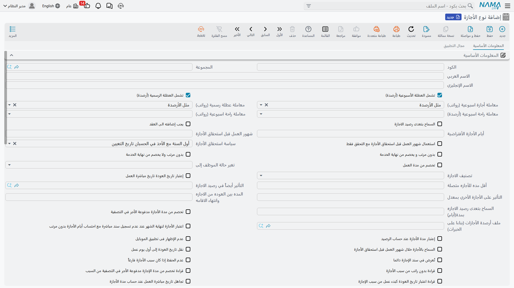
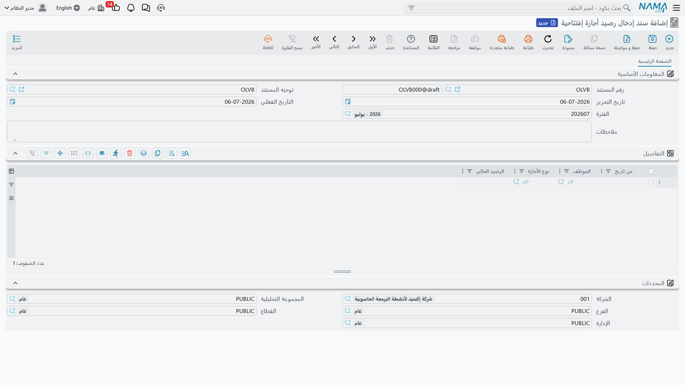

# أنواع وأرصدة الأجازات

قبل أن يتمكن أي موظف من أخذ يوم أجازة، يحتاج نما إلى معرفة *نوع* هذه الأجازة وعدد الأيام المستحقة للموظف منها. هذه هي مهمة ثلاث شاشات أساسية: **نوع الأجازة** الذي يحدد كل نوع من أنواع الأجازات وقواعده، **ملف أرصدة الأجازات (بناءا على الخبرات)** الاختياري الذي يجعل الاستحقاق يتدرج مع سنوات الخبرة، و**سند إدخال رصيد أجازة إفتتاحية** الذي يزرع رصيداً ابتدائياً لموظف ما. كل شيء آخر في قسم الأجازات — الطلبات، السندات، الخطط — يقرأ قواعده من هنا.

## نوع الأجازة: كتيب القواعد لنوع واحد من الإجازة

**نوع الأجازة** (Vacation Type) ليس مجرد تسمية مثل "سنوية" أو "مرضية". إنه كتيب قواعد صغير يتحكم في كيفية استحقاق الأيام، وكيفية استهلاكها، وما يحدث للمتبقي منها، وتأثير هذه الأجازة على راتب الموظف وسجل خدمته.

**مكان الشاشة:** الرواتب > الأجازات > نوع الأجازة (Vacation Type).

### التصنيف والاستحقاق

| الحقل (بالعربية) | English | ماذا يتحكم به |
|---|---|---|
| المجموعة | Group | مجلد تصنيفي اختياري، لتنظيم عدد كبير من أنواع الأجازات. |
| تصنيف الاجازة | Vacation Class | `أجازة سنوية` (Annual Vacation) هي التصنيف الخاص الذي يتعامل معه باقي نظام الموارد البشرية باعتباره *الرصيد* الرئيسي (حسابات مدة الخدمة، تصفية المستحقات، وملف أرصدة الخبرات كلها ترتبط به)؛ أما `أخرى 1/2/3` (Other 1/2/3) فهي فئات إضافية حرة تحددها أنت — أجازة مرضية، أجازة زواج، أجازة وفاة، وهكذا. |
| سياسة استحقاق الأجازة | Vacation Calculation Policy | متى يُقيّد استحقاق السنة: أول السنة مع الأخذ في الحسبان تاريخ التعيين (Beginning Of Year Regarding Commencement Date)، مع بداية الشهر (With Month Start)، مع نهاية الشهر (With Month End)، أو أول السنة بغض النظر عن تاريخ التعيين (Beginning Of Year Regardless of Commencement Date). |
| شهور العمل قبل استحقاق الأجازة | Applicable After | كم شهر خدمة يجب أن يمر قبل أن يحق للموظف أخذ هذه الأجازة أصلاً. |
| أيام الأجازة الأفتراضية | Default Vacation Days | عدد الأيام الثابت — يُستخدم ما لم يكن هناك ملف أرصدة أجازات مرتبط (انظر أدناه). |
| ملف أرصدة الأجازات (بناءا على الخبرات) | Vacation Balance Range File | إحالة إلى جدول استحقاق متدرج حسب سنوات الخبرة، بدلاً من رقم ثابت واحد. |
| الحد الأقصى للأجازة (يوم) | Vacation Days (Max) | أطول مدة يمكن أن يمتد إليها سند أجازة واحد من هذا النوع. |
| الحد الأقصى لرصيد الأجازة (يوم) | Balance Days (Max) | سقف على الرصيد المتراكم نفسه. |
| عدد مرات الاجازه خلال فترة الخدمة | Vacation Number During Service Period | يحدد كم مرة يمكن أخذ هذه الأجازة خلال فترة العمل بالكامل (مفيد لأنواع الأجازات التي تُؤخذ مرة واحدة فقط، مثل أجازة الحج أو أجازة الزواج). |

::: tip قراءتها كقاعدة عمل
عادة ما تُعرَّف الأجازة السنوية بتصنيف `تصنيف الاجازة = أجازة سنوية`، تُستحق `مع بداية الشهر` (جزء من اثني عشر من رصيد العام يُستحق كل شهر)، بعدد `أيام الأجازة الأفتراضية` يبلغ مثلاً 21 أو 30 يوماً — أو الأفضل أن تُربط بـ **ملف أرصدة الأجازات (بناءا على الخبرات)** بحيث يستحق موظف بخبرة سنتين أياماً أقل من موظف بخبرة 15 سنة. أما الأجازة المرضية فتُعرَّف غالباً كنوع `أخرى` منفصل بقيمة `شهور العمل قبل استحقاق الأجازة` خاصة به وحد أقصى للمدة لكل واقعة، بلا أي ارتباط بملف الأرصدة.
:::

### مصير الرصيد المتبقي وتأثيره على الراتب

| الحقل | English | المعنى |
|---|---|---|
| سياسة ترحيل الأجازة | Vacation Transfer Policy | ماذا يحدث للأيام غير المستهلكة عند نهاية العام: تجاهل (Ignored — تضيع ببساطة)، تعويض (Repaid — تُصرف نقداً، انظر [تعويض ونقل الأجازات](vacation-compensation-and-transfer.md))، أو ترحيل (Migrated — تُضاف إلى رصيد العام التالي). |
| الترحيل بحد أدني من المستهلك سنويا | Minimum Consumed Days Per Year | حد أدنى لعدد الأيام التي يجب استهلاكها فعلياً قبل السماح بترحيل أو تعويض الباقي. |
| السماح بتعدى رصيد الاجازة | No Max Limit (Allow Over Balance) | يسمح لرصيد هذا النوع من الأجازة بأن يصبح سالباً. |
| السماح بتعدى رصيد الاجازه بمدة (أيام) | Allowed Days For Balance Exceed | إلى أي حد يمكن أن يصل الرصيد إلى السلب، عند تفعيل الخيار السابق. |
| بدون مرتب و يخصم من نهاية الخدمة | Without Salary Deducted From Termination | تعتبر هذه أجازة بدون مرتب، وأيامها *تُخصم فعلاً* من حساب مكافأة نهاية الخدمة. |
| بدون مرتب ولا يخصم من نهاية الخدمة | Without Salary Not Deducted From Termination | أجازة بدون مرتب لكنها **لا** تؤثر على حساب المكافأة. |
| استقطاع نسبة من المفردات | Deduct Percentage From Salary Components | بدلاً من خصم اليوم بالكامل أو عدم خصمه إطلاقاً، تُخصم نسبة فقط من مفردات رواتب معينة — تُعرَّف في جدول **استقطاع نسبة من المفردات** (Deduction Percentage Lines). |
| المفردات الواجب تجاهلها مع الاجازه بدون مرتب | Discard Components | مفردات الراتب التي يتم تجاهلها ببساطة (لا خصم ولا صرف) أثناء هذه الأجازة بدون مرتب. |

### العلَم الذي يغذي تصفية نهاية الخدمة

| الحقل | English | المعنى |
|---|---|---|
| تخصم من مدة العمل | Deducted From Work Period | عند التفعيل، لا تُحتسب أيام هذا النوع من الأجازة ضمن مدة الخدمة المعتمدة — بل تُنقص من مدة الخدمة التي يُبنى عليها لاحقاً حساب مكافأة نهاية الخدمة. |

::: warning هذا العلَم له أثر لاحق
`تخصم من مدة العمل` ليس مجرد خيار شكلي. الموظف الذي أخذ عدة أشهر من هذا النوع من الأجازة على مدار عمله ستظهر مدة خدمته *الصافية* أقصر يوم مغادرته الشركة، ومدة خدمة أقصر تعني مكافأة أصغر. عملية [تصفية المستحقات](../end-of-service/dues-liquidation.md) في نما تقرأ هذا العلَم عند حساب عدد أيام الخدمة التي يُبنى عليها الصرف — ولهذا السبب بالتحديد يعيش هذا الحقل في نوع الأجازة بدلاً من أن يُقرر حالة بحالة في كل سند.
:::

### سلوكيات أخرى تستحق المعرفة

- **تُعرض في سند الإجازة دائما** (Always Show In Vacation Document) — تُبقي نوع الأجازة ظاهراً في القائمة حتى لو كان رصيد الموظف صفراً، حتى تستطيع الموارد البشرية تسجيله (مع تفعيل `السماح بتعدى رصيد الاجازة` مثلاً).
- **يجب إضافته الى العقد** (Must Added To Contract) — لا ينطبق هذا النوع إلا على الموظفين الذين يذكره عقد عملهم صراحةً.
- **تغير حالة الموظف إلى** (Change Employee State To) — يغيّر تلقائياً حالة عمل الموظف (مثلاً إلى *في أجازة*/InVacation، أو *موقوف*/Suspended) طوال مدة هذه الأجازة، ويعيدها عند العودة. وهي نفس حالات آلة الحالة المستخدمة في [تغيير حالة الموظف](change-employee-state.md).
- **عدم الحفظ إذا كان سبب الأجازة فارغاً** (Reason Is Required) — يمنع حفظ سند أجازة من هذا النوع بدون سبب أجازة.

تتطلب هذه الشاشة مكوّن الترخيص `humanresource-payroll`.

## ملف أرصدة الأجازات (بناءا على الخبرات): تدرج الاستحقاق مع سنوات الخبرة

الرقم الثابت في `أيام الأجازة الأفتراضية` مناسب عندما يستحق كل الموظفين نفس عدد أيام الأجازة السنوية بغض النظر عن مدة خدمتهم — لكن كثيراً من قوانين العمل (وكثيراً من سياسات الشركات) تمنح أياماً *أكثر* كلما طالت مدة الخدمة. **ملف أرصدة الأجازات (بناءا على الخبرات)** (Vacation Balance Range File، ويوجد تحت الموارد البشرية > الأساسيات > ملف أرصدة الأجازات) موجود لهذا الغرض بالتحديد: جدول صغير من نطاقات مدة الخدمة، لكل نطاق استحقاقه الخاص من الأيام.

| الحقل | English | المعنى |
|---|---|---|
| اكبر من او يساوي (أيام) | Greater Than Or Equal (Days) | الحد الأدنى لنطاق مدة الخدمة. |
| اقل من (أيام) | Less Than (Days) | الحد الأعلى للنطاق. |
| أيام الأجازة الأفتراضية | Default Vacation Days | الاستحقاق الذي ينطبق داخل هذا النطاق. |

على سبيل المثال، قد يتضمن أحد ملفات الأرصدة: من صفر إلى 1825 يوم خدمة (5 سنوات) ← 21 يوماً؛ من 1825 إلى 3650 يوماً (10 سنوات) ← 30 يوماً؛ 3650 يوماً فأكثر ← 36 يوماً. عند ربط هذا الملف بحقل **ملف أرصدة الأجازات (بناءا على الخبرات)** في نوع الأجازة، يتم تجاوز الرقم الثابت في `أيام الأجازة الأفتراضية` — ويُحسب استحقاق كل موظف من مدة خدمته الفعلية بدلاً من ذلك.

## سند إدخال رصيد أجازة إفتتاحية: تحديد نقطة البداية

عندما تنتقل شركة إلى نما لأول مرة، أو عندما ينضم موظف ولديه رصيد أجازات مرحّل من نظام سابق، لا بد من إدخال هذا الرقم في مكان ما — وإلا سيفترض نما أن كل رصيد يبدأ من صفر. هذا بالضبط ما وُجد من أجله **سند إدخال رصيد أجازة إفتتاحية** (Opening Vacation Balance Document).

**مكان الشاشة:** الرواتب > الأجازات > سند إدخال رصيد أجازة إفتتاحية (Opening Vacation Balance Document).

| الحقل | English | المعنى |
|---|---|---|
| الفترة / التاريخ الفعلي | Period / Value Date | فترة الموارد البشرية والتاريخ الذي يُعتبر هذا الرصيد الافتتاحي قائماً منه. |
| التفاصيل — الموظف | Employee | الموظف الذي يحدد هذا السطر رصيداً له. |
| التفاصيل — نوع الأجازة | Vacation Type | نوع الأجازة الذي يحدد هذا السطر رصيده. |
| التفاصيل — من تاريخ | From Date | التاريخ الذي يُعتبر الرصيد سارياً منه (له صلة بسياسات الاستحقاق). |
| التفاصيل — الرصيد الحالي | Current Balance | عدد أيام الرصيد الافتتاحي المقيّد للموظف من هذا النوع. |

يمكن أن يحمل سند واحد أسطراً كثيرة — سطر لكل مجموعة موظف/نوع أجازة — بحيث يمكن لتشغيلة واحدة من الأرصدة الافتتاحية أن تزرع أرصدة شركة كاملة عند بدء التشغيل.

::: info لا تأثير محاسبي ولا على دفتر الأستاذ
على خلاف معظم مستندات نما، لا يُنشئ سند إدخال رصيد أجازة إفتتاحية طلب أعمال (Business Request) ولا يمس دفتر الأستاذ. هو فقط يحدد الرقم الذي سيُحسب على أساسه كل سند أجازة أو طلب أجازة أو استعلام رصيد لاحق.
:::

## أين يقع هذا ضمن السياق العام

- **[مستندات الأجازات](vacation-documents.md)** — كيف تُستهلك أنواع وأرصدة الأجازات فعلياً عندما يأخذ الموظف أجازة.
- **[تعويض ونقل الأجازات](vacation-compensation-and-transfer.md)** — ماذا يحدث للأرصدة في ظل سياستي التعويض والترحيل.
- **[تصفية المستحقات](../end-of-service/dues-liquidation.md)** — تقرأ علَم `تخصم من مدة العمل` عند حساب مدة الخدمة النهائية للمكافأة.
- **[تغيير حالة الموظف](change-employee-state.md)** — نفس قيم حالة العمل المستخدمة في حقل `تغير حالة الموظف إلى` بنوع الأجازة.
