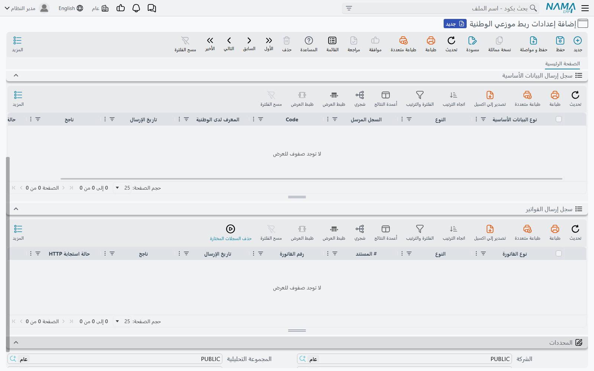

# سجلات الإرسال إلى الوطنية وإعادة الإرسال

في كل مرة يرسل فيها نما شيئًا إلى الوطنية يسجّل ما أرسله وبماذا ردّت المنصة. هذه السجلات ليست
مجرد أثر للمراجعة — بل هي ما يقرؤه نما في التشغيل التالي ليقرر ما الذي ما زال يحتاج إرسالًا.
لذلك فهم السجلين يجيب عن السؤالين معًا: «هل وصل؟» و«كيف أجعله يُرسَل من جديد؟».

كلا السجلين قائمتان أسفل سجل [إعدادات ربط موزعي الوطنية](./alwatania-setup)، وليس لأيهما شاشة
مستقلة. افتح الإعدادات ووسّع القائمتين.

## سجل إرسال البيانات الأساسية

صف لكل سجل **ونوع**: للعميل صف واحد (كعميل على المنصة)، وللصنف صف كصنف وآخر كتفاصيل صنف، وللشركة
صفان (كمحافظة وكمدينة). وعند إعادة إرسال السجل يُحدَّث صفه بدلًا من إضافة صف جديد.



| العمود | ماذا يخبرك |
|---|---|
| **نوع البيانات الأساسية** | النوع الذي أُرسل به السجل على المنصة — `Provinces`، `Clients`، `Items`، … (بالإنجليزية دائمًا) |
| **السجل المرسل** | سجل نما، ونوع الكيان في العمود المجاور |
| **الكود** | كود السجل |
| **المعرف لدى الوطنية** | الرقم الذي تعرف به المنصة هذا السجل. استخدمه عند مراسلة الوطنية بشأن سجل ما |
| **تاريخ الإرسال** | آخر مرة أُرسل فيها |
| **ناجح** | مُعلَّم عندما تقبله المنصة |
| **حالة استجابة HTTP** | رمز رد HTTP من المنصة (200 للرد العادي) |

أربعة أعمدة أخرى مخفية افتراضيًا ويمكن إظهارها من منتقي الأعمدة في القائمة:
**تم إنشاؤه لدى الوطنية**، و**تاريخ تعديل السجل عند الإرسال** (تاريخ آخر تعديل على السجل لحظة
إرساله — والتعديل بعده هو ما يجعل المسح التالي يرسله من جديد)، و**Request Body** و**Response**
(وهذان يظهران بالإنجليزية على الشاشة العربية أيضًا).

## سجل إرسال الفواتير

صف لكل مستند مبيعات. المستند الذي يُعاد إرساله يحدّث صفه نفسه.

| العمود | ماذا يخبرك |
|---|---|
| **نوع الفاتورة** | `Sale` للفاتورة، و`Returned` لمردودات المبيعات |
| **# المستند** | مستند نما، ونوع الكيان بجانبه |
| **رقم الفاتورة** | كود المستند كما أُرسل إلى المنصة |
| **تاريخ الإرسال**، **ناجح**، **حالة استجابة HTTP** | كما سبق |

الأعمدة المخفية هنا **الكود** و**Request Body** و**Response**.

## معرفة سبب الرفض

1. افتح الإعدادات وصفِّ السجل على **ناجح** غير مُعلَّم.
2. أظهر عمود **Response**. فيه رد المنصة نفسه — عادةً `message` وقائمة `errors`، مثل:

   ```json
   {"success":false,"message":"Validation failed for item at index 12.","errors":["Quantity must be greater than 0."],"statusCode":"BadRequest"}
   ```

3. أظهر عمود **Request Body** لترى بالضبط ما أرسله نما لهذا السجل أو المستند وحده (جزؤه فقط، لا
   الدفعة كلها). المقارنة بين العمودين تدلّك عادةً مباشرة على الحقل الناقص أو الخاطئ.
4. صحّح السجل في نما.

قد ترد المنصة على الرفض بحالة HTTP 200 مع `"success":false` في النص؛ ونما يعدّ ذلك فشلًا أيضًا،
فاعتمد دائمًا على عمود **ناجح** لا على **حالة استجابة HTTP** وحدها. وعندما يفشل طلب كامل — لأن
المنصة لم تكن متاحة، أو لأنها رفضت دفعة بيانات أساسية بأكملها — يُعلَّم كل صف في تلك الدفعة
بأنه غير ناجح.

## إعادة المحاولة — لا تحتاج شيئًا

الصف غير المُعلَّم بالنجاح يُعاد آليًا. التشغيل التالي للمهمة المجدولة يرسل من جديد كل سجل
أساسي فشل وكل مستند فشل، سواء غيّرت فيه شيئًا أم لا. صحّح البيانات ودع المهمة تكمل الباقي — أو
اضغط **تشغيل الان** على المهمة المجدولة إذا لم ترد الانتظار.

## فرض إعادة الإرسال

السجل الأساسي المقبول لا يُرسَل من جديد إلا إذا تغيّر، والمستند المقبول لا يُرسَل من جديد أبدًا.
لتجعل نما يرسل أحدهما رغم ذلك:

1. اختر الصفوف في السجل.
2. افتح **المزيد** واختر **حذف السجلات المختارة**. في سجل إرسال الفواتير يوجد الزر أيضًا في شريط
   أدوات القائمة.
3. أكّد السؤال.

التشغيل التالي يعامل هذه السجلات كأنها لم تُرسَل قط ويرسلها كسجلات جديدة.

::: danger إعادة إرسال فاتورة تنشئ نسخة ثانية على المنصة
لا تملك المنصة طريقة لتحديث فاتورة موجودة لديها. حذف صف فاتورة مقبولة وتركها تُرسَل من جديد
يعطي الوطنية الفاتورة نفسها مرتين. لا تفعل ذلك إلا بعد أن تؤكد الوطنية أن المستند ليس لديها.
:::

## رسائل قد تظهر لك

لا توجد ترجمة عربية لأي من هذه الرسائل، فتظهر بالإنجليزية على الشاشة العربية أيضًا. تظهر كنتيجة
لتشغيل المهمة المجدولة (رسالة الخطأ وسجل التشغيل) أو كرسالة مسار الكيان.

| الرسالة | السبب | ماذا تفعل |
|---|---|---|
| `Could not find Alwatania Distributors config with code or id {0}` | المدخل 1 لإجراء البيانات الأساسية أو الفواتير لا يطابق أي إعدادات | اكتب كود الإعدادات تمامًا كما هو على السجل |
| `{0} was not sent to Alwatania, there is no config with code or id {1}` | الشيء نفسه، من إجراء مسار الكيان | صحّح المدخل 1 في سطر مسار الكيان |
| `Failed to obtain Alwatania access token (HTTP {0}): {1}` | رفضت المنصة تسجيل الدخول، أو رابط التوكن خطأ | راجع **رابط الحصول على التوكن** و**Client Id** و**API Key** و**النطاق** مع الوطنية؛ النص بعد النقطتين هو رد المنصة |
| `Unknown Alwatania master data type ({0}), it must be one of {1}` | المدخل 2 لإجراء البيانات الأساسية ليس نوعًا معروفًا | استخدم `All` أو أحد الأنواع المسرودة بالتهجئة نفسها |
| `The query must return two columns, the entity type and the id, eg: select entityType, id from InvItem where sellable = 1` | الاستعلام في المدخل 3 يعيد أعمدة غير صحيحة | اختر `entityType, id` |
| `The query returned records of {0}, which feed no Alwatania master data endpoint and were not sent. The entity types it may return are {1}` | الاستعلام التقط سجلات من ملف لا تستقبله المنصة | احذف ذلك الجدول من الاستعلام |
| `Failed to send a batch of {0} {1} records to Alwatania: {2}` | تعذّر إرسال دفعة بيانات أساسية أصلًا (مثلًا لأن المنصة لم تكن متاحة) | راجع الرابط والشبكة؛ الدفعة تُعاد في التشغيل التالي |
| `Alwatania {0} batch of {1} records failed (HTTP {2}): {3}` | رفضت المنصة دفعة بيانات أساسية؛ آخر الرسالة هو سببها | اقرأ عمود **Response** للصفوف الفاشلة وصحّح السجلات |
| `Failed to send a batch of {0} documents to Alwatania: {1}` | تعذّر إرسال دفعة فواتير أصلًا | كما سبق؛ المستندات تُعاد في التشغيل التالي |
| `Alwatania batch of {0} documents failed (HTTP {1}): {2}` | رفضت المنصة دفعة فواتير | اقرأ عمود **Response** للصفوف الفاشلة |
| `Alwatania refused document {0}: {1}` | رفضت المنصة مستندًا واحدًا؛ وأُرسل باقي دفعته | صحّح المستند المذكور في الرسالة؛ يُعاد في التشغيل التالي |
| `Alwatania refused {0} documents of this batch one after another, so the {1} documents left were not taken apart any further and stay to be sent by the next run` | رُفض عدد كبير من المستندات في دفعة واحدة فتوقف نما عن فرزها واحدًا واحدًا | صحّح المستندات المرفوضة (يعرضها السجل)؛ والباقي يُرسَل في التشغيل التالي |
| `Alwatania did not accept {0} of the {1} documents selected, the rest were sent; every document it refused is on its own row of the Alwatania Invoice Log with the answer that refused it` | ملخص التشغيل: بقيت بعض المستندات مرفوضة بعد المحاولة الثانية | صفِّ سجل إرسال الفواتير على الصفوف الفاشلة واقرأ **Response** |
| `{0} is not one of the master files Alwatania accepts, it must be one of {1}` | إجراء مسار الكيان يعمل على شاشة لا مكان لها على المنصة | انقل المسار إلى أحد الملفات المسرودة |
| `{0} can not be sent to Alwatania as {1}, it can only be sent as {2}` | المدخل 2 لإجراء مسار الكيان يذكر نوعًا لا يناسب السجل | اترك المدخل 2 فارغًا، أو استخدم أحد الأنواع المسرودة |
| `{0} was not sent to Alwatania ({1})` | تعذّر على مسار الكيان إرسال السجل؛ السبب بين القوسين | عالج السبب؛ المسح المجدول يرسل السجل في تشغيله التالي |
